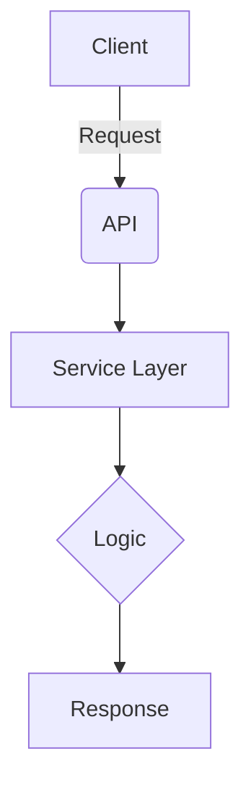

# Backend Development Guidelines

This document provides comprehensive development guidelines and architecture documentation for **Claude Code** when working on the **HWP Report Generator backend** (v2.4).

---

## Table of Contents

1. [System Architecture](#system-architecture)
   - High-Level Architecture (v2.4)
   - Core Technology Stack
2. [Backend Components](#backend-components)
   - API Routers (6 modules)
   - Data Models (9 Pydantic models)
   - Database Layer (11 modules)
   - Business Logic Utilities (20+ modules)
3. [Core Workflows](#core-workflows)
   - Workflow 1: Template Upload (9 steps)
   - Workflow 2: Generate Topic Report (9 steps)
   - Workflow 3: Message Chaining /ask (12 steps)
   - Workflow 4: Sequential Planning (NEW in v2.4)
   - Workflow 5: Background Report Generation (NEW in v2.4)
4. [Code Style and Documentation](#code-style-and-documentation)
   - DocString Rules
   - File Management Guidelines
5. [Testing Guidelines](#testing-guidelines)
   - Test Environment Setup
   - Quick Start
   - Claude Code Testing Checklist
6. [Unit Spec Workflow](#unit-spec-workflow)
   - Workflow Steps
   - Example Workflow
7. [Common Issues & Solutions](#common-issues--solutions)
   - Issue 1: Claude API Rate Limiting
   - Issue 2: Artifact File Not Found
   - Issue 3: Message Seq_no Ordering
   - Issue 4: Template Placeholder Validation
   - Issue 5: System Prompt Context Overflow
   - Issue 6: Database Lock
   - Issue 7: Markdown Parsing Failure

---

## System Architecture

### High-Level Architecture (v2.4)

```
┌─────────────────────────────────────────────────────────────────┐
│         HWP Report Generator - v2.4 Complete System            │
├─────────────────────────────────────────────────────────────────┤
│                                                                  │
│  Frontend (React + TypeScript)                                  │
│  ├── Dashboard                                                  │
│  ├── Template Management                                        │
│  ├── Report Generator Interface                                 │
│  └── Conversation Interface (/ask)                              │
│  └─────────────────────┬──────────────────────────────────────┘│
│                        │ REST API (FastAPI)                    │
│  ┌─────────────────────▼──────────────────────────────────────┐│
│  │ Backend Services (Python 3.12)                             ││
│  │                                                             ││
│  │  ┌──────────────────────────────────────────────────────┐ ││
│  │  │ API Layer (6 Routers)                                │ ││
│  │  │ • auth.py (JWT authentication)                       │ ││
│  │  │ • templates.py (HWPX file handling)                  │ ││
│  │  │ • topics.py (Report generation & /ask)              │ ││
│  │  │ • messages.py (Message CRUD)                         │ ││
│  │  │ • artifacts.py (MD/HWPX download & conversion)      │ ││
│  │  │ • admin.py (Admin-only operations)                  │ ││
│  │  └──────────────────────────────────────────────────────┘ ││
│  │                        ↓                                   ││
│  │  ┌──────────────────────────────────────────────────────┐ ││
│  │  │ Business Logic Layer (20+ Utilities)                 │ ││
│  │  │ • prompts.py (System prompt management)              │ ││
│  │  │ • claude_client.py (LLM API integration)             │ ││
│  │  │ • templates_manager.py (HWPX parsing)               │ ││
│  │  │ • markdown_parser.py (MD → structured data)         │ ││
│  │  │ • sequential_planning.py (Step-by-step planning)    │ ││
│  │  │ • generation_status.py (Background task tracking)   │ ││
│  │  │ • And 14+ supporting utilities                       │ ││
│  │  └──────────────────────────────────────────────────────┘ ││
│  │                        ↓                                   ││
│  │  ┌──────────────────────────────────────────────────────┐ ││
│  │  │ Data Access Layer (11 Database CRUD modules)        │ ││
│  │  │ • template_db.py (Template management)              │ ││
│  │  │ • topic_db.py (Report topics)                        │ ││
│  │  │ • message_db.py (Message history)                   │ ││
│  │  │ • artifact_db.py (File storage metadata)            │ ││
│  │  │ • ai_usage_db.py (Token usage tracking)             │ ││
│  │  │ • user_db.py (User management)                       │ ││
│  │  │ And 5+ additional database modules                   │ ││
│  │  └──────────────────────────────────────────────────────┘ ││
│  │                        ↓                                   ││
│  │  ┌──────────────────────────────────────────────────────┐ ││
│  │  │ SQLite Database (11 tables, normalized schema)      │ ││
│  │  │ • users, templates, placeholders                    │ ││
│  │  │ • topics, messages, artifacts                       │ ││
│  │  │ • ai_usage, transformations                         │ ││
│  │  │ • And 3+ supporting/legacy tables                   │ ││
│  │  └──────────────────────────────────────────────────────┘ ││
│  └──────────────────────────────────────────────────────────┘│
│                                                                │
│  External Services                                            │
│  • Anthropic Claude API (claude-sonnet-4-5-20250929)         │
│  • (Future: PDF conversion, web search)                       │
│                                                                │
└─────────────────────────────────────────────────────────────────┘
```

### Core Technology Stack

| Component | Technology | Version | Purpose |
|-----------|-----------|---------|---------|
| **Framework** | FastAPI | 0.104.1 | High-performance async web framework |
| **Runtime** | Python | 3.12 | Latest Python version |
| **Database** | SQLite | 3.x | Lightweight relational database |
| **AI/LLM** | Anthropic Claude API | 0.71.0 | Report content generation |
| **Model** | Claude Sonnet 4.5 | 20250929 | Latest Claude model |
| **Authentication** | JWT + bcrypt | 3.3.0 + 4.1.2 | Secure user authentication |
| **File Processing** | olefile + zipfile | 0.47 + stdlib | HWPX template handling |
| **Data Validation** | Pydantic | 2.5.0+ | Type-safe request/response |

---

## Backend Components

### A. API Routers (6 modules, 30+ endpoints)

| Router | Endpoints | Purpose | Status |
|--------|-----------|---------|--------|
| **auth.py** | POST /login, /register, /logout, /change-password | JWT authentication, user management | ✅ Complete |
| **templates.py** | POST /templates, GET /templates, GET /templates/{id} | HWPX template upload and management | ✅ Complete |
| **topics.py** | POST /generate, POST /{id}/ask, POST /{id}/plan, GET /{id}/status | Report generation, message chaining, sequential planning, progress tracking | ✅ Complete |
| **messages.py** | GET /topics/{id}/messages, GET /topics/{id}/messages/{id} | Message history and retrieval | ✅ Complete |
| **artifacts.py** | GET /artifacts/{id}, POST /convert, GET /download | Artifact download and format conversion | ✅ Complete |
| **admin.py** | GET /users, GET /templates, POST /users/{id}/approve | Admin operations and system management | ✅ Complete |

### B. Data Models (Pydantic, 9 core models)

| Model | Purpose | Key Fields | Notes |
|-------|---------|-----------|-------|
| **template.py** | Template definition | id, title, filename, prompt_user, prompt_system | Stores HWPX metadata |
| **topic.py** | Report topic/thread | id, user_id, input_prompt, template_id | Conversation context |
| **message.py** | Chat message | id, topic_id, role, seq_no, content | Ordered message history |
| **artifact.py** | Generated file metadata | id, kind, version, file_path, sha256 | MD/HWPX/PDF storage |
| **ai_usage.py** | Token usage tracking | input_tokens, output_tokens, latency_ms | Claude API metrics |
| **user.py** | User account | id, email, username, hashed_password, is_admin | Authentication |
| **transformation.py** | File conversion tracking | from_artifact_id, to_artifact_id, operation | MD→HWPX lineage |
| **token_usage.py** | Legacy token tracking | (deprecated) | Maintained for compatibility |
| **report.py** | Legacy report format | (deprecated) | Maintained for compatibility |

### C. Database Layer (11 modules, 11 tables, 100% normalized)

| Module | Table | Purpose | Transactions |
|--------|-------|---------|--------------|
| **template_db.py** | templates, placeholders | Template storage with placeholder tracking | ✅ Yes |
| **topic_db.py** | topics | Report topics/threads | ✅ Yes |
| **message_db.py** | messages | Message history with seq_no ordering | ✅ Yes |
| **artifact_db.py** | artifacts | File metadata (MD, HWPX, PDF) | ✅ Yes |
| **ai_usage_db.py** | ai_usage | Claude API usage metrics | ✅ Yes |
| **user_db.py** | users | User accounts and permissions | ✅ Yes |
| **transformation_db.py** | transformations | Artifact conversion lineage | ✅ Yes |
| **connection.py** | (schema init) | DB initialization and connection pooling | ✅ Yes |
| **token_usage_db.py** | token_usage | Legacy token tracking (deprecated) | ⚠️ Compatibility |
| **report_db.py** | reports | Legacy report format (deprecated) | ⚠️ Compatibility |

### D. Business Logic Utilities (20+ modules, 500+ lines total)

#### Core Processing (8 modules)
| Module | Functions | Purpose | LOC |
|--------|-----------|---------|-----|
| **claude_client.py** | chat_completion() | LLM API integration with error handling | 150 |
| **prompts.py** | create_dynamic_system_prompt() | System prompt generation from templates | 200 |
| **markdown_parser.py** | parse_markdown_to_content() | MD → structured data conversion | 180 |
| **markdown_builder.py** | build_report_md(), postprocess_headings() | Structured data → MD conversion; H2 headings → ordered lists | 204 |
| **templates_manager.py** | extract_placeholders(), validate_hwpx() | HWPX file parsing and validation | 140 |
| **hwp_handler.py** | (HWPX generation) | HWPX XML manipulation | 250 |
| **sequential_planning.py** | generate_plan() | Step-by-step report planning | 219 |
| **generation_status.py** | track_generation() | Background task status management | 298 |

#### Support Utilities (12 modules)
| Module | Purpose | Key Features |
|--------|---------|--------------|
| **artifact_manager.py** | Artifact file I/O abstraction | Path generation, storage, hashing |
| **md_handler.py** | Markdown file operations | Save/read/parse MD files |
| **file_utils.py** | File system utilities | SHA256, path management, encoding |
| **auth.py** | JWT token and password management | Token creation/verification, bcrypt |
| **response_helper.py** | Standard API response formatting | success_response(), error_response() |
| **exceptions.py** | Custom exception classes | InvalidTemplateError, etc. |
| **placeholder_metadata_generator.py** | Placeholder metadata creation | (Enhanced with JSON schema) |
| **claude_metadata_generator.py** | Claude-specific metadata | Model information generation |
| **meta_info_generator.py** | Placeholder info generation | (Core metadata utility) |
| **prompt_filter.py** | Prompt content filtering | Input sanitization |

---

## Core Workflows

### Workflow 1: Template Upload (9 steps)

```
Step 1: File Validation
  ✓ Check HWPX format (ZIP with required directories)
  ✓ Verify not corrupted

Step 2: Placeholder Extraction
  ✓ Extract from HWPX document content
  ✓ Validate format ({{KEY}} pattern)
  ✓ Check for duplicates → Error if found
  ✓ Check for required placeholders ({{TITLE}} required)

Step 3: Metadata Generation
  ✓ Generate prompt_user (comma-separated placeholder names)
  ✓ Generate prompt_system (dynamic instructions for Claude)

Step 4: SHA256 Hash Calculation
  ✓ Compute file hash for integrity verification

Step 5: Template Record Creation
  ✓ INSERT into templates table
  ✓ Store: title, filename, file_path, prompt_user, prompt_system, sha256

Step 6: Placeholder Records Creation
  ✓ INSERT into placeholders table for each placeholder
  ✓ Link: template_id, placeholder_key

Step 7: Transaction Commit
  ✓ Commit all inserts as single transaction
  ✓ Rollback if any error occurs

Step 8: File Storage
  ✓ Copy HWPX to artifacts/templates/ directory
  ✓ Use SHA256 as filename for deduplication

Step 9: Response
  ✓ Return: template_id, title, prompts, placeholder list
```

### Workflow 2: Generate Topic Report (POST /generate, 9 steps)

```
Step 1: Input Validation
  ✓ Check input_prompt (required, min 3 chars)
  ✓ Check user authentication

Step 2: System Prompt Selection (Priority order)
  Option 1: If template_id provided
    → Load Template from DB
    → Extract placeholders
    → Call create_dynamic_system_prompt() → Custom prompt
  Option 2: Default
    → Use FINANCIAL_REPORT_SYSTEM_PROMPT constant

Step 3: Claude API Call
  ✓ Format message: "Please create a report about: {input_prompt}"
  ✓ Call claude_client.chat_completion(messages, system_prompt)
  ✓ Handle errors: API failures, timeouts, rate limits

Step 4: Markdown Parsing
  ✓ Parse Claude response (Markdown)
  ✓ Extract sections: title, summary, background, main_content, conclusion
  ✓ Call parse_markdown_to_content()

Step 5: Topic Creation
  ✓ INSERT into topics table
  ✓ Generate auto title from content if needed

Step 6: Messages Recording
  ✓ INSERT user message into messages table (seq_no: 0)
  ✓ INSERT assistant message into messages table (seq_no: 1)

Step 7: Artifact (MD) Saving
  ✓ Call build_report_md() to convert parsed data to Markdown
  ✓ Use ArtifactManager.store_artifact() to save
  ✓ Calculate SHA256 hash
  ✓ INSERT into artifacts table (kind: MD, version: 1)

Step 8: AI Usage Tracking
  ✓ INSERT into ai_usage table
  ✓ Record: input_tokens, output_tokens, latency_ms

Step 9: Response
  ✓ Return: topic_id, artifact_id, generated_title, ai_usage metrics
  ✓ HTTP 201 (Created)
```

### Workflow 3: Message Chaining (/ask, 12 steps)

```
Step 1: Permission Validation
  ✓ Verify topic_id exists
  ✓ Verify user owns this topic
  ✓ Check authentication (JWT)

Step 2: User Message Storage
  ✓ Determine seq_no (max existing + 1)
  ✓ INSERT into messages table (role: user)

Step 3: Reference Document Selection
  ✓ If artifact_id provided → validate ownership
  ✓ Else → Get latest MD artifact from topic

Step 4: Context Construction
  ✓ Retrieve all messages for topic
  ✓ Filter by artifact_id if specified
  ✓ Limit to recent max_messages (default: 10)
  ✓ Sort by seq_no

Step 5: Document Content Injection (Optional)
  ✓ If include_artifact_content=true
    → Read artifact file from disk
    → Create system context message: "Current report:\n\n{content}"
    → Add to context messages

Step 6: Context Size Validation
  ✓ Calculate total characters in context
  ✓ Validate ≤ MAX_CONTEXT_CHARS (to prevent token overflow)
  ✓ Return error if exceeded

Step 7: System Prompt Selection (Priority)
  Priority 1: template_id (if specified in request)
  Priority 2: topic.template_id (from topic record)
  Priority 3: Default FINANCIAL_REPORT_SYSTEM_PROMPT

  If template_id selected:
    → Load template placeholders
    → Generate dynamic system prompt

Step 8: Claude API Call
  ✓ Build message array:
      [topic_context_msg] + [historical_msgs] + [new_user_msg]
  ✓ Call claude_client.chat_completion(messages, system_prompt)

Step 9: Assistant Response Storage
  ✓ Determine seq_no (max existing + 1)
  ✓ INSERT into messages table (role: assistant)

Step 10: Markdown Artifact Creation
  ✓ Parse Claude response to structured data
  ✓ Build Markdown from parsed data
  ✓ Save artifact (kind: MD, version++)
  ✓ Calculate SHA256

Step 11: AI Usage Recording
  ✓ INSERT into ai_usage table
  ✓ Record usage metrics

Step 12: Response
  ✓ Return: topic_id, user_message, assistant_message, artifacts[], usage
  ✓ artifacts[] may contain MD and/or HWPX
  ✓ HTTP 200 OK
```

### Workflow 3.5: Markdown Response Postprocessing (NEW in v2.11)

**Context:** When Claude API returns Markdown response (typically in `/ask` endpoint), the Markdown is postprocessed to convert H2 headings to ordered list format.

```
Input:  "## 배경\n내용\n## 주요내용"
        ↓
Process: postprocess_headings() conversion
        ↓
Output: "1. 배경\n내용\n2. 주요내용"
```

**Function:** `postprocess_headings(text: str) -> str` (markdown_builder.py, 84 lines)

**Processing Rules:**
1. **H2 Detection:** Match `^##(?!#)` (H2 only, exclude H3+)
2. **Number Extraction:** Extract leading digits from H2 content (e.g., `##1.제목` → `1`)
3. **Auto-Numbering:** If no number found, assign sequential number (max_num + 1)
4. **Duplicate Handling:** If same number repeats, auto-increment (1, 1 → 1, 2)
5. **Preservation:** All non-H2 content preserved (including H1, H3, bullets, etc.)

**Integration Points:**
- Called in `claude_client.py` → `generate_report()` (Markdown path only)
- Called after Claude API response received, before artifact creation
- Logging: INFO/DEBUG for conversions, WARN for edge cases, ERROR for exceptions

**Use Case:**
- Report generation via /ask when Claude chooses Markdown format
- Ensures consistent list formatting for structured reports
- No impact on JSON path (Structured Outputs mode)

**Test Coverage:** 16 tests (100% coverage)
- 7 primary test cases (TC-UT-001 through TC-UT-007)
- 8 edge case tests (multiple spaces, special chars, H3 preservation, etc.)
- 1 performance test (100 H2s, <100ms)

```

### Workflow 4: Sequential Planning (POST /plan, NEW in v2.4)

```
Step 1: Load Topic Context
  ✓ Verify topic_id and ownership

Step 2: Get Template Instructions (if applicable)
  ✓ Load template prompt_system
  ✓ Extract planning-focused instructions

Step 3: Sequential Planning API Call
  ✓ Use sequential_planning.py to generate step-by-step plan
  ✓ Response: Markdown with numbered steps and sections

Step 4: Parse Planning Output
  ✓ Extract section list from plan
  ✓ Structure: [{"title": "...", "content": "..."}]

Step 5: Response
  ✓ Return: plan (Markdown), sections (list)
  ✓ Response time: < 2 seconds
  ✓ HTTP 200 OK
```

### Workflow 5: Background Report Generation (NEW in v2.4)

```
Step 1: Initiate Generation (< 1 second)
  ✓ Validate input
  ✓ Create task_id
  ✓ Launch asyncio.create_task(long_operation)
  ✓ Store generation_status in memory
  ✓ Return HTTP 202 (Accepted) immediately

Step 2: Background Processing (Async)
  ✓ Execute full 9-step generation workflow
  ✓ Update status at each milestone:
      - "planning" (0%)
      - "generating" (25%)
      - "parsing" (50%)
      - "saving" (75%)
      - "complete" (100%)
  ✓ Handle errors → "failed" status with message

Step 3: Status Polling (GET /status)
  ✓ Retrieve current status from memory
  ✓ Return: status, progress %, message
  ✓ Response time: < 500ms

Step 4: Real-time Notifications (GET /status/stream - SSE)
  ✓ Open Server-Sent Events stream
  ✓ Send status updates as they occur
  ✓ Final: Send artifact IDs and results
  ✓ Close connection when complete
```

---

## Code Style and Documentation

### DocString Rules

**All Python functions and classes MUST include a Google-style DocString.**

#### DocString Format Example

```python
def generate_report(topic: str, user_id: int) -> dict:
    """Generates a report and returns metadata.

    Args:
        topic: Report generation topic (e.g., "Digital Banking Trends 2025")
        user_id: ID of the user creating the report

    Returns:
        Dictionary containing generated report info:
            - id: Report ID
            - filename: Generated file name
            - file_path: File storage path

    Raises:
        ValueError: When topic is empty
        APIError: When Claude API call fails

    Examples:
        >>> report = generate_report("AI Trends", user_id=1)
        >>> print(report['filename'])
        'report_20251027_103954.hwpx'
    """
    pass

def get_user_by_id(user_id: int) -> User:
    """Retrieves a user by ID."""
    pass
```

For class DocStrings, include attributes in the docstring header. Private functions (prefixed with `_`) should also have DocStrings but can be shorter.

#### Required Sections

| Section | When Required | Format |
|---------|---------------|--------|
| **Summary** | Always | One-line description ending with period |
| **Args** | If parameters exist | `param_name: description` |
| **Returns** | If return value exists | Describe structure and meaning |
| **Raises** | If exceptions possible | `ExceptionType: Condition` |
| **Examples** | For complex functions | Use doctest format (`>>>`) |

#### Key Rules

1. **Summary:** Start with imperative verb ("Generates", "Returns", "Calculates"), end with period
2. **Args:** Omit types (use type hints), indicate optional params, use indentation for nested structures
3. **Returns:** Describe structure, list key fields for dicts/objects
4. **Raises:** List exceptions with conditions
5. **Examples:** Use `>>>` format, show input and output

#### Common Mistakes

❌ No DocString, incomplete summary, wrong format (`@param`, `@return`)
✅ Complete Google-style DocString with all required sections

### Scope

Apply to: `app/routers/*.py`, `app/models/*.py`, `app/database/*.py`, `app/utils/*.py`, and all backend Python files.

**Exceptions:** `__init__.py` (imports only), simple getters/setters, test functions (optional).

---

## File Management Guidelines

### Artifact Storage

**ALWAYS use `ArtifactManager` for artifact file operations.**

#### ✅ DO - Use ArtifactManager

```python
from app.utils.artifact_manager import ArtifactManager
from shared.types.enums import ArtifactKind

# Generate standardized file path
filepath = ArtifactManager.generate_artifact_path(
    topic_id=topic.id,
    message_id=message.id,
    filename=f"report_v{version}.md"
)

# Store artifact
file_size = ArtifactManager.store_artifact(
    content=markdown_content,
    filepath=filepath,
    is_binary=False  # False for MD, True for HWPX
)

# Calculate hash for integrity
sha256 = ArtifactManager.calculate_sha256(filepath)

# Store metadata in database
artifact = ArtifactDB.create_artifact(
    topic_id=topic.id,
    message_id=message.id,
    kind=ArtifactKind.MD,
    filename=os.path.basename(filepath),
    file_path=filepath,
    file_size=file_size,
    sha256=sha256
)
```

#### ❌ DON'T - Direct file operations

```python
# DON'T do this!
with open(f"artifacts/topic_{topic_id}/file.md", "w") as f:
    f.write(content)
```

**Why?** `ArtifactManager` provides:
- Consistent file path structure
- Automatic directory creation
- UTF-8 encoding for text files
- File size and hash calculation
- Support for future storage backends (S3, Azure Blob)

### Markdown File Operations

**Use `MarkdownHandler` for Markdown file operations.**

#### ✅ DO - Use MarkdownHandler

```python
from app.utils.md_handler import MarkdownHandler

# Format report data as Markdown
report_data = {
    "title": "Digital Banking Report",
    "summary": "Executive summary...",
    "background": "Background information...",
    "main_content": "Detailed analysis...",
    "conclusion": "Conclusions and recommendations..."
}

md_content = MarkdownHandler.format_report_as_md(report_data)

# Save Markdown file
MarkdownHandler.save_md_file(md_content, filepath)

# Read Markdown file
content = MarkdownHandler.read_md_file(filepath)

# Parse Markdown back to structured data
parsed_data = MarkdownHandler.parse_md_report(content)
```

**Report Structure Standard:**
- `# {Title}` - Main title (H1)
- `## 요약` - Summary section (H2)
- `## 배경 및 목적` - Background section (H2)
- `## 주요 내용` - Main content section (H2)
- `## 결론 및 제언` - Conclusion section (H2)

### Transformation Tracking

**ALWAYS record transformations when converting artifacts.**

#### ✅ DO - Track transformations

```python
from app.database.transformation_db import TransformationDB
from app.models.transformation import TransformationCreate
from shared.types.enums import TransformOperation

# After converting MD to HWPX
transformation = TransformationDB.create_transformation(
    TransformationCreate(
        from_artifact_id=md_artifact.id,
        to_artifact_id=hwpx_artifact.id,
        operation=TransformOperation.CONVERT,
        params_json='{"template": "report_template.hwpx"}'
    )
)
```

**Benefits:**
- Lineage tracking (which HWPX came from which MD)
- Audit trail for conversions
- Support for conversion chains (MD → HWPX → PDF)
- Debugging conversion issues

#### Common Transformation Operations

```python
from shared.types.enums import TransformOperation

# Format conversion
TransformOperation.CONVERT  # MD → HWPX, HWPX → PDF, etc.

# Language translation (future use)
TransformOperation.TRANSLATE  # KO → EN, EN → KO, etc.
```

---

## Testing Guidelines

> **📖 For detailed testing guide, see [BACKEND_TEST.md](./BACKEND_TEST.md)**

### Test Environment Setup

**⚠️ IMPORTANT: Python Interpreter Configuration**

The project uses **uv** as the package manager and requires the following Python interpreter:

```
Project Root: /Users/jaeyoonmo/workspace/hwp-report-generator
Backend Venv: backend/.venv/bin/python
```

**Claude Code Configuration:**
- Set IDE Python interpreter to: `backend/.venv/bin/python`
- Package manager: `uv`
- When running tests, Claude Code will automatically use this interpreter

**Verification:**

```bash
# Check the Python interpreter path
which python
# Expected: /Users/jaeyoonmo/workspace/hwp-report-generator/backend/.venv/bin/python

# Verify uv is configured
cd backend && uv --version
```

---

### Quick Start

**Run all tests with coverage:**

```bash
cd backend
uv run pytest tests/ -v --cov=app --cov-report=term-missing
```

**Install test dependencies:**

```bash
uv pip install -r requirements-dev.txt
```

---

### Current Coverage Status

**Overall Coverage: 52%** ✅ (Target: ≥70%, topics.py: 78%)

- **Total Tests:** 88+ tests (88 passed, 0 failed)
- **Test Files:** 20+ files covering auth, claude_client, hwp_handler, API endpoints, and templates
- **Coverage Increase:** +6% (from 46% to 52% in this session)

**Top Modules:**
- `routers/topics.py`: 78% ✅ (+39% improvement)
- `utils/markdown_builder.py`: 100% ✅
- `utils/response_helper.py`: 96% ✅
- `utils/markdown_parser.py`: 92% ✅
- `utils/auth.py`: 80% ✅
- `utils/file_utils.py`: 96% ✅

---

### Coverage Goals

- **Overall:** ≥ 70%
- **Core business logic:** ≥ 90%
- **Utility functions:** ≥ 85%

---

### Best Practices

**DO ✅:**
- Mock all external API calls (Claude API, etc.)
- Use `@patch('app.utils.module.Class')` at point of use
- Keep tests independent and isolated
- Use fixtures for common setup
- Test both success and error scenarios

**DON'T ❌:**
- Never call actual APIs in tests
- Don't use production database
- Don't use incorrect mock paths (`@patch('anthropic.Anthropic')` → use `@patch('app.utils.claude_client.Anthropic')`)
- Don't skip error handling tests

**For detailed information on:**
- Test structure and fixtures
- Mocking patterns and examples
- Test writing patterns
- Troubleshooting common issues
- CI/CD integration

**→ See [BACKEND_TEST.md](./BACKEND_TEST.md)**

---

### Claude Code Testing Checklist

**Before running tests, Claude Code MUST verify:**

- [ ] **Python Interpreter**: Verify using `/Users/jaeyoonmo/workspace/hwp-report-generator/backend/.venv/bin/python`
  ```bash
  which python
  # Should output: .../backend/.venv/bin/python
  ```

- [ ] **Package Manager**: Confirm `uv` is configured
  ```bash
  cd backend && uv --version
  ```

- [ ] **Working Directory**: Always run tests from `backend/` directory
  ```bash
  cd backend && uv run pytest tests/ -v --cov=app --cov-report=term-missing
  ```

- [ ] **Virtual Environment**: Ensure `.venv` is activated or `uv run` is used
  ```bash
  # Option 1: Use uv run (recommended)
  uv run pytest tests/ -v

  # Option 2: Activate venv manually
  source .venv/bin/activate
  pytest tests/ -v
  ```

- [ ] **Dependencies**: Confirm test dependencies installed
  ```bash
  uv pip install -r requirements-dev.txt
  ```

**Common Issues & Solutions:**

| Issue | Cause | Solution |
|-------|-------|----------|
| `ModuleNotFoundError: No module named 'app'` | Wrong working directory | Run from `backend/` directory with `uv run` |
| `pytest: command not found` | pytest not installed | Run `uv pip install -r requirements-dev.txt` |
| `Python interpreter not found` | Wrong venv path | Verify path: `backend/.venv/bin/python` |
| Import errors in tests | Package manager mismatch | Use `uv run pytest` instead of raw `pytest` |

---

## DocString Review Checklist

- [ ] Does every public function/class have a DocString?
- [ ] Is the summary line clear and concise?
- [ ] Are Args and Returns sections complete?
- [ ] Is there a Raises section if exceptions may occur?
- [ ] Do complex functions include Examples?
- [ ] Is it written in English and follows Google style?

---

## Recent Improvements (v2.2)

### Bug Fix: /ask Artifact Markdown Parsing

**Problem:**
- `/api/topics/{topic_id}/ask` endpoint was saving raw Claude response to artifact
- Expected: Parse markdown through `parse_markdown_to_content()` → `build_report_md()`

**Solution:**
- Added markdown parsing and building logic to /ask function (lines 884-892)
- Now consistent with `generate_topic_report` implementation
- 3 new test cases added (TC-ASK-001, TC-ASK-003, TC-ASK-004)

**Test Results:**
```
tests/test_routers_topics.py::TestTopicsRouter
- 28/28 tests PASSED (100%)
- /ask tests: 15/15 PASSED (100%)
- New markdown validation tests: 3/3 PASSED (100%)
```

**Files Modified:**
- `app/routers/topics.py` (lines 880-906)
- `tests/test_routers_topics.py` (new test methods added)

**Reference:**
- Spec: `backend/doc/specs/20251110_fix_ask_artifact_markdown_parsing.md`

---

## Unit Spec Workflow

**Before implementing any feature or fix, Claude Code MUST create a Unit Spec document.**

### Workflow Steps

1. **User Request** → User describes a feature, bug fix, or change
2. **Unit Spec Creation** → Claude creates a spec document following `backend/doc/Backend_UnitSpec.md` template
3. **Review & Approval** → User reviews and approves the spec
4. **Implementation** → Claude implements according to the approved spec
5. **Testing** → Verify all test cases defined in the spec

### Unit Spec Template Structure

Each Unit Spec MUST include:

#### 1. Requirements Summary
- **Purpose:** One-line description of what the feature/fix does
- **Type:** ☐ New ☐ Change ☐ Delete
- **Core Requirements:**
  - Input: Expected parameters (e.g., topic, userId)
  - Output: Return values (e.g., markdown, json, status code)
  - Constraints: Validation rules, timeouts, error conditions
  - Processing Flow: One-line summary of operation

#### 2. Implementation Target Files
| Type | Path | Description |
|------|------|-------------|
| New | backend/app/api/... | New endpoint |
| Change | backend/app/services/... | Modified logic |
| Reference | backend/app/utils/... | Reference implementation |

#### 3. Flow Diagram (Mermaid)


#### 4. Test Plan
- **Principles:** TDD, Layer Coverage (Unit → Integration → API), Independence
- **Test Cases:** Use table format with:
  - TC ID
  - Layer (API/Unit/Integration)
  - Scenario
  - Purpose
  - Input/Precondition
  - Expected Result

### Example Workflow

```
User: "Add a feature to export reports to PDF"

Claude: "I'll create a Unit Spec for this feature first."

→ Creates: backend/doc/specs/export_pdf_feature.md
→ Presents: Spec summary with requirements, files, flow, tests
→ Asks: "Please review this spec. Should I proceed with implementation?"

User: "Approved, but change the endpoint path"

Claude: "Updated. Starting implementation..."
→ Implements according to spec
→ Writes tests from test plan
→ Reports completion with test results
```

### Unit Spec File Naming

- Location: `backend/doc/specs/`
- Format: `YYYYMMDD_feature_name.md`
- Example: `20251106_export_pdf_feature.md`

### Benefits

- **Clear Requirements:** Prevents misunderstandings
- **Test-First:** Tests are defined before implementation
- **Documentation:** Specs serve as implementation documentation
- **Review Point:** User can correct course before coding begins
- **Consistency:** All features follow same planning process

### Reference

- Template: `backend/doc/Backend_UnitSpec.md`
- Test Guide: `backend/BACKEND_TEST.md`

---

## Keyword Management Strategy for Placeholder Classification

### Overview

When `meta_info_generator.py` extracts Placeholders from Templates, unknown keywords (e.g., `{{RISK}}`, `{{POSITION}}`) may not match predefined keyword patterns. This section outlines the strategy for managing such keywords over time.

**Current Strategy (Phase 1):** Progressive keyword expansion with data-driven decision making.

### Phase 1: Current Implementation (MVP)

**Predefined Keywords (5):**
```python
PHASE_1_KEYWORDS = {
    "TITLE": {"type": "section_title", "section": "제목"},
    "SUMMARY": {"type": "section_content", "section": "요약"},
    "BACKGROUND": {"type": "section_content", "section": "배경"},
    "CONCLUSION": {"type": "section_content", "section": "결론"},
    "DATE": {"type": "metadata", "section": "날짜"},
}

# Location: backend/app/utils/meta_info_generator.py
KEYWORD_CLASSIFICATION = PHASE_1_KEYWORDS
```

**Key Features:**
- Unknown keywords fall back to safe defaults (`section_content`)
- Usage patterns are logged for analysis (see below)
- No Admin page required

**Logging Requirement:**
Add `KeywordUsageLog` table to track which keywords are matched vs. unmatched:
```sql
CREATE TABLE keyword_usage_logs (
    id INTEGER PRIMARY KEY,
    user_id INTEGER NOT NULL,
    template_id INTEGER NOT NULL,
    keyword TEXT NOT NULL,
    matched_keyword TEXT,  -- NULL if default is used
    created_at TIMESTAMP DEFAULT CURRENT_TIMESTAMP,
    FOREIGN KEY(user_id) REFERENCES users(id),
    FOREIGN KEY(template_id) REFERENCES templates(id)
);
```

### Phase 2: Progressive Keyword Expansion (1 month after Phase 1)

**Objective:** Analyze usage patterns and add frequently used keywords to `PHASE_2_KEYWORDS`.

**Candidate Keywords to Monitor:**
- `RISK` (위험 분석)
- `OVERVIEW` (개요)
- `MARKET` (시장 분석)
- `REGULATION` (규제 현황)
- `EXECUTIVE` (요약)

**Implementation:**
1. Run monthly analysis on `keyword_usage_logs`
2. Identify top 5-10 unmatched keywords
3. Add to `PHASE_2_KEYWORDS` in code
4. Update `KEYWORD_CLASSIFICATION = PHASE_2_KEYWORDS`

**Monitoring Target:**
- Goal: Matched keywords ≥ 80% (unmatched < 20%)

### Phase 3: Hybrid Strategy (3-6 months after Phase 1)

**Objective:** Support organization-specific and custom keywords via Admin interface.

**Strategy:** Combine code-based keywords + database-managed custom keywords.

**Required Implementation:**
1. **Database Schema:**
   ```sql
   CREATE TABLE custom_keywords (
       id INTEGER PRIMARY KEY,
       keyword TEXT UNIQUE NOT NULL,
       type TEXT NOT NULL,  -- section_title, section_content, metadata
       display_name TEXT NOT NULL,
       description TEXT,
       examples JSON,
       created_at TIMESTAMP DEFAULT CURRENT_TIMESTAMP,
       updated_at TIMESTAMP DEFAULT CURRENT_TIMESTAMP
   );
   ```

2. **Admin API Endpoints:**
   ```
   POST /api/admin/custom-keywords
   GET /api/admin/custom-keywords
   PUT /api/admin/custom-keywords/{id}
   DELETE /api/admin/custom-keywords/{id}
   ```

3. **Merge Logic in meta_info_generator.py:**
   ```python
   def create_meta_info_from_placeholders(placeholders, custom_keywords=None):
       # Merge built-in + custom keywords (custom overrides built-in)
       all_keywords = {**BUILT_IN_KEYWORDS, **(custom_keywords or {})}
       # ... rest of logic
   ```

### Reference Documents

- **Detailed Analysis:** `backend/doc/keyword_management_strategies.md`
- **Implementation Guide:** `backend/doc/meta_info_generator_guide.md`
- **Why Keyword Matching:** `backend/doc/why_keyword_matching.md`

---

---

## Backend Architecture Overview

### Directory Structure

```
backend/app/
├── main.py                          # FastAPI entry point (router registration, initialization)
│
├── routers/                         # API endpoints (6 modules)
│   ├── auth.py                      # Authentication (signup, login, JWT)
│   ├── topics.py                    # Topic/report generation (message chaining)
│   ├── messages.py                  # Message retrieval
│   ├── artifacts.py                 # Artifact (MD, HWPX) download/convert
│   ├── templates.py                 # ✨ Template upload/management
│   └── admin.py                     # Admin API
│
├── models/                          # Pydantic data models (9 modules)
│   ├── user.py                      # User, UserCreate, UserUpdate
│   ├── topic.py                     # Topic, TopicCreate (+ template_id)
│   ├── message.py                   # Message, AskRequest (+ template_id)
│   ├── template.py                  # ✨ Template, Placeholder, TemplateCreate
│   ├── artifact.py                  # Artifact, ArtifactCreate, ArtifactKind
│   ├── ai_usage.py                  # AiUsage, AiUsageCreate
│   ├── transformation.py            # Transformation, TransformOperation
│   ├── token_usage.py               # TokenUsage (legacy)
│   └── report.py                    # Report (legacy, Deprecated)
│
├── database/                        # SQLite CRUD layer (11 modules)
│   ├── connection.py                # DB initialization, table creation, migration
│   ├── user_db.py                   # User CRUD
│   ├── topic_db.py                  # Topic CRUD
│   ├── message_db.py                # Message CRUD (seq_no management)
│   ├── artifact_db.py               # Artifact CRUD (version management)
│   ├── template_db.py               # ✨ Template CRUD + transaction
│   ├── ai_usage_db.py               # AI usage tracking
│   ├── transformation_db.py         # Transformation history (MD→HWPX)
│   ├── token_usage_db.py            # Legacy token tracking
│   ├── report_db.py                 # Legacy reports
│   └── __init__.py                  # DB initialization export
│
└── utils/                           # Business logic & helpers (13 modules)
    ├── prompts.py                   # ✨ System Prompt central management
    ├── templates_manager.py         # ✨ HWPX file/Placeholder handling
    ├── claude_client.py             # Claude API call (Markdown response)
    ├── markdown_parser.py           # Markdown → structured data (dynamic sections)
    ├── markdown_builder.py          # Structured data → Markdown
    ├── hwp_handler.py               # HWPX modify/create (XML manipulation)
    ├── artifact_manager.py          # Artifact file management (store, hash)
    ├── file_utils.py                # File I/O utilities (write, read, hash)
    ├── md_handler.py                # Markdown file I/O
    ├── response_helper.py           # API standard response (success, error)
    ├── auth.py                      # JWT, password hashing
    └── meta_info_generator.py       # Placeholder metadata generation (future)
```

### Key Database Tables

```sql
-- Users table
CREATE TABLE users (
    id INTEGER PRIMARY KEY AUTOINCREMENT,
    email TEXT UNIQUE NOT NULL,
    username TEXT NOT NULL,
    hashed_password TEXT NOT NULL,
    is_active BOOLEAN DEFAULT 1,
    is_admin BOOLEAN DEFAULT 0,
    created_at TIMESTAMP DEFAULT CURRENT_TIMESTAMP
);

-- Topics table (conversation threads)
CREATE TABLE topics (
    id INTEGER PRIMARY KEY AUTOINCREMENT,
    user_id INTEGER NOT NULL,
    input_prompt TEXT NOT NULL,
    generated_title TEXT,
    language TEXT NOT NULL DEFAULT 'ko',
    status TEXT NOT NULL DEFAULT 'active',
    created_at TIMESTAMP DEFAULT CURRENT_TIMESTAMP,
    updated_at TIMESTAMP DEFAULT CURRENT_TIMESTAMP,
    FOREIGN KEY (user_id) REFERENCES users(id) ON DELETE CASCADE
);

-- Messages table
CREATE TABLE messages (
    id INTEGER PRIMARY KEY AUTOINCREMENT,
    topic_id INTEGER NOT NULL,
    role TEXT NOT NULL,                 -- user, assistant, system
    content TEXT NOT NULL,
    seq_no INTEGER NOT NULL,            -- sequence number (conversation order)
    created_at TIMESTAMP DEFAULT CURRENT_TIMESTAMP,
    FOREIGN KEY (topic_id) REFERENCES topics(id) ON DELETE CASCADE,
    UNIQUE(topic_id, seq_no)
);

-- Artifacts table
CREATE TABLE artifacts (
    id INTEGER PRIMARY KEY AUTOINCREMENT,
    topic_id INTEGER NOT NULL,
    message_id INTEGER,
    kind TEXT NOT NULL,                 -- MD, HWPX, PDF
    locale TEXT NOT NULL,               -- language (ko, en)
    version INTEGER NOT NULL,           -- version number
    filename TEXT NOT NULL,
    file_path TEXT NOT NULL,
    file_size INTEGER NOT NULL,
    sha256 TEXT NOT NULL,
    created_at TIMESTAMP DEFAULT CURRENT_TIMESTAMP,
    FOREIGN KEY (topic_id) REFERENCES topics(id) ON DELETE CASCADE,
    FOREIGN KEY (message_id) REFERENCES messages(id) ON DELETE SET NULL
);

-- ✨ Templates table (new)
CREATE TABLE templates (
    id INTEGER PRIMARY KEY AUTOINCREMENT,
    user_id INTEGER NOT NULL,
    title TEXT NOT NULL,
    description TEXT,
    filename TEXT NOT NULL,
    file_path TEXT NOT NULL,
    file_size INTEGER NOT NULL DEFAULT 0,
    sha256 TEXT NOT NULL,
    is_active BOOLEAN DEFAULT 1,
    prompt_user TEXT DEFAULT NULL,      -- ✨ Placeholder list
    prompt_system TEXT DEFAULT NULL,    -- ✨ Dynamic System Prompt
    created_at TIMESTAMP DEFAULT CURRENT_TIMESTAMP,
    updated_at TIMESTAMP DEFAULT CURRENT_TIMESTAMP,
    FOREIGN KEY (user_id) REFERENCES users(id) ON DELETE CASCADE
);

-- Placeholders table
CREATE TABLE placeholders (
    id INTEGER PRIMARY KEY AUTOINCREMENT,
    template_id INTEGER NOT NULL,
    placeholder_key TEXT NOT NULL,      -- {{TITLE}}, {{SUMMARY}}, etc.
    created_at TIMESTAMP DEFAULT CURRENT_TIMESTAMP,
    FOREIGN KEY (template_id) REFERENCES templates(id) ON DELETE CASCADE
);

-- AI usage table
CREATE TABLE ai_usage (
    id INTEGER PRIMARY KEY AUTOINCREMENT,
    topic_id INTEGER NOT NULL,
    message_id INTEGER,
    model TEXT NOT NULL,                -- claude-sonnet-4-5-20250929
    input_tokens INTEGER NOT NULL,
    output_tokens INTEGER NOT NULL,
    latency_ms INTEGER,
    created_at TIMESTAMP DEFAULT CURRENT_TIMESTAMP,
    FOREIGN KEY (topic_id) REFERENCES topics(id) ON DELETE CASCADE,
    FOREIGN KEY (message_id) REFERENCES messages(id) ON DELETE SET NULL
);
```

### Core API Endpoints

#### Topics Router (`/api/topics`)

```python
POST   /api/topics                         # Create topic
POST   /api/topics/generate                # Generate report (select template)
GET    /api/topics                         # List my topics
GET    /api/topics/{id}                    # Get topic details
PUT    /api/topics/{id}                    # Update topic
DELETE /api/topics/{id}                    # Delete topic
POST   /api/topics/{id}/ask                # Message chaining (conversation)
```

#### Templates Router (`/api/templates`)

```python
POST   /api/templates              # Upload template (HWPX)
GET    /api/templates              # List my templates
GET    /api/templates/{id}         # Get template details
DELETE /api/templates/{id}         # Delete template
GET    /api/admin/templates        # Admin: List all templates
```

#### Artifacts Router (`/api/artifacts`)

```python
GET    /api/artifacts/{id}                 # Get metadata
GET    /api/artifacts/{id}/content         # Get content (MD only)
GET    /api/artifacts/{id}/download        # Download file
POST   /api/artifacts/{id}/convert         # MD → HWPX conversion
GET    /api/artifacts/messages/{msg_id}/hwpx/download  # Auto-convert & download
```

---

## Core Functions & Step-by-Step Flows

### generate_topic_report() - 9-Step Flow

```python
@router.post("/generate", summary="Topic input → MD report generation")
async def generate_topic_report(
    topic_data: TopicCreate,
    current_user: User = Depends(get_current_active_user)
) -> ApiResponse:
    """
    [Step 1] Input validation
        - input_prompt required, minimum 3 characters

    [Step 2] Select System Prompt (based on template)
        IF topic_data.template_id:
            - Load Template
            - Fetch Placeholders
            - create_dynamic_system_prompt() call
        ELSE:
            - Use FINANCIAL_REPORT_SYSTEM_PROMPT

    [Step 3] Call Claude API
        - user_message = create_topic_context_message(input_prompt)
        - system_prompt = (Step 2 result)
        - response = claude.chat_completion([user_message], system_prompt)

    [Step 4] Parse Markdown
        - content = parse_markdown_to_content(response)
        - Dynamic section extraction (title, summary, background, ...)

    [Step 5] Create Topic
        - topic = TopicDB.create_topic(...)
        - Update generated_title

    [Step 6] Save messages
        - user_msg = MessageDB.create_message(USER)
        - assistant_msg = MessageDB.create_message(ASSISTANT)

    [Step 7] Save Artifact (MD)
        - md_text = build_report_md(content)
        - artifact = ArtifactDB.create_artifact(kind=MD)

    [Step 8] Record AI Usage
        - AiUsageDB.create_ai_usage(input_tokens, output_tokens, latency_ms)

    [Step 9] Return response
        - { topic_id, artifact_id, message_ids, usage }
    """
```

### ask() - 12-Step Flow (Message Chaining)

```python
@router.post("/{topic_id}/ask", summary="Message chaining (conversation)")
async def ask(
    topic_id: int,
    body: AskRequest,
    current_user: User = Depends(get_current_active_user)
) -> ApiResponse:
    """
    [Step 1] Authorization & validation
        - Topic exists check
        - Ownership check (topic.user_id == current_user.id)
        - content required, minimum 1 character
        - content length validation (≤ 50,000 chars)

    [Step 2] Save user message
        - user_msg = MessageDB.create_message(topic_id, MessageCreate(role=USER))

    [Step 3] Select reference document
        IF body.artifact_id:
            - artifact = ArtifactDB.get_artifact_by_id(body.artifact_id)
            - Check authorization (artifact.topic_id == topic_id)
            - Verify type (kind == MD)
        ELSE:
            - artifact = ArtifactDB.get_latest_artifact_by_kind(topic_id, MD)

    [Step 4] Build context
        - all_messages = MessageDB.get_messages_by_topic(topic_id)
        - user_messages = [m for m in all_messages if m.role == USER]
        - If artifact_id specified → include up to that message only
        - Apply max_messages → recent N messages only

    [Step 5] Inject document content
        IF body.include_artifact_content AND artifact exists:
            - md_content = read(artifact.file_path)
            - artifact_message = "Current report(MD):\n\n{md_content}"
            - Add to context_messages

    [Step 6] Validate context size
        - total_chars = sum(len(m.content) for m in context_messages)
        - MAX_CONTEXT_CHARS = 50,000
        - Return error if exceeded

    [Step 7] Select System Prompt (priority order)
        IF body.system_prompt:
            - system_prompt = body.system_prompt
        ELIF body.template_id:
            - template = TemplateDB.get_template_by_id(body.template_id)
            - placeholders = PlaceholderDB.get_placeholders_by_template()
            - system_prompt = create_dynamic_system_prompt(placeholders)
        ELSE:
            - system_prompt = FINANCIAL_REPORT_SYSTEM_PROMPT

    [Step 8] Call Claude API
        - claude_messages = [topic_context] + [context_messages] + [user_msg]
        - response = claude.chat_completion(claude_messages, system_prompt)

    [Step 9] Save assistant message
        - assistant_msg = MessageDB.create_message(topic_id, MessageCreate(role=ASSISTANT))

    [Step 10] Save Artifact (MD)
        - result = parse_markdown_to_content(response)
        - md_text = build_report_md(result)
        - artifact = ArtifactDB.create_artifact(kind=MD, version++)

    [Step 11] Record AI Usage
        - AiUsageDB.create_ai_usage(...)

    [Step 12] Return response
        - {
            topic_id,
            user_message,
            assistant_message,
            artifact,
            usage { model, input_tokens, output_tokens, latency_ms }
          }
    """
```

### upload_template() - 9-Step Flow

```python
@router.post("", summary="HWPX template upload")
async def upload_template(
    file: UploadFile = File(...),
    title: str = Form(...),
    current_user: User = Depends(get_current_active_user)
) -> ApiResponse:
    """
    [Step 1] File validation
        - Check filename (.hwpx only)
        - Check file size (max 50MB)

    [Step 2] Validate HWPX file
        - TemplatesManager.validate_hwpx()
        - Check ZIP magic bytes (PK\\x03\\x04)

    [Step 3] Save file
        - Path: templates/user_{user_id}/template_{timestamp}.hwpx
        - Calculate SHA256 hash

    [Step 4] Extract Placeholders
        - TemplatesManager.extract_hwpx() → unpack to temp directory
        - TemplatesManager.extract_placeholders() → extract {{KEY}}
        - Result: ["{{TITLE}}", "{{SUMMARY}}", ...]

    [Step 5] Duplicate check
        - TemplatesManager.has_duplicate_placeholders()
        - Warn if duplicates found (don't reject)

    [Step 6] Generate metadata
        - prompt_user = ", ".join(unique_placeholders)
          → "TITLE, SUMMARY, BACKGROUND, ..."
        - placeholder_objs = [Placeholder(placeholder_key=ph) ...]
        - system_prompt = create_dynamic_system_prompt(placeholder_objs)
          → "You are a financial... {{TITLE}}... {{SUMMARY}}..."

    [Step 7] Save to DB (transaction)
        - TemplateDB.create_template_with_transaction(
            user_id,
            TemplateCreate(
              ..., prompt_user, prompt_system
            ),
            placeholder_keys
          )
        - Auto-rollback on failure

    [Step 8] Cleanup temp files
        - Delete temp unpack directory

    [Step 9] Return response
        - {
            id, title, filename, prompt_user, prompt_system,
            placeholders: [{ key, ... }, ...]
          }
    """
```

---

## E2E Workflows

### Scenario 1: Template Upload → Topic Creation → Report Generation

```
[1] User: Upload template file
POST /api/templates
- file: report_template.hwpx (binary)
- title: "Financial Report Template"
    ↓
[2] Backend: Save Template
- Validate HWPX file
- Extract Placeholders: {{TITLE}}, {{SUMMARY}}, ...
- Generate dynamic System Prompt
- Save to DB (Template + Placeholder + metadata)
✅ Response: { template_id: 1, placeholders: [...] }
    ↓
[3] User: Generate report (select template)
POST /api/topics/generate
{
  "input_prompt": "Digital Banking Trends 2025",
  "template_id": 1  ← Selected Template
}
    ↓
[4] Backend: Generate dynamic System Prompt & call Claude
a) Load Template #1
b) Fetch Placeholders: [{{TITLE}}, {{SUMMARY}}, ...]
c) create_dynamic_system_prompt(placeholders)
   → "You are a financial... {{TITLE}} to include..."
d) Call Claude API:
   system_prompt = (dynamic System Prompt)
   user_message = "Write report on Digital Banking Trends..."
e) Response: Markdown text
    ↓
[5] Backend: Parse Markdown & save report
a) parse_markdown_to_content(response)
   → {title, summary, background, main_content, ...}
b) build_report_md(content) → Markdown format
c) Create Topic, Message, Artifact (MD)
d) Record AI Usage
✅ Response: { topic_id: 42, artifact_id: 100 }
    ↓
[6] User: Convert MD → HWPX & download
POST /api/artifacts/100/convert
→ Generate HWPX file
GET /api/artifacts/{hwpx_artifact_id}/download
→ Download report (report.hwpx)
```

### Scenario 2: Conversational Message Chaining (Ask)

```
[1] User: Ask question (select template, specify reference document)
POST /api/topics/42/ask
{
  "content": "Explain this section in more detail",
  "template_id": 1,              ← Template selection
  "artifact_id": 100,            ← Reference MD document
  "include_artifact_content": true,  ← Include document content
  "max_messages": 10             ← Context limit
}
    ↓
[2] Backend: Build context
a) Check authorization: User owns Topic
b) Save user message
c) Collect context messages:
   - If artifact_id specified → include only up to that message
   - Apply max_messages → recent N messages only
d) Inject reference document content:
   "Current report(MD):\n\n[artifact content]"
    ↓
[3] Backend: Select System Prompt (priority order)
Priority 1: body.system_prompt (explicit)
Priority 2: body.template_id (template-based)
  → Load Template
  → Fetch Placeholders
  → create_dynamic_system_prompt()
Priority 3: FINANCIAL_REPORT_SYSTEM_PROMPT (default)
    ↓
[4] Backend: Call Claude API
a) claude_messages = [topic_context] + [previous_msgs]
b) claude.chat_completion(claude_messages, system_prompt)
c) Response: Markdown text
    ↓
[5] Backend: Save response & create artifact
a) Save Assistant message
b) Parse Markdown & build report
c) Create Artifact (MD v2)
d) Record AI Usage
✅ Response: {
     topic_id, user_message, assistant_message,
     artifact, usage (tokens, latency)
   }
    ↓
[6] User: Continue conversation or download
- Continue: POST /api/topics/42/ask (new message)
- Download latest MD: GET /api/artifacts/{artifact_id}/...
- Convert to HWPX: POST /api/artifacts/{artifact_id}/convert
```

---

## Development Checklist

### ✅ Step 0: Unit Spec (Mandatory, First)

**Cannot proceed without completing this step.**

```
User Request
    ↓
Claude: Create Unit Spec
    ↓
[Location] backend/doc/specs/YYYYMMDD_feature_name.md
[Template] backend/doc/Backend_UnitSpec.md
    ↓
User: Review & Approve Spec
    ↓
Approved ✅ → Proceed to Step 1
OR
Revision → Update spec & resubmit
```

**Required items in Unit Spec:**
- [ ] Requirements summary (Purpose, Type, Core Requirements)
- [ ] Implementation target files (New/Change/Reference)
- [ ] Flow diagram (Mermaid)
- [ ] Test plan (minimum 3 test cases)
- [ ] Error handling scenarios

---

### ✅ Step 1: Implementation (After Unit Spec Approval)

**Only proceed after Step 0 approval.**

#### 1-1. Define Data Models
- [ ] Define Pydantic models (`models/*.py`)
- [ ] Type hints complete & accurate
- [ ] Optional/required fields clear

#### 1-2. Database Logic
- [ ] Implement DB CRUD methods (`database/*.py`)
- [ ] Handle transactions (when needed)
- [ ] Parameterize SQL queries (prevent SQL injection)
- [ ] Consider indexes

#### 1-3. Router/API Implementation
- [ ] Implement router functions (`routers/*.py`)
- [ ] Use **only** `success_response()` / `error_response()`
- [ ] Use **only** `ErrorCode` constants
- [ ] Correct HTTP status codes

#### 1-4. Logging & Documentation
- [ ] Add logging (`logger.info()`, `logger.warning()`, `logger.error()`)
- [ ] Write DocStrings (Google style, all functions)
- [ ] Document parameters, return values, exceptions

#### 1-5. Write Tests
- [ ] Implement tests (`tests/test_*.py`)
- [ ] Cover all test cases from Unit Spec
- [ ] Test both success & error scenarios
- [ ] **All tests MUST pass**

---

### ✅ Step 2: Validation & Final Checks (After Implementation)

#### 2-1. Check Impact on Existing Code
- [ ] Run existing tests (no new failures)
- [ ] Verify compatibility (no breaking changes)
- [ ] Check dependency conflicts

#### 2-2. Update Documentation
- [ ] Update CLAUDE.md (new endpoints, models, DB)
- [ ] Update README.md if needed

#### 2-3. Git Commit
- [ ] Include Unit Spec document (`backend/doc/specs/YYYYMMDD_*.md`)
- [ ] Clear commit message: feat/fix/refactor
- [ ] Reference Unit Spec filename in commit

---

## Claude Model Selection (v2.5)

### Overview

The ClaudeClient now supports **three Claude models** for different use cases:

| Model | Name | Use Case | Response Time | Cost |
|-------|------|----------|----------------|------|
| **Sonnet** | `claude-sonnet-4-5-20250929` | Default, detailed reports | 3-10s | Standard |
| **Haiku** | `claude-haiku-4-5-20251001` | Fast summaries, overviews | 1-3s | Low |
| **Opus** | `claude-opus-4-1-20250805` | Complex analysis, reasoning | 5-15s | High |

### Configuration

Set these environment variables in `.env`:

```bash
# Default model (high quality)
CLAUDE_MODEL=claude-sonnet-4-5-20250929

# Fast model (quick response < 2 seconds)
CLAUDE_FAST_MODEL=claude-haiku-4-5-20251001

# Reasoning model (complex analysis)
CLAUDE_REASONING_MODEL=claude-opus-4-1-20250805
```

### ClaudeClient Methods

```python
from app.utils.claude_client import ClaudeClient

client = ClaudeClient()

# 1. chat_completion() - Uses Sonnet (default)
response, input_tokens, output_tokens = client.chat_completion(messages)

# 2. chat_completion_fast() - Uses Haiku (fast responses)
response, input_tokens, output_tokens = client.chat_completion_fast(messages)

# 3. chat_completion_reasoning() - Uses Opus (complex analysis)
response, input_tokens, output_tokens = client.chat_completion_reasoning(messages)
```

### Endpoint-to-Model Mapping

| Endpoint | Method | Model | Reason |
|----------|--------|-------|--------|
| POST `/api/topics/generate` | `chat_completion()` | Sonnet | Detailed report generation |
| POST `/api/topics/{id}/ask` | `chat_completion()` | Sonnet | Context-aware responses |
| POST `/api/topics/plan` | `chat_completion_fast()` | **Haiku** | **Quick planning (< 2s)** |

### Implementation Details

- **Location:** [app/utils/claude_client.py](app/utils/claude_client.py)
- **Shared Logic:** `_call_claude()` method eliminates code duplication
- **Token Tracking:** All methods update `last_input_tokens`, `last_output_tokens`, `last_total_tokens`
- **Error Handling:** Consistent exception handling across all methods

### Testing

All three methods are tested with:
- ✅ 8+ unit tests covering initialization, method calls, and token tracking
- ✅ 373+ passing tests (no breaking changes)
- ✅ Token usage tracking verified
- ✅ Custom system prompt support

See [backend/tests/test_utils_claude_client.py](tests/test_utils_claude_client.py) for test cases.

---

## Common Issues & Solutions

### Issue 1: Claude API Rate Limiting or Timeout

**Symptom:**
```
anthropic.RateLimitError: 429 Rate limit exceeded
OR
anthropic.APITimeoutError: Request to Claude API timed out
```

**Root Causes:**
- Too many requests sent within rate limit window
- Network connectivity issues
- Large input context exceeding timeouts
- Claude API service degradation

**Solutions:**
```python
# 1. Implement exponential backoff (already in claude_client.py)
# 2. Check context size before API call
context_size = sum(len(m.content) for m in messages)
if context_size > 50000:  # tokens estimate
    return error_response(
        code=ErrorCode.VALIDATION_CONTEXT_TOO_LARGE,
        message="Context too large for API call"
    )

# 3. Verify API key is valid
# .env should have: CLAUDE_API_KEY=sk-ant-...

# 4. Check network connectivity
import socket
try:
    socket.create_connection(("api.anthropic.com", 443), timeout=3)
except socket.error:
    # No network connectivity
```

**Prevention:**
- Limit max_messages in /ask endpoint (default: 10)
- Monitor API usage with AiUsageDB
- Implement rate limit queue if needed

---

### Issue 2: Artifact File Not Found (404 on Download)

**Symptom:**
```
{
  "success": false,
  "error": {
    "code": "ARTIFACT.NOT_FOUND",
    "message": "Artifact file not found",
    "httpStatus": 404
  }
}
```

**Root Causes:**
- Artifact record exists but file was deleted/moved
- Incorrect file_path stored in database
- File system permissions issue
- Artifact reference to wrong artifact_id

**Solutions:**
```python
# 1. Verify artifact exists and is readable
import os
artifact = ArtifactDB.get_artifact_by_id(artifact_id)
if not os.path.exists(artifact.file_path):
    logger.error(f"Artifact file missing: {artifact.file_path}")
    # Option A: Regenerate from original data
    # Option B: Return 410 Gone (intentionally deleted)
    # Option C: Return 503 Unavailable (temporary issue)

# 2. Check file permissions
os.access(artifact.file_path, os.R_OK)

# 3. Verify artifact_id ownership
user_topic = TopicDB.get_topic_by_id(artifact.topic_id)
if user_topic.user_id != current_user.id:
    return error_response(code=ErrorCode.PERMISSION_DENIED)

# 4. Regenerate artifact if needed
if not os.path.exists(artifact.file_path):
    # Retrieve original message and regenerate
    message = MessageDB.get_message_by_id(artifact.message_id)
    # Regenerate artifact...
```

**Prevention:**
- Use ArtifactManager for all file operations (centralized control)
- Implement file integrity checks with SHA256
- Schedule periodic artifact health checks
- Keep backup strategy for critical artifacts

---

### Issue 3: Message Seq_no Ordering Issues

**Symptom:**
```
# Messages returned out of order in /ask response
# seq_no gaps: 0, 1, 3, 5 (missing 2, 4)
```

**Root Causes:**
- Race condition in concurrent message creation
- Failed insert rollback didn't decrement seq_no counter
- Manual database edits bypassed seq_no validation
- Transaction isolation level too low

**Solutions:**
```python
# 1. Use transaction for atomic seq_no increment
def create_message(self, topic_id: int, role: str, content: str):
    """Create message with atomic seq_no assignment."""
    with self.get_db_connection() as conn:
        try:
            # Get max seq_no for topic
            max_seq = conn.execute(
                "SELECT MAX(seq_no) FROM messages WHERE topic_id = ?",
                (topic_id,)
            ).fetchone()[0] or -1

            new_seq_no = max_seq + 1

            # Insert with explicit seq_no
            cursor = conn.execute(
                """INSERT INTO messages
                   (topic_id, role, content, seq_no, created_at)
                   VALUES (?, ?, ?, ?, datetime('now'))""",
                (topic_id, role, content, new_seq_no)
            )

            conn.commit()  # Atomic commit
            return cursor.lastrowid
        except Exception as e:
            conn.rollback()
            raise

# 2. Verify seq_no continuity before returning
messages = MessageDB.get_messages_by_topic(topic_id)
expected_seq = list(range(len(messages)))
actual_seq = [m.seq_no for m in messages]
if expected_seq != actual_seq:
    logger.error(f"seq_no gap detected: {actual_seq}")
    # Rebuild seq_no if needed
```

**Prevention:**
- Always use transactions for seq_no updates
- Add UNIQUE constraint: UNIQUE(topic_id, seq_no)
- Validate seq_no continuity in tests
- Log all seq_no updates for audit trail

---

### Issue 4: Template Placeholder Validation Failures

**Symptom:**
```
POST /api/templates returns 400
{
  "error": "Invalid template: duplicate placeholder {{TITLE}}"
}
```

**Root Causes:**
- Duplicate placeholders in HWPX document
- Invalid placeholder format (not {{KEY}})
- Missing required placeholders ({{TITLE}})
- HWPX file corrupted/invalid

**Solutions:**
```python
# See templates_manager.py for complete validation
def validate_hwpx(filepath: str) -> tuple[bool, list[str], str]:
    """
    Validate HWPX and extract placeholders.

    Returns:
        (is_valid, placeholders, error_message)
    """
    try:
        # 1. Validate ZIP format
        if not zipfile.is_zipfile(filepath):
            return False, [], "Not a valid HWPX file (not ZIP)"

        # 2. Extract placeholders
        with zipfile.ZipFile(filepath, 'r') as zf:
            # Read document.xml or similar
            content = zf.read('content/document.xml').decode('utf-8')

        # 3. Find all {{...}} patterns
        import re
        placeholders = re.findall(r'\{\{([A-Z_]+)\}\}', content)

        # 4. Validate no duplicates
        if len(placeholders) != len(set(placeholders)):
            duplicates = [p for p in set(placeholders) if placeholders.count(p) > 1]
            return False, [], f"Duplicate placeholders: {duplicates}"

        # 5. Validate required ones
        if "TITLE" not in placeholders:
            return False, [], "Missing required placeholder: {{TITLE}}"

        return True, placeholders, ""
    except Exception as e:
        return False, [], str(e)
```

**Prevention:**
- Validate HWPX file before uploading (client-side)
- Provide clear error messages with placeholder list
- Show template preview with placeholders highlighted
- Implement template validation schema

---

### Issue 5: System Prompt Context Overflow

**Symptom:**
```
# Claude API returns error about token limit exceeded
# Or responses are truncated/incomplete
```

**Root Causes:**
- System prompt too long (> 3000 tokens)
- Context messages too long (> 10000 tokens)
- Combined message array exceeds model limit (100k tokens)
- Document content included makes context too large

**Solutions:**
```python
# 1. Monitor and truncate system prompt
MAX_SYSTEM_PROMPT_LENGTH = 3000  # chars

system_prompt = create_dynamic_system_prompt(placeholders)
if len(system_prompt) > MAX_SYSTEM_PROMPT_LENGTH:
    logger.warning(f"System prompt too long: {len(system_prompt)} chars")
    # Truncate or simplify
    system_prompt = system_prompt[:MAX_SYSTEM_PROMPT_LENGTH]

# 2. Validate total context size
def validate_context_size(messages: list[dict]) -> bool:
    """Estimate token count before API call."""
    # Rough estimate: 1 token ≈ 4 chars
    total_chars = sum(len(m.get('content', '')) for m in messages)
    total_tokens = total_chars // 4

    MAX_CONTEXT_TOKENS = 80000  # Leave room for response
    if total_tokens > MAX_CONTEXT_TOKENS:
        logger.error(f"Context too large: {total_tokens} tokens")
        return False
    return True

# 3. Implement context windowing
def get_recent_messages(topic_id: int, max_messages: int = 10) -> list:
    """Get only recent messages to limit context."""
    all_messages = MessageDB.get_messages_by_topic(topic_id)
    # Sort by seq_no descending and take most recent
    return sorted(all_messages, key=lambda m: m.seq_no)[-max_messages:]

# 4. Optionally exclude artifact content
if not include_artifact_content:
    # Don't add "Current report: ..." message
    pass
```

**Prevention:**
- Set reasonable MAX_CONTEXT_CHARS (50000 chars = ~12500 tokens)
- Return error before API call if exceeded
- Log context size for monitoring
- Implement progressive context reduction (summarize old messages)

---

### Issue 6: Database Lock (sqlite3.OperationalError: database is locked)

**Symptom:**
```
sqlite3.OperationalError: database is locked
During concurrent POST /generate requests
```

**Root Causes:**
- SQLite doesn't handle concurrent writes well
- Connection not closed properly (no context manager)
- Long-running transaction blocking others
- Multiple connections to same database

**Solutions:**
```python
# 1. ALWAYS use context manager for connections
from app.database.connection import get_db_connection

# ❌ DON'T do this:
conn = sqlite3.connect(DATABASE_PATH)
cursor = conn.execute(...)
# What if exception occurs? conn never closes!

# ✅ DO this:
def create_topic(self, data: TopicCreate) -> Topic:
    """Create topic using context manager."""
    with self.get_db_connection() as conn:  # Auto closes!
        try:
            cursor = conn.execute(
                "INSERT INTO topics (...) VALUES (...)",
                (...)
            )
            conn.commit()
            return Topic(id=cursor.lastrowid, ...)
        except Exception as e:
            conn.rollback()
            raise

# 2. Keep transactions short
# ❌ DON'T: Process 1000 messages inside transaction
# ✅ DO: Batch operations, short transactions

# 3. Add retry logic with exponential backoff
def execute_with_retry(func, max_retries=3, delay=0.1):
    """Execute function with database lock retry."""
    for attempt in range(max_retries):
        try:
            return func()
        except sqlite3.OperationalError as e:
            if "database is locked" not in str(e):
                raise
            if attempt == max_retries - 1:
                raise
            time.sleep(delay * (2 ** attempt))  # Exponential backoff

# 4. Set connection timeout
conn = sqlite3.connect(DATABASE_PATH, timeout=10.0)  # 10 second timeout
```

**Prevention:**
- Use connection pooling if high concurrency expected
- Always close connections (use context managers)
- Keep transactions minimal
- Monitor for concurrent write patterns
- Consider PostgreSQL for production (better concurrency)

---

### Issue 7: Markdown Parsing Failure (Invalid Sections)

**Symptom:**
```
# Claude response is parsed but sections are empty
# Or: KeyError in parse_markdown_to_content()
```

**Root Causes:**
- Claude response doesn't follow expected markdown structure
- H2 headers don't match classification keywords
- Markdown is malformed (missing newlines, etc.)
- Response classified as "question" not "report"

**Solutions:**
```python
# 1. Validate markdown structure before parsing
from app.utils.markdown_parser import parse_markdown_to_content

try:
    content = parse_markdown_to_content(response)
except ValueError as e:
    logger.error(f"Markdown parse failed: {e}")
    # Option A: Return error to user
    # Option B: Fallback to raw response as-is

# 1. Implement fallback parsing
def parse_with_fallback(md_text: str) -> dict:
    """Parse markdown with graceful fallback."""
    try:
        return parse_markdown_to_content(md_text)
    except Exception as e:
        logger.warning(f"Standard parse failed, using fallback: {e}")
        # Simple fallback: split by ## headers
        return fallback_parse_markdown(md_text)

def fallback_parse_markdown(md_text: str) -> dict:
    """Minimal markdown parser for edge cases."""
    result = {}
    sections = md_text.split('##')[1:]  # Split by H2
    for section in sections:
        lines = section.strip().split('\n')
        title = lines[0].strip()
        content = '\n'.join(lines[1:]).strip()
        result[title.lower()] = content
    return result
```

**Prevention:**
- Test Claude with various input prompts
- Validate system prompt directs proper markdown format
- Add markdown validation to test suite
- Log all parse failures for analysis
- Consider using structured output mode (if available)

---

## References

- [Google Python Style Guide - Docstrings](https://google.github.io/styleguide/pyguide.html#38-comments-and-docstrings)
- [PEP 257 - Docstring Conventions](https://peps.python.org/pep-0257/)
- [Napoleon - Sphinx extension for Google style docstrings](https://www.sphinx-doc.org/en/master/usage/extensions/napoleon.html)
- [pytest Documentation](https://docs.pytest.org/)
- [pytest-cov Documentation](https://pytest-cov.readthedocs.io/)
- [Unit Spec - Claude Model Selection](doc/specs/20251112_claude_model_selection.md)

---

**Last Updated:** November 13, 2025
**Version:** 2.5.0
**Effective Date:** Immediately

**Recent Session Notes (2025-11-11):**
- ✅ Test Environment Setup documentation added
- ✅ Python interpreter configuration details (backend/.venv/bin/python)
- ✅ Claude Code Testing Checklist with verification steps
- ✅ Common issues & solutions troubleshooting table
- ✅ Package manager (uv) configuration guidelines

**Previous Session Notes (2025-11-10):**
- ✅ Comprehensive backend architecture documentation
- ✅ Added core functions with 9, 12, and 9-step flows
- ✅ Documented all E2E workflows (2 scenarios)
- ✅ Added development checklist (Step 0, 1, 2)
- ✅ All content migrated from root CLAUDE.md to English
