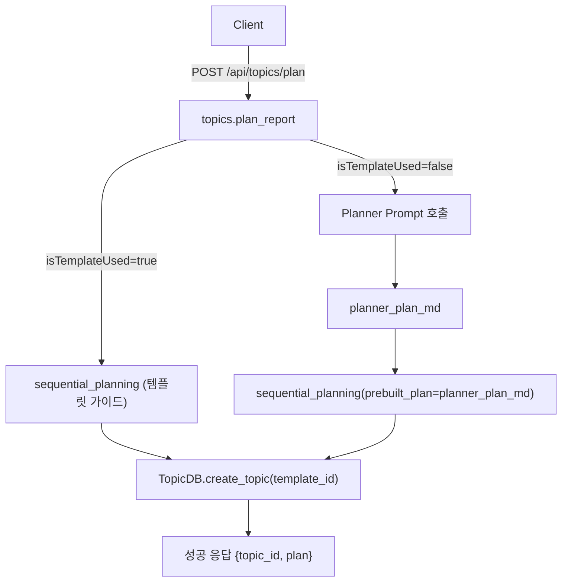

# Unit Spec: /api/topics/plan (템플릿/Planner 분기)

## 1. 요구사항 요약

- **목적:** 보고서 계획 생성 시 템플릿 기반 흐름과 Planner(고도화 프롬프트) 흐름을 선택적으로 수행해 계획을 생성한다.
- **유형:** ☑ 변경
- **핵심 요구사항:**
  - 입력: topic(필수), template_id(선택), isWebSearch(선택), isTemplateUsed(boolean, 기본 true)
  - 출력: JSON `{plan: string, topic_id: int}`
  - 예외/제약: topic 누락/과다 길이 시 400, LLM 오류/타임아웃 시 500/504, template 없음 시 404(기존)
  - 처리흐름 요약: isTemplateUsed=true → 기존 템플릿 기반 sequential_planning; isTemplateUsed=false → Planner 프롬프트로 Markdown 계획 생성 후 sequential_planning에 전달하여 동일 후속 처리.

---

## 2. 구현 대상 파일

| 구분 | 경로 | 설명 |
| ---- | ---- | ---- |
| 변경 | backend/app/models/topic.py | PlanRequest 스키마에 isTemplateUsed 추가 |
| 변경 | backend/app/routers/topics.py | /api/topics/plan 분기, Planner 호출, prebuilt_plan 전달 |
| 변경 | backend/app/utils/sequential_planning.py | prebuilt_plan(Planner 결과) 수용 분기 추가 |
| 신규/변경 | backend/app/utils/prompts.py (또는 utils/planner_prompt.py) | Planner용 프롬프트 정의 및 헬퍼 |

---

## 3. 동작 플로우 (Mermaid)



---

## 4. 테스트 계획

### 4.1 원칙

- TDD 우선, LLM/DB는 mock 또는 in-memory.
- 라우터 분기/스키마/부작용(Topic 생성) 검증.
- 기존 경로 회귀 포함.

### 4.2 구현 예상 테스트 항목(각 항목의 목적 포함)

| TC ID | 계층 | 시나리오 | 목적(무엇을 검증?) | 입력/사전조건 | 기대결과 |
| ----- | ---- | -------- | ------------------ | ------------- | -------- |
| TC-API-PLAN-001 | API | isTemplateUsed 기본값 미전달 | 기본값 True 적용 및 기존 플로우 유지 | `{"topic":"AI 시장"}` | 200, plan 존재, sequential_planning 호출 1회, Planner 호출 0회 |
| TC-API-PLAN-002 | API | isTemplateUsed=false 분기 | Planner 호출 후 prebuilt_plan 경로 사용 | `{"topic":"AI 시장","isTemplateUsed":false}` | 200, plan==planner_plan_md, Planner 1회, sequential_planning 1회(prebuilt) |
| TC-API-PLAN-003 | API | Validation 오류 | 스키마/길이 검증 | `{}` 또는 topic>200자 | 400, 에러코드 VALIDATION_ERROR |
| TC-API-PLAN-004 | Unit | PlanRequest alias 역직렬화 | isTemplateUsed alias 처리 | pydantic 모델 직렬화/역직렬화 | isTemplateUsed 미포함→True, 포함 false→False |
| TC-SVC-PLAN-005 | Unit | sequential_planning prebuilt_plan 경로 | LLM 호출 스킵, 값 패스스루 | prebuilt_plan 전달 | 반환 plan==prebuilt_plan, sections=[] (또는 기본값), LLM 호출 0회 |
| TC-SVC-PLAN-006 | Unit | Planner 헬퍼 메시지 구성 | system/user 메시지 형식 검증 | topic="T1" | ClaudeClient.chat_completion_fast 호출 1회, system 프롬프트에 TITLE~SYSTEM 구조 요청 포함 |

### 4.3 샘플 테스트 코드

- `fastapi.TestClient`로 `/api/topics/plan` 호출.
- `unittest.mock.patch`로 `ClaudeClient`, `TopicDB.create_topic`, `sequential_planning` 모킹해 호출 횟수/인자 검증.
- `PlanRequest`는 직접 인스턴스화하여 alias/default 확인.

---

## 5. 사용자 요청 프롬프트

**Original User Request (1차):**
```
POST /api/topics/plan에 isTemplateUsed 분기 추가, isTemplateUsed=false일 때 Planner 프롬프트(TITLE/DATE/BACKGROUND/MAIN_CONTENT/SUMMARY/CONCLUSION/SYSTEM 구조)로 계획 생성 후 sequential_planning에 전달. 기본값은 기존 호환 유지.
```

**Claude 응답 (필요시):**
```
기존 흐름 요약, 분기 설계, 수정 파일, 단계별 작업, 의사코드, 주의사항 제시.
```

**User Clarification/Modification (2차+):**
```
Backend_UnitSpec.md 템플릿에 맞춰 Unit Spec으로 작성 요청.
```

**최종 명확화 (통합):**
- ✅ isTemplateUsed 기본값 True로 backward compatibility 유지
- ✅ false 분기에서 Planner 프롬프트로 Markdown 계획 생성 후 sequential_planning에 전달
- ✅ 템플릿 기반 기존 플로우 변경 없음
- ✅ API 응답 스키마(plan, topic_id) 유지, 오류 매핑 기존 준수

---

**요청 일시:** 2025-01-17

**컨텍스트/배경:**
- FastAPI 기반 보고서 플래너/생성기
- `/api/topics/plan` 현재 템플릿 기반 LLM → sequential_planning 단일 플로우
- 신규 기능: Planner 프롬프트 분기 추가, 스키마 확장, LLM 호출 경로 분기
