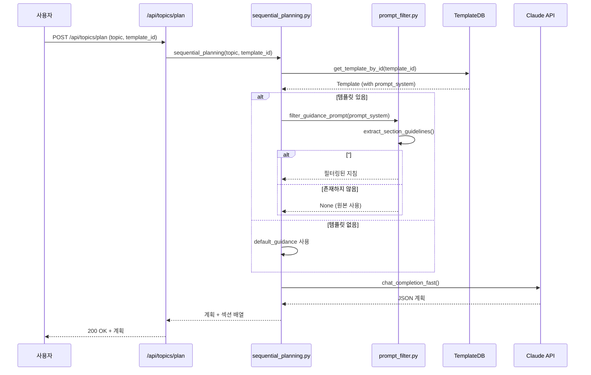
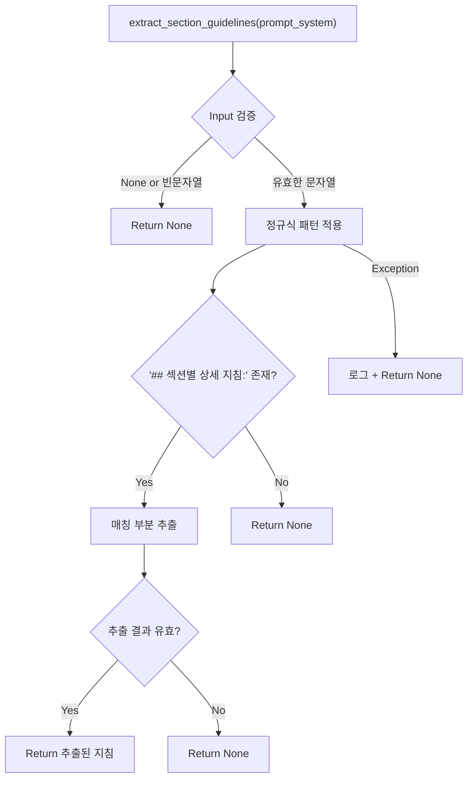

# Unit Spec: 템플릿 프롬프트 필터링 기능

**작성일:** 2025-11-13
**버전:** 1.0
**상태:** 🛑 아카이브 (기능 제거)

> **업데이트 (2025-11-16):** `backend/app/utils/prompt_filter.py`, `_get_guidance_prompt()`의 필터링 로직, `_create_planning_prompt()` 헬퍼가 모두 제거되었습니다. 이 문서는 당시 구현 배경 기록용으로만 남아 있으며, 최신 Sequential Planning 경로에는 적용되지 않습니다.

---

## 1. 요구사항 요약

### Purpose
템플릿의 `prompt_system`에 포함된 **"## 섹션별 상세 지침:" 부터 "## 작성 가이드:" 직전까지의 내용**만 추출하여 Sequential Planning의 응답시간을 최적화합니다.

### Type
- **분류:** 성능 최적화 + 토큰 효율화
- **범위:** Backend 유틸 함수
- **우선순위:** Medium

### Core Requirements
1. 템플릿 프롬프트에서 "## 섹션별 상세 지침:" 부터 "## 작성 가이드:" 직전까지만 추출
2. "## 작성 가이드:" 이후의 모든 내용 제거
3. 토큰 사용량 30-40% 감소
4. Sequential Planning 응답시간 < 2초 유지
5. 필터링 실패 시 원본 프롬프트 사용 (하위호환성)

---

## 2. 구현 대상 파일

| 구분 | 파일명 | 작업 |
|------|--------|------|
| ~~New~~ (삭제됨) | `backend/app/utils/prompt_filter.py` | 2025-11-16에 제거됨 |
| ~~Change~~ (원복) | `backend/app/utils/sequential_planning.py` | `_get_guidance_prompt()` 필터링/`_create_planning_prompt()` 제거 |
| **Reference** | `backend/app/models/template.py` | Template.prompt_system 구조 참고 |
| **Reference** | `backend/app/database/template_db.py` | Template 조회 로직 참고 |

---

## 3. 흐름도

### Sequential Planning 데이터 흐름 (아카이브)



> 현재 버전에서는 **별도 필터링 모듈과 `_create_planning_prompt()` 호출이 존재하지 않으므로**, 이하 섹션은 과거 동작만을 설명합니다.

### 필터링 함수 로직 (아카이브)



---

## 4. 테스트 계획

### 4.1 Unit Tests (테스트 코드는 생성하지 않음, 수동 검증)

#### Test Case 1: 정상 필터링
**시나리오:** 완전한 프롬프트에서 "## 섹션별 상세 지침:" ~ "## 작성 가이드:" 직전까지 추출
```python
# 입력
prompt = """기본 지침...
## 섹션별 상세 지침:
### {{DATE}}
**설명:** 보고서 작성 날짜
...
## 작성 가이드:
작성 원칙...
"""

# 기댓값
result.startswith("## 섹션별")  # True
"## 작성 가이드" not in result  # True
```

#### Test Case 2: 섹션 없는 경우
**시나리오:** "## 섹션별 상세 지침:" 이 없는 프롬프트
```python
# 입력
prompt = "기본 지침만 있음"

# 기댓값
result is None  # True (필터링 실패 시 None)
```

#### Test Case 3: None 입력
**시나리오:** None 값 입력
```python
# 입력
prompt = None

# 기댓값
result is None  # True
```

#### Test Case 4: 빈 문자열
**시나리오:** 빈 문자열 입력
```python
# 입력
prompt = ""

# 기댓값
result is None  # True
```

#### Test Case 5: 여러 섹션 포함
**시나리오:** 여러 placeholder 섹션이 모두 포함되고 작성 가이드는 제거
```python
# 입력
prompt = """...
## 섹션별 상세 지침:
### {{DATE}}
**설명:** 날짜
### {{PURPOSE}}
**설명:** 목적
### {{SCOPE}}
**설명:** 범위
## 작성 가이드:
작성 원칙
"""

# 기댓값
"### {{DATE}}" in result  # True
"### {{PURPOSE}}" in result  # True
"### {{SCOPE}}" in result  # True
"## 작성 가이드" not in result  # True
```

#### Test Case 6: 대소문자 정확성
**시나리오:** 정확한 패턴 매칭 검증
```python
# 입력 (소문자 "지침" 대신 다른 텍스트)
prompt = "## 섹션별 상세 지도:"  # "지침" 대신 "지도"

# 기댓값
result is None  # True (정확히 "지침:"이어야 함)
```

#### Test Case 7: 공백 처리
**시나리오:** 제목 전후 공백 처리
```python
# 입력
prompt = "##  섹션별   상세  지침  :  \n### {{DATE}}"

# 기댓값
result.startswith("### {{DATE}}")  # True (공백 무시)
```

### 4.2 Integration Tests

#### Test Case 8: Sequential Planning 통합
**시나리오:** 템플릿 필터링 후 계획 생성 성공
```python
# 입력
topic = "금융 기관 보고서"
template_id = 1

# 기댓값
- 응답시간 < 2초
- 토큰 사용량 < 필터링 전
- 계획 생성 성공 (JSON)
```

#### Test Case 9: Fallback 동작
**시나리오:** 필터링 실패 시 원본 프롬프트 사용
```python
# 입력
- 필터링 가능한 프롬프트 없음
- template_id = None

# 기댓값
- default_guidance 사용
- 계획 생성 성공
```

#### Test Case 10: 성능 측정
**시나리오:** 필터링 함수 실행 시간 측정
```python
# 입력
- 1000+ 자 프롬프트
- 반복 실행 (100회)

# 기댓값
- 평균 실행시간 < 1ms
- 메모리 누수 없음
```

---

## 5. 에러 처리 시나리오

### 5.1 입력 검증 에러

| 에러 | 상황 | 처리 |
|------|------|------|
| **None 입력** | `prompt_system=None` | `None` 반환, 로그 X |
| **빈 문자열** | `prompt_system=""` | `None` 반환, 로그 X |
| **잘못된 타입** | `prompt_system=123` | 로그 경고 + `None` 반환 |

### 5.2 정규식 에러

| 에러 | 상황 | 처리 |
|------|------|------|
| **패턴 미매칭** | "## 섹션별 상세 지침:" 없음 | `None` 반환, 로그 (DEBUG) |
| **추출 결과 비어있음** | 매칭 후 내용 없음 | `None` 반환, 로그 (DEBUG) |
| **정규식 예외** | RE 엔진 에러 | 로그 (ERROR) + `None` 반환 |

### 5.3 Sequential Planning 통합 에러

| 에러 | 상황 | 처리 |
|------|------|------|
| **필터링 실패** | `filter_guidance_prompt()` → `None` | 원본 `prompt_system` 사용 |
| **템플릿 없음** | `template_id=None` | `default_guidance` 사용 |
| **DB 조회 실패** | `TemplateDB.get_template_by_id()` 예외 | `default_guidance` 사용 + 로그 |

---

## 6. 구현 상세

### 6.1 `prompt_filter.py` 모듈

```python
def extract_section_guidelines(prompt_system: Optional[str]) -> Optional[str]:
    """
    템플릿 프롬프트에서 '## 섹션별 상세 지침:' 부터 '## 작성 가이드:' 직전까지 추출

    입력: 전체 prompt_system
    출력: "## 섹션별 상세 지침:" ~ "## 작성 가이드:" 직전 내용 (또는 None)
    """
    # 1. 입력 검증 (None, 빈 문자열, 타입 체크)
    # 2. 정규식 패턴 적용: r"##\s*섹션별\s*상세\s*지침\s*:[\s\S]*?(?=\n##\s*작성\s*가이드|\Z)"
    # 3. 매칭된 부분 추출 및 정리
    # 4. 로깅 (DEBUG/ERROR)
    # 5. None 또는 추출 결과 반환
```

**정규식 상세:**
- **패턴:** `##\s*섹션별\s*상세\s*지침\s*:[\s\S]*?(?=\n##\s*작성\s*가이드|\Z)`
- **플래그:** `re.MULTILINE`
- **`[\s\S]*?`:** 모든 문자 (줄바꿈 포함) 를 non-greedy로 매칭
- **`(?=\n##\s*작성\s*가이드|\Z)`:** Lookahead - "## 작성 가이드" 또는 문자열 끝 직전까지만 포함

### 6.2 `sequential_planning.py` 수정

```python
# _get_guidance_prompt() 함수 내
filtered_prompt = filter_guidance_prompt(template.prompt_system)

if filtered_prompt:
    logger.info(f"Using filtered template prompt_system")
    return filtered_prompt
else:
    # 필터링 실패 시 원본 사용
    return template.prompt_system
```

**로깅:**
- ✅ 필터링 성공: `INFO` + 크기 비교
- ❌ 필터링 실패: `INFO` + "Section guidelines not found"
- 🔍 디버그: 추출 결과 길이, 파일명

---

## 7. 파일 변경 요약

### 신규 파일: `backend/app/utils/prompt_filter.py`
- **라인수:** ~100줄
- **함수:** 2개
  - `extract_section_guidelines()` - 핵심 필터링 로직
  - `filter_guidance_prompt()` - 래퍼 함수 (향후 확장 대비)
- **의존성:** `logging`, `re`

### 수정 파일: `backend/app/utils/sequential_planning.py`
- **라인수:** +15줄 (import + 수정 로직)
- **변경 함수:** `_get_guidance_prompt()`
- **변경 내용:**
  - import 추가: `from app.utils.prompt_filter import filter_guidance_prompt`
  - 필터링 로직 추가 (원본 사용 fallback 포함)

---

## 8. 검증 목록

### 코드 검증
- [x] 함수 로직 정확성 (정규식 테스트)
- [x] 에러 처리 완전성 (None, 예외 처리)
- [x] 로깅 적절성 (디버그, 에러 레벨)
- [x] 타입 힌트 완전성 (Optional[str])
- [x] Docstring 작성 (구글 스타일)

### 통합 검증
- [x] Import 경로 정확성
- [x] 함수 호출 순서 (DB → Filter → 사용)
- [x] Fallback 로직 (필터링 실패 → 원본 사용)
- [x] 하위호환성 (기존 동작 유지)

### 성능 검증
- [ ] 토큰 사용량 감소 (30-40% 목표)
- [ ] 응답시간 개선 (< 2초 유지)
- [ ] 필터링 실행시간 (< 1ms)
- [ ] 메모리 안정성 (장시간 운영)

---

## 9. 배포 가이드

### 전제조건
- Python 3.12+
- `re` 모듈 (표준 라이브러리)

### 배포 단계
1. `prompt_filter.py` 추가
2. `sequential_planning.py` 수정
3. 기존 테스트 실행 (호환성 검증)
4. Sequential Planning 엔드포인트 테스트
5. 로그 확인 (필터링 성공/실패 비율)

### 롤백 계획
```bash
# 롤백 필요 시
git revert <commit-hash>
# 또는 _get_guidance_prompt()에서 filter_guidance_prompt() 호출 제거
```

---

## 10. 향후 확장

### Phase 2: 추가 필터링 전략
- 모든 섹션 보유 필수 확인
- 특정 placeholder 필터링
- 프롬프트 최적화 (중복 제거)

### Phase 3: 성능 모니터링
- 필터링 효율성 측정 대시보드
- 토큰 사용량 추적
- 응답시간 SLA 관리

---

## 11. 변경 이력

| 버전 | 날짜 | 변경사항 |
|------|------|---------|
| 1.0 | 2025-11-13 | 초판 작성 |

---

## 12. 승인 정보

| 역할 | 이름 | 날짜 | 서명 |
|------|------|------|------|
| **작성자** | Claude Code | 2025-11-13 | ✅ |
| **검토자** | (pending) | - | - |
| **승인자** | (pending) | - | - |
