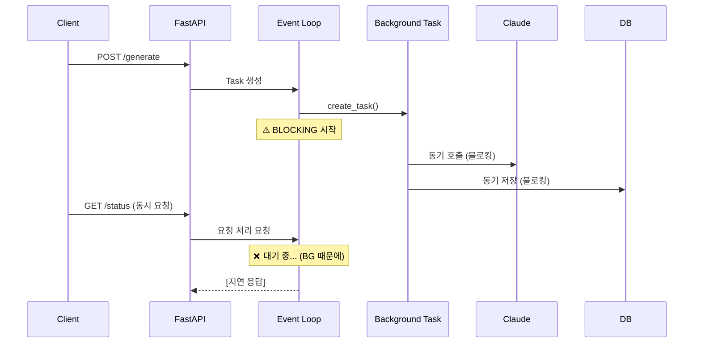
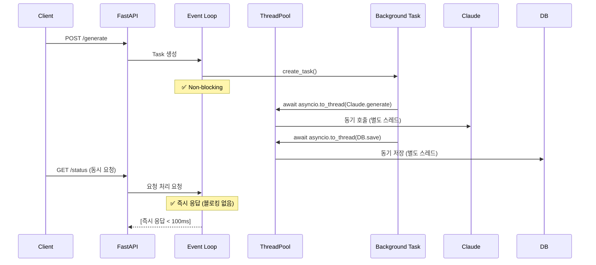

# Unit Spec: 백그라운드 보고서 생성 Event Loop Blocking 문제 해결

**작성일**: 2025-11-14
**담당자**: Claude Code
**우선순위**: 🔴 Critical
**상태**: 📋 검토 대기

---

## 1. 요구사항 요약

### Purpose (목적)
백그라운드 보고서 생성 중에 동기적 작업들이 FastAPI Event Loop을 블로킹하여, 동시에 `/status` 엔드포인트 요청 시 응답이 지연되는 문제를 해결합니다.

### Type (유형)
- 🐛 **Bug Fix** - 성능 및 동시성 문제
- ⚡ **Performance** - Event Loop 최적화

### Core Requirements (핵심 요구사항)

#### R1: Event Loop Non-Blocking 처리
- 모든 동기 작업을 `asyncio.to_thread()`로 감싸기
  - Claude API 호출 (`generate_report()`)
  - DB 저장/조회 (`TopicDB`, `MessageDB`, `ArtifactDB`, `AiUsageDB`)
  - 파일 I/O (`write_text()`, `sha256_of()`)

#### R2: Task 예외 처리 강화
- `asyncio.create_task()` 후 `add_done_callback()` 추가
- Task 실패 시 로그에 명확하게 기록
- 실패한 task의 예외를 `mark_failed()` 로 상태 업데이트

#### R3: 개발 환경 자동 리로드 방지
- `main.py`의 `uvicorn.run(..., reload=True)` 변경
- 개발 중 메모리 상태 손실 문제 해결
- 대체: VS Code Python debugger 또는 `--reload-dir` 옵션 사용

#### R4: 응답 시간 개선
- `/api/topics/{topic_id}/generate` 응답: **< 1초** (현재 OK)
- `/api/topics/{topic_id}/status` 응답: **< 100ms** (현재: blocking 중)
  - 목표: 모든 요청이 event loop 대기 없이 즉시 응답

#### R5: 테스트 커버리지
- 백그라운드 task 예외 처리 테스트 추가
- Event Loop non-blocking 동작 검증
- 동시 요청 시뮬레이션 테스트

---

## 2. 구현 대상 파일

| 파일 | 변경 유형 | 주요 수정 내용 |
|------|----------|--------------|
| `backend/app/routers/topics.py` | **Change** | `_background_generate_report()` 함수 리팩토링 |
| `backend/app/main.py` | **Change** | `uvicorn.run(..., reload=False)` 변경 |
| `backend/tests/test_routers_topics.py` | **Change** | 백그라운드 task 테스트 추가 |
| `backend/doc/specs/this_file.md` | **Reference** | 이 문서 자체 |

---

## 3. 흐름도

### 현재 흐름 (문제 있음)


### 개선된 흐름 (해결 후)


---

## 4. 테스트 계획

### TC-001: Event Loop Non-Blocking (동기 호출 제거)
**분류**: Unit Test
**목표**: `_background_generate_report()`의 모든 동기 호출이 `asyncio.to_thread()`로 감싸져 있는지 확인

**사전 조건**:
- Topic이 생성되어 있음
- 유효한 사용자 인증 토큰 있음

**테스트 단계**:
1. POST `/api/topics/{topic_id}/generate` 호출
2. 즉시 GET `/api/topics/{topic_id}/status` 호출 (생성 중)
3. 응답 시간 측정
4. Status 응답이 100ms 이내인지 확인

**기대 결과**: ✅ 응답 시간 < 100ms

**코드 예시**:
```python
@pytest.mark.asyncio
async def test_tc_001_event_loop_non_blocking():
    """동기 호출이 스레드 풀에서 실행되는지 확인"""
    # 생성 시작
    generate_resp = await client.post(
        f"/api/topics/{topic_id}/generate",
        headers=auth_header,
        json=request_body
    )
    assert generate_resp.status_code == 202

    # 즉시 status 확인
    import time
    start = time.time()
    status_resp = await client.get(
        f"/api/topics/{topic_id}/status",
        headers=auth_header
    )
    elapsed = time.time() - start

    assert status_resp.status_code == 200
    assert elapsed < 0.1  # < 100ms
    assert status_resp.json()["data"]["status"] == "generating"
```

---

### TC-002: Task 예외 처리 - 실패 시 상태 업데이트
**분류**: Unit Test
**목표**: Task 실행 중 예외 발생 시 `mark_failed()`가 호출되는지 확인

**사전 조건**:
- Mock: Claude API가 RuntimeError 발생하도록 설정

**테스트 단계**:
1. Claude API Mock을 실패하도록 설정
2. POST `/api/topics/{topic_id}/generate` 호출
3. Task가 완료될 때까지 대기 (약 1초)
4. GET `/api/topics/{topic_id}/status` 확인

**기대 결과**: ✅ Status = "failed", error_message 포함

**코드 예시**:
```python
@pytest.mark.asyncio
async def test_tc_002_task_exception_handling():
    """Task 실패 시 mark_failed() 호출 확인"""
    with patch('app.utils.claude_client.ClaudeClient.generate_report') as mock_claude:
        mock_claude.side_effect = RuntimeError("Claude API timeout")

        # 생성 시작
        generate_resp = await client.post(
            f"/api/topics/{topic_id}/generate",
            headers=auth_header,
            json=request_body
        )
        assert generate_resp.status_code == 202

        # Task 완료 대기
        await asyncio.sleep(2)

        # 상태 확인
        status_resp = await client.get(
            f"/api/topics/{topic_id}/status",
            headers=auth_header
        )

        assert status_resp.status_code == 200
        data = status_resp.json()["data"]
        assert data["status"] == "failed"
        assert "Claude API timeout" in data["error_message"]
```

---

### TC-003: 동시 다중 생성 요청
**분류**: Integration Test
**목표**: 여러 Topic의 동시 생성이 서로 간섭하지 않는지 확인

**사전 조건**:
- 3개 이상의 Topic이 생성되어 있음

**테스트 단계**:
1. 3개 Topic에 동시에 POST `/generate` 호출
2. 각 Topic의 `/status` 폴링
3. 모든 생성이 동시에 진행되는지 확인

**기대 결과**:
- ✅ 모든 요청이 < 1초 내에 응답
- ✅ Status 조회 응답이 < 100ms
- ✅ 3개 Topic이 모두 "generating" 상태

**코드 예시**:
```python
@pytest.mark.asyncio
async def test_tc_003_concurrent_generation():
    """여러 Topic의 동시 생성이 동시에 진행되는지 확인"""
    topic_ids = [1, 2, 3]

    # 동시 생성 시작
    tasks = [
        client.post(
            f"/api/topics/{tid}/generate",
            headers=auth_header,
            json={"topic": f"Test {tid}", "plan": "Plan"}
        )
        for tid in topic_ids
    ]
    results = await asyncio.gather(*tasks)

    # 모두 202 Accepted
    for resp in results:
        assert resp.status_code == 202

    # 상태 동시 조회
    status_tasks = [
        client.get(
            f"/api/topics/{tid}/status",
            headers=auth_header
        )
        for tid in topic_ids
    ]
    statuses = await asyncio.gather(*status_tasks)

    # 모두 "generating" 상태
    for status_resp in statuses:
        assert status_resp.status_code == 200
        assert status_resp.json()["data"]["status"] == "generating"
```

---

### TC-004: 로그 검증 - 예외 발생 시 로그
**분류**: Unit Test
**목표**: Task 예외 발생 시 ERROR 레벨 로그가 기록되는지 확인

**사전 조건**:
- 로깅 설정: DEBUG 이상 캡처

**테스트 단계**:
1. Claude API Mock을 실패하도록 설정
2. POST `/generate` 호출
3. Task 완료 대기
4. 로그 확인

**기대 결과**: ✅ 로그에 `[BACKGROUND] Report generation failed` 포함

**코드 예시**:
```python
@pytest.mark.asyncio
async def test_tc_004_error_logging():
    """예외 발생 시 로그 기록 확인"""
    with patch('app.utils.claude_client.ClaudeClient.generate_report') as mock_claude:
        mock_claude.side_effect = ValueError("Invalid input")

        with caplog.at_level(logging.ERROR):
            # 생성 시작
            await client.post(
                f"/api/topics/{topic_id}/generate",
                headers=auth_header,
                json=request_body
            )

            # Task 완료 대기
            await asyncio.sleep(2)

            # 로그 확인
            assert any(
                "[BACKGROUND] Report generation failed" in record.message
                and "Invalid input" in record.message
                for record in caplog.records
                if record.levelname == "ERROR"
            )
```

---

### TC-005: Status 엔드포인트 응답 시간
**분류**: Performance Test
**목표**: Status 조회 응답이 < 100ms 이내인지 확인

**사전 조건**:
- 2개 이상의 동시 생성이 진행 중

**테스트 단계**:
1. 2개 Topic의 생성 시작
2. 각 Topic의 Status를 10회 연속 조회
3. 각 조회의 응답 시간 측정

**기대 결과**: ✅ 모든 조회가 < 100ms

**코드 예시**:
```python
@pytest.mark.asyncio
async def test_tc_005_status_response_time():
    """Status 엔드포인트 응답 시간 < 100ms 확인"""
    # 생성 시작
    await client.post(
        f"/api/topics/{topic_id}/generate",
        headers=auth_header,
        json=request_body
    )

    # 응답 시간 측정
    import time
    response_times = []

    for _ in range(10):
        start = time.time()
        resp = await client.get(
            f"/api/topics/{topic_id}/status",
            headers=auth_header
        )
        elapsed = time.time() - start
        response_times.append(elapsed)

        assert resp.status_code == 200

    # 최대 응답 시간 확인
    max_time = max(response_times)
    assert max_time < 0.1  # < 100ms

    print(f"Status response times: {[f'{t*1000:.1f}ms' for t in response_times]}")
```

---

## 5. 에러 처리 시나리오

### E1: Claude API 타임아웃
**발생 조건**: Claude API가 30초 이상 응답 없음
**처리**:
- Task에서 TimeoutError 캡처
- `mark_failed(topic_id, "Claude API timeout")` 호출
- ERROR 로그 기록
- Status 응답에 error_message 포함

### E2: DB 저장 실패
**발생 조건**: SQLite DB 쓰기 실패
**처리**:
- Task에서 SQLError 또는 IntegrityError 캡처
- `mark_failed(topic_id, "Database save failed")` 호출
- 이전에 생성된 파일은 수동으로 정리 필요
- ERROR 로그 기록

### E3: 파일 시스템 오류
**발생 조건**: 디스크 공간 부족, 권한 없음 등
**처리**:
- Task에서 OSError 캡처
- `mark_failed(topic_id, "File system error")` 호출
- ERROR 로그 기록

### E4: 메모리 상태 손실 (개발 환경)
**발생 조건**: FastAPI 자동 리로드로 인한 메모리 초기화
**처리**:
- `main.py`에서 `reload=False` 설정
- 개발자는 VSCode Python debugger 또는 `--reload-dir` 사용
- 상태가 메모리에만 저장되므로, 프로덕션 환경에서는 Redis 사용 고려

---

## 6. 구현 체크리스트

### Step 1: topics.py 수정
- [ ] `_background_generate_report()` 함수 수정
  - [ ] `await asyncio.to_thread(TopicDB.get_topic_by_id, topic_id)` 적용
  - [ ] `await asyncio.to_thread(claude.generate_report, ...)` 적용
  - [ ] `await asyncio.to_thread(MessageDB.create_message, ...)` 적용
  - [ ] `await asyncio.to_thread(ArtifactDB.create_artifact, ...)` 적용
  - [ ] `await asyncio.to_thread(write_text, ...)` 적용
  - [ ] 모든 DB 호출에 `to_thread()` 적용

- [ ] `generate_report_background()` 함수 수정
  - [ ] `task.add_done_callback()` 추가하여 예외 처리
  - [ ] Task 실패 시 로그 기록

- [ ] 로깅 강화
  - [ ] 각 단계별 진행 상황 로그
  - [ ] 예외 발생 시 상세 로그

### Step 2: main.py 수정
- [ ] `uvicorn.run(..., reload=True)` → `reload=False` 변경
- [ ] 개발 가이드 문서 추가 (README 또는 CLAUDE.md)

### Step 3: 테스트 작성
- [ ] TC-001: Event Loop Non-Blocking
- [ ] TC-002: Task 예외 처리
- [ ] TC-003: 동시 다중 생성
- [ ] TC-004: 로그 검증
- [ ] TC-005: 응답 시간 검증

### Step 4: 검증
- [ ] 모든 테스트 통과 (100%)
- [ ] 기존 테스트 영향 없음
- [ ] Swagger에서 동시 요청 시뮬레이션

### Step 5: 문서 업데이트
- [ ] CLAUDE.md 업데이트 (변경사항)
- [ ] backend/CLAUDE.md 업데이트 (개발 가이드)
- [ ] 커밋 메시지 작성

---

## 7. 참고 자료

### asyncio.to_thread() 예시
```python
# ❌ 이전 (동기, 블로킹)
result = claude.generate_report(topic)

# ✅ 이후 (비동기, non-blocking)
result = await asyncio.to_thread(claude.generate_report, topic)
```

### Task 예외 처리 예시
```python
# ❌ 이전 (예외 캡처 없음)
asyncio.create_task(_background_generate_report(...))

# ✅ 이후 (예외 캡처)
task = asyncio.create_task(_background_generate_report(...))

def handle_task_result(task: asyncio.Task):
    try:
        task.result()
    except Exception as e:
        logger.error(f"Task failed: {str(e)}", exc_info=True)

task.add_done_callback(handle_task_result)
```

---

## 8. 성공 기준

| 기준 | 현재 상태 | 목표 | 측정 방법 |
|------|---------|------|---------|
| Event Loop Blocking | ❌ 있음 | ✅ 없음 | 응답 시간 < 100ms |
| 동시 다중 요청 | ❌ 불가 | ✅ 가능 | 3개 동시 생성 동작 |
| Task 예외 처리 | ❌ 미흡 | ✅ 완벽 | 로그에 명확히 기록 |
| 테스트 커버리지 | 📊 78% | 📊 85%+ | pytest coverage |
| 응답 시간 (status) | ❌ 지연 | < 100ms | 시간 측정 |

---

**작성자**: Claude Code
**최종 수정**: 2025-11-14
**검토 대기**: ⏳ 사용자 승인 필요