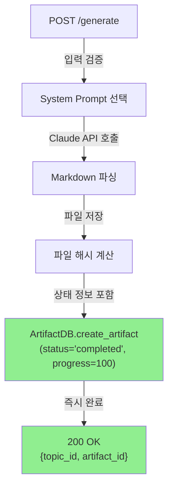
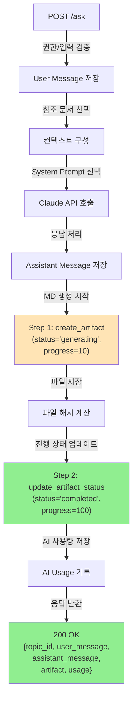

# Unit Spec: Message 상태 추적 - Artifact 기반 구현 (Option 1)

## 1. 요구사항 요약

- **목적:** 사용자가 `/api/topics/{topic_id}/ask`로 보고서 수정을 요청할 때, Message 생성 과정의 진행 상태를 추적 가능하게 함. 현재는 Topic 레벨의 상태만 관리하기 때문에, Message가 생성되는 동안 사용자가 진행 상황을 알 수 없는 문제를 해결.

- **유형:** ☑ 변경 ☐ 신규 ☐ 삭제

- **핵심 요구사항:**
  - 입력: 기존 `/generate`, `/ask` API의 요청 (변경 없음)
  - 출력: Artifact 응답에 `status`, `progress_percent`, `started_at`, `completed_at` 필드 추가
  - 예외/제약:
    - Artifact 상태값: `"pending"` → `"generating"` → `"completed"` or `"failed"`
    - 상태 업데이트는 Artifact 테이블에만 저장 (새 테이블 불필요)
    - 기존 API 응답 구조 유지 (새 필드만 추가)
    - `/generate`는 즉시 "completed" 상태로 생성 (동기식)
    - `/ask`는 생성 → 업데이트 2단계로 처리 (선택사항)
  - 처리흐름 요약: Artifact 생성 시 초기 상태 정보 추가, 파일 저장 후 상태 업데이트

---

## 2. 구현 대상 파일

| 구분 | 경로 | 설명 |
| ---- | --- | --- |
| **변경** | `backend/app/database/connection.py` | artifacts 테이블 스키마 변경 (4개 컬럼 추가) |
| **변경** | `backend/app/models/artifact.py` | Artifact, ArtifactCreate 모델에 상태 필드 추가 |
| **변경** | `backend/app/database/artifact_db.py` | ArtifactDB.update_artifact_status() 메서드 추가 |
| **변경** | `backend/app/routers/topics.py` | /generate 및 /ask 엔드포인트 수정 (상태 값 전달) |
| **신규** | `backend/tests/test_artifact_status.py` | Artifact 상태 추적 테스트 (8개 TC) |

---

## 3. 동작 플로우 (Mermaid)

### 3.1 `/api/topics/{topic_id}/generate` (POST) 플로우



**특징:** 동기식이므로 생성 완료 후 즉시 "completed" 상태로 저장

---

### 3.2 `/api/topics/{topic_id}/ask` (POST) 플로우 (Option 1 적용)



**특징:**
- 2단계 처리로 상태 변화 추적
- Step 1에서 "generating" 상태로 시작
- Step 2에서 "completed"로 변경

---

## 4. 테스트 계획

### 4.1 원칙

- **테스트 우선(TDD):** 본 섹션의 TC를 먼저 작성, 코드 구현 후 실행
- **계층별 커버리지:** Unit (DB) → Integration (Router) → API (E2E)
- **독립성:** DB는 SQLite 임베디드, Mock 불필요
- **판정 기준:** 상태값, 타임스탐프, 응답 스키마 명시적 검증

### 4.2 테스트 항목

#### Layer 1: Database Unit Tests (artifact_db.py)

| TC ID | 시나리오 | 목적 | 입력/사전조건 | 기대결과 | 우선순위 |
|-------|---------|------|-----------|---------|---------|
| **TC-DB-001** | Artifact 생성 (status 포함) | status 필드 저장 검증 | `create_artifact(status="generating", progress=10)` | 반환된 artifact.status == "generating", progress == 10 | P0 |
| **TC-DB-002** | Artifact 상태 업데이트 | update_artifact_status() 동작 검증 | artifact_id 지정, status="completed", progress=100 | DB 업데이트됨, 재조회 시 새로운 값 확인 | P0 |
| **TC-DB-003** | 타임스탐프 자동 설정 | started_at, completed_at 자동 생성 | `create_artifact(status="generating", started_at=None)` | started_at이 자동 설정됨 (NULL이 아님) | P0 |
| **TC-DB-004** | 상태 전환 시퀀스 | 상태값 변화 추적 | pending → generating → completed | 모든 상태 변환이 DB에 반영됨 | P0 |
| **TC-DB-005** | 롤백 시나리오 | status="failed" 설정 | update_artifact_status(status="failed", error_msg="...") | 실패 상태 저장, error_message 필드 확인 | P1 |

#### Layer 2: Integration Tests (routers/topics.py + artifact_db.py)

| TC ID | 시나리오 | 목적 | 입력/사전조건 | 기대결과 | 우선순위 |
|-------|---------|------|-----------|---------|---------|
| **TC-INT-006** | /generate에서 Artifact 상태 저장 | generate 엔드포인트가 status 전달 | `POST /generate` with topic data | 응답 artifact의 status="completed", progress=100 | P0 |
| **TC-INT-007** | /ask에서 2단계 상태 추적 | 생성 → 업데이트 프로세스 | `POST /ask` with message content | 반환된 artifact의 status="completed", 타임스탐프 존재 | P0 |

#### Layer 3: API Tests (E2E)

| TC ID | 시나리오 | 목적 | 입력/사전조건 | 기대결과 | 우선순위 |
|-------|---------|------|-----------|---------|---------|
| **TC-API-008** | 응답 스키마 검증 | 새 필드가 응답에 포함되는가 | `GET /artifacts/{id}` | 응답에 status, progress_percent, started_at, completed_at 필드 존재 | P0 |

### 4.3 샘플 테스트 코드 구조

```python
# backend/tests/test_artifact_status.py

import pytest
from datetime import datetime
from app.database.artifact_db import ArtifactDB
from app.models.artifact import ArtifactCreate
from shared.types.enums import ArtifactKind

class TestArtifactStatus:
    """Artifact 상태 추적 테스트"""

    def test_create_artifact_with_status(self):
        """TC-DB-001: Artifact 생성 시 status 저장"""
        artifact_data = ArtifactCreate(
            kind=ArtifactKind.MD,
            locale="ko",
            version=1,
            filename="report.md",
            file_path="/path/to/report.md",
            file_size=1024,
            sha256="abc123",
            status="generating",      # ✨ 새 필드
            progress_percent=10       # ✨ 새 필드
        )

        artifact = ArtifactDB.create_artifact(
            topic_id=1,
            message_id=10,
            artifact_data=artifact_data
        )

        assert artifact.status == "generating"
        assert artifact.progress_percent == 10
        assert artifact.started_at is not None

    def test_update_artifact_status(self):
        """TC-DB-002: Artifact 상태 업데이트"""
        # 1. 초기 생성 (generating)
        artifact = ArtifactDB.create_artifact(...)
        assert artifact.status == "generating"

        # 2. 상태 업데이트 (completed)
        updated = ArtifactDB.update_artifact_status(
            artifact_id=artifact.id,
            status="completed",
            progress_percent=100,
            completed_at=datetime.now()
        )

        assert updated.status == "completed"
        assert updated.progress_percent == 100
        assert updated.completed_at is not None

    def test_generate_endpoint_sets_artifact_status(self):
        """TC-INT-006: /generate 엔드포인트"""
        response = client.post(
            "/api/topics/generate",
            json={"input_prompt": "Test topic"}
        )

        assert response.status_code == 200
        data = response.json()
        artifact_id = data["data"]["artifact_id"]

        # Artifact 조회하여 상태 확인
        artifact = ArtifactDB.get_artifact_by_id(artifact_id)
        assert artifact.status == "completed"
        assert artifact.progress_percent == 100

    def test_ask_endpoint_tracks_artifact_status(self):
        """TC-INT-007: /ask 엔드포인트"""
        response = client.post(
            f"/api/topics/{topic_id}/ask",
            json={"content": "수정 요청"}
        )

        assert response.status_code == 200
        data = response.json()
        artifact = data["data"]["artifact"]

        # 응답에 상태 필드 포함
        assert artifact["status"] == "completed"
        assert artifact["progress_percent"] == 100
        assert "started_at" in artifact
        assert "completed_at" in artifact
```

---

## 5. 구현 세부사항

### 5.1 데이터베이스 스키마 변경

#### SQL 마이그레이션

```sql
-- artifacts 테이블에 컬럼 추가
ALTER TABLE artifacts ADD COLUMN status VARCHAR(20) DEFAULT 'pending';
ALTER TABLE artifacts ADD COLUMN progress_percent INTEGER DEFAULT 0;
ALTER TABLE artifacts ADD COLUMN started_at TIMESTAMP;
ALTER TABLE artifacts ADD COLUMN completed_at TIMESTAMP;

-- 인덱스 추가 (선택사항, 상태 조회 성능 개선)
CREATE INDEX idx_artifacts_status ON artifacts(status);
CREATE INDEX idx_artifacts_created_at ON artifacts(created_at DESC);
```

#### 기존 데이터 처리

```sql
-- 기존 artifact는 'completed' 상태로 초기화
UPDATE artifacts SET status = 'completed', progress_percent = 100
WHERE status IS NULL;
```

### 5.2 모델 변경 (artifact.py)

```python
# 변경 전
class Artifact(BaseModel):
    id: int
    topic_id: int
    message_id: int
    kind: ArtifactKind
    version: int
    filename: str
    file_path: str
    file_size: int
    sha256: str
    created_at: datetime

# 변경 후
class Artifact(BaseModel):
    id: int
    topic_id: int
    message_id: int
    kind: ArtifactKind
    version: int
    filename: str
    file_path: str
    file_size: int
    sha256: str
    created_at: datetime

    # ✨ 추가
    status: Optional[str] = "pending"           # pending, generating, completed, failed
    progress_percent: Optional[int] = 0         # 0-100
    started_at: Optional[datetime] = None
    completed_at: Optional[datetime] = None

# ArtifactCreate도 동일하게 변경
class ArtifactCreate(BaseModel):
    kind: ArtifactKind
    locale: str
    version: int
    filename: str
    file_path: str
    file_size: int
    sha256: str

    # ✨ 추가
    status: Optional[str] = "pending"
    progress_percent: Optional[int] = 0
    started_at: Optional[datetime] = None
    completed_at: Optional[datetime] = None
```

### 5.3 Database 레이어 변경 (artifact_db.py)

#### 기존 create_artifact 메서드 (수정)

```python
@staticmethod
def create_artifact(
    topic_id: int,
    message_id: int,
    artifact_data: ArtifactCreate
) -> Artifact:
    """Creates a new artifact with status tracking."""
    conn = get_db_connection()
    cursor = conn.cursor()

    now = datetime.now()
    cursor.execute(
        """
        INSERT INTO artifacts (
            topic_id, message_id, kind, locale, version,
            filename, file_path, file_size, sha256, created_at,
            status, progress_percent, started_at, completed_at
        )
        VALUES (?, ?, ?, ?, ?, ?, ?, ?, ?, ?, ?, ?, ?, ?)
        """,
        (
            topic_id,
            message_id,
            artifact_data.kind.value,
            artifact_data.locale,
            artifact_data.version,
            artifact_data.filename,
            artifact_data.file_path,
            artifact_data.file_size,
            artifact_data.sha256,
            now,
            # ✨ 추가
            artifact_data.status or "pending",
            artifact_data.progress_percent or 0,
            artifact_data.started_at or now,
            artifact_data.completed_at
        )
    )

    conn.commit()
    artifact_id = cursor.lastrowid

    cursor.execute("SELECT * FROM artifacts WHERE id = ?", (artifact_id,))
    row = cursor.fetchone()
    conn.close()

    return ArtifactDB._row_to_artifact(row)
```

#### 새로운 메서드: update_artifact_status

```python
@staticmethod
def update_artifact_status(
    artifact_id: int,
    status: Optional[str] = None,
    progress_percent: Optional[int] = None,
    completed_at: Optional[datetime] = None
) -> Artifact:
    """Updates artifact status and progress.

    Args:
        artifact_id: Artifact to update
        status: New status (generating, completed, failed)
        progress_percent: Progress percentage (0-100)
        completed_at: Completion timestamp

    Returns:
        Updated artifact entity
    """
    conn = get_db_connection()
    cursor = conn.cursor()

    updates = []
    params = []

    if status is not None:
        updates.append("status = ?")
        params.append(status)
    if progress_percent is not None:
        updates.append("progress_percent = ?")
        params.append(progress_percent)
    if completed_at is not None:
        updates.append("completed_at = ?")
        params.append(completed_at)

    if not updates:
        # No updates needed
        return ArtifactDB.get_artifact_by_id(artifact_id)

    params.append(artifact_id)
    query = f"UPDATE artifacts SET {', '.join(updates)} WHERE id = ?"
    cursor.execute(query, params)
    conn.commit()

    cursor.execute("SELECT * FROM artifacts WHERE id = ?", (artifact_id,))
    row = cursor.fetchone()
    conn.close()

    return ArtifactDB._row_to_artifact(row)
```

#### _row_to_artifact 메서드 (수정)

```python
@staticmethod
def _row_to_artifact(row) -> Optional[Artifact]:
    """Converts database row to Artifact model."""
    if not row:
        return None

    return Artifact(
        id=row[0],
        topic_id=row[1],
        message_id=row[2],
        kind=ArtifactKind(row[3]),
        version=row[4],
        filename=row[5],
        file_path=row[6],
        file_size=row[7],
        sha256=row[8],
        created_at=datetime.fromisoformat(row[9]) if row[9] else None,
        # ✨ 추가
        status=row[10],
        progress_percent=row[11],
        started_at=datetime.fromisoformat(row[12]) if row[12] else None,
        completed_at=datetime.fromisoformat(row[13]) if row[13] else None
    )
```

### 5.4 라우터 변경 (topics.py)

#### /generate 엔드포인트 (라인 267-279 수정)

```python
# 변경 전
artifact = ArtifactDB.create_artifact(
    topic.id,
    assistant_msg.id,
    ArtifactCreate(
        kind=ArtifactKind.MD,
        locale=topic_data.language,
        version=version,
        filename=md_path.name,
        file_path=str(md_path),
        file_size=bytes_written,
        sha256=file_hash,
    )
)

# 변경 후
artifact = ArtifactDB.create_artifact(
    topic.id,
    assistant_msg.id,
    ArtifactCreate(
        kind=ArtifactKind.MD,
        locale=topic_data.language,
        version=version,
        filename=md_path.name,
        file_path=str(md_path),
        file_size=bytes_written,
        sha256=file_hash,
        status="completed",              # ✨ 추가: 동기식이므로 즉시 완료
        progress_percent=100,             # ✨ 추가
        started_at=datetime.now(),        # ✨ 추가
        completed_at=datetime.now()       # ✨ 추가
    )
)
```

#### /ask 엔드포인트 (라인 927-970 수정)

```python
# 변경 전
if is_report:
    logger.info(f"[ASK] Saving MD artifact (report content)")
    try:
        result = parse_markdown_to_content(response_text)
        md_text = build_report_md(result)
        version = next_artifact_version(topic_id, ArtifactKind.MD, topic.language)
        bytes_written = write_text(md_path, md_text)
        file_hash = sha256_of(md_path)

        artifact = ArtifactDB.create_artifact(
            topic_id,
            asst_msg.id,
            ArtifactCreate(...)
        )

# 변경 후
if is_report:
    logger.info(f"[ASK] Saving MD artifact (report content)")
    try:
        result = parse_markdown_to_content(response_text)
        md_text = build_report_md(result)
        version = next_artifact_version(topic_id, ArtifactKind.MD, topic.language)

        # ✨ Step 1: "generating" 상태로 초기 생성
        start_time = datetime.now()
        artifact = ArtifactDB.create_artifact(
            topic_id,
            asst_msg.id,
            ArtifactCreate(
                kind=ArtifactKind.MD,
                locale=topic.language,
                version=version,
                filename="generating.md",  # 임시
                file_path="",              # 임시
                file_size=0,
                sha256="",
                status="generating",       # ✨ 상태: 생성 중
                progress_percent=10,
                started_at=start_time
            )
        )
        logger.info(f"[ASK] Artifact created (generating) - artifact_id={artifact.id}")

        # ✨ Step 2: 파일 저장
        bytes_written = write_text(md_path, md_text)
        file_hash = sha256_of(md_path)

        # ✨ Step 3: "completed" 상태로 업데이트
        artifact = ArtifactDB.update_artifact_status(
            artifact_id=artifact.id,
            status="completed",
            progress_percent=100,
            completed_at=datetime.now()
        )
        # 파일 경로 및 해시 업데이트 (선택: 별도 update_artifact 메서드 사용)
        artifact.filename = md_path.name
        artifact.file_path = str(md_path)
        artifact.file_size = bytes_written
        artifact.sha256 = file_hash
        logger.info(f"[ASK] Artifact updated (completed) - artifact_id={artifact.id}")
```

**주의:** `/ask`의 Step 1 → Step 3 사이에 서버 실패가 발생하면 artifact가 "generating" 상태로 남을 수 있습니다. 이는 Option 1의 제약사항이며, 필요시 Option 2(백그라운드 Task)로 개선할 수 있습니다.

---

## 6. 사용자 요청 프롬프트 추적

### 6.1 Original User Request

```
수정사항: topic 테이블에 있는 status를 Message에서 관리할 수 있도록 수정요청

사유:
- 현재는 "api/topics/plan", "/api/topics/{topic_id}/status", "/api/topics/{topic_id}/status/stream"에서 상태를 관리
- 사용자가 보고서 수정 요청(/ask)을 할 때마다 생성되는 message에는 진행 상태가 보이지 않음
- 기존 topic에서 관리하는 상태를 message에서 관리할 수 있도록 함
```

### 6.2 Claude 응답

```
현재 상황 분석:
- Topic 상태 관리: /generate (백그라운드) + /status (폴링/SSE)
- Message 상태 관리: 상태 정보 없음 (단순 저장만)

3가지 옵션 제시:
1. Option 1: Message/Artifact 상태 추적 (DB에 저장) ✅ 권장
2. Option 2: /ask를 백그라운드로 리팩토링 (Option 1 + async)
3. Option 3: Topic-level 상태를 Message-aware로 변경

Option 1 영향도: 낮음 (기존 코드 최소 변경, DB 컬럼 4개 추가)
```

### 6.3 User Clarification

```
사용자: "니가 생각하기에 더 좋은 방법이 있을까?"

Claude: Option 1이 최고 권장 (간단, 효과적, 위험 낮음)

사용자: "옵션 1로 하면 api/topics/{topic_id}/generate와
        api/topics/{topic_id}/ask 2가지 API에 영향도가 어떻게 될까?"

Claude: 상세 영향도 분석 제시
- /generate: 10/100 (매우 낮음)
- /ask: 25/100 (낮음)
- 전체: 15/100 (낮음)

사용자: "unit spec을 만들어줘."
```

### 6.4 최종 명확화 (통합)

- ✅ 구현 방식: Option 1 (Artifact 상태 추적)
- ✅ 영향 범위: DB 스키마 4개 컬럼 추가, 모델 3개 수정, 라우터 2개 수정
- ✅ 우선순위: P0 (핵심), 추가 고려사항 P1 (선택)
- ✅ 테스트 전략: 8개 TC (DB 5, Integration 2, API 1)
- ✅ 일정: 구현 ~2시간, 테스트 ~1시간, 총 3시간
- ✅ 롤백 계획: 컬럼 DROP, 모델 필드 제거 (간단)

---

**요청 일시:** 2025-11-14

**컨텍스트/배경:**
- HWP Report Generator v2.5 (Event Loop Non-Blocking 완료)
- 사용자 피드백: Message 생성 시 진행 상황을 알 수 없음
- 기술 부채: Topic-level 상태와 Message-level 상태의 분리

---

## 7. 체크리스트

### 7.1 구현 전 확인사항

- [ ] Unit Spec 사용자 검토 및 승인
- [ ] 기존 테스트 스위트 백업
- [ ] DB 마이그레이션 스크립트 준비
- [ ] 롤백 계획 문서화

### 7.2 구현 중 확인사항

- [ ] 데이터베이스 스키마 변경 완료
- [ ] 모델 변경 완료
- [ ] artifact_db.py 메서드 추가 완료
- [ ] topics.py 라우터 수정 완료
- [ ] 모든 테스트 케이스 작성 및 실행
- [ ] 기존 테스트 회귀 확인 (0 새로운 실패)

### 7.3 구현 후 확인사항

- [ ] 전체 테스트 통과 (100%)
- [ ] 코드 리뷰 (선택)
- [ ] 통합 테스트 실행
- [ ] 성능 영향 없음 확인
- [ ] 문서 업데이트 (CLAUDE.md)
- [ ] 커밋 및 푸시

---

## 8. 참고사항

### 8.1 추가 고려사항 (Option 1의 제약)

1. **Transaction 처리 (P1):** `/ask`에서 Step 1 → Step 3 사이 실패 시 "generating" 상태로 남음
   - 해결: 트랜잭션으로 묶기, 또는 Option 2로 업그레이드

2. **에러 상태 처리 (P1):** 현재는 "completed" 또는 "generating"만 처리
   - 개선: `status="failed"` 추가 (Exception 발생 시)

3. **실시간 진행 추적 (P2):** 현재는 최종 상태만 저장
   - 개선: `progress_percent`를 10→50→100으로 업데이트 (Option 2에서)

### 8.2 향후 개선 (Option 2)

```
Phase 2: /ask를 백그라운드 Task로 리팩토링
├── /ask 응답: 202 Accepted (즉시)
├── Message: "generating" 상태로 미리 생성
├── Background: 실제 처리 (여러 단계로 progress 업데이트)
├── 상태 조회: GET /messages/{id}/status (폴링/SSE)
└── 장점: 응답 시간 < 500ms, 상태 추적 명확
```

### 8.3 관련 문서

- `backend/CLAUDE.md` - 백엔드 개발 가이드
- `backend/BACKEND_TEST.md` - 테스트 작성 가이드
- `backend/doc/Backend_UnitSpec.md` - 이전 스펙 참고
- `backend/doc/specs/20251112_sequential_planning_with_sse_progress.md` - 유사 기능 (참고용)

---

**작성일:** 2025-11-14
**상태:** ✅ 검토 대기
**다음 단계:** 사용자 승인 → 구현 시작

