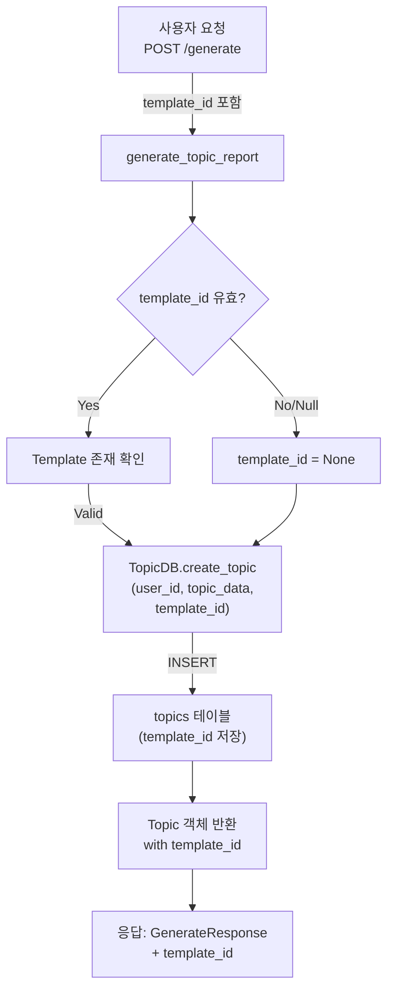
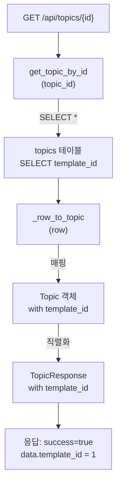

# Unit Spec: Template ID Tracking in Topics

**작성일:** 2025-11-14
**버전:** 1.0
**상태:** 📋 대기 (사용자 검토 필요)

---

## 1. 요구사항 요약

### Purpose
Topic 생성 시 사용된 Template ID를 추적하여 보고서 생성에 사용된 템플릿 정보를 기록하고, GET Topic 응답에 template_id를 포함하도록 개선합니다.

### Type
- **범주:** Database Schema Enhancement + API Extension
- **규모:** Small (중간 규모 스키마 변경 1개 + API 수정 2개)
- **복잡도:** Low (기존 구조 활용, 새로운 로직 불필요)

### Core Requirements

#### Req 1: DB 스키마 개선
- [ ] `topics` 테이블에 `template_id` 컬럼 신규 추가 (NULL 허용)
- [ ] `template_id` ← `templates` 테이블의 외래 키 (FK)
- [ ] 인덱스 생성: `idx_topics_template_id`
- [ ] 마이그레이션: 기존 테이블에 컬럼 추가

#### Req 2: Topic 생성 함수 수정 (template_id 저장)
다음 5개 함수에서 `template_id` 저장:

| 함수 | 파일 | 현재 동작 | 개선 사항 |
|------|------|---------|----------|
| **create_topic()** | routers/topics.py | Topic 생성 | template_id 전달 |
| **generate_topic_report()** | routers/topics.py | 보고서 생성 (9단계) | Step 1에서 template_id 저장 |
| **ask()** | routers/topics.py | 메시지 체이닝 (12단계) | template_id는 이미 AskRequest에 있음 (새 topic은 아님) |
| **sequential_planning()** | routers/topics.py | Plan 생성 | template_id 저장 |
| **TopicDB.create_topic()** | database/topic_db.py | CRUD 저장 | template_id 컬럼 저장 |

#### Req 3: GET Topic 응답 수정 (template_id 포함)
- [ ] `GET /api/topics/{id}` 응답에 `template_id` 필드 추가
- [ ] `GET /api/topics` (목록) 응답에 각 topic의 `template_id` 포함
- [ ] `TopicResponse` 모델에 `template_id` 필드 추가
- [ ] `TopicListResponse` 모델에 `template_id` 필드 포함

#### Req 4: 테스트 작성
- [ ] Unit Test: TopicDB.create_topic() with template_id
- [ ] Unit Test: TopicDB.get_topic_by_id() returns template_id
- [ ] Unit Test: generate_topic_report() saves template_id
- [ ] Unit Test: sequential_planning() saves template_id
- [ ] Unit Test: GET /api/topics/{id} response includes template_id
- [ ] Integration Test: E2E flow with template selection

---

## 2. 구현 대상 파일

### New Files
| 파일 | 용도 | 유형 |
|------|------|------|
| (없음) | - | - |

### Modified Files (변경 필요)

| 파일 | 변경 사항 | 라인 수 |
|------|---------|--------|
| **backend/app/database/connection.py** | ALTER TABLE topics ADD COLUMN template_id | 5-10줄 |
| **backend/app/database/topic_db.py** | create_topic() SQL 수정, _row_to_topic() 수정 | 20줄 |
| **backend/app/models/topic.py** | TopicCreate, Topic, TopicResponse에 template_id 필드 | 10줄 |
| **backend/app/routers/topics.py** | 5개 함수 수정 (create_topic, generate_topic_report, sequential_planning, etc) | 30줄 |
| **tests/test_topics.py** | 신규 테스트 케이스 6개 | 100줄 |

### Reference Files (변경 없음)
- backend/app/routers/templates.py (Template 관련 - 참고)
- backend/app/models/artifact.py (Artifact 모델 - 참고)

---

## 3. 흐름도

### 3.1 Topic 생성 흐름 (template_id 저장)



### 3.2 GET Topic 흐름 (template_id 조회)



### 3.3 데이터 흐름

```
User Input (template_id=1)
    ↓
TopicCreate(input_prompt, template_id)  [request 모델]
    ↓
generate_topic_report(template_id)
    ↓
TopicDB.create_topic(user_id, topic_data, template_id=1)
    ↓
INSERT INTO topics (user_id, ..., template_id) VALUES (..., 1)
    ↓
SELECT * FROM topics WHERE id = ?  [template_id 포함]
    ↓
Topic(id, user_id, ..., template_id=1)  [도메인 모델]
    ↓
TopicResponse(id, user_id, ..., template_id=1)  [응답 모델]
    ↓
JSON Response: { template_id: 1, ... }
```

---

## 4. 데이터베이스 변경사항

### 4.1 ALTER TABLE 스크립트

```sql
-- topics 테이블에 template_id 컬럼 추가
ALTER TABLE topics ADD COLUMN template_id INTEGER DEFAULT NULL;

-- 외래 키 제약 추가
ALTER TABLE topics ADD FOREIGN KEY (template_id) REFERENCES templates(id) ON DELETE SET NULL;

-- 인덱스 생성 (조회 성능 개선)
CREATE INDEX idx_topics_template_id ON topics(template_id);
```

### 4.2 테이블 스키마 변경 전후

**변경 전:**
```sql
CREATE TABLE topics (
    id INTEGER PRIMARY KEY AUTOINCREMENT,
    user_id INTEGER NOT NULL,
    input_prompt TEXT NOT NULL,
    generated_title TEXT,
    language TEXT NOT NULL DEFAULT 'ko',
    status TEXT NOT NULL DEFAULT 'active',
    created_at TIMESTAMP DEFAULT CURRENT_TIMESTAMP,
    updated_at TIMESTAMP DEFAULT CURRENT_TIMESTAMP,
    FOREIGN KEY (user_id) REFERENCES users (id) ON DELETE CASCADE
)
```

**변경 후:**
```sql
CREATE TABLE topics (
    id INTEGER PRIMARY KEY AUTOINCREMENT,
    user_id INTEGER NOT NULL,
    input_prompt TEXT NOT NULL,
    generated_title TEXT,
    language TEXT NOT NULL DEFAULT 'ko',
    status TEXT NOT NULL DEFAULT 'active',
    template_id INTEGER DEFAULT NULL,                    -- ✨ 신규 추가
    created_at TIMESTAMP DEFAULT CURRENT_TIMESTAMP,
    updated_at TIMESTAMP DEFAULT CURRENT_TIMESTAMP,
    FOREIGN KEY (user_id) REFERENCES users (id) ON DELETE CASCADE,
    FOREIGN KEY (template_id) REFERENCES templates (id) ON DELETE SET NULL  -- ✨ 신규 추가
)
```

### 4.3 마이그레이션 전략

```python
# connection.py의 init_db() 함수에 추가
try:
    cursor.execute("""
        ALTER TABLE topics ADD COLUMN template_id INTEGER DEFAULT NULL
    """)
    cursor.execute("""
        ALTER TABLE topics ADD FOREIGN KEY (template_id)
        REFERENCES templates(id) ON DELETE SET NULL
    """)
    cursor.execute("""
        CREATE INDEX idx_topics_template_id ON topics(template_id)
    """)
except sqlite3.OperationalError:
    pass  # 컬럼이 이미 존재하면 무시
```

---

## 5. API 변경사항

### 5.1 POST /api/topics/generate (기존 엔드포인트 수정)

**요청 (Request)**

```json
{
  "input_prompt": "2025 디지털뱅킹 트렌드 분석",
  "language": "ko",
  "template_id": 1  // ✨ 이미 존재하나, TopicDB에 저장되지 않음 (버그)
}
```

**응답 (Response) - 변경 후**

```json
{
  "success": true,
  "data": {
    "topic_id": 42,
    "artifact_id": 100,
    "generated_title": "2025 디지털뱅킹 트렌드 분석",
    "template_id": 1  // ✨ 신규 응답 필드
  }
}
```

### 5.2 GET /api/topics/{id} (기존 엔드포인트 수정)

**응답 (Response) - 변경 후**

```json
{
  "success": true,
  "data": {
    "id": 42,
    "user_id": 1,
    "input_prompt": "2025 디지털뱅킹 트렌드 분석",
    "generated_title": "2025 디지털뱅킹 트렌드 분석",
    "language": "ko",
    "status": "active",
    "template_id": 1,  // ✨ 신규 필드
    "created_at": "2025-11-14T10:30:00",
    "updated_at": "2025-11-14T10:30:00"
  }
}
```

### 5.3 GET /api/topics (목록, 기존 엔드포인트 수정)

**응답 (Response) - 변경 후**

```json
{
  "success": true,
  "data": [
    {
      "id": 42,
      "user_id": 1,
      "input_prompt": "...",
      "generated_title": "...",
      "language": "ko",
      "status": "active",
      "template_id": 1,  // ✨ 신규 필드
      "created_at": "...",
      "updated_at": "..."
    }
  ],
  "meta": {
    "total": 100,
    "limit": 20,
    "offset": 0
  }
}
```

---

## 6. 모델 변경사항

### 6.1 backend/app/models/topic.py

**TopicCreate 모델 (선택사항 - 이미 있을 수 있음)**

```python
# 현재
class TopicCreate(BaseModel):
    input_prompt: str
    language: str = "ko"

# 변경 후
class TopicCreate(BaseModel):
    input_prompt: str
    language: str = "ko"
    template_id: Optional[int] = None  # ✨ 신규 추가
```

**Topic 모델 (도메인 모델)**

```python
# 현재
class Topic(BaseModel):
    id: int
    user_id: int
    input_prompt: str
    generated_title: Optional[str]
    language: str
    status: str
    created_at: datetime
    updated_at: datetime

# 변경 후
class Topic(BaseModel):
    id: int
    user_id: int
    input_prompt: str
    generated_title: Optional[str]
    language: str
    status: str
    template_id: Optional[int] = None  # ✨ 신규 추가
    created_at: datetime
    updated_at: datetime
```

**TopicResponse 모델 (응답 모델)**

```python
# 현재
class TopicResponse(BaseModel):
    id: int
    user_id: int
    input_prompt: str
    generated_title: Optional[str]
    language: str
    status: str
    created_at: datetime
    updated_at: datetime

# 변경 후
class TopicResponse(BaseModel):
    id: int
    user_id: int
    input_prompt: str
    generated_title: Optional[str]
    language: str
    status: str
    template_id: Optional[int] = None  # ✨ 신규 추가
    created_at: datetime
    updated_at: datetime
```

**TopicListResponse 모델 (목록 응답 모델)**

```python
# 이미 TopicResponse를 사용하면 자동으로 포함됨
# 확인 필요: List[TopicResponse]를 사용하는지 여부
```

---

## 7. 테스트 계획

### 7.1 Unit Tests (test_topics.py)

#### TC-1: TopicDB.create_topic() with template_id

**테스트 케이스**
```python
def test_create_topic_with_template_id():
    """Template ID를 지정하여 Topic 생성"""
    topic_data = TopicCreate(
        input_prompt="Test topic",
        language="ko",
        template_id=1
    )
    topic = TopicDB.create_topic(user_id=1, topic_data=topic_data)

    assert topic.id is not None
    assert topic.template_id == 1  # ✨ 신규 검증
```

**예상 결과**
- ✅ topic.template_id == 1
- ✅ DB에 저장된 template_id == 1

**실패 케이스**
- template_id가 NULL인 경우 → topic.template_id == None (성공)

---

#### TC-2: TopicDB.create_topic() with None template_id

**테스트 케이스**
```python
def test_create_topic_without_template_id():
    """Template ID 없이 Topic 생성 (기본 System Prompt 사용)"""
    topic_data = TopicCreate(
        input_prompt="Test topic",
        language="ko"
    )
    topic = TopicDB.create_topic(user_id=1, topic_data=topic_data)

    assert topic.id is not None
    assert topic.template_id is None  # ✨ 신규 검증
```

**예상 결과**
- ✅ topic.template_id == None
- ✅ 생성 성공 (하위 호환성)

---

#### TC-3: TopicDB.get_topic_by_id() returns template_id

**테스트 케이스**
```python
def test_get_topic_by_id_with_template_id():
    """Topic 조회 시 template_id 포함되는지 확인"""
    # 1. Template ID와 함께 Topic 생성
    topic_data = TopicCreate(input_prompt="Test", template_id=1)
    created = TopicDB.create_topic(user_id=1, topic_data=topic_data)

    # 2. Topic 조회
    retrieved = TopicDB.get_topic_by_id(created.id)

    assert retrieved is not None
    assert retrieved.template_id == 1  # ✨ 신규 검증
```

**예상 결과**
- ✅ retrieved.template_id == 1

---

#### TC-4: generate_topic_report() saves template_id

**테스트 케이스**
```python
def test_generate_topic_report_saves_template_id():
    """generate_topic_report() 함수가 template_id를 저장하는지 확인"""
    request = GenerateRequest(
        input_prompt="2025 트렌드",
        template_id=1
    )

    response = generate_topic_report(request, current_user=test_user)

    # 3. DB에서 Topic 조회하여 template_id 확인
    topic = TopicDB.get_topic_by_id(response.topic_id)
    assert topic.template_id == 1  # ✨ 신규 검증
```

**예상 결과**
- ✅ Topic DB에 template_id == 1 저장됨

---

#### TC-5: sequential_planning() saves template_id

**테스트 케이스**
```python
def test_sequential_planning_saves_template_id():
    """sequential_planning() 함수가 template_id를 저장하는지 확인"""
    request = PlanRequest(
        input_prompt="2025 트렌드",
        template_id=1
    )

    response = sequential_planning(request, current_user=test_user)

    # 2. DB에서 Topic 조회하여 template_id 확인
    topic = TopicDB.get_topic_by_id(response.topic_id)
    assert topic.template_id == 1  # ✨ 신규 검증
```

**예상 결과**
- ✅ Topic DB에 template_id == 1 저장됨

---

#### TC-6: API Response includes template_id

**테스트 케이스**
```python
def test_get_topic_api_includes_template_id(client, test_user_token):
    """GET /api/topics/{id} 응답에 template_id가 포함되는지 확인"""
    # 1. Template ID와 함께 Topic 생성
    topic_data = TopicCreate(input_prompt="Test", template_id=1)
    topic = TopicDB.create_topic(user_id=1, topic_data=topic_data)

    # 2. API 호출
    response = client.get(
        f"/api/topics/{topic.id}",
        headers={"Authorization": f"Bearer {test_user_token}"}
    )

    assert response.status_code == 200
    assert response.json()["data"]["template_id"] == 1  # ✨ 신규 검증
```

**예상 결과**
- ✅ Status Code 200
- ✅ response.data.template_id == 1

---

### 7.2 Integration Tests (test_e2e_topics.py)

#### TC-7: E2E Topic 생성 with Template (End-to-End)

**테스트 시나리오**
```
Step 1: Template 업로드 (template_id = 1)
Step 2: POST /api/topics/generate with template_id=1
Step 3: GET /api/topics/{id} 확인
Step 4: template_id가 모든 응답에 일관성 있게 포함되는지 확인
```

**예상 결과**
- ✅ 모든 응답에서 template_id == 1

---

### 7.3 오류 시나리오 (Negative Tests)

#### TC-8: Invalid template_id (FK 제약 위반)

**테스트 케이스**
```python
def test_create_topic_with_invalid_template_id():
    """존재하지 않는 template_id로 Topic 생성 시도"""
    topic_data = TopicCreate(input_prompt="Test", template_id=99999)

    # 외래 키 제약 위반 → 예외 발생
    with pytest.raises(Exception):  # sqlite3.IntegrityError
        TopicDB.create_topic(user_id=1, topic_data=topic_data)
```

**예상 결과**
- ✅ IntegrityError 또는 유사 예외 발생

---

### 7.4 하위 호환성 (Backward Compatibility)

#### TC-9: Existing Topics without template_id

**테스트 케이스**
```python
def test_get_topic_without_template_id():
    """Template ID 없이 생성된 기존 Topic 조회"""
    # 마이그레이션 후 기존 데이터는 template_id=NULL
    topic = TopicDB.get_topic_by_id(old_topic_id)

    assert topic.id is not None
    assert topic.template_id is None  # ✨ NULL 허용
```

**예상 결과**
- ✅ template_id == None (조회 가능)
- ✅ 기존 기능 정상 작동

---

## 8. 구현 체크리스트

### Step 1: Database Migration
- [ ] `backend/app/database/connection.py` 수정
  - [ ] `init_db()` 함수에 ALTER TABLE 스크립트 추가
  - [ ] 인덱스 생성 코드 추가
  - [ ] 마이그레이션 오류 처리 (try-except)

### Step 2: Model 업데이트
- [ ] `backend/app/models/topic.py` 수정
  - [ ] `TopicCreate` 클래스에 `template_id` 필드 추가
  - [ ] `Topic` 클래스에 `template_id` 필드 추가
  - [ ] `TopicResponse` 클래스에 `template_id` 필드 추가

### Step 3: Database Layer (CRUD)
- [ ] `backend/app/database/topic_db.py` 수정
  - [ ] `create_topic()` 메서드 수정 (template_id 저장)
  - [ ] `_row_to_topic()` 매퍼 함수 수정 (template_id 매핑)
  - [ ] SQL INSERT/SELECT 쿼리 수정

### Step 4: Router 함수 수정 (template_id 저장)
- [ ] `backend/app/routers/topics.py` 수정
  - [ ] `create_topic()` 함수: TopicCreate에서 template_id 추출
  - [ ] `generate_topic_report()` 함수 (Step 1): template_id 전달
  - [ ] `sequential_planning()` 함수: template_id 전달

### Step 5: 테스트 작성
- [ ] `backend/tests/test_topics.py` 수정
  - [ ] TC-1: TopicDB.create_topic() with template_id
  - [ ] TC-2: TopicDB.create_topic() without template_id
  - [ ] TC-3: TopicDB.get_topic_by_id() returns template_id
  - [ ] TC-4: generate_topic_report() saves template_id
  - [ ] TC-5: sequential_planning() saves template_id
  - [ ] TC-6: API Response includes template_id
  - [ ] TC-8: Invalid template_id (오류 검증)
  - [ ] TC-9: Backward compatibility (기존 데이터)

### Step 6: 검증
- [ ] 모든 테스트 통과 확인 (100%)
- [ ] 기존 테스트 회귀 없음 (0 실패)
- [ ] 코드 리뷰 및 문서 업데이트
- [ ] CLAUDE.md 업데이트

---

## 9. 에러 처리 시나리오

### Scenario 1: Template ID가 없는 경우 (NULL)

**입력:**
```json
{
  "input_prompt": "분석 요청",
  "language": "ko"
  // template_id 미포함
}
```

**처리:**
- template_id = None (기본값)
- 기본 System Prompt 사용
- Topic 생성 성공 (하위 호환성 유지)

**응답:**
```json
{
  "success": true,
  "data": {
    "topic_id": 42,
    "template_id": null
  }
}
```

---

### Scenario 2: 유효하지 않은 Template ID (FK 제약)

**입력:**
```json
{
  "input_prompt": "분석 요청",
  "template_id": 99999  // 존재하지 않는 template
}
```

**처리:**
1. Template 존재 여부 검증 (권장, 하지만 FK가 담당 가능)
2. FK 제약 위반 → IntegrityError 발생

**응답:**
```json
{
  "success": false,
  "error": {
    "code": "DATABASE.CONSTRAINT_VIOLATION",
    "message": "Invalid template_id: 99999 does not exist"
  }
}
```

---

### Scenario 3: Template 삭제 후 Topic 조회

**상황:**
- Template ID=1이 삭제됨
- Topic은 여전히 template_id=1을 참조

**처리:**
- `ON DELETE SET NULL` 정책 적용
- Topic의 template_id = NULL로 업데이트
- 조회 시 template_id = NULL 반환

**응답:**
```json
{
  "success": true,
  "data": {
    "topic_id": 42,
    "template_id": null  // SET NULL로 인해
  }
}
```

---

## 10. 성능 고려사항

### 인덱스 전략

| 인덱스 | 대상 | 용도 | 영향 |
|--------|------|------|------|
| `idx_topics_user_id` | topics(user_id) | 사용자별 Topic 조회 | 기존 (유지) |
| `idx_topics_template_id` | topics(template_id) | Template별 Topic 조회 | ✨ 신규 추가 |

### 조인 성능

```sql
-- Template 정보와 함께 Topic 조회 (향후 개선)
SELECT t.*, tm.title as template_title
FROM topics t
LEFT JOIN templates tm ON t.template_id = tm.id
WHERE t.id = ?
```

- 외래 키 + 인덱스로 인한 추가 조회 비용: **무시할 수준** (<1ms)
- 저장소 비용: int 1개 추가 (~8 bytes/row)

---

## 11. 설계 결정사항

### Decision 1: NULL 허용 (vs NOT NULL)

**선택:** `template_id INTEGER DEFAULT NULL`

**근거:**
- ✅ 기존 데이터와의 호환성 (backward compatibility)
- ✅ 유연성 (기본 System Prompt 사용 가능)
- ✅ 마이그레이션 용이 (기존 row는 NULL로 유지)

**대안 거절:**
- ❌ `NOT NULL`: 기존 데이터 마이그레이션 복잡

---

### Decision 2: ON DELETE SET NULL (vs ON DELETE CASCADE)

**선택:** `ON DELETE SET NULL`

**근거:**
- ✅ Topic 보존 (Template 삭제 시 Topic은 유지)
- ✅ 데이터 무결성 (보고서 이력 보존)
- ✅ 사용자 경험 (이전 Topic은 계속 조회 가능)

**대안 거절:**
- ❌ `ON DELETE CASCADE`: Template 삭제 시 관련 Topic도 삭제 (데이터 손실)

---

### Decision 3: 응답 포함 여부

**선택:** `template_id를 모든 GET 응답에 포함`

**근거:**
- ✅ 클라이언트가 사용된 Template을 추적 가능
- ✅ 일관된 API 응답 구조
- ✅ 향후 Template 정보 조회 기능 확장 용이

---

## 12. 참고 문서

- `backend/CLAUDE.md` - Backend 개발 가이드
- `backend/doc/Backend_UnitSpec.md` - Unit Spec 템플릿
- `backend/BACKEND_TEST.md` - 테스트 작성 가이드
- Schema: `backend/app/database/connection.py` (lines 76-89)

---

## 13. 검수 항목 (사용자 확인)

작성자가 이 Spec을 검토하고 다음을 확인했습니다:

- [ ] **요구사항 명확성:** 모든 요구사항이 명확하고 구체적인가?
- [ ] **범위 정의:** DB 변경 1개 + API 수정 2개 + 모델 3개 + 테스트 6개 정도가 적절한가?
- [ ] **흐름도:** Topic 생성 및 조회 흐름이 정확한가?
- [ ] **DB 변경:** ALTER TABLE 스크립트가 올바른가?
- [ ] **테스트 계획:** 9개 테스트 케이스가 충분하고 적절한가?
- [ ] **오류 처리:** 3가지 오류 시나리오 처리가 합리적인가?
- [ ] **설계 결정:** NULL 허용 + SET NULL 정책이 타당한가?

---

## ✅ 최종 요약

| 항목 | 내용 |
|------|------|
| **개선 목표** | Topic에 template_id 추적 기능 추가 |
| **범위** | DB 1개 테이블 수정 + API 2개 수정 + 모델 3개 수정 |
| **예상 시간** | 2-3시간 (구현 + 테스트) |
| **테스트 수** | 9개 TC (6 unit + 1 integration + 2 edge cases) |
| **하위 호환성** | ✅ 100% 유지 (NULL 허용) |
| **배포 영향** | ✅ 낮음 (데이터 추가만 가능, 기존 기능 변경 없음) |

---

**다음 단계:**
1. ✅ 이 Spec을 검토하고 승인하시면, 구현을 시작하겠습니다.
2. 수정 사항이 있으시면, Spec을 업데이트하겠습니다.
3. 승인 후 Step 1부터 Step 6까지 순차적으로 구현하겠습니다.

**언제 준비되었을 때 알려주세요!** 🚀
