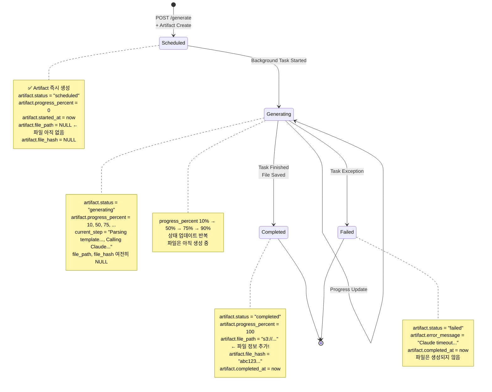
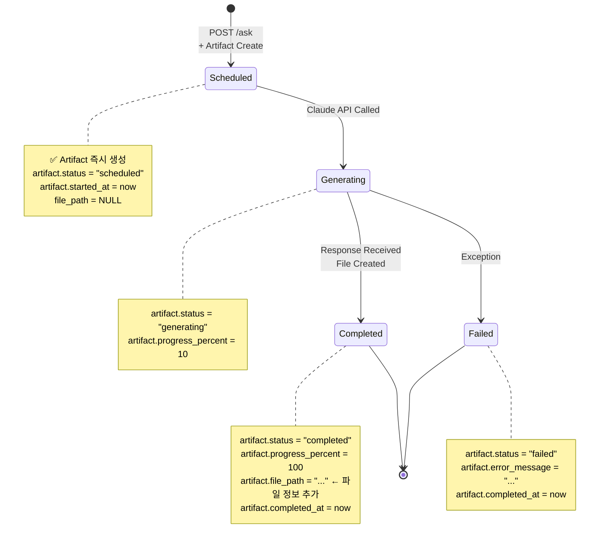
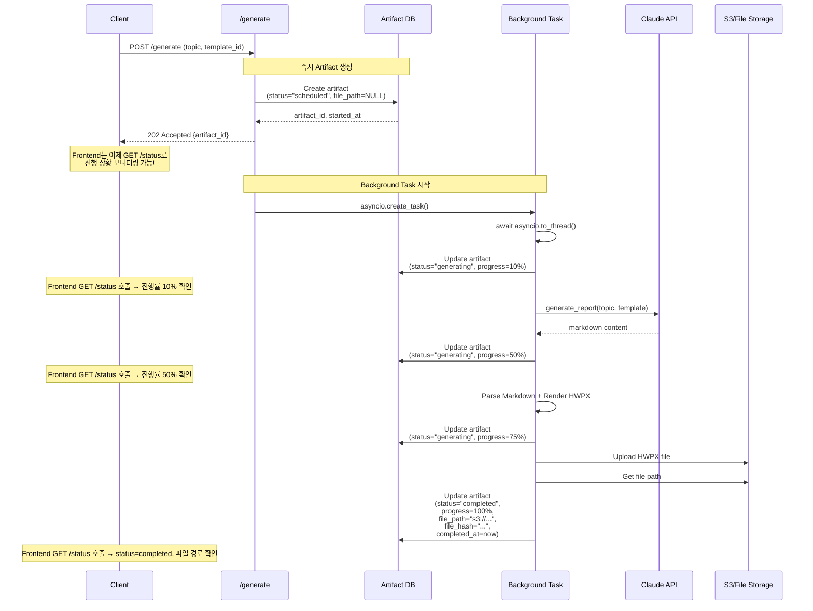
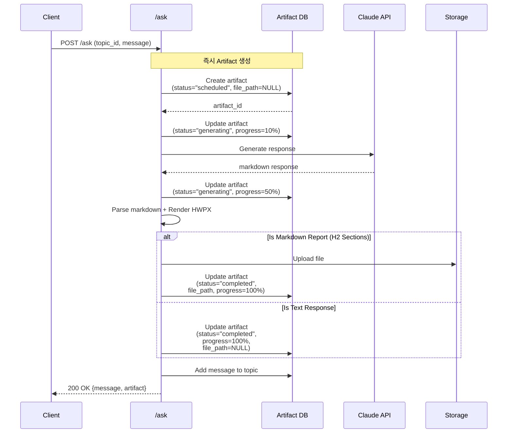

# Unit Spec: Artifact-Based Complete Integration (Option A)

## 1. 요구사항 요약

- **목적**: 보고서 생성 상태 관리를 메모리 기반 (generation_status.py) + DB 기반 (Artifact) 이원체제에서 **Artifact 테이블 중심의 단일 DB 소스로 통합**. 이를 통해 `/generate` (비동기) 와 `/ask` (동기) 두 API가 동일한 상태 머신을 따르고, Frontend에서 **단 하나의 API로 모든 보고서 생성 상태를 모니터링**할 수 있도록 함.

  **핵심 변화**: Artifact는 더 이상 "작업 완료 후 생성"이 아니라, **"작업 시작 직후 생성되어 상태를 추적"**하는 방식으로 변경됨.

- **유형**: ☑ 변경 (기존 두 엔드포인트 + 상태 관리 시스템 리팩토링)

- **핵심 요구사항**:
  - **입력**:
    - POST /api/topics/{topic_id}/generate (기존, 변경)
    - POST /api/topics/{topic_id}/ask (기존, 변경)
  - **출력**:
    - Artifact 레코드 with state machine: scheduled → generating → completed/failed
    - GET /api/topics/{topic_id}/status (리팩토링: Artifact 조회로 변경)
    - GET /api/topics/{topic_id}/status/stream (리팩토링: Artifact 업데이트 감지)
  - **예외/제약**:
    - `/generate` 202 Accepted 유지, background task로 Artifact 상태 업데이트
    - `/ask` 동기 유지, 동일한 Artifact 상태 머신 따름
    - Artifact는 **작업 시작 직후** 생성 (파일_path, file_hash는 나중에 추가)
    - 기존 클라이언트 호환성 유지 (API 시그니처 동일)
    - generation_status.py는 Phase 1에서 유지, Phase 2+에서 제거
  - **처리흐름 요약**:
    1. `/generate`: 202 Accepted 즉시 반환 + Artifact 생성 (status="scheduled") → background task 시작 → Artifact 상태 점진적 업데이트 → 완료 시 "completed" + file_path 저장
    2. `/ask`: 동일한 상태 머신 따름 (단, 동기이므로 빠르게 "completed"에 도달)
    3. `/status`: Artifact 테이블 조회 (생성 시간, 상태, 진행률, 완료 시간, 파일 경로 등)
    4. Frontend: 단일 엔드포인트로 모든 상태 모니터링

---

## 2. 구현 대상 파일

| 구분 | 경로 | 설명 |
|------|------|------|
| **데이터베이스** | backend/app/database/connection.py | artifacts 테이블 스키마 확장 (status, progress_percent, started_at, completed_at 컬럼 추가) |
| **데이터베이스** | backend/app/database/artifact_db.py | `update_artifact_status()` 메서드 추가, `create_artifact()` 수정 |
| **모델** | backend/app/models/artifact.py | ArtifactCreate 모델 필드 추가 (status, progress_percent, started_at, completed_at) |
| **라우터** | backend/app/routers/topics.py | `/generate`, `/ask`, `/status`, `/status/stream` 리팩토링 |
| **유틸** | backend/app/utils/generation_status.py | 기존 유지 (Phase 1), 향후 제거 예정 |
| **마이그레이션** | backend/migrations/001_add_artifact_state.sql | DB 스키마 마이그레이션 스크립트 |

---

## 3. 동작 플로우 (Mermaid)

### 3.1 전체 아키텍처 (Artifact 중심)

```mermaid
graph TB
    subgraph Frontend
        Client["Frontend Client"]
    end

    subgraph API["API Layer"]
        GenAPI["POST /generate"]
        AskAPI["POST /ask"]
        StatusAPI["GET /status"]
        StreamAPI["GET /status/stream"]
    end

    subgraph Background["Background Task"]
        Task["asyncio.Task<br/>(_background_generate)"]
    end

    subgraph DB["Database"]
        Artifacts["Artifacts Table<br/>(status, progress_percent, file_path...)"]
    end

    Client -->|Request| GenAPI
    Client -->|Request| AskAPI
    Client -->|Poll| StatusAPI
    Client -->|SSE Subscribe| StreamAPI

    GenAPI -->|202 Accepted + artifact_id| Client
    GenAPI -->|Create + Start Task| Task
    GenAPI -->|Create (status=scheduled)| Artifacts

    AskAPI -->|200 OK + artifact| Client
    AskAPI -->|Create + Update| Artifacts

    Task -->|Update (status, progress%)| Artifacts
    Task -->|Update (completed + file_path)| Artifacts

    StatusAPI -->|Query| Artifacts
    StatusAPI -->|Return status| Client

    StreamAPI -->|Watch| Artifacts
    StreamAPI -->|SSE Event| Client
```

### 3.2 /generate 상태 머신 (비동기, 작업 시작 직후 Artifact 생성)



**핵심 변화**: Artifact가 "scheduled" 상태로 **즉시 생성**되며, 파일 정보(file_path, file_hash)는 작업 중간에는 NULL이고 **완료 시에만 저장**됨.

### 3.3 /ask 상태 머신 (동기, 동일 패턴)



### 3.4 /generate 상세 흐름 (시간축)



**시간대 비교:**
- **기존**: t0~t3까지 Artifact 없음 → Frontend 상태 확인 불가
- **신규**: t0 직후 Artifact 생성 → Frontend는 즉시 상태 모니터링 시작 가능

### 3.5 /ask 상세 흐름



---

## 4. 테스트 계획

### 4.1 원칙

- **TDD 우선**: 각 TC의 동작을 먼저 정의하고 코드 작성
- **계층별 커버리지**:
  - DB layer (4 TCs) - Artifact 생성, 상태 업데이트
  - Integration layer (4 TCs) - /generate, /ask 상태 머신
  - API layer (2 TCs) - /status, /status/stream
  - Error handling (4 scenarios)
- **독립성/재현성**: Mock 클라우드 API, 실제 DB 사용 (SQLite)
- **판정 기준**: 상태값, 타임스탐프, progress_percent, file_path 명시적 검증

### 4.2 테스트 항목

| TC ID | 계층 | 시나리오 | 목적 | 입력/사전조건 | 기대결과 |
|-------|------|---------|------|-------------|---------|
| **TC-DB-001** | DB | Artifact 즉시 생성 (파일 없음) | Artifact가 작업 시작 직후 생성됨 | `create_artifact(status="scheduled", file_path=NULL)` | artifact_id 반환, status="scheduled", file_path=NULL, started_at 저장됨 |
| **TC-DB-002** | DB | 상태 업데이트 (파일 없음 상태) | 진행 중 상태 업데이트 가능 | artifact 존재, `update_artifact_status(status="generating", progress=50)` | artifact.status="generating", progress_percent=50, file_path 여전히 NULL |
| **TC-DB-003** | DB | 상태 + 파일 정보 함께 업데이트 | 완료 시 파일 정보 추가 | artifact 존재 (file_path=NULL), `update_artifact_status(status="completed", progress=100, file_path="s3://...", file_hash="abc123")` | 모든 필드 정상 저장 |
| **TC-DB-004** | DB | 실패 상태로 업데이트 | 파일 없이 실패 상태 저장 | artifact 존재, `update_artifact_status(status="failed", error_message="timeout", completed_at=now)` | artifact.status="failed", error_message 저장, file_path 여전히 NULL |
| **TC-INT-005** | Integration | /generate 202 + Artifact scheduled | Artifact가 즉시 생성되고 background 시작 | POST /generate (topic="AI market"), mock Claude API | Response: 202, artifact_id, artifact.status="scheduled" (파일 없음), background task 시작됨 |
| **TC-INT-006** | Integration | /generate background → generating → completed | Artifact 상태가 점진적 업데이트됨 | /generate 호출 후, 3초 polling | 진행 상황: 10% → 50% → 75% → completed (100%), 최종적으로 file_path 저장됨 |
| **TC-INT-007** | Integration | /ask 상태 머신 (동기) | /ask도 동일 Artifact 상태 머신 | POST /ask (topic_id, "질문"), mock Claude | Response: 200, artifact 임베딩, artifact.status="completed", 파일 정보 포함 |
| **TC-INT-008** | Integration | 다중 동시 /generate | 동시 여러 보고서의 독립적 상태 추적 | 3개 topic 각각 /generate 호출 동시 | 3개 artifact 각각 독립적으로 status 전이, 간섭 없음 |
| **TC-API-009** | API | GET /status 파일 없는 상태 조회 | artifact.file_path=NULL일 때도 조회 가능 | /generate 직후, GET /status (artifact_id) | {status="scheduled", progress=0, file_path=NULL, ...} 반환 |
| **TC-API-010** | API | GET /status/stream 파일 정보 포함 | SSE로 파일 정보도 함께 전달 | /generate 후 /status/stream 열기 | SSE 이벤트로 scheduled, generating (진행률), completed (파일_경로) 순차 전달 |

### 4.3 에러 처리 시나리오

| 시나리오 | 입력 | 기대결과 | Artifact 상태 |
|---------|------|---------|---------------|
| Claude API 타임아웃 | /generate 호출, Claude 5초 이상 | error response (503) | status="failed", error_message="Claude API timeout", file_path=NULL |
| HWPX 변환 실패 | /generate, markdown ok but HWPX 실패 | error response (500) | status="failed", error_message="HWPX conversion error", file_path=NULL |
| S3 업로드 실패 | /generate, 모든 변환 ok but S3 실패 | error response (500) | status="failed", error_message="S3 upload error", file_path=NULL |
| Invalid artifact_id 조회 | GET /status (artifact_id=99999) | 404 error, "artifact not found" | N/A |

---

## 5. 구현 상세

### 5.1 데이터베이스 스키마 변경

#### 기존 Artifacts 테이블

```sql
CREATE TABLE artifacts (
    id INTEGER PRIMARY KEY AUTOINCREMENT,
    topic_id INTEGER NOT NULL,
    message_id INTEGER,
    artifact_type VARCHAR(50),
    version INTEGER,
    filename VARCHAR(255),
    file_path VARCHAR(255),
    file_size INTEGER,
    sha256 VARCHAR(64),
    metadata TEXT,
    created_at TIMESTAMP DEFAULT CURRENT_TIMESTAMP,
    updated_at TIMESTAMP DEFAULT CURRENT_TIMESTAMP,
    FOREIGN KEY(topic_id) REFERENCES topics(id),
    FOREIGN KEY(message_id) REFERENCES messages(id)
);
```

#### 마이그레이션 SQL (001_add_artifact_state.sql)

```sql
-- Artifacts 테이블에 상태 관리 컬럼 추가
ALTER TABLE artifacts ADD COLUMN status VARCHAR(20) DEFAULT 'completed';
-- 값: 'scheduled', 'generating', 'completed', 'failed'
-- 기존 artifact는 'completed'로 설정 (현재는 모두 완료된 파일만 저장)

ALTER TABLE artifacts ADD COLUMN progress_percent INTEGER DEFAULT 100;
-- 값: 0-100
-- 기존 artifact는 100으로 설정

ALTER TABLE artifacts ADD COLUMN started_at TIMESTAMP;
-- 보고서 생성 시작 시간

ALTER TABLE artifacts ADD COLUMN completed_at TIMESTAMP;
-- 보고서 생성 완료 시간

ALTER TABLE artifacts ADD COLUMN error_message VARCHAR(500);
-- 실패 시 에러 메시지

-- Indices for performance
CREATE INDEX idx_artifacts_status ON artifacts(status);
CREATE INDEX idx_artifacts_started_at ON artifacts(started_at);
```

#### 롤백 SQL

```sql
-- artifacts 테이블에 추가된 컬럼 제거
ALTER TABLE artifacts DROP COLUMN status;
ALTER TABLE artifacts DROP COLUMN progress_percent;
ALTER TABLE artifacts DROP COLUMN started_at;
ALTER TABLE artifacts DROP COLUMN completed_at;
ALTER TABLE artifacts DROP COLUMN error_message;

-- 인덱스 제거
DROP INDEX IF EXISTS idx_artifacts_status;
DROP INDEX IF EXISTS idx_artifacts_started_at;
```

### 5.2 모델 수정 (artifact.py)

```python
from pydantic import BaseModel, Field
from datetime import datetime
from typing import Optional


class ArtifactCreate(BaseModel):
    """Artifact 생성 요청 모델

    Note: 작업 시작 직후 생성되므로, file_path와 file_hash는 처음에는 NULL일 수 있음.
    작업 완료 시 update_artifact_status()로 파일 정보를 추가.
    """
    kind: str  # "markdown", "hwpx", "pdf"
    locale: str  # "ko", "en"
    version: int = 1
    filename: Optional[str] = None
    file_path: Optional[str] = None  # 작업 완료 후 추가됨
    file_size: Optional[int] = None  # 작업 완료 후 추가됨
    sha256: Optional[str] = None  # 작업 완료 후 추가됨
    metadata: Optional[dict] = None

    # NEW: 상태 관리 필드
    status: str = Field(
        default="scheduled",
        description="artifact status: scheduled, generating, completed, failed"
    )
    progress_percent: int = Field(
        default=0,
        ge=0,
        le=100,
        description="Progress percentage (0-100)"
    )
    started_at: Optional[str] = Field(
        default_factory=lambda: datetime.utcnow().isoformat(),
        description="ISO 8601 timestamp when generation started"
    )
    completed_at: Optional[str] = Field(
        default=None,
        description="ISO 8601 timestamp when generation completed or failed"
    )
    error_message: Optional[str] = Field(
        default=None,
        description="Error message if status is 'failed'"
    )


class Artifact(BaseModel):
    """Full artifact entity model"""
    id: int
    topic_id: int
    message_id: Optional[int] = None
    kind: str
    locale: str
    version: int
    filename: Optional[str] = None
    file_path: Optional[str] = None
    file_size: Optional[int] = None
    sha256: Optional[str] = None
    metadata: Optional[dict] = None
    created_at: datetime
    updated_at: datetime

    # NEW: 상태 관리 필드
    status: str = "scheduled"
    progress_percent: int = 0
    started_at: Optional[datetime] = None
    completed_at: Optional[datetime] = None
    error_message: Optional[str] = None

    class Config:
        from_attributes = True
```

### 5.3 Database Layer 수정 (artifact_db.py)

```python
from datetime import datetime
from typing import Optional
from app.models.artifact import Artifact, ArtifactCreate
from app.database.connection import get_db_connection


def create_artifact(
    topic_id: int,
    artifact_create: ArtifactCreate,
    message_id: Optional[int] = None
) -> Artifact:
    """
    Artifact 생성 (작업 시작 직후)

    Note: 이 시점에 파일은 아직 없을 수 있음 (file_path=NULL, file_hash=NULL)
    완료 후 update_artifact_status()로 파일 정보 추가

    Args:
        topic_id: 토픽 ID
        artifact_create: Artifact 생성 데이터
        message_id: 메시지 ID (선택)

    Returns:
        생성된 Artifact
    """
    conn = get_db_connection()
    cursor = conn.cursor()

    # started_at 설정
    started_at = artifact_create.started_at or datetime.utcnow().isoformat()

    cursor.execute(
        """
        INSERT INTO artifacts (
            topic_id, message_id, artifact_type, version,
            filename, file_path, file_size, sha256, metadata,
            status, progress_percent, started_at, completed_at, error_message,
            created_at, updated_at
        ) VALUES (?, ?, ?, ?, ?, ?, ?, ?, ?, ?, ?, ?, ?, ?, ?, ?)
        """,
        (
            topic_id,
            message_id,
            artifact_create.kind,
            artifact_create.version,
            artifact_create.filename,
            artifact_create.file_path,  # NULL 가능
            artifact_create.file_size,  # NULL 가능
            artifact_create.sha256,  # NULL 가능
            json.dumps(artifact_create.metadata) if artifact_create.metadata else None,
            artifact_create.status,  # "scheduled"
            artifact_create.progress_percent,  # 0
            started_at,
            artifact_create.completed_at,  # NULL
            artifact_create.error_message,  # NULL
            datetime.utcnow().isoformat(),
            datetime.utcnow().isoformat()
        )
    )

    conn.commit()
    artifact_id = cursor.lastrowid

    logger.info(
        f"Artifact created: artifact_id={artifact_id}, status={artifact_create.status}, "
        f"file_path={artifact_create.file_path}"
    )

    return get_artifact_by_id(artifact_id)


def update_artifact_status(
    artifact_id: int,
    status: str,
    progress_percent: Optional[int] = None,
    file_path: Optional[str] = None,
    file_hash: Optional[str] = None,
    file_size: Optional[int] = None,
    completed_at: Optional[str] = None,
    error_message: Optional[str] = None
) -> Artifact:
    """
    Artifact 상태 및 진행률 업데이트

    Note: 작업 진행 중에는 progress_percent만 업데이트.
    완료 시 file_path, file_hash 등 파일 정보 추가.

    Args:
        artifact_id: Artifact ID
        status: 새로운 상태 ("scheduled", "generating", "completed", "failed")
        progress_percent: 진행률 (0-100), None이면 기존값 유지
        file_path: 파일 경로, 완료 시 추가
        file_hash: 파일 해시, 완료 시 추가
        file_size: 파일 크기, 완료 시 추가
        completed_at: 완료/실패 시간
        error_message: 실패 시 에러 메시지

    Returns:
        업데이트된 Artifact
    """
    conn = get_db_connection()
    cursor = conn.cursor()

    updates = {
        "status": status,
        "updated_at": datetime.utcnow().isoformat()
    }

    if progress_percent is not None:
        updates["progress_percent"] = progress_percent

    if file_path is not None:
        updates["file_path"] = file_path

    if file_hash is not None:
        updates["sha256"] = file_hash

    if file_size is not None:
        updates["file_size"] = file_size

    if completed_at is not None:
        updates["completed_at"] = completed_at

    if error_message is not None:
        updates["error_message"] = error_message

    # Build dynamic SQL
    set_clause = ", ".join([f"{k} = ?" for k in updates.keys()])
    query = f"UPDATE artifacts SET {set_clause} WHERE id = ?"

    cursor.execute(query, list(updates.values()) + [artifact_id])
    conn.commit()

    logger.info(
        f"Artifact status updated: artifact_id={artifact_id}, status={status}, "
        f"progress={progress_percent}%, file_path={file_path}"
    )

    return get_artifact_by_id(artifact_id)


def get_artifact_by_id(artifact_id: int) -> Optional[Artifact]:
    """Artifact ID로 조회"""
    conn = get_db_connection()
    cursor = conn.cursor()

    cursor.execute("SELECT * FROM artifacts WHERE id = ?", (artifact_id,))
    row = cursor.fetchone()

    if not row:
        return None

    return _row_to_artifact(row)


def _row_to_artifact(row: tuple) -> Artifact:
    """DB 행을 Artifact 모델로 변환"""
    return Artifact(
        id=row[0],
        topic_id=row[1],
        message_id=row[2],
        kind=row[3],
        version=row[4],
        filename=row[5],
        file_path=row[6],
        file_size=row[7],
        sha256=row[8],
        metadata=json.loads(row[9]) if row[9] else None,
        created_at=datetime.fromisoformat(row[10]),
        updated_at=datetime.fromisoformat(row[11]),
        status=row[12] or "completed",  # DB에서 조회
        progress_percent=row[13] or 100,
        started_at=datetime.fromisoformat(row[14]) if row[14] else None,
        completed_at=datetime.fromisoformat(row[15]) if row[15] else None,
        error_message=row[16]
    )
```

### 5.4 라우터 수정 (topics.py)

#### 5.4.1 POST /generate 리팩토링

```python
@router.post("/generate", response_model=GenerateResponse, status_code=202)
async def generate_topic_report(
    topic_id: int,
    request: GenerateRequest,
    session: Session = Depends(get_session),
) -> GenerateResponse:
    """
    POST /api/topics/{topic_id}/generate

    리팩토링: 202 Accepted + background task with Artifact state machine

    변화점:
    1. Artifact를 "scheduled" 상태로 즉시 생성 (파일 없음)
    2. Background task 시작
    3. 202 Accepted 즉시 반환
    4. Backend에서 상태 점진적 업데이트

    Timeline:
    - t0: Artifact 생성 (scheduled)
    - t0+: 202 응답
    - t0+Δt: Background task가 상태 업데이트 (generating → completed)
    """
    # 1. Topic 조회
    topic = session.query(TopicDB).filter(TopicDB.id == topic_id).first()
    if not topic:
        return error_response(
            "Topic not found",
            status_code=404,
            error_code=ErrorCode.TOPIC_NOT_FOUND
        )

    logger.info(f"[GENERATE] Starting - topic_id={topic_id}")

    # 2. Artifact 생성 (status="scheduled", file_path=NULL)
    artifact = artifact_db.create_artifact(
        topic_id=topic_id,
        artifact_create=ArtifactCreate(
            kind="hwpx",
            locale=request.language or "ko",
            version=1,
            filename=None,  # 아직 없음
            file_path=None,  # 아직 없음
            file_size=None,  # 아직 없음
            sha256=None,  # 아직 없음
            status="scheduled",  # 상태: 예약됨
            progress_percent=0,
            started_at=datetime.utcnow().isoformat(),
            completed_at=None,
            error_message=None
        ),
        message_id=None
    )

    logger.info(
        f"[GENERATE] Artifact created - artifact_id={artifact.id}, status=scheduled, "
        f"file_path=None"
    )

    # 3. Background task 시작
    task = asyncio.create_task(
        _background_generate_report(
            topic_id=topic_id,
            artifact_id=artifact.id,
            topic_input=topic.input_prompt,
            template_id=request.template_id
        )
    )

    # Task 예외 처리
    def handle_task_result(t: asyncio.Task):
        try:
            t.result()
        except Exception as e:
            logger.error(
                f"[GENERATE] Background task failed: artifact_id={artifact.id}, "
                f"error={str(e)}",
                exc_info=True
            )

    task.add_done_callback(handle_task_result)

    logger.info(f"[GENERATE] Background task started - task_id={id(task)}")

    # 4. 즉시 202 Accepted 반환 (파일은 아직 생성 중)
    return success_response(
        GenerateResponse(
            topic_id=topic_id,
            artifact_id=artifact.id,
            status="scheduled",
            message="Report generation started in background",
            status_check_url=f"/api/topics/{topic_id}/status?artifact_id={artifact.id}"
        ),
        status_code=202
    )


async def _background_generate_report(
    topic_id: int,
    artifact_id: int,
    topic_input: str,
    template_id: Optional[int] = None
):
    """
    Background task for report generation.

    Artifact 상태 머신: scheduled → generating → completed/failed

    Timeline:
    - Step 1: Update status="generating", progress=10%
    - Step 2-3: Claude API 호출 (progress=50%)
    - Step 4-5: Markdown 파싱, HWPX 변환 (progress=75%)
    - Step 6: S3 업로드 (progress=90%)
    - Step 7: Update status="completed", file_path 추가, progress=100%
    """
    try:
        # Step 1: 상태 업데이트 (generating 시작)
        artifact_db.update_artifact_status(
            artifact_id,
            status="generating",
            progress_percent=10
        )
        logger.info(f"[GENERATE] Step 1: Status updated to generating - artifact_id={artifact_id}")

        # Step 2: System Prompt 선택
        try:
            system_prompt = get_system_prompt(
                custom_prompt=None,
                template_id=template_id,
                user_id=session.query(TopicDB).filter(TopicDB.id == topic_id).first().user_id
            )
        except InvalidTemplateError as e:
            raise e

        # Step 3: Claude API 호출 (비동기, 이벤트 루프 논블로킹)
        user_message = create_topic_context_message(topic_input)
        claude = ClaudeClient()

        response_text, input_tokens, output_tokens = await asyncio.to_thread(
            claude.chat_completion,
            [user_message],
            system_prompt
        )

        logger.info(f"[GENERATE] Step 3: Claude API response received - tokens={output_tokens}")

        # Step 3.5: 진행률 업데이트
        artifact_db.update_artifact_status(
            artifact_id,
            status="generating",
            progress_percent=50
        )

        # Step 4: Markdown 파싱
        result = await asyncio.to_thread(
            parse_markdown_to_content,
            response_text
        )

        logger.info(f"[GENERATE] Step 4: Markdown parsed")

        # Step 5: HWPX 변환
        artifact_db.update_artifact_status(
            artifact_id,
            status="generating",
            progress_percent=75
        )

        md_text = build_report_md(result)
        version = next_artifact_version(topic_id, ArtifactKind.MD, "ko")
        _, md_path = build_artifact_paths(topic_id, version, "report.hwpx")

        hwpx_bytes = await asyncio.to_thread(
            hwpx_renderer.render_to_hwpx,
            title=f"Report: {topic_input}",
            content=md_text
        )

        logger.info(f"[GENERATE] Step 5: HWPX generated")

        # Step 6: S3 업로드
        artifact_db.update_artifact_status(
            artifact_id,
            status="generating",
            progress_percent=90
        )

        file_path = await asyncio.to_thread(
            s3_client.upload_file,
            key=f"reports/{topic_id}/artifact_{artifact_id}.hwpx",
            data=hwpx_bytes
        )

        file_hash = sha256(hwpx_bytes).hexdigest()

        logger.info(f"[GENERATE] Step 6: File uploaded - file_path={file_path}")

        # Step 7: 완료 상태로 업데이트 (파일 정보 추가!)
        artifact_db.update_artifact_status(
            artifact_id,
            status="completed",
            progress_percent=100,
            file_path=file_path,
            file_hash=file_hash,
            file_size=len(hwpx_bytes),
            completed_at=datetime.utcnow().isoformat()
        )

        logger.info(
            f"[GENERATE] Complete! artifact_id={artifact_id}, file_path={file_path}, "
            f"status=completed"
        )

    except Exception as e:
        # 실패 상태로 업데이트 (파일 정보 없음)
        artifact_db.update_artifact_status(
            artifact_id,
            status="failed",
            completed_at=datetime.utcnow().isoformat(),
            error_message=str(e)
        )

        logger.error(
            f"[GENERATE] Failed! artifact_id={artifact_id}, error={str(e)}",
            exc_info=True
        )
        raise
```

#### 5.4.2 POST /ask 리팩토링 (동일 상태 머신)

```python
@router.post("/{topic_id}/ask", response_model=MessageResponse, status_code=200)
async def ask(
    topic_id: int,
    request: AskRequest,
    session: Session = Depends(get_session)
) -> MessageResponse:
    """
    POST /api/topics/{topic_id}/ask

    리팩토링: /generate와 동일한 Artifact 상태 머신 사용
    scheduled → generating → completed/failed (동기 처리)
    """
    # 1. Topic 조회
    topic = session.query(TopicDB).filter(TopicDB.id == topic_id).first()
    if not topic:
        return error_response(
            "Topic not found",
            status_code=404,
            error_code=ErrorCode.TOPIC_NOT_FOUND
        )

    logger.info(f"[ASK] Starting - topic_id={topic_id}")

    # 2. User message 저장
    user_message = message_db.create_message(
        topic_id=topic_id,
        role=MessageRole.USER,
        content=request.content
    )

    # 3. Artifact 생성 (status="scheduled", 동일 패턴)
    artifact = artifact_db.create_artifact(
        topic_id=topic_id,
        artifact_create=ArtifactCreate(
            kind="markdown",
            locale="ko",
            version=1,
            filename=None,
            file_path=None,
            file_size=None,
            sha256=None,
            status="scheduled",
            progress_percent=0,
            started_at=datetime.utcnow().isoformat(),
            completed_at=None,
            error_message=None
        ),
        message_id=user_message.id
    )

    logger.info(f"[ASK] Artifact created - artifact_id={artifact.id}, status=scheduled")

    try:
        # Step 1: 상태 업데이트
        artifact_db.update_artifact_status(
            artifact.id,
            status="generating",
            progress_percent=10
        )

        # Step 2: 컨텍스트 메시지 수집
        context_messages = []
        if request.max_messages:
            recent_messages = message_db.get_messages_by_topic(
                topic_id, limit=request.max_messages
            )
            context_messages = [
                {"role": m.role.value, "content": m.content}
                for m in recent_messages
            ]

        # Step 3: Claude API 호출
        system_prompt = get_system_prompt(
            custom_prompt=None,
            template_id=request.template_id,
            user_id=topic.user_id
        )

        response_text = await asyncio.to_thread(
            claude.ask,
            prompt=request.content,
            context=context_messages,
            system_prompt=system_prompt
        )

        logger.info(f"[ASK] Claude response received")

        # Step 4: 진행률 업데이트
        artifact_db.update_artifact_status(
            artifact.id,
            status="generating",
            progress_percent=50
        )

        # Step 5: 응답 타입 판별 및 파일 생성
        is_markdown = response_detector.detect_response_type(response_text)
        file_path = None
        file_hash = None
        file_size = None

        if is_markdown:
            result = await asyncio.to_thread(
                parse_markdown_to_content,
                response_text
            )

            md_text = build_report_md(result)
            version = next_artifact_version(topic_id, ArtifactKind.MD, "ko")
            _, md_path = build_artifact_paths(topic_id, version, "response.hwpx")

            hwpx_bytes = await asyncio.to_thread(
                hwpx_renderer.render_to_hwpx,
                title="Response",
                content=md_text
            )

            file_path = await asyncio.to_thread(
                s3_client.upload_file,
                key=f"messages/{topic_id}/artifact_{artifact.id}.hwpx",
                data=hwpx_bytes
            )

            file_hash = sha256(hwpx_bytes).hexdigest()
            file_size = len(hwpx_bytes)

            logger.info(f"[ASK] HWPX generated and uploaded - file_path={file_path}")

        # Step 6: 완료 상태로 업데이트 (파일 정보 추가)
        artifact_db.update_artifact_status(
            artifact.id,
            status="completed",
            progress_percent=100,
            file_path=file_path,
            file_hash=file_hash,
            file_size=file_size,
            completed_at=datetime.utcnow().isoformat()
        )

        logger.info(f"[ASK] Completed - artifact_id={artifact.id}, status=completed")

        # Step 7: Assistant message 저장
        assistant_message = message_db.create_message(
            topic_id=topic_id,
            role=MessageRole.ASSISTANT,
            content=response_text
        )

        return success_response(
            MessageResponse(
                id=assistant_message.id,
                topic_id=topic_id,
                role=MessageRole.ASSISTANT,
                content=response_text,
                seq_no=assistant_message.seq_no,
                created_at=assistant_message.created_at,
                artifact=artifact  # Artifact 상태 포함
            )
        )

    except Exception as e:
        # 실패 상태로 업데이트
        artifact_db.update_artifact_status(
            artifact.id,
            status="failed",
            completed_at=datetime.utcnow().isoformat(),
            error_message=str(e)
        )

        logger.error(
            f"[ASK] Failed - artifact_id={artifact.id}, error={str(e)}",
            exc_info=True
        )

        return error_response(
            f"Ask operation failed: {str(e)}",
            status_code=500,
            error_code=ErrorCode.INTERNAL_SERVER_ERROR
        )
```

#### 5.4.3 GET /status 리팩토링 (Artifact 조회)

```python
@router.get("/{topic_id}/status", response_model=StatusResponse)
async def get_generation_status_endpoint(
    topic_id: int,
    artifact_id: int,
    session: Session = Depends(get_session)
) -> StatusResponse:
    """
    GET /api/topics/{topic_id}/status?artifact_id={artifact_id}

    리팩토링: generation_status.py 대신 Artifact 테이블 조회

    변화점: 파일이 없는 "scheduled", "generating" 상태도 조회 가능
    """
    # Artifact 조회
    artifact = artifact_db.get_artifact_by_id(artifact_id)
    if not artifact:
        return error_response(
            "Artifact not found",
            status_code=404,
            error_code=ErrorCode.ARTIFACT_NOT_FOUND
        )

    # Artifact 상태를 StatusResponse로 변환
    return success_response(
        StatusResponse(
            topic_id=topic_id,
            artifact_id=artifact.id,
            status=artifact.status,  # "scheduled", "generating", "completed", "failed"
            progress_percent=artifact.progress_percent,
            current_step=_get_current_step(artifact.status, artifact.progress_percent),
            started_at=artifact.started_at,
            completed_at=artifact.completed_at,
            file_path=artifact.file_path,  # NULL일 수 있음
            error_message=artifact.error_message if artifact.status == "failed" else None
        )
    )


def _get_current_step(status: str, progress_percent: int) -> Optional[str]:
    """Artifact 상태를 human-readable 단계로 변환"""
    if status == "scheduled":
        return "Waiting to start..."
    elif status == "generating":
        if progress_percent < 30:
            return "Initializing report generation..."
        elif progress_percent < 60:
            return "Generating content from Claude..."
        elif progress_percent < 90:
            return "Converting to HWPX format..."
        else:
            return "Uploading to storage..."
    elif status == "completed":
        return "Report generation completed"
    elif status == "failed":
        return "Report generation failed"
    return None
```

#### 5.4.4 GET /status/stream 리팩토링 (Artifact 감지)

```python
@router.get("/{topic_id}/status/stream")
async def stream_generation_status(
    topic_id: int,
    artifact_id: int,
    session: Session = Depends(get_session)
):
    """
    GET /api/topics/{topic_id}/status/stream?artifact_id={artifact_id}

    리팩토링: Artifact 테이블 폴링하여 변화 감지

    변화점: 파일이 없는 상태도 SSE 이벤트로 전송
    """
    async def event_generator():
        last_status = None
        last_progress = None

        while True:
            try:
                # Artifact 상태 조회
                artifact = artifact_db.get_artifact_by_id(artifact_id)

                if not artifact:
                    yield f"data: {json.dumps({'error': 'artifact not found'})}\n\n"
                    break

                # 상태 변화 감지
                if (artifact.status != last_status or
                    artifact.progress_percent != last_progress):

                    event_data = {
                        "artifact_id": artifact.id,
                        "status": artifact.status,
                        "progress_percent": artifact.progress_percent,
                        "current_step": _get_current_step(
                            artifact.status,
                            artifact.progress_percent
                        ),
                        "started_at": artifact.started_at,
                        "completed_at": artifact.completed_at,
                        "file_path": artifact.file_path,  # NULL일 수 있음
                        "error_message": artifact.error_message if artifact.status == "failed" else None
                    }

                    yield f"data: {json.dumps(event_data)}\n\n"

                    last_status = artifact.status
                    last_progress = artifact.progress_percent

                    # 완료 또는 실패 시 스트림 종료
                    if artifact.status in ["completed", "failed"]:
                        break

                # 500ms 대기 후 재조회
                await asyncio.sleep(0.5)

            except Exception as e:
                logger.error(f"[STREAM] Error - {str(e)}", exc_info=True)
                yield f"data: {json.dumps({'error': str(e)})}\n\n"
                break

    return StreamingResponse(
        event_generator(),
        media_type="text/event-stream"
    )
```

### 5.5 상태 모델 (StatusResponse 추가)

```python
# models/topic.py 에 추가
class StatusResponse(BaseModel):
    """GET /api/topics/{id}/status 응답 모델"""
    topic_id: int
    artifact_id: int
    status: str  # "scheduled", "generating", "completed", "failed"
    progress_percent: int  # 0-100
    current_step: Optional[str] = None  # Human-readable step
    started_at: Optional[str] = None
    completed_at: Optional[str] = None
    file_path: Optional[str] = None  # 파일 정보, NULL일 수 있음
    error_message: Optional[str] = None  # If status=="failed"
```

---

## 6. 마이그레이션 전략

### Phase 1 (현재)
- ✅ Artifact 테이블 스키마 확장 (status, progress_percent, started_at, completed_at)
- ✅ `/generate`, `/ask` 리팩토링 하여 **Artifact 즉시 생성** (파일은 나중)
- ✅ `/status`, `/status/stream` 리팩토링 하여 Artifact 조회
- ⚠️ generation_status.py 유지 (호환성)

### Phase 2+
- 🔄 generation_status.py 제거
- 🔄 모든 기존 테스트 통과 확인
- 🔄 마이그레이션 스크립트 실행

---

## 7. 사용자 요청 기록 (Decision Audit Trail)

### 최종 명확화 (Option A Complete Integration + Artifact 생성 시점)

**사용자 질문:**
> "지금은 artifact는 모든 작업이 완료된 이후에 생성이 되는데. 상태관리를 어떻게 할예정이야?"

**Claude 분석 및 해결:**
1. **기존 방식**: Artifact는 작업 완료 후 생성 (파일과 함께)
2. **신규 방식 (Option A)**:
   - Artifact는 **작업 시작 직후 생성** (status="scheduled")
   - 파일 정보(file_path, file_hash)는 처음에는 NULL
   - 진행 중에 status, progress_percent 계속 업데이트
   - 완료 시 file_path, file_hash 추가

3. **가능한 이유**:
   - Artifact 테이블에 "상태 필드"(status, progress_percent, started_at, completed_at)를 추가
   - 파일이 없어도 상태 정보만으로 레코드 생성 가능

4. **Timeline 비교**:
   - **기존**: t0~t3 (작업 완료까지) Artifact 없음 → Frontend 상태 확인 불가
   - **신규**: t0 (작업 시작) Artifact 생성 → Frontend는 즉시 상태 모니터링 가능

**실제 구현 예시**:
```python
# 작업 시작 직후 생성
artifact = create_artifact(
    status="scheduled",
    file_path=None,  # 아직 없음
    progress_percent=0
)

# 진행 중 업데이트
update_artifact_status(artifact_id, status="generating", progress=50%)

# 완료 시 파일 정보 추가
update_artifact_status(artifact_id, status="completed",
    file_path="s3://...", file_hash="abc123", progress=100%)
```

---

## 8. 구현 체크리스트

### 8.1 데이터베이스
- [ ] 마이그레이션 SQL 작성 (001_add_artifact_state.sql)
- [ ] artifacts 테이블에 5개 컬럼 추가 (status, progress_percent, started_at, completed_at, error_message)
- [ ] 인덱스 추가 (status, started_at)
- [ ] 롤백 스크립트 작성
- [ ] 기존 데이터 마이그레이션 (status="completed", progress=100)

### 8.2 모델
- [ ] ArtifactCreate 모델 필드 추가 (5개 상태 필드)
- [ ] Artifact 모델 필드 추가 (동일)
- [ ] StatusResponse 모델 필드 추가 (file_path 포함)

### 8.3 Database Layer
- [ ] artifact_db.create_artifact() 파라미터 확장
- [ ] artifact_db.update_artifact_status() 메서드 구현 (파일 정보 업데이트 포함)
- [ ] _row_to_artifact() 매핑 확인

### 8.4 라우터 구현
- [ ] POST /generate 리팩토링
  - [ ] Artifact 생성 (status="scheduled", file_path=NULL)
  - [ ] 202 Accepted 즉시 반환
  - [ ] Background task 시작
  - [ ] _background_generate_report() 구현
    - [ ] Step 1: status="generating", progress=10%
    - [ ] Step 2-3: Claude API 호출, progress=50%
    - [ ] Step 4-5: HWPX 변환, progress=75%
    - [ ] Step 6: S3 업로드, progress=90%
    - [ ] Step 7: 완료 (파일 정보 추가, progress=100%)
    - [ ] 예외 처리: status="failed"

- [ ] POST /ask 리팩토링
  - [ ] Artifact 생성 (동일 패턴)
  - [ ] 동일한 상태 머신 따름
  - [ ] artifact.status="completed" 동기 처리

- [ ] GET /status 리팩토링
  - [ ] Artifact 조회 (generation_status.py 제거)
  - [ ] StatusResponse 응답
  - [ ] file_path=NULL일 때도 반환

- [ ] GET /status/stream 리팩토링
  - [ ] Artifact 폴링
  - [ ] 상태 변화 시 SSE 이벤트 전송
  - [ ] file_path 포함

### 8.5 테스트 구현
- [ ] TC-DB-001: Artifact 즉시 생성 (파일 없음)
- [ ] TC-DB-002: 상태 업데이트 (파일 없는 상태)
- [ ] TC-DB-003: 상태 + 파일 정보 함께 업데이트
- [ ] TC-DB-004: 실패 상태 (파일 없음)
- [ ] TC-INT-005: /generate 202 + Artifact scheduled
- [ ] TC-INT-006: /generate background 상태 전이 (10% → 50% → completed)
- [ ] TC-INT-007: /ask 동일 상태 머신
- [ ] TC-INT-008: 동시 다중 /generate
- [ ] TC-API-009: GET /status file_path=NULL 조회
- [ ] TC-API-010: GET /status/stream 파일 정보 포함
- [ ] 에러 처리 4개 시나리오

### 8.6 호환성 검증
- [ ] 기존 테스트 모두 통과
- [ ] API 응답 스키마 동일 (신규 필드 선택적)
- [ ] 클라이언트 코드 변경 불필요

### 8.7 문서화
- [ ] CLAUDE.md 업데이트
- [ ] 신규 엔드포인트 명시
- [ ] State machine diagram 포함
- [ ] Artifact 생성 시점 명확화

---

## 9. 성공 기준

1. ✅ **Artifact 즉시 생성 + 점진적 업데이트**
   - Artifact는 작업 시작 직후 생성 (status="scheduled", file_path=NULL)
   - 진행 중 status, progress_percent 계속 업데이트
   - 완료 시 file_path, file_hash 추가

2. ✅ **Artifact 기반 완전 통합**
   - /generate와 /ask 모두 Artifact state machine 사용
   - 메모리 기반 generation_status.py 제거 (Phase 2+)

3. ✅ **Frontend 단일 API 모니터링**
   - GET /api/topics/{topic_id}/status?artifact_id={artifact_id}로 모든 상태 조회 가능
   - file_path=NULL인 상태도 조회 가능
   - /generate와 /ask 패턴 통일

4. ✅ **모든 테스트 통과**
   - DB layer: 4 TCs
   - Integration layer: 4 TCs
   - API layer: 2 TCs
   - 에러 처리: 4+ scenarios

5. ✅ **백워드 호환성**
   - 기존 클라이언트 코드 변경 불필요
   - API 응답 스키마 동일

6. ✅ **성능 요구사항**
   - POST /generate: < 1초 (202 Accepted)
   - GET /status: < 100ms (Artifact 조회)
   - GET /status/stream: 500ms polling interval

---

**작성일**: 2025-11-15 (수정)
**버전**: Option A (Complete Integration) - Artifact 생성 시점 명확화
**상태**: ✅ Artifact 즉시 생성 + 점진적 업데이트 방식 포함, 준비 완료
