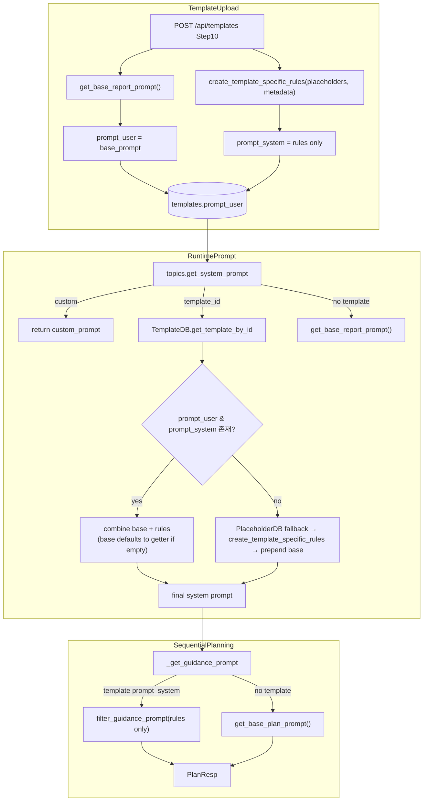

# Unit Spec: Prompt BASE/RULE 분리 및 Sequential Planning 기본 프롬프트 중앙화

**작성일:** 2025-11-15  
**버전:** v1.0 (초안)  
**상태:** 사용자 검토 대기

---

## 1. 요구사항 요약

- **목적:** 보고서/계획 BASE 프롬프트를 중앙에서 관리하고, 템플릿이 BASE(`prompt_user`)와 규칙(`prompt_system`)을 분리 저장하도록 리팩토링하여 Prompt 품질과 유지보수성을 개선한다.
- **유형:** ☑ 변경 ☐ 신규 ☐ 삭제
- **핵심 요구사항:**
  - 입력: 템플릿 업로드/재생성 요청(`POST /api/templates`, `POST /api/templates/{id}/regenerate-prompt-system`), 보고서 생성·대화·계획 API에서 전달되는 `template_id`, shared/constants.* 파일
  - 출력: BASE 문자열은 `prompt_user`, 규칙 문자열은 `prompt_system`으로 저장/응답; 런타임에서는 `get_system_prompt()`가 `BASE + 규칙` 조합을 반환하고 `_get_guidance_prompt()`는 PLAN BASE를 기본값으로 사용
  - 예외/제약: shared/constants에 Prompt 키 누락 시 명확한 예외 발생, legacy 템플릿(prompt_user/prompt_system 비어 있음)은 PlaceholderDB 기반 fallback 제공, Sequential Planning SLA(2초) 영향 금지
  - 처리흐름 요약: shared constants → prompts.py getter → templates.py 저장 → topics/claude_client/sequential_planning 등 주요 경로에서 조합하여 사용

---

## 2. 구현 대상 파일

| 구분 | 경로 | 설명 |
| ---- | ---- | ---- |
| 변경 | shared/constants.properties | `PROMPT.REPORT.BASE`, `PROMPT.PLAN.BASE` 키 추가 |
| 변경 | shared/constants.py / shared/constants.ts | `PromptConfig` 섹션 및 getter·검증 로직 추가 |
| 변경 | backend/app/utils/prompts.py | BASE getter, `create_template_specific_rules`, `get_system_prompt` 재구현, legacy fallback 포함 |
| 변경 | backend/app/routers/templates.py | 업로드/재생성 단계에서 `prompt_user=BASE`, `prompt_system=rules` 저장 |
| 변경 | backend/app/utils/sequential_planning.py | `_get_guidance_prompt` 기본값을 PLAN BASE로 치환, 규칙-only prompt 필터링 |
| 변경 | backend/app/utils/claude_client.py | default system prompt를 BASE getter 기반으로 변경 |
| 변경 | backend/tests/test_dynamic_prompts.py 등 | 신규 로직 단위 테스트 추가/갱신 |
| 참조 | backend/app/database/template_db.py | legacy 데이터 상태 확인용 (코드 수정 없음) |

---

## 3. 동작 플로우 (Mermaid)



---

## 4. 테스트 계획

| TC ID | 계층 | 시나리오 | 목적 | 입력/조건 | 기대결과 |
| ----- | ---- | -------- | ---- | -------- | -------- |
| TC-PROMPT-001 | Unit (prompts) | get_system_prompt 템플릿 경로 | 템플릿이 BASE+규칙으로 조합되는지 검증 | template.prompt_user="BASE", prompt_system="RULE" | 반환 문자열이 BASE로 시작하고 규칙을 이어붙이며 PlaceholderDB 호출 없음 |
| TC-PROMPT-002 | Unit (prompts) | legacy 템플릿 fallback | prompt_user/prompt_system 중 하나라도 비어있을 때의 호환성 | template.prompt_user=None, PlaceholderDB mock 데이터 존재 | create_template_specific_rules 호출 후 BASE prepend, Warning 로그 |
| TC-TPL-API-003 | API (templates) | 템플릿 업로드 성공 | 응답/DB가 BASE 분리에 성공했는지 검증 | hwpx fixture, metadata mock | `prompt_user`가 shared BASE와 동일, `prompt_system`에 BASE 문구 미포함, metadata 유지 |
| TC-SEQ-004 | Unit (sequential_planning) | `_get_guidance_prompt` 기본값 | PLAN BASE getter 사용 확인 | template_id=None | 반환 문자열 == PLAN BASE, 기존 하드코딩 문자열 미사용 |
| TC-SEQ-005 | Unit (sequential_planning) | template prompt_system 필터링 | 규칙-only 구조가 필터링과 호환되는지 | template.prompt_system에 규칙만 주입 | `filter_guidance_prompt` 결과 그대로 사용, BASE 중복 없음 |
| TC-CLAUDE-006 | Unit (claude_client) | default system prompt 경로 | getter 기반 default 적용 검증 | system_prompt 인자 None | `Anthropic.messages.create` 호출 파라미터 `system`이 `get_base_report_prompt()` 결과 |

---

## 5. 에러 처리 시나리오

1. **Shared Prompt Key Missing**  
   - 조건: shared/constants.properties에 `PROMPT.REPORT.BASE` 또는 `PROMPT.PLAN.BASE` 키가 없음  
   - 처리: shared/constants.* 로딩 시 `RuntimeError("PROMPT.REPORT.BASE missing")` 형태로 즉시 예외 + logger.error, API 레이어는 500 + `ErrorCode.SYSTEM.INTERNAL_ERROR`

2. **Legacy Template Without Rules**  
   - 조건: 기존 템플릿이 prompt_user/prompt_system 모두 NULL이고 PlaceholderDB에도 데이터 없음  
   - 처리: `get_system_prompt`가 BASE getter만 반환하며 Warning 로그 + ErrorCode.TEMPLATE_INVALID_FORMAT을 담은 400 응답

3. **Sequential Planning Filter Returns Empty**  
   - 조건: template.prompt_system 규칙 문자열이 비었거나 필터 결과가 빈 문자열  
   - 처리: `_get_guidance_prompt`가 PLAN BASE로 graceful fallback, warning 로그 남김

4. **Metadata Generation Failure**  
   - 조건: 템플릿 업로드 시 metadata 생성 실패  
   - 처리: 기존 fallback(`generate_placeholder_metadata`) 사용, BASE/규칙 분리 로직은 fallback 결과로 동일하게 동작해야 함

---

## 6. 사용자 요청 프롬프트

**Original User Request (1차):**
```
내가 보내준 파일들을 모두 분석해줘.
모든 대답은 한글로 해줘.
[20251113_prompt_optimization_refactor.md] 현재 해당 계획을 새웠을 때와 지금 소스 코드가 많이 달라졌는데 해당 계획을 바탕으로 현재 프로젝트를 분석 후 다시 한번 mcp sequential-thinking 를 통해서 unit spec 을 만들어줘.
```

**최종 명확화 (통합):**
- ✅ CLAUDE.md, BACKEND_ONBOARDING.md, 기존 Unit Spec을 참고하여 현행 상태를 분석한다.
- ✅ mcp sequential-thinking 도구를 활용해 새로운 Unit Spec을 작성한다.
- ✅ 응답 전체를 한글로 제공한다.

**요청 일시:** 2025-11-15 (문맥 기준)

**컨텍스트/배경:**
- 기존 20251113 Prompt Optimization 계획이 코드와 어긋난 상태
- Sequential Planning과 Template API가 BASE/규칙 분리 전략을 따르지 못함

---

**승인 필요:** 사용자 검토 후 구현 착수
