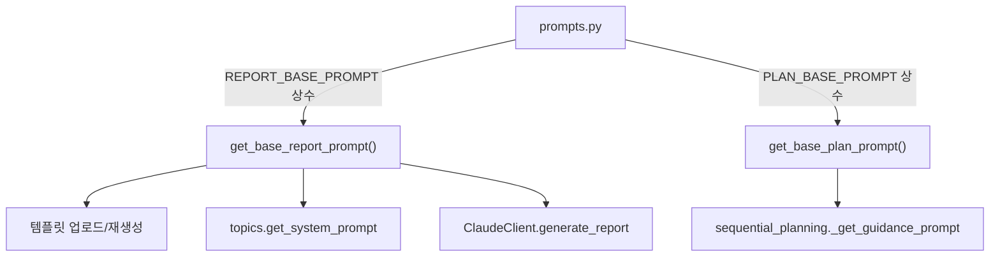

# Unit Spec: Prompt BASE 상수 static화 (properties 제거)

**작성일:** 2025-11-15  
**버전:** v1.0 (초안)  
**상태:** 사용자 검토 대기

---

## 1. 요구사항 요약

- **목적:** `PROMPT.REPORT.BASE`, `PROMPT.PLAN.BASE`를 `shared/constants.properties`에서 제거하고 `backend/app/utils/prompts.py`에 정적인 상수로 보관해 줄바꿈/전문 확인 불편을 해소한다.
- **유형:** ☑ 변경 ☐ 신규 ☐ 삭제
- **핵심 요구사항:**
  - 입력: 기존 Prompt BASE 문자열(보고서, 계획)
  - 출력: prompts.py 내 공개 상수/Getter에서 동일 문자열 제공, shared/constants는 다른 구성요소만 유지
  - 제약: 기존 `get_base_report_prompt()/get_base_plan_prompt()` 인터페이스는 동일하게 유지해 하위 호환 확보
  - 처리 흐름: prompts.py 상수 → 템플릿 업로드/재생성 → topics/sequential planning/claude client 등에서 활용

---

## 2. 구현 대상 파일

| 구분 | 경로 | 설명 |
| ---- | ---- | ---- |
| 변경 | shared/constants.properties | `PROMPT.REPORT.BASE`, `PROMPT.PLAN.BASE` 키 제거 |
| 변경 | shared/constants.py | `PromptConfig`에서 BASE 관련 로직 삭제 혹은 no-op 처리 |
| 변경 | shared/constants.ts | FRONT 공유 상수에서 PromptConfig 제거 |
| 변경 | backend/app/utils/prompts.py | `REPORT_BASE_PROMPT`, `PLAN_BASE_PROMPT` 상수 정의 및 getter가 해당 상수를 반환하도록 변경 |
| 변경 | backend/tests/test_prompts_metadata.py 등 | 새 상수 경로를 기준으로 검증 수정 |
| 참조 | backend/tests/verify_prompt_integration.py | 검증 스크립트에서 import 문자열 업데이트 |

---

## 3. 동작 플로우 (Mermaid)



---

## 4. 테스트 계획

| TC ID | 계층 | 시나리오 | 목적 | 기대결과 |
| ----- | ---- | -------- | ---- | -------- |
| TC-PROMPT-BASE-001 | Unit | `get_base_report_prompt()` 반환 | 새 상수를 그대로 반환하는지 확인 | 문자열이 멀티라인 그대로, `PROMPT.REPORT.BASE` 키 없이 동작 |
| TC-PROMPT-BASE-002 | Unit | `get_base_plan_prompt()` 반환 | PLAN BASE 상수 활용 검증 | 문자열이 계획 지침 전문 포함 |
| TC-PROMPT-BASE-003 | Unit | `create_system_prompt_with_metadata([])` | properties 의존 없이 default 조합 되는지 | `get_default_report_prompt()` 결과가 상수 기반임을 검증 |
| TC-PROMPT-BASE-004 | Unit | `sequential_planning._get_guidance_prompt(None, None)` | PLAN BASE fallback이 동작하는지 | 반환 문자열 == PLAN BASE |
| TC-PROMPT-BASE-005 | Script | `tests/verify_prompt_integration.py` | import/상수 검사 업데이트 | FINANCIAL_REPORT_SYSTEM_PROMPT 참조 제거, 새 상수 존재 메시지 |

---

## 5. 에러 처리 시나리오

1. **properties에 기존 키가 남아 있는 경우**  
   - 처리: 로드 시 무시되지만 혼란 방지를 위해 README/변경 로그에 제거 안내 추가.

2. **외부 모듈이 `shared.constants.PromptConfig`를 통해 BASE를 가져오던 경우**  
   - 처리: PromptConfig에 deprecation stub를 남기거나, 해당 경로 사용 부분을 모두 prompts.py로 교체한다. 미처 업데이트되지 않은 코드가 있으면 ImportError/AttributeError가 발생하므로 사전 점검 필요.

---

## 6. 사용자 요청 프롬프트

**Original User Request:**
```
constants.properties 에 있는 PROMPT.REPORT.BASE, PROMPT.PLAN.BASE 2가지를 prompt.py에 별도로 스테틱 하게 지정.
사유 : 기존에는 줄 변경을 인식하지 못해서 편의성이 떨어짐.
```

**최종 명확화:**
- ✅ properties 의존 제거 후 prompts.py에서 직접 문자열을 정의한다.
- ✅ 기존 기능/엔드포인트 동작은 동일하게 유지한다.

---

**승인 필요:** 사용자 검토 후 구현 진행
