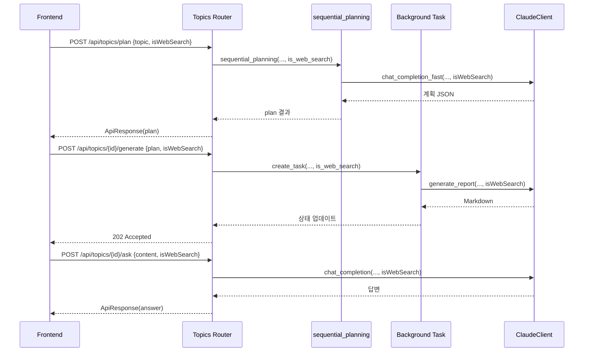

# Unit Spec: Topics API WebSearch 토글 연동

## 1. 요구사항 요약

- **목적:** Topic 관련 3개 API의 요청에 `isWebSearch` 플래그를 추가하여 사용자가 선택 시 Claude Web Search MCP 도구를 활성화한다.
- **유형:** ☑ 변경 (기존 흐름 유지, 선택 파라미터 추가)
- **핵심 요구사항:**
  - 입력: `/api/topics/plan`, `/api/topics/{topic_id}/generate`, `/api/topics/{topic_id}/ask` 요청 바디에 `isWebSearch` (boolean, default false)
  - 출력: 기존 응답과 동일하며, isWebSearch 설정 여부는 로그 및 Claude 호출 파라미터에만 반영
  - 예외/제약: 필수 입력 없음, 잘못된 타입 입력 시 Pydantic 422, 기존 에러 코드 유지, 기본 False 시 회귀 없어야 함
  - 처리흐름 요약: 요청에서 플래그 → Pydantic 모델 → 라우터 → Sequential Planning / Background Task / ClaudeClient → Anthropic messages.create 호출 시 tools 파라미터 설정

---

## 2. 구현 대상 파일

| 구분 | 경로 | 설명 |
| ---- | ---- | ---- |
| 변경 | `backend/app/models/topic.py` | `PlanRequest`, `GenerateRequest` 모델에 `is_web_search` 필드 추가 및 예제 갱신 |
| 변경 | `backend/app/models/message.py` | `AskRequest`에 동일 필드 추가 |
| 변경 | `backend/app/routers/topics.py` | 세 라우터 및 `_background_generate_report`에서 플래그 수신·전달 로직 반영 |
| 변경 | `backend/app/utils/sequential_planning.py` | 함수 시그니처 확장, `_call_sequential_planning`이 fast 모델 호출 시 웹 검색 파라미터 전달 |
| 변경 | `backend/app/utils/claude_client.py` | `generate_report` 및 `_call_claude` 계열 메서드가 `isWebSearch` True일 때 tools 페이로드 삽입 |
| 참조 | `BACKEND_ONBOARDING.md`, `CLAUDE.md` | 새로운 요청 파라미터 문서화 필요 여부 확인 |

---

## 3. 동작 플로우 (Mermaid)



---

## 4. 테스트 계획

### 4.1 원칙

- Pydantic 모델 단위 테스트로 alias 및 기본값 보장
- Router/Service 레벨에서 ClaudeClient를 mock 하여 tools 전달 여부 검증
- 기존 성공/실패 플로우 회귀 테스트 (isWebSearch 미지정 시 이전 스냅샷 동일)

### 4.2 테스트 항목

| TC ID | 계층 | 시나리오 | 목적 | 입력/사전조건 | 기대결과 |
| --- | --- | --- | --- | --- | --- |
| TC-MDL-001 | Unit | `PlanRequest` 직렬화 | alias(`isWebSearch`)와 기본 False 확인 | topic="AI", isWebSearch omitted | `model_dump(by_alias=True)`에 `isWebSearch: false` 포함 |
| TC-MDL-002 | Unit | `AskRequest` Validation | 잘못된 타입 처리 | `{"content":"hi","isWebSearch":"yes"}` | 422 ValidationError |
| TC-API-003 | Router(Mock) | `/api/topics/plan` `isWebSearch=true` | Sequential Planning에 전달 검증 | fast Claude mock | `_call_sequential_planning`이 `isWebSearch=True`로 호출 |
| TC-API-004 | Router(Mock) | `/api/topics/{id}/ask` `isWebSearch=true` | ClaudeClient chat 호출 파라미터 검증 | ClaudeClient mock | `tools=[{"type":"web_search_20250131","name":"web_search"}]` 전달 |
| TC-SVC-005 | Service(Mock) | `_background_generate_report` | generate_report가 플래그 수신 | ClaudeClient mock | `generate_report(..., isWebSearch=True)` 호출 기록 |

### 4.3 샘플 테스트 코드

- `tests/topics/test_plan_websearch.py` : router dependency override + ClaudeClient mock
- `tests/topics/test_ask_websearch.py` : ClaudeClient fixture로 tools 파라미터 확인
- `tests/topics/test_generate_background.py` : background 함수 direct 호출 + monkeypatch

---

## 5. 사용자 요청 프롬프트 기록

**Original User Request (1차):**
```
두개의 파일을 분석해서 현재 프로젝트에 api 를 변경할 계획을 작성해줘.
목적 : 사용자가 웹 화면에서 isWebSearch 라는 추가 파라미터를 받아서 claude api에 호출할때 websearch tools를 전달
대상 api 
- api/topics/plan
- api/topics/{topic_id}/generate
- api/topics/{topic_id}/ask 
제약사항: 기존에 흐름을 그대로 유지하고 isWebSearch 선택 항목에 따라 claude api 에 tools 활성 여부 확인. 
```

**Claude 응답:**
```
Sequential-thinking MCP를 이용해 단계별 구현 계획 작성 (현재 문서).
```

**User Clarification:**
```
"한글로 해서 unit spec 을 만들어줘" → "파일로 작성해줘"
```

**최종 명확화 (통합):**
- ✅ 세 API의 요청 모델에 `isWebSearch` 선택 필드 추가 (기본 False)
- ✅ 플래그가 True일 때만 Claude API tools 파라미터(`web_search_20250131`) 활성화
- ✅ 기존 플로우/응답 구조 유지, 회귀 없음
- ✅ Unit Spec을 문서 파일로 제공해야 함

**요청 일시:** 2025-11-16

**컨텍스트/배경:**
- Backend 온보딩/CLAUDE.md 문서를 참고하여 API, Claude 연동 규칙 준수
- Sequential Planning 및 기존 보고서 생성 흐름은 유지해야 함

