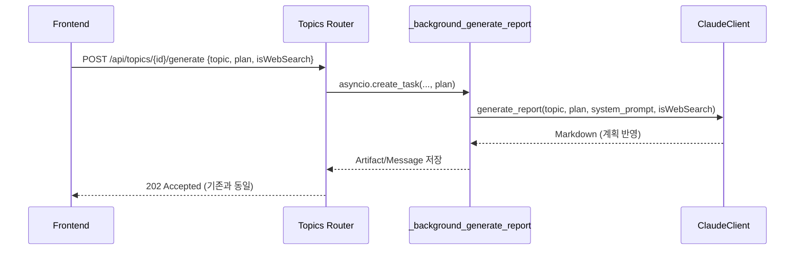

# Unit Spec: Sequential Planning 기반 보고서 생성 프롬프트 반영

## 1. 요구사항 요약

- **목적:** `/api/topics/{id}/generate` 백그라운드 생성 시 Sequential Planning 결과(`plan`)가 Claude 호출에 반영되도록 하여 report.md가 빈 상태로 저장되는 문제를 해결한다.
- **유형:** ☑ 변경
- **핵심 요구사항:**
  - 입력: GenerateRequest 내 `plan` 텍스트 (필수) + 기존 topic, template_id, isWebSearch
  - 출력: 기존 report.md/메시지/아티팩트 동일하지만, Claude 출력은 계획 구조를 반영한 Markdown이어야 함
  - 예외/제약: plan 누락/공백 시 기존 검증 유지, 프롬프트 길이 제한(예: 50k chars) 검토, 기존 토큰 로깅 유지
  - 처리흐름 요약: `_background_generate_report`에서 plan+topic 기반 사용자 프롬프트 생성 → ClaudeClient가 해당 프롬프트로 보고서 생성 → 결과를 기존 파이프라인으로 저장

---

## 2. 구현 대상 파일

| 구분 | 경로 | 설명 |
| ---- | ---- | ---- |
| 변경 | `backend/app/routers/topics.py` | `_background_generate_report`에서 plan을 포함한 user_prompt 생성 및 Claude 호출 구조 수정 |
| 변경 | `backend/app/utils/claude_client.py` | `generate_report` 시그니처 확장 (plan/context 지원) 및 프롬프트 구성 로직 개선 |
| 변경 | `backend/app/utils/markdown_builder.py` 등 | (필요 시) plan 포함 프롬프트로 인해 Markdown 구조 변화 점검 |
| 참조 | `backend/doc/specs/20251116_enable_claude_websearch_toggle.md` | 동시 변경된 isWebSearch 흐름 고려 |
| 테스트 | `backend/tests/topics/test_generate_background.py` (신규/갱신) | 프롬프트 전달 여부를 목킹으로 검증 |

---

## 3. 동작 플로우 (Mermaid)



---

## 4. 테스트 계획

### 4.1 원칙
- Claude 호출 부는 모킹하여 API 의존성 제거
- plan 텍스트가 프롬프트에 포함되었는지 assert
- 기존 성공 플로우 회귀 테스트: plan 미지정(또는 빈 문자열) 시 적절한 Validation Error 유지

### 4.2 테스트 항목

| TC ID | 계층 | 시나리오 | 목적 | 입력/사전조건 | 기대결과 |
| --- | --- | --- | --- | --- | --- |
| TC-MDL-001 | Unit | GenerateRequest plan 빈 문자열 | Validation 유지 확인 | plan="" | 422 혹은 기존 VALIDATION_REQUIRED_FIELD |
| TC-SVC-002 | Unit | `_background_generate_report`가 plan 전달 | Mock ClaudeClient로 프롬프트 확인 | plan에 섹션 텍스트 포함 | ClaudeClient.generate_report 호출 파라미터에 plan 문자열 포함 |
| TC-SVC-003 | Unit | plan이 매우 길 때 truncate 로직 | 프롬프트 길이 제한 검증 | len(plan)>MAX | Claude 호출 전에 적절히 잘리거나 예외 발생 |
| TC-INT-004 | Integration | `/api/topics/{id}/generate` 성공 | 엔드 투 엔드 회귀 | FastAPI client, Claude mock | 응답 202, artifact 내용이 mock Markdown과 일치 |

### 4.3 샘플 테스트 코드

```python
async def test_background_generate_passes_plan(monkeypatch):
    captured = {}
    async def fake_generate_report(*, topic, plan_text, **kwargs):
        captured["topic"] = topic
        captured["plan_text"] = plan_text
        return "# Mock Report"
    monkeypatch.setattr(ClaudeClient, "generate_report", fake_generate_report)
    await _background_generate_report(..., plan="## 섹션1", ...)
    assert "섹션1" in captured["plan_text"]
```

---

## 5. 사용자 요청 프롬프트 기록

**Original User Request (1차):**
```
Curl ... generate ... isWebSearch true ... report.md 내용이 비어 있고 로그 첨부
```

**Claude 응답 (분석):**
```
원인: `_background_generate_report`가 plan 미사용 → Claude 기본 프롬프트만 호출
```

**User Clarification (2차):**
```
"mcp sequential-thinking 를 활용해서 계획을 세우고 한글 Unit Spec 작성" 요청
```

**최종 명확화:**
- ✅ Generate API가 plan을 Claude 프롬프트에 반드시 포함해야 함
- ✅ 기존 Async/Artifact 플로우는 유지, 단 prompt 구성만 수정
- ✅ Unit Spec을 기반으로 구현 진행 예정

**요청 일시:** 2025-11-16

**컨텍스트:**
- 기존 web search 토글 기능이 이미 탑재되어 있음
- Sequential Planning 단계에서 작성된 계획을 실제 보고서 생성에 사용해야 함
