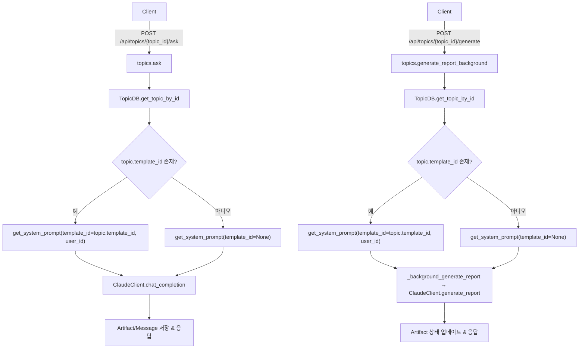

# Unit Spec: Topic APIs에서 template_id 요청 필드 제거

## 1. 요구사항 요약

- **목적:** `/api/topics/{topic_id}/generate` 및 `/api/topics/{topic_id}/ask` 호출 시 요청 본문의 `template_id` 의존성을 제거하고, `topics.template_id` 컬럼에 저장된 값을 활용하여 동일한 보고서/대화 품질을 유지한다.
- **유형:** ☑ 변경 ☐ 신규 ☐ 삭제
- **핵심 요구사항:**
  - 입력: `GenerateRequest`는 `topic`, `plan`, `isWebSearch`만 받고 `AskRequest`는 `content`, `artifact_id`, `include_artifact_content`, `max_messages`, `isWebSearch`만 허용한다.
  - 출력: 기존 `success_response`/`error_response` 스키마 유지, API 응답의 `template_id` 관련 필드는 추가하지 않는다.
  - 예외/제약: 토픽이 템플릿을 보유하지 않으면 기본 System Prompt 사용, 저장된 템플릿이 삭제되었거나 권한이 없으면 기존 `TEMPLATE.NOT_FOUND` 흐름을 통해 404 반환.
  - 처리흐름 요약: 토픽 조회 → `topic.template_id` 추출 → `get_system_prompt` 호출 시 전달 → 보고서 생성/대화 생성 로직 기존 경로로 진행.

---

## 2. 구현 대상 파일

| 구분 | 경로 | 설명 |
| ---- | ---- | ---- |
| 변경 | `backend/app/models/topic.py` | `GenerateRequest`에서 `template_id` 필드 제거 및 도큐멘트/예제 업데이트 |
| 변경 | `backend/app/models/message.py` | `AskRequest`에서 `template_id` 필드 제거, Pydantic 스키마와 OpenAPI 반영 |
| 변경 | `backend/app/routers/topics.py` | `/ask`, `/ {topic_id}/generate`, `_background_generate_report` 에서 토픽 조회 후 `template_id` 결정 및 `get_system_prompt` 호출 로직 수정 |
| 참조 | `backend/app/database/topic_db.py` | `TopicDB.get_topic_by_id` 로부터 `template_id` 를 항상 반환하는지 확인 (스키마 변경 없음) |
| 변경 | `backend/tests/test_routers_topics.py`, `backend/tests/test_dynamic_prompts.py` | 새로운 입력 스키마와 template 선택 로직을 검증하는 테스트 추가/수정 |

---

## 3. 동작 플로우 (Mermaid)



---

## 4. 테스트 계획

### 4.1 원칙

- API 스키마 변경이므로 `/ask`와 `/generate` 경로에서 template_id 입력 제거를 검증한다.
- Prompt 선택 로직은 `get_system_prompt` 호출 파라미터를 monkeypatch/mocker 로 관찰한다.
- 토픽/템플릿 존재 여부에 따른 ErrorCode 매핑이 기존과 동일한지 확인한다.

### 4.2 구현 예상 테스트 항목

| TC ID | 계층 | 시나리오 | 목적 | 입력/사전조건 | 기대결과 |
| --- | --- | --- | --- | --- | --- |
| TC-ASK-API-001 | API (FastAPI 테스트 클라이언트) | 토픽에 template_id=7 저장됨, `/ask` 호출 | 토픽 저장 값으로 template prompt가 사용되는지 확인 | 토픽 픽스처가 template_id=7을 가짐, 요청 본문에는 template_id 누락 | 200 응답, `mock_get_system_prompt`가 template_id=7 로 호출되고 성공 응답 스키마 유지 |
| TC-ASK-API-002 | API | 토픽이 템플릿 미보유 | 기본 prompt fallback 확인 | topic.template_id=None, `/ask` 요청 | 200 응답, `get_system_prompt`가 template_id=None 으로 호출, 기존 보고서 생성 흐름 실행 |
| TC-ASK-API-003 | API | 토픽에 저장된 template_id가 삭제됨 | TEMPLATE.NOT_FOUND 에러 처리 확인 | Topic.template_id=99, TemplateDB.get_template_by_id 모킹 → InvalidTemplateError 발생 | 404 응답, ErrorCode.TEMPLATE_NOT_FOUND 반환, Artifact/Messages 롤백 |
| TC-GEN-API-001 | API | `/api/topics/{id}/generate` 호출 시 토픽 template_id 반영 | 백그라운드 생성 경로에서 template_id 전달 여부 검증 | Topic.template_id=5, GenerateRequest body에 template_id 없음 | 202 응답, `_background_generate_report` task에 template_id=5 전달됨, Artifact status scheduled |
| TC-GEN-API-002 | API | 토픽 template_id 없음 | 기본 prompt 사용 | Topic.template_id=None | `_background_generate_report` 에 template_id=None 전달, 202 응답 |

---

## 5. 사용자 요청 프롬프트

**Original User Request (1차):**
```
위의 2개 문서를 보고 해당 프로젝트를 분석한 후 다음 수정요건에 대한 mcp server-sequential를 사용해서 계획을 생성 후 unit spec 으로 작성해줘.
요구사항 : 
- api에 요청시 template_id 항목 제거.
- 기존 다른 기능은 수정 하지 않고 template_id가 필요한 항목에 대해서 해당 topic을 db에서 조회하여 template_id를 넣을 수 있도록 로직 개선
사유 : template_id는 최초 요청 api인 /api/topics/plan 에서 topics.template_id 라는 컬럼으로 db에 저장되어 있음. /api/topics/plan 이후애 실행되는 다른 api에서는 template_id가 필요 없음.

대상 API : 
- api/topics/{topic_id}/generate
- api/topics/{topic_id}/ask
```

**Claude 응답:**
```
요구사항을 충족하기 위해 Sequential Planning 도구로 단계별 계획을 수립하고, template_id 사용 경로(모델/라우터/테스트)를 재정리한 뒤 Unit Spec을 작성한다는 방식을 합의함.
```

**User Clarification/Modification:**
```
추가 명확화 없었음.
```

**최종 명확화 (통합):**
- ✅ `/api/topics/{topic_id}/ask` 요청 바디에서 template_id 제거
- ✅ `/api/topics/{topic_id}/generate` 요청 바디에서 template_id 제거
- ✅ Topic DB에 저장된 template_id를 조회해 prompt를 결정하도록 로직 개선
- ✅ template_id 미보유 또는 삭제 시 기존 ErrorCode 처리 유지

**요청 일시:** 2025-11-17

**컨텍스트/배경:**
- template_id는 `/api/topics/plan` 단계에서 topics 테이블에 저장
- 이후 플로우에서 동일 토픽에 저장된 template_id를 재활용하도록 표준화 필요
```
