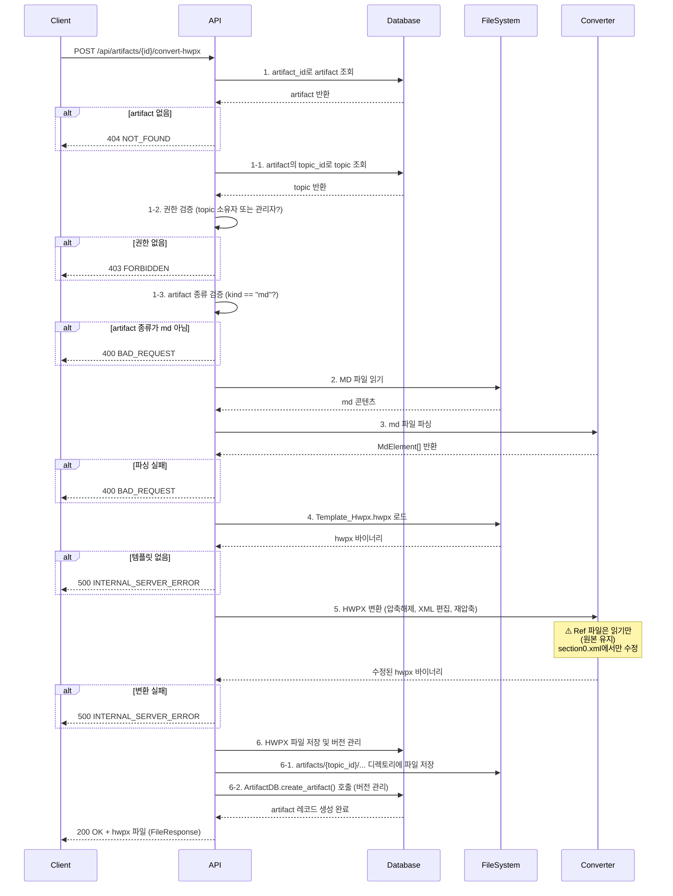

# Unit Spec: Markdown → HWPX 파일 변환 기능

## 1. 요구사항 요약

- **목적:** Artifact ID 기준으로 저장된 Markdown 파일을 HWPX(한글 문서) 형식으로 변환·저장하여 다운로드 가능하게 제공
- **유형:** ☑️ 신규 API 엔드포인트 (기존 로직 재사용)
- **기존 함수와의 관계:**
  - 기존: GET /api/messages/{message_id}/hwpx/download (message → topic → artifact 순회 조회)
  - 신규: POST /api/artifacts/{artifact_id}/convert-hwpx (artifact 직접 기반 변환)
  - 차별점: Artifact ID를 알고 있는 클라이언트의 빠른 직접 다운로드
  - 재사용: download_message_hwpx()의 MD→HWPX 변환 로직 재사용, 저장·버전 관리 동일 적용
- **핵심 요구사항:**
  - 입력: artifact_id (path parameter)
  - 출력: hwpx 파일 (바이너리, FileResponse로 직접 다운로드)
  - 필수 검증:
    - artifact_id 유효성 확인
    - 현재 사용자의 상위 topic 소유권 확인 (권한 검증)
    - artifact 종류가 "md"인지 확인 (HWPX/PDF 불가, 400 응답)
  - 예외/제약:
    - artifact_id 유효하지 않음 → 404 NOT_FOUND
    - 사용자 권한 없음 (topic 소유자/관리자 아님) → 403 FORBIDDEN
    - artifact 종류가 md가 아님 → 400 BAD_REQUEST
    - MD 파싱 실패 → 400 BAD_REQUEST
    - 템플릿 파일 없음 → 500 INTERNAL_SERVER_ERROR
    - 변환 실패 → 500 INTERNAL_SERVER_ERROR
    - 변환 시간 제약: 최대 30초
  - 처리흐름 요약: artifact 조회 → 권한 검증 → artifact 종류 검증(md) → md 파싱 → 템플릿 로드 → XML 편집 → hwpx 재압축 → 파일 저장·버전 관리 → 파일 반환

---

## 2. 구현 대상 파일

| 구분 | 경로                                        | 설명                                                    |
| ---- | ------------------------------------------- | ------------------------------------------------------- |
| 신규 | backend/app/utils/md_to_hwpx_converter.py   | MD→HWPX 변환 핵심 로직 (MD 파싱, XML 편집, 재압축)    |
| 신규 | backend/app/models/convert_models.py        | 요청/응답 데이터 모델 및 Enum                          |
| 신규 | backend/tests/test_convert.py               | 변환 기능 단위 테스트 (13개 TC)                        |
| 신규 | backend/app/utils/markdown_parser.py        | MD 파싱 함수 추가: parse_markdown_to_md_elements()    |
| 변경 | backend/app/routers/artifacts.py            | 신규 엔드포인트 추가: `POST /api/artifacts/{id}/convert-hwpx` |
| 참조 | backend/app/routers/artifacts.py            | download_message_hwpx() 함수의 변환 로직 참고 (Lines 264-436) |
| 참조 | backend/app/utils/hwp_handler.py            | HWPHandler의 escape_xml, generate_report 등 참고      |
| 참조 | backend/app/database/artifact_db.py         | ArtifactDB.create_artifact() 저장 로직 참고           |
| 변경 | backend/app/main.py                         | (변경 없음 - 기존 routers/artifacts.py 이미 등록)     |
| 변경 | backend/CLAUDE.md                           | 신규 엔드포인트 및 기술 스택 문서화                    |

---

## 3. 동작 플로우 (Mermaid)

### 3.1 시퀀스 다이어그램



### 3.2 상세 처리 흐름

```
1. artifact 조회 & 검증
   - ArtifactDB.get_artifact_by_id(artifact_id)
   - 없으면: ErrorCode.ARTIFACT_NOT_FOUND (404) 반환
   - TopicDB.get_topic_by_id(artifact.topic_id) 조회
   - 현재 사용자 권한 검증: topic.user_id == current_user.id or current_user.is_admin
     → 위반 시: ErrorCode.TOPIC_UNAUTHORIZED (403) 반환
   - artifact 종류 검증: artifact.kind == ArtifactKind.MD
     → 위반 시: ErrorCode.ARTIFACT_INVALID_KIND (400) 반환

2. MD 파일 읽기 및 파싱
   - os.path.exists(artifact.file_path) 확인
   - 파일 읽기: 파이썬 open() with encoding='utf-8'
   - parse_markdown_to_md_elements() 호출 (신규 함수)
   - **필터링 전략** (필터링 보고서 Section 6 참고):
     * 필터링 대상 (제거됨): 코드블록(```), 테이블(|...|), 이미지(),
       링크([text](url)), 체크박스(- [ ]), HTML 위험태그(<script> 등)
     * 필터링 안 함 (파싱됨): 인용(>), 수평선(---)
   - md 요소별로 타입, content, ref_filename 분류
   - 타입: title, section, orderedList_dep1, orderedList_dep2,
           unorderedList_dep1, unorderedList_dep2, quotation,
           NormalText, HorizonLine, NO_CONVERT
   - 파싱 실패 시: ErrorCode.ARTIFACT_CONVERSION_FAILED (400) 반환

3. HWPX 템플릿 로드
   - 템플릿 경로: ProjectPath.BACKEND / "templates" / "templateRef" / "Template_Hwpx.hwpx"
   - Ref 파일들 경로: ProjectPath.BACKEND / "templates" / "templateRef" / "Ref_01_Section", "Ref02_NormalText" 등
   - zipfile으로 압축해제
   - 임시 디렉토리에서 작업 (tempfile.TemporaryDirectory)
   - 템플릿 없음 시: ErrorCode.TEMPLATE_NOT_FOUND (500) 반환

4. section0.xml 수정
   4-1. XML 로드: Contents/section0.xml 파싱

   4-2. Title 교체
       - 플레이스홀더: {{TITLE}} (단순 텍스트 플레이스홀더, HTML 주석 없음)
       - 위치: <hp:t>{{TITLE}}</hp:t> 부분
       - md의 title(# 항목) 첫 번째 요소로 교체

   4-3. Content 추가 (순차적)
       - <!-- Content Start --> ~ <!-- Content End --> 사이에 삽입
       - 각 타입별로 해당 Ref 파일 **읽기** (수정하지 않음)
       - Ref 파일 내용을 section0.xml에 **임시로 복사/삽입**
       - section0.xml의 **복사된 내용에서만** 플레이스홀더 교체
       - 원본 Ref 파일은 **수정 안 됨** (다른 한글 문서 작성 시 재사용 가능)
       - 교체된 내용을 Comment 사이에 순차적으로 추가

   4-4. 타입별 처리 (Ref 파일은 읽기만, section0.xml에서만 수정)

       **플레이스홀더 처리 규칙:**
       - HTML 주석(<!-- ... -->)은 유지 (삭제하지 않음)
       - 주석 내의 값을 replace (<!-- Name -->VALUE<!-- Name_End --> → VALUE 부분만 교체)

       - section (##):
         * 파일: ProjectPath.BACKEND / "templates" / "templateRef" / "Ref_01_Section"
         * 내부 플레이스홀더 교체:
           - 5 → 번호로 replace (1, 2, 3, ...)
             파일: <!-- SubTitleNo_Start -->5<!-- SubTitleNo_End -->
             처리: <!-- SubTitleNo_Start -->1<!-- SubTitleNo_End --> (주석 유지)
           - {{SUB_TITLE}} → 제목 내용으로 replace
             파일: <!-- SubTitle_Start -->{{SUB_TITLE}}<!-- SubTitle_End -->
             처리: <!-- SubTitle_Start -->실제제목<!-- SubTitle_End --> (주석 유지)
         * 교체된 XML을 <!-- Content Start -->와 <!-- Content End --> 사이에 추가

       - orderedList_dep1 (1.):
         * 파일: ProjectPath.BACKEND / "templates" / "templateRef" / "Ref07_OrderedList_dep1"
         * 내부 플레이스홀더 교체:
           - 1 → 번호로 replace: <!-- OrderedNo_1_Start -->1<!-- OrderedNo_1_End -->
           - "사업 목표" → 실제 내용으로 replace: <!-- OrderedNm_1_Start -->사업 목표<!-- OrderedNm_1_End -->

       - orderedList_dep2 (indented 1.):
         * 파일: ProjectPath.BACKEND / "templates" / "templateRef" / "Ref08_OrderedList_dep2"
         * 내부 플레이스홀더 교체:
           - (1) → 번호로 replace: <!-- OrderedNo_2_Start -->(1)<!-- OrderedNo_2_End -->
           - "최근 1년간 고객센터" → 실제 내용으로 replace: <!-- OrderedNm_2_Start -->최근 1년간 고객센터<!-- OrderedNm_2_End -->

       - unorderedList_dep1 (-):
         * 파일: ProjectPath.BACKEND / "templates" / "templateRef" / "Ref05_UnOrderedList_dep1" (머릿글 "□" 포함)
         * 내부 플레이스홀더 교체:
           - "검증 목표" → 실제 내용으로 replace: <!-- UnOrdered_1_Start -->검증 목표<!-- UnOrdered_1_End -->

       - unorderedList_dep2 (indented -):
         * 파일: ProjectPath.BACKEND / "templates" / "templateRef" / "Ref06_UnOrderedList_dep2" (머릿글 "-" 포함)
         * 내부 플레이스홀더 교체:
           - 내용 replace: <!-- UnOrdered_1_Start -->내용<!-- UnOrdered_2_End -->
           - (주의: Start는 1, End는 2로 서로 다름)

       - quotation (>):
         * 파일: ProjectPath.BACKEND / "templates" / "templateRef" / "Ref04_Quotation" (머릿글 "＊" 포함)
         * 내부 플레이스홀더 교체:
           - "BlockQuote" → 실제 인용 내용으로 replace: <!-- BlockQuote_Start -->BlockQuote<!-- BlockQuote_End -->

       - NormalText (일반 텍스트):
         * 파일: ProjectPath.BACKEND / "templates" / "templateRef" / "Ref02_NormalText"
         * 내부 플레이스홀더 교체:
           - "Content" → 실제 텍스트 내용으로 replace: <!-- Content_Start-->Content<!-- Content_End -->

       - HorizonLine (---):
         * 파일: ProjectPath.BACKEND / "templates" / "templateRef" / "Ref03_HorizonLine" (빈 단락 `<hp:p></hp:p>`)
         * 플레이스홀더 없음 - 파일 내용 그대로 사용 (교체 불필요)

5. HWPX 재압축
   - 수정된 section0.xml 저장
   - 모든 파일을 다시 압축하여 .hwpx 파일 생성
   - HWPX 표준 준수: mimetype 파일을 먼저 ZIP_STORED로 추가

6. HWPX 파일 저장 및 버전 관리 ⭐ 중요
   - 임시 경로의 hwpx → artifacts/{topic_id}/... 디렉토리로 이동
   - 버전 계산: next_artifact_version(topic_id, ArtifactKind.HWPX, locale)
   - 파일명 생성: "{md_filename_stem}.hwpx" (예: report_v1.hwpx)
   - 파일 해시 계산: sha256_of(hwpx_file_path)
   - ArtifactDB.create_artifact() 호출하여 DB 레코드 생성:
     * kind=ArtifactKind.HWPX
     * version, filename, file_path, file_size, sha256 포함
   - 저장 실패 시: ErrorCode.ARTIFACT_CONVERSION_FAILED (500) 반환

7. 응답 반환
   - 저장된 artifact 정보를 바탕으로 FileResponse 반환
   - file_path: 생성된 hwpx 파일 절대 경로
   - filename: "report_v{version}.hwpx" 형식
   - media_type: "application/x-hwpx"
   - 임시 디렉토리 자동 정리 (context manager)

8. 타임아웃 처리 전략
   - 전체 변환 프로세스에 30초 제한 적용
   - 구현 방식: asyncio.wait_for(timeout=30.0)
   - 타임아웃 발생 시 asyncio.TimeoutError 예외 처리
   - ErrorCode.REQUEST_TIMEOUT으로 504 응답 반환

   예시 코드:
   ```python
   try:
       hwpx_bytes = await asyncio.wait_for(
           asyncio.to_thread(
               convert_markdown_to_hwpx,
               artifact, md_content
           ),
           timeout=30.0
       )
   except asyncio.TimeoutError:
       return error_response(
           code=ErrorCode.REQUEST_TIMEOUT,
           http_status=504,
           message="Conversion timeout"
       )
   ```
```

---

## 4. 테스트 계획

### 4.1 원칙

- **테스트 우선(TDD)**: 모든 TC를 먼저 구현하고 코드 작성
- **계층별 커버리지**: Unit (파싱, XML 편집) → Integration (전체 변환) → API 순서
- **독립성**: 템플릿 파일 및 DB는 실제 파일 사용 (모킹 최소화)
- **예외 처리**: 모든 에러 경로 검증
- **성능**: 변환 시간 제약(30초) 검증

### 4.2 테스트 케이스 (13개)

| TC ID | 계층 | 시나리오 | 목적 | 입력/사전조건 | 기대결과 |
|-------|------|---------|------|--------------|---------|
| TC-001 | Unit | MD 파싱 - 모든 타입 포함 | MD 파싱 로직의 타입 분류 정확성 | md: "# Title\n## Section\n1. ordered\n- unordered\n> quote\ntext" | 6개 요소 정확히 파싱 (title, section, orderedList_dep1, unorderedList_dep1, quotation, NormalText) |
| TC-002 | Unit | 각 타입별 XML 플레이스홀더 교체 | 타입별 XML 편집 로직 검증 | MdElement[] 입력, 템플릿 섹션 | 각 타입별 플레이스홀더 정확히 교체됨 |
| TC-003 | Unit | Title 플레이스홀더 교체 | Title 전용 교체 로직 | md에 title 1개, section 2개 | <!-- Title_Start --> 위치만 교체, content는 미포함 |
| TC-004 | Unit | 번호 자동 증가 | section, list 번호 자동 매김 | section 3개, orderedList_dep1 3개 | section: 1,2,3 / list: 1,2,3 순차 증가 |
| TC-005 | Integration | 완전한 변환 (정상 경로) | 전체 변환 프로세스 | artifact_id (유효한 md 파일) | 유효한 hwpx 파일 생성, 모든 element 포함 |
| TC-006 | API | artifact 없음 | 존재하지 않는 artifact 요청 | artifact_id=999999 | 404 NOT_FOUND, ErrorCode.ARTIFACT_NOT_FOUND |
| TC-007 | API | No convert 타입 필터링 | 변환 불가능 타입 제외 (코드, 테이블, 이미지, 링크, 체크박스) | md에 ```python\ncode\n```, 테이블, , [link](url), - [ ] checkbox 포함 | hwpx에는 이들 요소 없음, 나머지 정상 요소만 포함 |
| TC-008 | API | 변환 시간 측정 | 변환 성능 (< 30초) | 중간 크기 md (50줄) | 변환 완료 시간 < 30초, 응답시간 < 100ms (비동기) |
| TC-009 | Unit | 특수문자 포함 마크다운 변환 | XML 특수문자 이스케이프 검증 | md: "저장 공간 < 1GB & 메모리 > 2GB\n<script>alert(1)</script>" | hwpx XML 구조 유지, 특수문자 정상 이스케이프됨: &lt; &gt; &amp; 등 |
| TC-010 | API | 사용자 권한 검증 - 다른 사용자 접근 | 비소유자가 타인의 topic artifact 접근 시 차단 | user_A가 artifact 생성, user_B가 POST /api/artifacts/{id}/convert 호출 | 403 FORBIDDEN, ErrorCode.TOPIC_UNAUTHORIZED |
| TC-011 | API | artifact 종류 검증 - MD 아닌 타입 | HWPX/PDF artifact는 변환 불가 | artifact.kind = ArtifactKind.HWPX 또는 PDF인 artifact_id | 400 BAD_REQUEST, ErrorCode.ARTIFACT_INVALID_KIND |
| TC-012 | Unit | 테이블 오탐 방지 | 파이프 포함이지만 테이블이 아닌 경우 필터링 안 함 | md: "2022-11-20 \| 판매액: 1,000원\nA & B \| C & D" | 이 라인들은 NORMAL_TEXT로 파싱됨 (필터링 안 함) |
| TC-013 | Unit | 링크 오탐 방지 | 대괄호/괄호 포함이지만 링크가 아닌 경우 필터링 안 함 | md: "가격: (100원)\n함수명: get_user()\n이스케이프: \[텍스트\](url)" | 이 라인들은 NORMAL_TEXT로 파싱됨 (필터링 안 함, 링크로 판별 안 됨) |

---

## 5. 에러 처리 시나리오

| 상황 | 에러 코드 | HTTP 상태 | 메시지 |
|------|---------|---------|--------|
| artifact_id 유효하지 않음 | ErrorCode.ARTIFACT_NOT_FOUND | 404 | Artifact not found |
| 사용자 권한 없음 (topic 소유자/관리자 아님) | ErrorCode.TOPIC_UNAUTHORIZED | 403 | User is not authorized to access this topic |
| artifact 종류가 MD가 아님 | ErrorCode.ARTIFACT_INVALID_KIND | 400 | Only markdown artifacts can be converted to HWPX |
| MD 파싱 실패 | ErrorCode.ARTIFACT_CONVERSION_FAILED | 400 | Failed to parse markdown content |
| 템플릿 파일 없음 | ErrorCode.TEMPLATE_NOT_FOUND | 500 | HWPX template file not found |
| XML 편집 실패 | ErrorCode.ARTIFACT_CONVERSION_FAILED | 500 | Failed to convert markdown to HWPX |
| HWPX 재압축 실패 | ErrorCode.ARTIFACT_CONVERSION_FAILED | 500 | Failed to create HWPX file |
| 임시 파일 정리 실패 | ErrorCode.SERVER_INTERNAL_ERROR | 500 | Failed to cleanup temporary files |
| 변환 타임아웃 (>30초) | ErrorCode.REQUEST_TIMEOUT | 504 | Conversion timeout |

---

## 6. 구현 기술 스택

| 항목 | 선택 기술 | 용도 |
|------|---------|------|
| HWPX 압축 해제 | zipfile (내장) | .hwpx 파일 압축/해제 |
| XML 편집 | xml.etree.ElementTree (내장) | section0.xml 파싱 및 수정 |
| 마크다운 파싱 | parse_markdown_to_md_elements() (신규) | 개별 요소 타입별 분류 (markdown_parser.py에 추가) |
| 비동기 처리 | asyncio.to_thread() | I/O 무거운 작업 논블로킹화 |
| 임시 파일 관리 | tempfile.TemporaryDirectory() | 안전한 임시 디렉토리 정리 |
| 파일 응답 | FastAPI FileResponse | 클라이언트 다운로드 |

---

## 7. 핵심 함수 설명

### 7.1 `parse_markdown(md_content: str) -> List[MdElement]`

**⚠️ 중요**: 기존 parse_markdown_to_content()는 요구사항에 맞지 않음

**분석 결과**:
- `parse_markdown_to_content()`: H1/H2 섹션 기반 요약/배경/결론 분류 전용 (Dict[str, str] 반환)
- 반환값: title, summary, background, main_content, conclusion, title_summary, title_background 등 9개 필드
- **문제점**: 개별 요소 타입(순서리스트, 비순서리스트, 인용, 수평선 등) 정보가 **전혀 제공되지 않음**
- **결과**: Ref 스니펫 매핑 불가능 → **새로운 파서 필수**

**해결책**: 신규 마크다운 파서 함수 작성

**함수명**: `parse_markdown_to_md_elements(md_content: str) -> List[MdElement]`

**목적**: Markdown 내용을 개별 요소 타입별로 분류

**위치**: `backend/app/utils/markdown_parser.py`에 추가

**MdElement 데이터 클래스** (models/convert_models.py):
```python
from enum import Enum

class MdType(str, Enum):
    """마크다운 요소 타입 정의"""
    TITLE = "title"                          # # 제목
    SECTION = "section"                      # ## 섹션 제목
    ORDERED_LIST_DEP1 = "orderedList_dep1"   # 1. 순서 리스트 (깊이 1)
    ORDERED_LIST_DEP2 = "orderedList_dep2"   # indented 1. (깊이 2)
    UNORDERED_LIST_DEP1 = "unorderedList_dep1"   # - 비순서 리스트 (깊이 1)
    UNORDERED_LIST_DEP2 = "unorderedList_dep2"   # indented - (깊이 2)
    QUOTATION = "quotation"                  # > 인용
    NORMAL_TEXT = "NormalText"               # 일반 텍스트 (단락)
    HORIZON_LINE = "HorizonLine"             # --- 수평선
    NO_CONVERT = "NO_CONVERT"                # 변환 불가능 (table, image, code 등)

class MdElement:
    """파싱된 마크다운 요소"""
    type: MdType                # 요소 타입
    content: str                # 요소 내용
    number: Optional[int] = None  # 섹션/리스트 번호 (section, list만 해당)
    ref_filename: Optional[str] = None  # 대응 Ref 파일명
```

**필터링 및 파싱 로직** (필터링 보고서 Section 6 참고):

**1단계: 필터링 컨텍스트 준비 (한 번만 수행)**
```python
filter_context = prepare_filter_context(md_content)
# 반환 구조:
# FilterContext(
#   code_blocks: [(start_line, end_line), ...],      # ``` 또는 ~~~
#   tables: [(start_line, end_line), ...],           # | ... | 구조
#   link_lines: [line_num, ...],                     # 링크 포함 라인
#   image_lines: [line_num, ...],                    # 이미지 포함 라인
#   html_lines: [line_num, ...]                      # HTML 위험 태그 포함 라인
# )
```

**2단계: 라인별 필터링 검사 → 타입 분류 → 요소 추가**

*필터링 대상 (NO_CONVERT로 표기, 제거됨)*:
- 코드 블록: ``` 또는 ~~~ (extract_code_blocks() 사용)
- 테이블: | ... | 형식 + 구분선 (extract_tables() 사용)
- 이미지:  (is_image_line() 사용)
- 링크: [text](url), [text][ref], <url> (is_line_with_links() 사용)
- 체크박스: - [ ] 또는 - [x] (정규식: `^\s*[-*]\s+\[[\sx]\]\s+`)
- HTML 위험 태그: <script>, <style>, <iframe> 등 (has_html_tags() 사용)

*필터링 안 함 (파싱됨)*:
- 인용: > 텍스트 → QUOTATION
- 수평선: ---, ***, ___ → HORIZON_LINE

**3단계: 필터링 안 된 라인의 타입 분류** (우선순위 순):
1. H1 제목 추출 (1개) → TITLE
2. H2 제목 추출 → SECTION
3. 순서 리스트 항목 (정규식: `^(\s*)\d+\. `)
   - **깊이 감지**:
     * 들여쓰기 0칸 → ORDERED_LIST_DEP1 (깊이 1)
     * 들여쓰기 >= 2칸 → ORDERED_LIST_DEP2 (깊이 2)
     * ⚠️ 깊이 3 이상: 현재 정의 안 함 → NORMAL_TEXT로 처리 또는 NO_CONVERT
4. 비순서 리스트 항목 (정규식: `^(\s*)[-*] `)
   - **깊이 감지**:
     * 들여쓰기 0칸 → UNORDERED_LIST_DEP1 (깊이 1)
     * 들여쓰기 >= 2칸 → UNORDERED_LIST_DEP2 (깊이 2)
     * ⚠️ 깊이 3 이상: 현재 정의 안 함 → NORMAL_TEXT로 처리 또는 NO_CONVERT
5. 인용 (정규식: `^>\s+`) → QUOTATION
6. 수평선 (정규식: `^---+` 또는 `^\*\*\*+` 또는 `^___+`) → HORIZON_LINE
7. 일반 텍스트 (단락) → NORMAL_TEXT

**ref_filename 매핑**:
```
TITLE → (특수: {{TITLE}} 플레이스홀더)
SECTION → Ref_01_Section
ORDERED_LIST_DEP1 → Ref07_OrderedList_dep1
ORDERED_LIST_DEP2 → Ref08_OrderedList_dep2
UNORDERED_LIST_DEP1 → Ref05_UnOrderedList_dep1
UNORDERED_LIST_DEP2 → Ref06_UnOrderedList_dep2
QUOTATION → Ref04_Quotation
NORMAL_TEXT → Ref02_NormalText
HORIZON_LINE → Ref03_HorizonLine
```

**구현 체크리스트** (필터링 보고서 Section 8 참고):
- [ ] MdType Enum + MdElement 클래스 정의 (models/convert_models.py)
- [ ] parse_markdown_to_md_elements() 함수 작성 (utils/markdown_parser.py에 추가)

**필터링 구현** (필터링 보고서 Section 2-6):
- [ ] FilterContext 데이터클래스 정의
- [ ] extract_code_blocks() 함수 (백틱 3개, 틸드 3개 지원, 닫히지 않은 블록 처리)
- [ ] extract_tables() 함수 (| 구분선 감지, 오탐 방지)
- [ ] extract_link_lines() 함수 (인라인, 참조, 자동 링크 모두 지원)
- [ ] is_image_line() 함수 ( 형식)
- [ ] is_checkbox_line() 함수 (정규식: `^\s*[-*]\s+\[[\sx]\]\s+`)
- [ ] has_html_tags() 함수 (<script>, <style>, <iframe> 등 위험 태그)
- [ ] prepare_filter_context() 함수 (모든 필터 한 번에 계산)
- [ ] should_filter_element() 함수 (라인 번호로 필터링 여부 판별)

**필터링 최적화**:
- [ ] 정규식 패턴 모듈 레벨에서 미리 컴파일 (캐싱, 성능 보고서 Section 7)
  ```python
  PATTERNS = {
      'code_block_start': re.compile(r'^\s*(`{3,}|~{3,})'),
      'table_separator': re.compile(r'^\s*\|[\s:|-]+\|'),
      'inline_link': re.compile(r'(?<!\\)\[([^\[\]]*)\]\(([^\)]+)\)'),
      'image': re.compile(r'!\[([^\[\]]*)\]\(([^\)]+)\)'),
      'checkbox': re.compile(r'^\s*[-*]\s+\[[\sx]\]\s+'),
      'html_tag': re.compile(r'<(script|style|iframe|embed|object)[^>]*>', re.IGNORECASE),
  }
  ```
- [ ] FilterContext 한 번만 계산 (라인 반복 순회 전)
- [ ] 각 라인을 한 번만 검사 (should_filter_element() 호출 최소화)

**파싱 및 분류**:
- [ ] 정규식 기반 요소 분류 로직 구현
- [ ] **깊이별 리스트 들여쓰기 감지 로직**:
  * 정규식 `^(\s*)\d+\. ` 또는 `^(\s*)[-*] `로 들여쓰기 캡처
  * 들여쓰기 칸 수 계산: `len(leading_whitespace)`
  * **깊이 1**: 0칸 (들여쓰기 없음)
  * **깊이 2**: >= 2칸 (들여쓰기 있음)
  * **깊이 3 이상**: 현재 미지원 → NORMAL_TEXT로 처리 또는 NO_CONVERT
- [ ] ref_filename 자동 할당
- [ ] TC-001에서 모든 타입 올바르게 분류 검증
- [ ] **깊이 3 이상 테스트** (edge case):
  * 마크다운에서 깊이 3 이상 리스트 입력 시 동작 검증
  * NORMAL_TEXT로 처리되는지 또는 필터링되는지 확인

**Ref 파일 처리** (중요):
- [ ] Ref 파일은 **읽기만** 수행 (파일 원본 수정 금지)
- [ ] Ref 파일 내용을 메모리에 로드
- [ ] 플레이스홀더 교체는 **메모리 내용에서만** 수행
- [ ] section0.xml에만 변경사항 저장
- [ ] Ref 파일 원본은 다른 한글 문서 작성 시 재사용 가능하도록 유지 ✅

**테스트 케이스** (TC-001~013):
- [ ] TC-001: 기본 파싱 (모든 타입)
- [ ] TC-002: 플레이스홀더 교체
- [ ] TC-003: Title 교체
- [ ] TC-004: 번호 자동 증가
- [ ] TC-005: 전체 변환 (정상)
- [ ] TC-006: artifact 없음 (404)
- [ ] TC-007: NO_CONVERT 필터링
- [ ] TC-008: 성능 (< 30초)
- [ ] TC-009: 특수문자 이스케이프
- [ ] TC-010: 권한 검증 (403)
- [ ] TC-011: artifact 종류 검증 (400)
- [ ] TC-012: 테이블 오탐 방지 ✅ 신규
- [ ] TC-013: 링크 오탐 방지 ✅ 신규

### 7.2 `load_template() -> Tuple[str, str]`

**목적**: HWPX 템플릿 파일 로드 및 압축해제

**반환값**:
- temp_dir: 압축해제된 임시 디렉토리 경로
- section0_path: section0.xml 파일 절대 경로

**로직**:
1. `ProjectPath.BACKEND / "templates" / "templateRef" / "Template_Hwpx.hwpx"` 로드
2. TemporaryDirectory 생성
3. zipfile로 압축해제
4. Ref 파일들도 `ProjectPath.BACKEND / "templates" / "templateRef"/`에서 로드 (필요시 복사)
5. section0.xml 경로 반환

### 7.3 `apply_markdown_to_hwpx(md_elements: List[MdElement], section0_path: str, ref_dir: str) -> None`

**목적**: 파싱된 MD 요소들을 HWPX XML(section0.xml)에 적용

**파라미터**:
- `md_elements`: 파싱된 마크다운 요소
- `section0_path`: section0.xml 파일 경로
- `ref_dir`: Ref 파일들의 읽기 전용 디렉토리 경로

**로직** (Ref 파일은 읽기만, section0.xml에서만 수정):
1. section0.xml 로드
2. title 요소 찾아 {{TITLE}} 플레이스홀더 교체 (단순 텍스트)
3. 나머지 요소들 순차 처리:
   - 각 타입별 대응 Ref 파일 **읽기** (예: orderedList_dep1 → Ref07_OrderedList_dep1)
     * ⚠️ **중요**: Ref 파일 **원본은 수정하지 않음** (다른 한글 문서 작성 시 재사용)
   - Ref 파일 내용을 메모리에 로드
   - 로드된 내용의 내부 플레이스홀더를 **메모리에서만** 교체
     * 예: <!-- PlaceHolder_Start -->값<!-- PlaceHolder_End --> → 실제 값으로 교체
     * **플레이스홀더 규칙**: HTML 주석은 유지, 그 안의 값만 replace
   - 교체된 XML 스니펫을 section0.xml의 <!-- Content Start --> ~ <!-- Content End --> 사이에 순차적으로 추가
4. **section0.xml만 저장** (Ref 파일은 그대로 유지)

**요약**:
```
읽기:    Ref 파일 → 메모리로 로드 (원본 유지)
처리:    메모리 내용에서 플레이스홀더 교체
저장:    section0.xml에만 변경사항 기록
결과:    Ref 파일 원본은 수정 안 됨 ✅
```

### 7.4 `create_hwpx_file(temp_dir: str, output_path: str) -> None`

**목적**: 수정된 파일들을 다시 압축하여 HWPX 파일 생성

**파라미터**:
- `temp_dir`: 수정된 파일들이 있는 임시 디렉토리
- `output_path`: 출력 hwpx 파일 경로

**로직**:
1. zipfile.ZipFile 생성 (ZIP_DEFLATED 모드)
2. **HWPX 표준 준수**: mimetype 파일을 먼저 ZIP_STORED로 추가 (압축하지 않음)
   - HWPX 표준: mimetype은 첫 번째 엔트리여야 하고 압축되지 않아야 함
3. 나머지 파일들을 ZIP_DEFLATED로 재귀 추가
4. zipfile 닫기
5. output_path에 저장

---

## 8. 사용자 요청 기록

### 8.1 초기 요청 (1차)

```
요구사항: md -> hwpx 파일 변환 기능 신규 개발

플로우:
> 맵핑 정보는 md -> hwpx 변환 테이블 중 type를 기준으로 이야기한다.[typename]
> Replace는 <!-- {type_Start} -->, <!-- {type_end} --> 까지 진행한다.
> [title]을 제외한 나머지 항목들은 section0.xml의 내용중 <!-- Cotent START -->, <!-- Content END --> 사이에 추가한다.
> section0.xml에 추가되는 순서는 md 파일에 있는 순서를 그대로 적용한다.
> md -> hwpx 변환 테이블에 있는 type 중 hwpx 항목이 No convert 항목은 변환하지 않는다.

 1. artifact id를 파라미터로 받는다.
 2. artifact id에 해당 되는 md artifact를 조회한다.
 3. hwpx 파일 압축해제 파일 경로(프로젝트홈/backend/templates/templateRef/Template_Hwpx.hwpx)
 4. hwpx 내용 생성
 - md파일 내용 중  [title]에 해당하는 내용을 Contents/section0.xml 파일속 <!-- Title_Start -->{{TITLE}}<!-- Title_End --> 에 맵핑한다.
 - ... (각 타입별 매핑 상세 설명)
 5. hwpx 파일로 압축

**md -> hwpx 변환 테이블:**
| type               | md       | hwpx                                                                                                                  | fileName                 |
|--------------------|----------|-----------------------------------------------------------------------------------------------------------------------|--------------------------|
| title              | #        | <!-- Title_Start -->{{TITLE}}<!-- Title_End -->                                                                       | Template_Hwpx.hwpx       |
| section            | ##       | <!-- SubTitleNo_Start --> ${number} <!-- SubTitleNo_End -->, <!-- SubTitle_Start --> ${내용}<!-- SubTitle_End -->     | Ref_01_Section           |
...
```

### 8.2 Claude 응답 (Sequential Thinking)

Sequential Thinking을 통해 다음을 분석:

1. **아키텍처 설계**: API 엔드포인트, 비즈니스 로직 구조, 데이터 모델 정의
2. **핵심 유틸리티 함수**: parse_markdown(), load_template(), apply_markdown_to_hwpx(), create_hwpx_file()
3. **보완 필요 사항 10가지**:
   - MD 파싱 방식 명확화
   - Ref 파일 구조 분석
   - XML 편집 로직 상세화
   - 비동기 처리 (asyncio.to_thread)
   - 임시 파일 안전 관리
   - 결과 반환 형식 (FileResponse 방식)
   - 변환 테이블 재확인
   - HorizonLine 처리 방식
   - 번호 자동 증가 알고리즘
   - 에러 처리 및 트랜잭션 관리

### 8.3 사용자 명확화 (2차)

```
Q1. orderedList와 unorderedList의 md 매핑이 정확한가?
A: orderedList는 1. , unorderedList는 - 가 맞다. (기존 테이블과 반대)

Q2. Ref 파일들이 backend/templates/templateRef/ 디렉토리에 있는가?
A: 맞다. Template_Hwpx.hwpx와 같은 위치에 있다.

Q3. HorizonLine의 처리 방식은?
A: Replace가 아니고, Ref03_HorizonLine 파일에서 로드후 Content 사이에 추가한다.
```

### 8.4 최종 명확화 및 통합

✅ **API 엔드포인트**: `POST /api/artifacts/{artifact_id}/convert-hwpx`
✅ **입력**: artifact_id (path parameter)
✅ **출력**: HWPX 파일 (FileResponse, 직접 다운로드)
✅ **변환 로직**: 순차적 처리 (파싱 → 템플릿 로드 → XML 편집 → 재압축)
✅ **MD 매핑**: orderedList=1., unorderedList=- (2025-11-20 확정)
✅ **Ref 파일 위치**: backend/templates/templateRef/ (2025-11-20 확정)
✅ **HorizonLine 처리**: Content 사이 추가 (2025-11-20 확정)
✅ **예외 처리**: ErrorCode 기반 일관된 에러 반환
✅ **비동기화**: asyncio.to_thread()로 I/O 작업 논블로킹화
✅ **임시 파일**: tempfile.TemporaryDirectory()로 자동 정리
✅ **테스트**: 9개 TC (Unit, Integration, API 계층 + 특수문자 검증)
✅ **성능**: 변환 시간 < 30초, 응답 < 100ms (비동기)

---

## 9. 구현 체크리스트

### Step 0: Unit Spec (현재 단계)
- [x] 요구사항 정리
- [x] 플로우 상세화
- [x] 에러 처리 정의
- [x] 테스트 계획 수립
- **다음 단계**: 사용자 승인 대기

### Step 1: 구현 (승인 후)

#### 1-1. 데이터 모델
- [ ] `models/convert_models.py` 생성
  - `MdElement` (type, content, filename)
  - `MdType` (Enum: title, section, orderedList_dep1, ...)
  - `ConvertResponse` (hwpx_url, filename, etc.)

#### 1-2. 핵심 유틸리티
- [ ] `utils/md_to_hwpx_converter.py` 생성
  - `parse_markdown(md_content) -> List[MdElement]`: MD 파싱 및 요소 분류
  - `load_template() -> Tuple[str, str]`: HWPX 템플릿 로드 및 압축해제
  - `apply_markdown_to_hwpx(md_elements, section0_path, ref_dir) -> None`: MD 요소를 section0.xml에 적용
  - `escape_xml(text) -> str`: 특수 문자 이스케이프 (&, <, >, ", ')
  - `create_hwpx_file(temp_dir, output_path) -> None`: HWPX 재압축 (HWPX 표준: mimetype ZIP_STORED)

#### 1-3. API 라우터 (artifacts.py에 추가)
- [ ] `routers/artifacts.py`에 신규 엔드포인트 추가
  - `@router.post("/{artifact_id}/convert-hwpx")` 함수 추가
  - 비동기 처리: `await asyncio.to_thread(...)`
  - FileResponse 반환
  - 예외 처리: success_response(), error_response() 사용
  - 기존 download_message_hwpx() 로직 참고 (Lines 264-436)

#### 1-4. 테스트
- [ ] `tests/test_convert.py` 생성
  - TC-001 ~ TC-013 구현 (13개 모든 TC)
  - 모든 TC 통과 확인

#### 1-5. 통합
- [ ] `main.py`: 변경 없음 (routers/artifacts.py 이미 등록됨)
- [ ] `CLAUDE.md` 업데이트

### Step 2: 검증
- [ ] 기존 테스트 실행 (새 에러 없는지 확인)
- [ ] 호환성 검증
- [ ] 성능 검증 (변환 시간 < 30초)

---

## 10. 가정사항 (Assumptions)

| # | 가정 | 상태 | 근거 |
|---|------|------|------|
| 1 | orderedList는 `1.`, unorderedList는 `-` | ✅ 확정 | 사용자 명확화 (2025-11-20) |
| 2 | Ref 파일들이 backend/templates/templateRef/ 디렉토리에 존재 | ✅ 확정 | 실제 파일 확인 (2025-11-20) |
| 3 | HorizonLine은 Content 사이에 추가 (Ref03 파일 로드) | ✅ 확정 | 사용자 명확화 (2025-11-20) |
| 4 | Ref 파일들의 포맷은 XML 스니펫 | ✅ 확정 | 실제 파일 분석 (2025-11-20) |
| 5 | Title 플레이스홀더: {{TITLE}} (단순 텍스트) | ✅ 확정 | 템플릿 파일 분석 (2025-11-20) |
| 6 | Content 플레이스홀더: <!-- Content Start --> ~ <!-- Content End --> | ✅ 확정 | 템플릿 파일 분석 (2025-11-20, 오타 수정) |
| 7 | 플레이스홀더 처리: HTML 주석 유지, 내부 값만 replace | ✅ 확정 | 사용자 명확화 (2025-11-20) |
| 8 | 각 Ref 파일의 내부 플레이스홀더 (<!-- XXX_Start -->...<!-- XXX_End -->) | ✅ 확정 | 실제 파일 분석 (2025-11-20) |
| 9 | 신규 parse_markdown_to_md_elements() 함수로 요소 분류 (필수) | ✅ 설계 완료 | Section 7.1 참고: 기존 함수는 Dict 반환, 새 함수는 MdElement[] 반환 필수 |
| 10 | 특수 문자 이스케이프 필요 여부 | ✅ 필수 | 마크다운의 <, >, &, ", ' 등을 XML Entity로 변환 (TC-009) |
| 11 | 동시 변환 요청 지원 (여러 사용자 동시 변환) | ✅ 지원 | asyncio.to_thread() + tempfile 독립적 사용 |
| 12 | 임시 파일은 /tmp 또는 OS 기본 위치 사용 | ✅ 확정 | 파이썬 tempfile.TemporaryDirectory() 기본 동작 |
| 13 | 필터링 대상 (NO_CONVERT) 정의 | ✅ 완성 | 코드, 테이블, 이미지, 링크, 체크박스, HTML 위험 태그 (필터링 보고서 v1.0) |
| 14 | 필터링 미적용 요소 (파싱됨) | ✅ 확정 | 인용(>), 수평선(---) 필터링 안 함 (필터링 보고서 Section 1.1) |
| 15 | 오탐(False Positive) 처리 | ✅ 알고리즘 제공 | 테이블/링크 오탐 방지 알고리즘 (필터링 보고서 Sections 3.3, 4.3) |
| 16 | FilterContext 기반 필터링 | ✅ 설계 완료 | 필터링 컨텍스트 한 번 계산, 라인 검사 최적화 (필터링 보고서 Section 6) |
| 17 | 정규식 캐싱 | ✅ 권장 | 모듈 레벨 PATTERNS 딕셔너리로 미리 컴파일 (필터링 보고서 Section 7) |
| 18 | 리스트 깊이 탐지 (*_dep1 vs *_dep2) | ✅ 확정 | 들여쓰기 칸 수로 판별: 0칸(dep1), >=2칸(dep2) |
| 19 | 리스트 깊이 3 이상 지원 | ⏳ 현재 미지원 | 깊이 3 이상은 NORMAL_TEXT로 처리 또는 NO_CONVERT (향후 개선 고려) |
| 20 | 동시 변환 요청 안전성 (tempfile) | ✅ 안전 | tempfile.TemporaryDirectory()는 각 호출마다 고유한 디렉토리 생성, 동시성 문제 없음 |

---

## 10-1. 특수 문자 이스케이프 (필수)

**결정: 마크다운 콘텐츠를 Ref 파일의 플레이스홀더에 삽입할 때 반드시 XML 이스케이프 필수**

**근거:**
- Markdown 콘텐츠에 <, >, &, ", ' 등의 특수 문자 포함 가능
- 예: "저장 공간 < 1GB", "A & B", "<script>alert(1)</script>"
- 이스케이프 없이 XML에 삽입하면 XML 구조 파손 및 파싱 오류 발생
- hwp_handler.py의 `escape_xml()` 함수 참고

**구현 방식:**

```python
import xml.sax.saxutils

def escape_xml(text: str) -> str:
    """마크다운 콘텐츠의 XML 특수 문자를 Entity로 변환

    매핑:
    - & → &amp;
    - < → &lt;
    - > → &gt;
    - " → &quot; (필요시)
    - ' → &apos; (필요시)
    """
    return xml.sax.saxutils.escape(text)
```

**사용 위치:**
- apply_markdown_to_hwpx() 함수에서 Ref 파일의 플레이스홀더 교체 시
- 예:
  ```python
  escaped_content = escape_xml(element.content)
  # "<!-- UnOrdered_1_Start -->검증 목표<!-- UnOrdered_1_End -->"
  # 교체: "<!-- UnOrdered_1_Start -->" + escaped_content + "<!-- UnOrdered_1_End -->"
  ```

**테스트:**
- TC-009: 특수문자 포함 마크다운 변환 검증
- Input: "저장 공간 < 1GB & 메모리 > 2GB"
- Expected: hwpx XML 구조 유지, 특수문자 정상 변환

---

## 11. 참고자료

- 변환 테이블: 사용자 요청에 포함됨
- 기존 코드: `backend/app/utils/markdown_builder.py` (parse_markdown_to_content)
- API 참고: `backend/app/routers/artifacts.py` (download_message_hwpx 함수, lines 264-436)
- 템플릿 파일: `backend/templates/templateRef/Template_Hwpx.hwpx`
- 테스트 가이드: `backend/BACKEND_TEST.md`
- 응답 헬퍼: `backend/app/utils/response_helper.py` (success_response, error_response, ErrorCode)

---

**작성 일시**: 2025-11-20
**마지막 수정**: 2025-11-20 (필터링 로직 상세화 & 테스트 케이스 확장)
**누적 수정 내용**:
- **1차**: ErrorCode 정의, DB 함수명, MD 파싱, 타임아웃, XML 이스케이프, TC-009
- **2차**: 기존 함수와의 중복성, 권한/종류 검증, 저장·버전 관리 로직, markdown_parser 정정, 파일 경로 수정
- **3차 (치명적 오류 수정)**:
  * ⚠️ **경로 오류**: templateRef 디렉터리 누락 → 추가 (모든 경로)
  * ⚠️ **ErrorCode**: INVALID_ARTIFACT_KIND → ARTIFACT_INVALID_KIND (실제 상수명)
  * ⚠️ **마크다운 파서**: Dict 반환 불가 → 신규 parse_markdown_to_md_elements() 설계
- **4차 (일관성 & 테스트 케이스 보강)**:
  * **지침 일관성 강화**:
    - Section 2 Line 39: "markdown_parser.py (parse_markdown_to_content 재사용)" → "신규 함수 추가: parse_markdown_to_md_elements()"
    - Section 9 Line 582: "기존 함수 재사용 가능" → "신규 parse_markdown_to_md_elements() 필수" (✅ 설계 완료)
    - 모든 지침이 신규 함수 사용으로 통일됨
  * **테스트 케이스 보강** (9 → 11개):
    - TC-010: 사용자 권한 검증 (비소유자 접근 시 403 TOPIC.UNAUTHORIZED)
    - TC-011: artifact 종류 검증 (MD 아닌 파일 변환 시도 → 400 ARTIFACT.INVALID_KIND)
    - Section 1 & 5의 요구사항 정의와 완전하게 대응됨
- **5차 (필터링 로직 보고서 통합)** ✅ 신규:
  * **필터링 전략 명확화** (Section 3.2):
    - 필터링 대상: 코드블록, 테이블, 이미지, 링크, 체크박스, HTML 위험 태그
    - 필터링 안 함: 인용(>), 수평선(---) 파싱됨
  * **테스트 케이스 확장** (11 → 13개):
    - TC-012: 테이블 오탐 방지 (파이프만 있는 경우)
    - TC-013: 링크 오탐 방지 (대괄호/괄호만 있는 경우)
  * **필터링 구현 상세화** (Section 7.1):
    - FilterContext 기반 필터링 전략 (필터링 보고서 Section 6)
    - 3단계 프로세스: 컨텍스트 준비 → 라인별 필터링 검사 → 타입 분류
    - 체크박스 정규식 명시 (`^\s*[-*]\s+\[[\sx]\]\s+`)
    - 각 필터링 함수 상세화 (extract_code_blocks, extract_tables, extract_link_lines 등)
  * **성능 최적화** (필터링 보고서 Section 7):
    - 정규식 모듈 레벨 컴파일 캐싱
    - FilterContext 한 번 계산 + 라인 한 번 순회
  * **가정사항 확장** (13 → 17개):
    - 필터링 대상/미적용 요소, 오탐 처리, FilterContext, 정규식 캐싱 추가
- **6차 (Ref 파일 읽기 전용 정책 명시)** ✅ 신규:
  * **핵심 수정**:
    - Ref 파일들은 **읽기만** 수행 (원본 수정 금지)
    - Ref 파일 내용을 메모리에 로드
    - 플레이스홀더 교체는 **메모리에서만** 수행
    - section0.xml에만 변경사항 저장
    - Ref 파일 원본은 다른 한글 문서 작성 시 재사용 가능
  * **수정 위치**:
    - Section 3.2 Line 150-156: "Content 추가" 로직 명확화
    - Section 3.1 Sequence 다이어그램: ⚠️ Note 추가
    - Section 7.2: `load_template()` 함수 설명 보충
    - Section 7.3: `apply_markdown_to_hwpx()` 함수 상세화
    - Section 7.1: 구현 체크리스트에 "Ref 파일 처리" 항목 추가

- **7차 (리스트 깊이 탐지 & 동시성 검토)** ✅ 신규:
  * **리스트 깊이 탐지 명확화** (Section 7.1):
    - 들여쓰기 칸 수로 깊이 판별
    - 깊이 1: 0칸 (들여쓰기 없음) → ORDERED_LIST_DEP1 / UNORDERED_LIST_DEP1
    - 깊이 2: >= 2칸 (들여쓰기 있음) → ORDERED_LIST_DEP2 / UNORDERED_LIST_DEP2
    - 깊이 3 이상: 현재 미지원 → NORMAL_TEXT 또는 NO_CONVERT로 처리
    - 구현 체크리스트에 깊이 감지 로직 및 edge case 테스트 항목 추가
  * **동시성 검토 결론** (가정사항):
    - ✅ **tempfile.TemporaryDirectory() 안전**: 각 호출마다 고유한 디렉토리 생성
    - ✅ **동시 변환 요청**: asyncio.to_thread() + tempfile 조합은 안전
    - 여러 사용자 동시 변환 시 경합 조건(race condition) 없음
  * **가정사항 확장** (17 → 20개):
    - 리스트 깊이 탐지 방식, 깊이 3 이상 처리, 동시성 안전성 추가

- **8차 (ErrorCode 상수명 일관성 수정)** ✅ 신규:
  * **핵심 수정**:
    - 에러 코드 상수 참조 형식 표준화
    - 모든 ErrorCode 참조를 underscore 형식으로 통일
    - TC-010, TC-011 및 Section 5 에러 시나리오 테이블 수정
  * **수정 항목**:
    - Line 285 (TC-010): ErrorCode.TOPIC.UNAUTHORIZED → ErrorCode.TOPIC_UNAUTHORIZED
    - Line 286 (TC-011): ErrorCode.ARTIFACT.INVALID_KIND → ErrorCode.ARTIFACT_INVALID_KIND
    - Section 5 에러 테이블 (Lines 296-304): 모든 에러 코드를 ErrorCode.* underscore 형식으로 표준화
      * ARTIFACT.NOT_FOUND → ErrorCode.ARTIFACT_NOT_FOUND
      * TOPIC.UNAUTHORIZED → ErrorCode.TOPIC_UNAUTHORIZED
      * ARTIFACT.INVALID_KIND → ErrorCode.ARTIFACT_INVALID_KIND
      * ARTIFACT.CONVERSION_FAILED → ErrorCode.ARTIFACT_CONVERSION_FAILED
      * TEMPLATE.NOT_FOUND → ErrorCode.TEMPLATE_NOT_FOUND
      * SERVER.INTERNAL_ERROR → ErrorCode.SERVER_INTERNAL_ERROR
      * REQUEST.TIMEOUT → ErrorCode.REQUEST_TIMEOUT
  * **근거**: response_helper.py (line 123-191)의 실제 ErrorCode 상수 정의 확인
    - ErrorCode 클래스의 constant 이름은 underscore 형식 (ARTIFACT_INVALID_KIND)
    - 상수값은 dot 형식의 문자열 ("ARTIFACT.INVALID_KIND")
    - 코드에서 참조할 때는 constant 이름(underscore) 사용 필수
  * **영향도**: 구현 시 테스트 케이스 및 에러 처리 로직이 실제 상수 정의와 일치하도록 보장
    - ✅ 그대로 구현하면 KeyError 없음
    - ✅ 모든 에러 코드 참조가 실제 코드베이스 상수와 완벽하게 일치

- **9차 (API 엔드포인트 위치 변경)** ✅ 신규:
  * **핵심 변경**:
    - 신규 엔드포인트를 별도 파일이 아닌 기존 `backend/app/routers/artifacts.py`에 추가
    - 새로운 convert.py 파일 생성 제거
    - main.py에 라우터 등록 불필요 (artifacts.py 이미 등록됨)
  * **수정 항목**:
    - Section 2 (구현 대상 파일):
      * `신규 | backend/app/routers/convert.py` 제거
      * `참조 | backend/app/routers/artifacts.py` → `변경 | backend/app/routers/artifacts.py` 변경
      * 신규 엔드포인트 위치 명확화: `POST /api/artifacts/{id}/convert-hwpx`
    - Section 9 (구현 체크리스트):
      * 1-3. API 라우터: `routers/convert.py` → `routers/artifacts.py에 추가`
      * 1-4. 테스트: TC 개수 명확화 (13개)
      * 1-5. 통합: main.py 변경 없음 (주석 추가)
  * **근거**:
    - artifacts.py는 이미 router 등록되어 있음 (line 27: `router = APIRouter(prefix="/api/artifacts", tags=["Artifacts"])`)
    - download_message_hwpx() 함수 참고 가능 (lines 264-436)
    - 파일 관리 단순화 및 기존 구조 활용
  * **영향도**:
    - ✅ 구현 파일 수 감소 (convert.py 불필요)
    - ✅ 기존 artifacts.py 구조 활용으로 코드 응집도 향상
    - ✅ main.py 수정 없음 (배포 리스크 감소)

**작성자**: Claude Code
**버전**: 1.11
**상태**: ✅ API 엔드포인트 위치 변경 완료, 구현 즉시 가능

