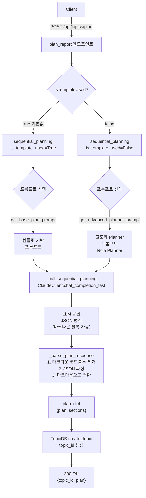
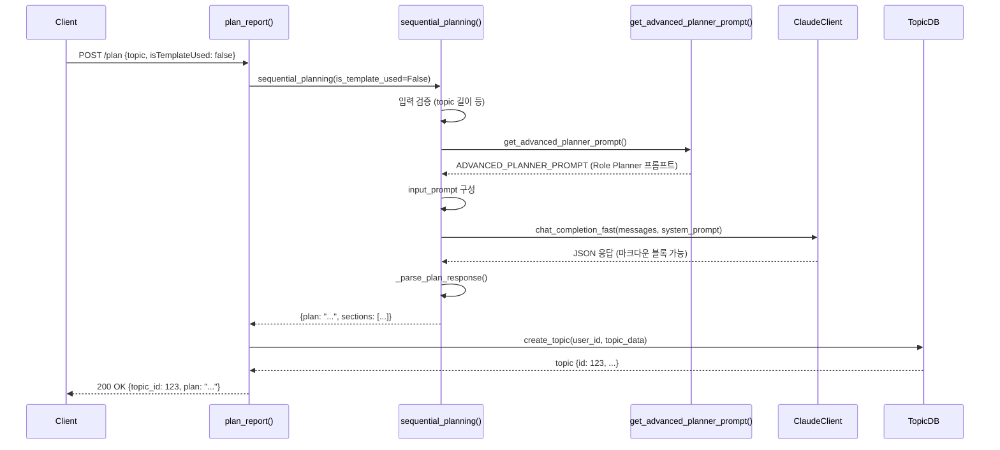

# Unit Spec: POST /api/topics/plan - isTemplateUsed 파라미터 추가

## 1. 요구사항 요약

- **목적:** 보고서 계획 생성 시 템플릿 기반 프롬프트와 고도화된 Planner 프롬프트를 선택적으로 사용할 수 있도록 한다.
- **유형:** ☑ 변경
- **핵심 요구사항:**
  - 입력: `topic` (필수, 1-200자), `template_id` (선택), `isWebSearch` (선택, 기본 false), `isTemplateUsed` (선택, 기본 true)
  - 출력: JSON `{topic_id: int, plan: string}`
  - 예외/제약:
    - topic 누락/과다 길이 시 400 (VALIDATION_ERROR)
    - LLM 호출 실패 시 503 (SERVER_SERVICE_UNAVAILABLE)
    - 타임아웃 (>2초) 시 504 (REQUEST_TIMEOUT)
    - template_id 잘못됨 (isTemplateUsed=true) 시 404 (TEMPLATE_NOT_FOUND)
  - 처리흐름 요약:
    - `isTemplateUsed=true` (기본값): 기존 템플릿 기반 프롬프트 → sequential_planning() 호출
    - `isTemplateUsed=false`: 고도화 Planner 프롬프트 (Role Planner, 7섹션 구조) → sequential_planning() 호출
    - 두 경로 모두 동일한 `_call_sequential_planning()` → `_parse_plan_response()` 사용

---

## 2. 구현 대상 파일

| 구분 | 경로 | 설명 |
| ---- | ---- | ---- |
| 변경 | `backend/app/models/topic.py` | `PlanRequest` 모델에 `is_template_used: bool = True` 필드 추가 (alias: "isTemplateUsed") |
| 변경 | `backend/app/utils/prompts.py` | `get_advanced_planner_prompt()` 함수 및 `ADVANCED_PLANNER_PROMPT` 상수 추가 |
| 변경 | `backend/app/utils/sequential_planning.py` | `sequential_planning()` 함수에 `is_template_used: bool = True` 파라미터 추가 및 분기 로직 |
| 변경 | `backend/app/routers/topics.py` | `plan_report()` 엔드포인트에서 `request.is_template_used` 전달 |
| 참조 | `backend/app/utils/claude_client.py` | ClaudeClient 구조 참고 (변경 없음) |

---

## 2.5 기존 함수 인터페이스 (현황 분석)

### sequential_planning() 시그니처
```python
async def sequential_planning(
    topic: str,                          # 보고서 주제 (필수, 1-200자)
    template_id: Optional[int] = None,   # 템플릿 ID (선택)
    user_id: Optional[str] = None,       # 사용자 ID (template_id 권한 검증용)
    is_web_search: bool = False,         # 웹 검색 활성화 여부
    is_template_used: bool = True        # ← 신규 파라미터 (기본값 True)
) -> Dict[str, Any]:
    """
    반환값: {
        "plan": "# 보고서 계획\n## 개요\n...",  # 마크다운 형식 텍스트 (항상 존재)
        "sections": [
            {
                "title": "개요",
                "description": "보고서의 전체 개요",
                "key_points": ["포인트1", "포인트2"],
                "order": 1
            },
            ...
        ]
    }
    """
```

### _call_sequential_planning() 시그니처
```python
async def _call_sequential_planning(
    input_prompt: str,      # 구성된 입력 프롬프트
    is_web_search: bool = False  # 웹 검색 활성화
) -> str:
    """
    Claude API 호출 결과.
    반환: JSON 문자열 (```json ... ``` 마크다운 코드블록 포함 가능)
    """
```

### _parse_plan_response() 시그니처
```python
def _parse_plan_response(plan_text: str) -> Dict[str, Any]:
    """
    입력: JSON 문자열 (마크다운 코드블록 포함 가능)
    처리:
      1. _extract_json_from_response() - 마크다운 코드블록 제거
      2. json.loads() - JSON 파싱
      3. _build_text_plan() - 마크다운 텍스트로 변환

    반환: {
        "plan": "마크다운 형식 텍스트",
        "sections": [...]
    }
    """
```

### _build_text_plan() 로직
```python
def _build_text_plan(plan_json: Dict[str, Any]) -> str:
    """
    JSON의 title + sections 배열을 마크다운 텍스트로 변환

    입력 JSON 구조:
    {
        "title": "...",
        "sections": [
            {"title": "...", "description": "...", "key_points": [...], "order": 1},
            ...
        ],
        "estimated_word_count": 5000
    }

    출력: 마크다운 문자열
    """
```

---

## 3. 데이터 구조 정의

### 3.1 plan_dict (sequential_planning() 반환값)

```python
{
    "plan": str,              # 마크다운 형식 텍스트 (필수, 항상 존재)
    "sections": [             # 섹션 배열 (필수, 빈 배열 가능)
        {
            "title": str,             # 섹션 제목 (예: "개요")
            "description": str,       # 섹션 설명 (1-2문장)
            "key_points": list[str],  # 주요 포인트 (예: ["포인트1", "포인트2"])
            "order": int              # 섹션 순서
        },
        ...
    ]
}
```

### 3.2 LLM 응답 JSON 구조 (두 프롬프트 모두 동일)

```json
{
    "title": "보고서 제목",
    "sections": [
        {
            "title": "섹션 제목",
            "description": "섹션 설명 (1문장)",
            "key_points": ["포인트1", "포인트2"],
            "order": 1
        },
        ...
    ],
    "estimated_word_count": 5000,
    "estimated_sections_count": 5
}
```

---

## 4. 동작 플로우 (Mermaid)

### 4.1 전체 흐름도



### 4.2 시퀀스 다이어그램 (isTemplateUsed=false 케이스)



---

## 5. ADVANCED_PLANNER_PROMPT 정의

### 5.1 프롬프트 (Role Planner 패턴, JSON 응답)

```python
ADVANCED_PLANNER_PROMPT = """당신은 **고급 프롬프트 엔지니어이자 도메인 역할 설계자(Role Planner)**입니다.
내 요청을 분석하고, 다음 두 가지를 수행하세요:

---

## 1. **보고서 작성에 가장 적합한 전문가 역할을 자동 선택하세요.**

내가 제공한 주제를 분석한 뒤, 아래 중 하나 이상의 역할을 선택합니다:

* 금융 분석가 (Financial Analyst)
* 조직 심리학자 (Organizational Psychologist)
* 기술 아키텍트 (Technical Architect)
* 마케팅 전략가 (Marketing Strategist)
* 정책 연구자 (Policy Researcher)
* 경영 컨설턴트 (Management Consultant)
* 위험관리 전문가 (Risk Specialist)
* 데이터 분석가 (Data Analyst)
* 기타: 주제에 더 적합한 역할이 있을 경우 스스로 정의해도 됩니다.

**역할 선택 기준**

* 주제의 성격(기술/조직/경영/금융/마케팅/사회적 이슈 등)
* 보고서가 다루게 될 주요 이해관계자
* 해결해야 할 문제의 본질
* 필요한 분석 관점과 전문 지식

---

## 2. 선택된 역할이 사용할 **전문적 분석 프레임워크·시각·문체·용어 체계**를 설정하세요.

예:

* 금융 분석가 → Top-down Macro Analysis, 미시 지표, 리스크 인사이트, 공식 보고 문체
* 기술 아키텍트 → 시스템 구조화, 문제 재정의, 계층 아키텍처, 도식적 사고
* 조직 심리학자 → BPS Model, 동기/행동 패턴 분석, 근거 중심 접근
* 마케팅 전략가 → STP, AARRR, 포지셔닝, 카피라이팅 톤

---

## 3. **아래 7개 섹션으로 이루어진 상세 보고서 계획을 JSON으로 생성하세요.**

각 섹션은 **계획(Plan)**이며, 선택된 역할의 관점과 프레임워크가 반영되어야 합니다.

**각 섹션의 의미:**

* **TITLE**: 보고서 전체를 대표하는 제목 (13자 이하 권장)
* **DATE**: 발행 날짜 (예시: 2025.11.24)
* **BACKGROUND**: 보고서가 생성되는 맥락, 문제 정의, 이슈 상황, 필요성
* **MAIN_CONTENT**: 전문가 역할이 적용될 분석 프레임워크 기반의 상세 계획 (3-5개 서브항목 예상)
* **SUMMARY**: 전체 계획을 2~3문단으로 압축한 실행 요약
* **CONCLUSION**: 전략적 제언, 의사결정 관점, 다음 단계 제안
* **SYSTEM**: 선택된 역할, 적용 프레임워크, 문체 원칙, 분석 기준 등 내부 지침

---

## 4. **JSON 응답 형식 규칙 (필수)**

아래 JSON 구조로 응답하세요. Markdown 형식은 불가:

```json
{
  "title": "보고서 제목",
  "selected_role": "선택된 전문가 역할명 (예: Financial Analyst)",
  "framework": "적용된 주요 분석 프레임워크 (예: Top-down Macro Analysis)",
  "sections": [
    {
      "title": "배경 분석",
      "description": "BACKGROUND 섹션 핵심 설명 (1-2문장)",
      "key_points": ["포인트1", "포인트2"],
      "order": 1
    },
    {
      "title": "주요 분석",
      "description": "MAIN_CONTENT 섹션 핵심 설명",
      "key_points": ["프레임워크1", "포인트2", "포인트3"],
      "order": 2
    },
    {
      "title": "요약",
      "description": "SUMMARY 섹션 핵심 (2-3문단 요약)",
      "key_points": ["핵심1", "핵심2"],
      "order": 3
    },
    {
      "title": "결론 및 제언",
      "description": "CONCLUSION 섹션 (전략적 제언, 다음 단계)",
      "key_points": ["제언1", "제언2"],
      "order": 4
    },
    {
      "title": "시스템 메타",
      "description": "역할, 프레임워크, 문체 원칙, 평가 규칙 통합 설명",
      "key_points": [],
      "order": 5
    }
  ],
  "estimated_word_count": 5000,
  "estimated_sections_count": 5
}
```

**주의사항:**
* 응답은 반드시 유효한 JSON만 포함
* Markdown 형식, 설명문, 추가 텍스트 불가
* 마크다운 코드블록(```)도 불가

---

## 5. **주제 입력 (사용자 지정)**

요청 주제: {{USER_TOPIC}}

위 주제에 대해 Role Planner 패턴을 적용하여 상기 JSON 형식으로 응답하세요.
"""
```

---

## 6. 테스트 계획

### 6.1 원칙

- **테스트 우선(TDD)**: 본 섹션의 테스트 케이스를 먼저 작성하고 구현
- **계층별 커버리지**: Unit (모델, 함수) → Integration (sequential_planning) → API (엔드포인트) 순서
- **독립성/재현성**: ClaudeClient, TopicDB는 mock 또는 in-memory 사용
- **판정 기준**: 상태코드, 응답 스키마, 함수 호출 횟수/인자 명시적 검증

### 6.2 구현 예상 테스트 항목

| TC ID | 계층 | 시나리오 | 목적 | 입력/사전조건 | 기대결과 |
| ----- | ---- | -------- | ---- | ------------- | -------- |
| **TC-MODEL-001** | Unit | PlanRequest 기본값 | `is_template_used` 기본값 True 검증 | `PlanRequest(topic="AI")` | `is_template_used == True` |
| **TC-MODEL-002** | Unit | PlanRequest alias | camelCase `isTemplateUsed` 역직렬화 | `{"topic": "AI", "isTemplateUsed": false}` JSON | `request.is_template_used == False` |
| **TC-MODEL-003** | Unit | PlanRequest 검증 | topic 길이 초과 검증 | `topic="A"*201` | ValidationError 발생 |
| **TC-FUNC-004** | Unit | get_advanced_planner_prompt() | 프롬프트에 7섹션 키워드 포함 | 함수 호출 | "TITLE", "DATE", "BACKGROUND", "MAIN_CONTENT", "SUMMARY", "CONCLUSION", "SYSTEM" 포함 |
| **TC-FUNC-005** | Unit | get_advanced_planner_prompt() | JSON 응답 형식 명시 | 함수 호출 | "json", "sections", "estimated_word_count" 포함 |
| **TC-FUNC-006** | Unit | sequential_planning (기본값) | `is_template_used` 미지정 시 get_base_plan_prompt 호출 | `sequential_planning(topic="AI")` (파라미터 생략) | `get_base_plan_prompt()` 호출 1회, `get_advanced_planner_prompt()` 호출 0회 |
| **TC-FUNC-007** | Unit | sequential_planning (템플릿) | `is_template_used=True` 시 템플릿 프롬프트 사용 | `sequential_planning(topic="AI", is_template_used=True)` | `get_base_plan_prompt()` 호출 1회 |
| **TC-FUNC-008** | Unit | sequential_planning (Planner) | `is_template_used=False` 시 고도화 프롬프트 사용 | `sequential_planning(topic="AI", is_template_used=False)` | `get_advanced_planner_prompt()` 호출 1회 |
| **TC-FUNC-009** | Unit | _parse_plan_response | JSON 파싱 및 마크다운 변환 | LLM JSON 응답 (마크다운 블록 포함) | `plan_dict["plan"]` 마크다운 텍스트, `plan_dict["sections"]` 배열 |
| **TC-API-010** | API | 기본값 backward compatibility | 기존 클라이언트 (isTemplateUsed 미포함) 정상 작동 | `POST /plan {"topic": "AI"}` | 200, `get_base_plan_prompt()` 사용, plan 존재 |
| **TC-API-011** | API | isTemplateUsed=true 명시 | 템플릿 기반 프롬프트 경로 | `POST /plan {"topic": "AI", "isTemplateUsed": true}` | 200, `get_base_plan_prompt()` 사용, plan 존재 |
| **TC-API-012** | API | isTemplateUsed=false 명시 | 고도화 프롬프트 경로 (Role Planner) | `POST /plan {"topic": "AI", "isTemplateUsed": false}` | 200, `get_advanced_planner_prompt()` 사용, plan 존재, "selected_role" 포함 |
| **TC-API-013** | API | Validation 오류 | topic 누락 시 400 반환 | `POST /plan {}` | 400, VALIDATION_REQUIRED_FIELD |
| **TC-API-014** | API | template_id 우선순위 | isTemplateUsed=false 시 template_id 무시 | `POST /plan {"topic": "AI", "isTemplateUsed": false, "template_id": 999}` | 200, `get_advanced_planner_prompt()` 사용 (template_id 무시, 에러 없음) |
| **TC-API-015** | API | 응답 스키마 일관성 | 두 프롬프트 모두 동일한 응답 형식 | isTemplateUsed=true/false 각각 실행 | 두 경우 모두 `{topic_id: int, plan: string}` 형식 |
| **TC-ERROR-016** | API | LLM 호출 실패 | ClaudeClient 예외 시 503 반환 | ClaudeClient mock에서 Exception 발생 | 503, SERVER_SERVICE_UNAVAILABLE |
| **TC-ERROR-017** | Integration | JSON 파싱 실패 | LLM 응답이 유효한 JSON 아닐 때 에러 처리 | LLM mock에서 "invalid json" 반환 | SequentialPlanningError 발생, 500 처리 |
| **TC-ERROR-018** | Integration | 응답 시간 초과 | LLM 호출이 2초 초과 시 타임아웃 | LLM mock에서 2초 이상 대기 | TimeoutError 발생, 504 처리 |

### 6.3 샘플 테스트 코드

#### 모델 테스트 (TC-MODEL-001, 002)
```python
# backend/tests/test_models_topic.py

def test_plan_request_default_is_template_used():
    """TC-MODEL-001: is_template_used 기본값 True"""
    request = PlanRequest(topic="AI 시장 분석")
    assert request.is_template_used is True

def test_plan_request_alias_camelcase():
    """TC-MODEL-002: isTemplateUsed alias"""
    data = {"topic": "AI 시장 분석", "isTemplateUsed": False}
    request = PlanRequest.model_validate(data)
    assert request.is_template_used is False
```

#### 함수 테스트 (TC-FUNC-008)
```python
# backend/tests/test_sequential_planning.py

@pytest.mark.asyncio
@patch("app.utils.sequential_planning.get_base_plan_prompt")
@patch("app.utils.sequential_planning.get_advanced_planner_prompt")
@patch("app.utils.sequential_planning._call_sequential_planning")
async def test_sequential_planning_advanced_planner(
    mock_call, mock_advanced, mock_base
):
    """TC-FUNC-008: is_template_used=False 시 고도화 프롬프트 사용"""
    mock_advanced.return_value = "ADVANCED_PROMPT"
    mock_call.return_value = '{"title": "test", "sections": []}'

    await sequential_planning(topic="AI", is_template_used=False)

    mock_advanced.assert_called_once()
    mock_base.assert_not_called()
```

#### API 테스트 (TC-API-012)
```python
# backend/tests/test_routers_topics_plan.py

@patch("app.routers.topics.sequential_planning")
@patch("app.routers.topics.TopicDB.create_topic")
def test_plan_advanced_planner(mock_create_topic, mock_planning, client):
    """TC-API-012: isTemplateUsed=false 시 고도화 프롬프트 경로"""
    mock_planning.return_value = {
        "plan": "advanced plan",
        "sections": [{"title": "배경", "description": "...", "key_points": [], "order": 1}]
    }
    mock_create_topic.return_value = type('obj', (object,), {'id': 1})()

    response = client.post(
        "/api/topics/plan",
        json={"topic": "AI 시장 분석", "isTemplateUsed": False},
        headers={"Authorization": "Bearer test_token"}
    )

    assert response.status_code == 200
    mock_planning.assert_called_once()
    args, kwargs = mock_planning.call_args
    assert kwargs.get("is_template_used") is False
```

---

## 7. template_id와 isTemplateUsed의 상호작용

| 상황 | isTemplateUsed | template_id | 동작 | 에러 |
|------|---|---|---|---|
| **케이스 1** | true | 유효한 ID | 템플릿 프롬프트 사용 | 없음 |
| **케이스 2** | true | 잘못된 ID | 템플릿 조회 시도 → 실패 | 404 TEMPLATE_NOT_FOUND |
| **케이스 3** | true | 미지정 (None) | 기본 프롬프트 사용 | 없음 |
| **케이스 4** | false | 유효한 ID | 고도화 프롬프트 사용 **(template_id 무시)** | 없음 |
| **케이스 5** | false | 잘못된 ID | 고도화 프롬프트 사용 **(template_id 무시)** | 없음 |
| **케이스 6** | false | 미지정 (None) | 고도화 프롬프트 사용 | 없음 |

**핵심:**
- isTemplateUsed=false일 때는 template_id 값과 관계없이 **고도화 프롬프트만 사용**
- template_id 검증은 sequential_planning() 내에서 **건너뜀**
- 에러 발생 가능성: **false 경로에서는 없음**

---

## 8. 기술 선택 사항 (Technical Design Decision)

### 8.1 내부 분기 (sequential_planning 내부) vs 외부 분기 (plan_report 내부)

**선택:** 내부 분기 (sequential_planning 내부)

**이유:**
1. **단일 책임:** sequential_planning()의 책임은 "계획 수립", 프롬프트 선택은 계획 수립 로직의 일부
2. **코드 응집도:** 프롬프트 로직을 한 곳에 집중 (prompts.py + sequential_planning.py)
3. **기존 호환성:** 기존 호출자 (plan_report, _background_generate_report 등)는 변경 불필요
4. **재사용성:** 추후 다른 엔드포인트에서 sequential_planning() 호출 시 is_template_used 파라미터만 지정하면 됨

---

## 9. 가정사항 (Assumptions)

| 항목 | 가정 | 검증 방법 |
|------|------|---------|
| 기존 함수 정상 동작 | `get_base_plan_prompt()`, `_call_sequential_planning()`, `_parse_plan_response()`는 기존 구현이 정확하고 변경되지 않음 | 기존 테스트 재실행 |
| TopicDB 인터페이스 불변 | `TopicDB.create_topic()` 시그니처는 변경 불필요 | API 응답 스키마 검증 |
| LLM 모델 선택 | `chat_completion_fast()` 사용 (Haiku, 응답 속도 우선) | 성능 측정 (2초 제약) |
| JSON 응답 안정성 | LLM이 마크다운 코드블록 또는 JSON으로 응답 가능하며, _extract_json_from_response()가 정확히 처리 | 랜덤 샘플 LLM 호출 테스트 |
| 기존 호출 사이트 영향 | sequential_planning()의 기존 호출 사이트 (plan_report, _background_generate_report 등)는 is_template_used 기본값 True로 자동 처리됨 | 기존 테스트 회귀 검증 |

---

## 10. 에러 처리 시나리오

| 에러 상황 | HTTP 코드 | ErrorCode | 처리 방법 |
|----------|----------|-----------|----------|
| topic 누락 | 400 | VALIDATION_REQUIRED_FIELD | FastAPI Pydantic validation 자동 처리 |
| topic 길이 초과 (>200자) | 400 | VALIDATION_ERROR | sequential_planning() 내 if 검증 |
| template_id 잘못됨 (isTemplateUsed=true) | 404 | TEMPLATE_NOT_FOUND | get_system_prompt() 내 InvalidTemplateError |
| LLM API 호출 실패 | 503 | SERVER_SERVICE_UNAVAILABLE | _call_sequential_planning() 예외 처리 |
| LLM 타임아웃 (>2초) | 504 | REQUEST_TIMEOUT | SequentialPlanningTimeout 예외 (기존) |
| LLM 응답 JSON 파싱 실패 | 500 | SERVER_INTERNAL_ERROR | _parse_plan_response() 예외 처리 |

---

## 11. 성능 및 제약사항

| 항목 | 제약사항 | 검증 방법 |
|------|---------|----------|
| 응답 시간 | < 2초 | 로깅 + 모니터링 (e2e_time) |
| topic 최대 길이 | 200자 | Pydantic validation |
| LLM 모델 | Haiku (chat_completion_fast) | 성능 측정 |
| 동시 요청 | 제한 없음 (stateless, async) | 부하 테스트 |
| JSON 응답 크기 | < 100KB (예상) | LLM 응답 크기 모니터링 |

---

## 12. 사용자 요청 프롬프트

### 12.1 대화 히스토리

**Original User Request (1차):**
```
POST /api/topics/plan에 isTemplateUsed 파라미터 추가
- true: 기존 템플릿 기반 프롬프트
- false: 새로운 Planner 프롬프트 (TITLE, DATE, BACKGROUND, MAIN_CONTENT, SUMMARY, CONCLUSION, SYSTEM 7섹션)
- 기본값 true (backward compatible)
```

**Claude 응답 (설계 제안):**
```
MCP sequential-thinking 활용하여 설계 수립:
1. PlanRequest 모델에 is_template_used: bool = True 추가
2. prompts.py에 get_advanced_planner_prompt() 추가
3. sequential_planning() 내부에서 분기 로직
4. 응답 형식 동일 ({plan, sections})
```

**User Clarification (2차):**
```
Unit Spec 작성 요청
```

**Supplementary Review (3차):**
```
보완 검토:
- ADVANCED_PLANNER_PROMPT 실제 텍스트 필요
- plan_dict 정확한 구조 명시 필요
- template_id/isTemplateUsed 상호작용 명확화 필요
- sequential_planning() 인터페이스 명시 필요
- 기술 선택 사항, 가정사항 추가 필요
```

**User Decision (4차):**
```
Option B 선택: ADVANCED_PLANNER_PROMPT를 JSON 응답 형식으로 변경
→ Role Planner 패턴 유지 + JSON 응답 형식으로 변환
```

**최종 명확화 (통합):**
- ✅ `isTemplateUsed` 파라미터 추가 (기본값 true, backward compatible)
- ✅ ADVANCED_PLANNER_PROMPT 완전 정의 (Role Planner, JSON 응답)
- ✅ plan_dict 정확한 구조 명시
- ✅ template_id/isTemplateUsed 상호작용 명확화 (false일 때 template_id 무시)
- ✅ sequential_planning(), _call_sequential_planning(), _parse_plan_response() 인터페이스 완전 정의
- ✅ 테스트 18개 TC 상세 정의
- ✅ 기술 선택 사항 설명 (내부 분기 이유)
- ✅ 가정사항 명시
- ✅ 에러 처리 시나리오 정리

---

**요청 일시:** 2025-11-24

**컨텍스트/배경:**
- FastAPI 기반 금융 보고서 자동 생성 시스템
- Sequential Planning 기반 보고서 계획 수립 → 보고서 생성 워크플로우
- 현재 `/api/topics/plan`은 템플릿 기반 프롬프트만 지원
- 신규: 고도화된 Planner 프롬프트 (Role Planner 패턴, 7섹션 구조, JSON 응답)
- CLAUDE.md 규칙: Unit Spec 작성 → 승인 → 구현 순서 준수

---

## 13. 구현 체크리스트

### 13.1 Step 0: Unit Spec 작성 (완료 ✅)

- [x] 요구사항 요약 작성
- [x] 구현 대상 파일 정리
- [x] 기존 함수 인터페이스 명시
- [x] 데이터 구조 정의
- [x] 동작 플로우 다이어그램 작성
- [x] ADVANCED_PLANNER_PROMPT 완전 정의
- [x] 테스트 계획 (18개 TC) 작성
- [x] template_id/isTemplateUsed 상호작용 명확화
- [x] 기술 선택 사항 설명
- [x] 가정사항 명시
- [x] 사용자 요청 프롬프트 히스토리 기록
- [ ] **사용자 검토 및 승인 대기** ← **현재 위치**

### 13.2 Step 1: 구현 (승인 후 진행)

#### 1-1. 데이터 모델 정의
- [ ] `PlanRequest`에 `is_template_used` 필드 추가
- [ ] 기본값 `True` 설정
- [ ] alias `"isTemplateUsed"` 설정

#### 1-2. 프롬프트 함수 추가
- [ ] `ADVANCED_PLANNER_PROMPT` 상수 정의 (위의 5.1 내용)
- [ ] `get_advanced_planner_prompt()` 함수 구현

#### 1-3. Sequential Planning 분기 로직
- [ ] `sequential_planning()` 시그니처에 `is_template_used` 파라미터 추가
- [ ] 프롬프트 선택 분기 로직 구현
- [ ] 로깅 추가 (선택된 프롬프트 종류, 파라미터)

#### 1-4. 라우터 수정
- [ ] `plan_report()` 함수에서 `request.is_template_used` 전달
- [ ] 로깅 추가

#### 1-5. 테스트 작성
- [ ] 모델 테스트 (TC-MODEL-001~003) 작성 및 통과
- [ ] 함수 테스트 (TC-FUNC-004~009) 작성 및 통과
- [ ] API 테스트 (TC-API-010~015) 작성 및 통과
- [ ] 에러 테스트 (TC-ERROR-016~018) 작성 및 통과

### 13.3 Step 2: 검증 및 최종 확인

#### 2-1. 기존 코드 영향 확인
- [ ] 기존 테스트 실행 (새 에러 없는지 확인)
- [ ] backward compatibility 검증 (isTemplateUsed 미포함 요청 정상)
- [ ] 응답 형식 일관성 확인

#### 2-2. 문서 업데이트
- [ ] CLAUDE.md 업데이트 (v2.7 버전 정보)
- [ ] API 문서 업데이트 (필요 시)

#### 2-3. 깃 커밋
- [ ] Unit Spec 문서 포함 (`backend/doc/specs/20251124_*.md`)
- [ ] 커밋 메시지: `feat: Add isTemplateUsed parameter to /api/topics/plan with Role Planner`
- [ ] 커밋 메시지에 Unit Spec 파일 명시

---

## 14. 참고 자료

- [CLAUDE.md](../../CLAUDE.md) - 백엔드 개발 가이드
- [Backend_UnitSpec.md](../Backend_UnitSpec.md) - Unit Spec 템플릿
- [sequential_planning.py](../../app/utils/sequential_planning.py) - 기존 구현
- [prompts.py](../../app/utils/prompts.py) - 프롬프트 관리
- [topics.py](../../app/routers/topics.py) - 엔드포인트 구현
- [Backend_UnitSpec_topics_plan.md](../Backend_UnitSpec_topics_plan.md) - 이전 버전 참고용
