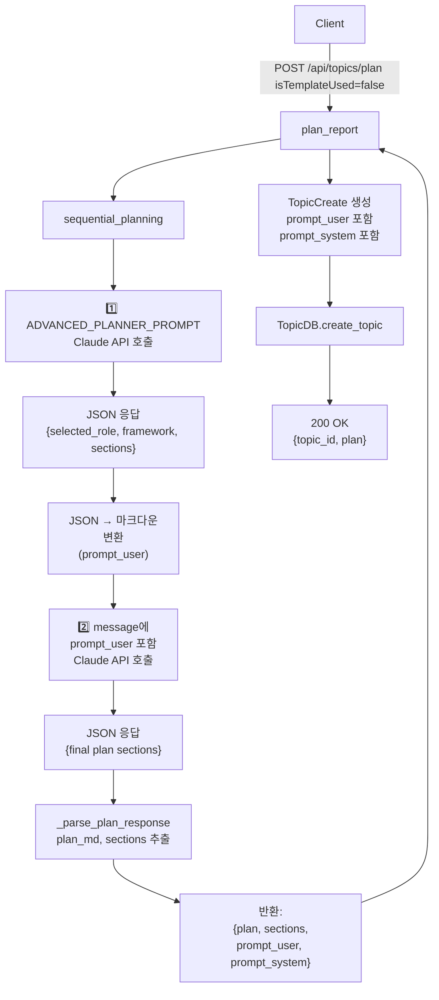
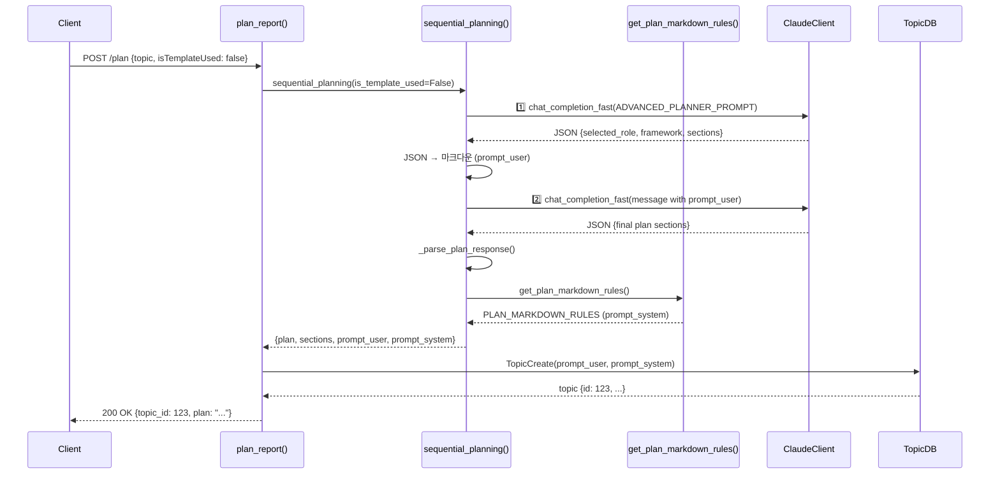

# Unit Spec: POST /api/topics/plan - 2단계 고급 계획 생성 + Prompt 저장

## 1. 요구사항 요약

- **목적:** `isTemplateUsed=false`일 때 Advanced Role Planner를 2단계로 활용하여 고도화된 보고서 계획을 생성하고, 첫 번째 API 응답(prompt_user)과 마크다운 규칙(prompt_system)을 Topic DB에 저장한다.
- **유형:** ☑ 변경
- **핵심 요구사항:**
  - 입력: `topic` (필수), `isTemplateUsed=false` (선택)
  - 출력: JSON `{topic_id: int, plan: string}` (변경 없음)
  - 예외/제약:
    - Claude API 호출 2회 (첫 번째: Role Planner 분석, 두 번째: 상세 계획)
    - 응답 시간 < 4초 (각 호출 < 2초)
    - JSON 파싱 실패 시 500 (SequentialPlanningError)
  - 처리흐름 요약:
    1️⃣ ADVANCED_PLANNER_PROMPT로 Claude API 호출 (JSON 응답)
    2️⃣ JSON을 마크다운으로 변환 → prompt_user에 저장
    3️⃣ prompt_user를 message에 포함하여 두 번째 Claude API 호출
    4️⃣ 최종 계획 JSON 파싱 → plan, sections 추출
    5️⃣ Topic DB에 prompt_user, prompt_system 함께 저장

---

## 2. 구현 대상 파일

| 구분 | 경로 | 설명 |
| ---- | ---- | ---- |
| 변경 | `backend/app/utils/prompts.py` | PLAN_MARKDOWN_RULES 상수 + get_plan_markdown_rules() 함수 추가 |
| 변경 | `backend/app/models/topic.py` | Topic, TopicCreate 모델에 prompt_user, prompt_system 필드 추가 |
| 변경 | `backend/app/utils/sequential_planning.py` | 2단계 호출 로직 구현 (is_template_used=false 분기) |
| 변경 | `backend/app/routers/topics.py` | plan_report()에서 plan_result의 prompt 데이터를 TopicCreate에 전달 |

---

## 3. 동작 플로우 (Mermaid)

### 3.1 전체 흐름도



### 3.2 시퀀스 다이어그램 (isTemplateUsed=false)



---

## 4. 상세 데이터 구조

### 4.1 prompt_system (PLAN_MARKDOWN_RULES)

```markdown
## BACKGROUND
보고서가 생성되는 맥락, 문제 정의, 이슈 상황, 필요성을 명확히 작성하세요.
- 현재 상황 분석
- 문제점 정의
- 이슈의 중요성
- 보고서 필요 이유

## MAIN_CONTENT
전문가 역할이 적용될 분석 프레임워크 기반의 상세 계획 (3-5개 서브항목)을 작성하세요.
- 분석 프레임워크 적용
- 주요 분석 항목
- 구체적 내용 구성
- 상세 섹션 구분

## SUMMARY
전체 계획을 2~3문단으로 압축한 실행 요약을 작성하세요.
- 핵심 내용 요약
- 주요 발견사항
- 예상 효과

## CONCLUSION
전략적 제언, 의사결정 관점, 다음 단계 제안을 작성하세요.
- 전략적 제언
- 의사결정 방향
- 다음 단계 액션
```

### 4.2 prompt_user (첫 번째 API 응답 마크다운)

```markdown
## 선택된 역할: Financial Analyst
금융 분석 관점에서 주제를 분석합니다.

## 프레임워크: Top-down Macro Analysis
거시 경제 지표와 미시 지표를 종합적으로 분석합니다.

## 섹션 1: 배경 분석
주제의 금융적 맥락과 시장 상황을 분석합니다.
- 포인트 1
- 포인트 2

## 섹션 2: 주요 분석
Top-down Macro Analysis 프레임워크를 적용하여 분석합니다.
- 거시 경제 지표
- 산업 동향
- 기업 분석

...
```

### 4.3 sequential_planning() 반환값

```python
{
    "plan": "# 보고서 계획\n## 배경\n...",  # 마크다운 형식
    "sections": [
        {"title": "배경", "description": "...", "key_points": [...], "order": 1},
        {"title": "주요 분석", "description": "...", "key_points": [...], "order": 2},
        ...
    ],
    "prompt_user": "## 선택된 역할: ...\n...",  # 첫 번째 API 응답 마크다운
    "prompt_system": "## BACKGROUND\n..."  # PLAN_MARKDOWN_RULES
}
```

### 4.4 TopicCreate 모델

```python
class TopicCreate(BaseModel):
    input_prompt: str
    template_id: Optional[int] = None
    prompt_user: Optional[str] = None      # ← NEW
    prompt_system: Optional[str] = None    # ← NEW
```

---

## 5. 테스트 계획

### 5.1 원칙

- **테스트 우선(TDD)**: 본 섹션의 테스트 케이스를 먼저 작성하고 코드 작성
- **계층별 커버리지**: Unit (모델, 함수) → Integration (sequential_planning) → API (엔드포인트)
- **독립성/재현성**: ClaudeClient, TopicDB는 mock 사용
- **판정 기준**: 상태코드, 응답 스키마, DB 저장 부작용 검증

### 5.2 구현 예상 테스트 항목

| TC ID | 계층 | 시나리오 | 목적 | 입력/사전조건 | 기대결과 |
| ----- | ---- | -------- | ---- | ------------- | -------- |
| **TC-MODEL-001** | Unit | TopicCreate prompt 필드 | prompt_user, prompt_system 필드 추가 | `TopicCreate(input_prompt="AI", prompt_user="...", prompt_system="...")` | 모두 저장됨 |
| **TC-MODEL-002** | Unit | TopicCreate 기본값 | prompt 필드 optional (None) | `TopicCreate(input_prompt="AI")` | prompt_user=None, prompt_system=None |
| **TC-FUNC-003** | Unit | get_plan_markdown_rules() | PLAN_MARKDOWN_RULES 반환 | 함수 호출 | "BACKGROUND", "MAIN_CONTENT", "SUMMARY", "CONCLUSION" 포함 |
| **TC-FUNC-004** | Unit | sequential_planning 2단계 (mock) | 첫 번째 API → 두 번째 API 호출 순서 | `sequential_planning(topic="AI", is_template_used=False)` with mock | mock_call.call_count == 2 |
| **TC-FUNC-005** | Unit | JSON → 마크다운 변환 | 첫 번째 응답을 prompt_user로 변환 | mock 응답: `{"selected_role": "...", "framework": "...", "sections": [...]}` | prompt_user에 "선택된 역할:", "프레임워크:" 포함 |
| **TC-FUNC-006** | Unit | prompt_system 반환 | sequential_planning 반환값에 prompt_system 포함 | `sequential_planning(..., is_template_used=False)` | result["prompt_system"]에 PLAN_MARKDOWN_RULES 값 |
| **TC-FUNC-007** | Unit | 마크다운 형식 (first_response_md) | first_response_md가 message에 올바르게 포함 | mock으로 첫 번째 응답 시뮬레이션 | 두 번째 호출의 message에 first_response_md 포함 |
| **TC-API-008** | API | isTemplateUsed=false 분기 | 2단계 호출 수행 | `POST /plan {topic: "AI", isTemplateUsed: false}` | 200, {topic_id, plan} |
| **TC-API-009** | API | Prompt 데이터 저장 | TopicDB에 prompt_user, prompt_system 저장 | `POST /plan {topic: "AI", isTemplateUsed: false}` | TopicDB.create_topic() 호출 시 prompt_user, prompt_system 전달 |
| **TC-API-010** | API | 응답 스키마 불변 | 반환값 형식 유지 (변경 없음) | `POST /plan {topic: "AI", isTemplateUsed: false}` | 200, `{success: true, data: {topic_id, plan}}` |
| **TC-ERROR-011** | Integration | 첫 번째 API 실패 | 첫 번째 Claude API 호출 실패 시 500 | ClaudeClient mock에서 Exception 발생 | 500, SequentialPlanningError |
| **TC-ERROR-012** | Integration | 두 번째 API 실패 | 두 번째 Claude API 호출 실패 시 500 | 첫 번째는 성공, 두 번째 mock에서 Exception 발생 | 500, SequentialPlanningError |
| **TC-ERROR-013** | Integration | JSON 파싱 실패 (첫 번째) | 첫 번째 응답이 유효한 JSON 아닐 때 | mock 응답: `"invalid json"` | 500, SequentialPlanningError |
| **TC-ERROR-014** | Integration | JSON 파싱 실패 (두 번째) | 두 번째 응답이 유효한 JSON 아닐 때 | 첫 번째는 valid JSON, 두 번째: `"invalid json"` | 500, SequentialPlanningError |

### 5.3 샘플 테스트 코드

#### 모델 테스트 (TC-MODEL-001, 002)

```python
# backend/tests/test_models_topic_two_step.py

def test_topic_create_with_prompt_fields():
    """TC-MODEL-001: TopicCreate prompt 필드 저장"""
    topic_data = TopicCreate(
        input_prompt="AI 시장 분석",
        prompt_user="## 선택된 역할: Financial Analyst\n...",
        prompt_system="## BACKGROUND\n..."
    )
    assert topic_data.prompt_user == "## 선택된 역할: Financial Analyst\n..."
    assert topic_data.prompt_system == "## BACKGROUND\n..."

def test_topic_create_prompt_optional():
    """TC-MODEL-002: TopicCreate prompt 필드 optional"""
    topic_data = TopicCreate(input_prompt="AI 시장 분석")
    assert topic_data.prompt_user is None
    assert topic_data.prompt_system is None
```

#### 함수 테스트 (TC-FUNC-003~007)

```python
# backend/tests/test_sequential_planning_two_step.py

def test_get_plan_markdown_rules():
    """TC-FUNC-003: get_plan_markdown_rules() 반환"""
    rules = get_plan_markdown_rules()
    assert "BACKGROUND" in rules
    assert "MAIN_CONTENT" in rules
    assert "SUMMARY" in rules
    assert "CONCLUSION" in rules

@pytest.mark.asyncio
@patch("app.utils.sequential_planning._call_sequential_planning")
async def test_two_step_api_calls(mock_call):
    """TC-FUNC-004: 2단계 API 호출 검증"""
    # 첫 번째 응답
    mock_call.side_effect = [
        '{"selected_role": "Financial Analyst", "framework": "Top-down", "sections": []}',
        '{"title": "Final Plan", "sections": []}'
    ]

    result = await sequential_planning(topic="AI", is_template_used=False)

    assert mock_call.call_count == 2
    assert "prompt_user" in result
    assert "prompt_system" in result

@pytest.mark.asyncio
@patch("app.utils.sequential_planning._call_sequential_planning")
async def test_markdown_conversion(mock_call):
    """TC-FUNC-005: JSON → 마크다운 변환"""
    mock_call.side_effect = [
        '{"selected_role": "Financial Analyst", "framework": "Top-down", "sections": [{"title": "배경", "description": "...", "key_points": [], "order": 1}]}',
        '{"title": "Final Plan", "sections": []}'
    ]

    result = await sequential_planning(topic="AI", is_template_used=False)

    assert "선택된 역할" in result["prompt_user"]
    assert "프레임워크" in result["prompt_user"]

@pytest.mark.asyncio
@patch("app.utils.sequential_planning._call_sequential_planning")
async def test_prompt_system_included(mock_call):
    """TC-FUNC-006: prompt_system 반환"""
    mock_call.side_effect = [
        '{"selected_role": "Financial Analyst", "framework": "Top-down", "sections": []}',
        '{"title": "Final Plan", "sections": []}'
    ]

    result = await sequential_planning(topic="AI", is_template_used=False)

    assert result["prompt_system"] == get_plan_markdown_rules()
```

#### API 테스트 (TC-API-008~010)

```python
# backend/tests/test_routers_topics_two_step.py

@patch("app.routers.topics.sequential_planning")
@patch("app.routers.topics.TopicDB.create_topic")
def test_two_step_plan_with_prompts(mock_create_topic, mock_planning, client):
    """TC-API-008~010: 2단계 계획 생성 + Prompt 저장"""
    mock_planning.return_value = {
        "plan": "# 계획\n...",
        "sections": [{"title": "배경", "description": "...", "key_points": [], "order": 1}],
        "prompt_user": "## 선택된 역할: ...\n...",
        "prompt_system": "## BACKGROUND\n..."
    }
    mock_create_topic.return_value = type('obj', (object,), {'id': 1})()

    response = client.post(
        "/api/topics/plan",
        json={"topic": "AI 시장 분석", "isTemplateUsed": False},
        headers={"Authorization": "Bearer test_token"}
    )

    assert response.status_code == 200

    # TC-API-009: Prompt 데이터가 TopicCreate에 전달됨을 검증
    args, kwargs = mock_create_topic.call_args
    topic_data = args[1]  # TopicCreate 인자
    assert topic_data.prompt_user == "## 선택된 역할: ...\n..."
    assert topic_data.prompt_system == "## BACKGROUND\n..."
```

#### 에러 테스트 (TC-ERROR-011~014)

```python
@pytest.mark.asyncio
@patch("app.utils.sequential_planning._call_sequential_planning")
async def test_first_api_failure(mock_call):
    """TC-ERROR-011: 첫 번째 API 실패"""
    mock_call.side_effect = Exception("API Error")

    with pytest.raises(SequentialPlanningError):
        await sequential_planning(topic="AI", is_template_used=False)

@pytest.mark.asyncio
@patch("app.utils.sequential_planning._call_sequential_planning")
async def test_second_api_failure(mock_call):
    """TC-ERROR-012: 두 번째 API 실패"""
    mock_call.side_effect = [
        '{"selected_role": "...", "sections": []}',
        Exception("API Error")
    ]

    with pytest.raises(SequentialPlanningError):
        await sequential_planning(topic="AI", is_template_used=False)

@pytest.mark.asyncio
@patch("app.utils.sequential_planning._call_sequential_planning")
async def test_first_json_parse_failure(mock_call):
    """TC-ERROR-013: 첫 번째 JSON 파싱 실패"""
    mock_call.side_effect = [
        "invalid json",
        '{"sections": []}'
    ]

    with pytest.raises(SequentialPlanningError):
        await sequential_planning(topic="AI", is_template_used=False)
```

---

## 6. 구현 체크리스트

### Step 1: prompts.py 수정
- [ ] PLAN_MARKDOWN_RULES 상수 추가 (4섹션: BACKGROUND, MAIN_CONTENT, SUMMARY, CONCLUSION)
- [ ] get_plan_markdown_rules() 함수 추가
- [ ] 함수에 docstring 작성

### Step 2: topic.py 수정
- [ ] Topic 모델에 prompt_user, prompt_system 필드 추가 (Optional[str])
- [ ] TopicCreate 모델에 prompt_user, prompt_system 필드 추가 (Optional[str])
- [ ] 필드에 description 추가

### Step 3: sequential_planning.py 수정
- [ ] is_template_used=false 분기에서 2단계 호출 구현:
  - [ ] 첫 번째 API 호출 (ADVANCED_PLANNER_PROMPT)
  - [ ] JSON → 마크다운 변환 (prompt_user)
  - [ ] 두 번째 API 호출 (prompt_user를 message에 포함)
  - [ ] get_plan_markdown_rules() 호출 (prompt_system)
- [ ] 반환값에 prompt_user, prompt_system 추가
- [ ] 로깅 업데이트 (2단계 호출 기록)

### Step 4: topics.py 수정
- [ ] plan_report()에서 plan_result의 prompt 데이터 추출
- [ ] TopicCreate 생성 시 prompt 데이터 전달
- [ ] 로깅 업데이트 (prompt 저장 기록)

### Step 5: 테스트 작성 및 실행
- [ ] test_models_topic_two_step.py (2개)
- [ ] test_sequential_planning_two_step.py (5개)
- [ ] test_routers_topics_two_step.py (7개)
- [ ] 모든 테스트 통과 확인 (14개)

### Step 6: 기존 테스트 검증
- [ ] 기존 topics 라우터 테스트 (is_template_used=true) 통과
- [ ] 기존 sequential_planning 테스트 통과
- [ ] 회귀 테스트 (backward compatibility)

---

## 7. 사용자 요청 프롬프트

**Original User Request:**

```
/api/topics/plan에서 is_template_used=false일 때:
1️⃣ 첫 번째 Claude API 호출: ADVANCED_PLANNER_PROMPT 사용
2️⃣ 첫 번째 응답을 마크다운으로 변환 → DB에 저장 (prompt_user)
3️⃣ 두 번째 Claude API 호출: 첫 번째 응답을 message에 포함
4️⃣ Topics DB에 prompt_user, prompt_system 컬럼 추가 저장

구현 방식: plan_report()에서 sequential_planning() 반환값의 prompt 데이터를 TopicCreate에 전달하여 저장
```

**최종 명확화 (통합):**
- ✅ 신규 프롬프트 상수 (PLAN_MARKDOWN_RULES) 추가
- ✅ sequential_planning() 내부에서 2단계 API 호출
- ✅ 첫 번째 응답 JSON → 마크다운 변환
- ✅ sequential_planning() 반환값에 prompt_user, prompt_system 포함
- ✅ plan_report()에서 prompt 데이터를 TopicCreate에 전달
- ✅ TopicDB.create_topic()에서 prompt 데이터 저장
- ✅ 최종 API 응답 형식 불변 (변경 없음)

---

## 8. 에러 처리 시나리오

| 에러 상황 | HTTP 코드 | ErrorCode | 처리 방법 |
|----------|----------|-----------|----------|
| 첫 번째 API 호출 실패 | 500 | SERVER_INTERNAL_ERROR | _call_sequential_planning() 예외 처리 |
| 두 번째 API 호출 실패 | 500 | SERVER_INTERNAL_ERROR | _call_sequential_planning() 예외 처리 |
| 첫 번째 JSON 파싱 실패 | 500 | SERVER_INTERNAL_ERROR | _parse_plan_response() 예외 처리 |
| 두 번째 JSON 파싱 실패 | 500 | SERVER_INTERNAL_ERROR | _parse_plan_response() 예외 처리 |

---

## 9. 성능 제약

| 항목 | 제약 | 비고 |
|------|------|------|
| 첫 번째 API 호출 | < 2초 | Haiku 모델 사용 |
| 두 번째 API 호출 | < 2초 | Haiku 모델 사용 |
| 전체 sequential_planning() | < 4초 | 2회 호출 합산 |
| DB 저장 (TopicDB.create_topic) | < 100ms | 동기/비동기 처리 |

---

**작성 일시:** 2025-11-24
**버전:** 1.0
**상태:** ✅ Unit Spec 작성 완료
