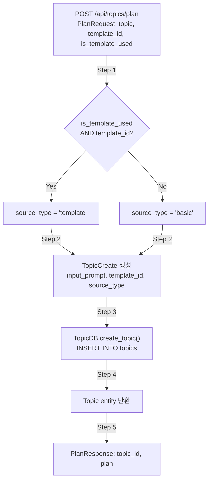
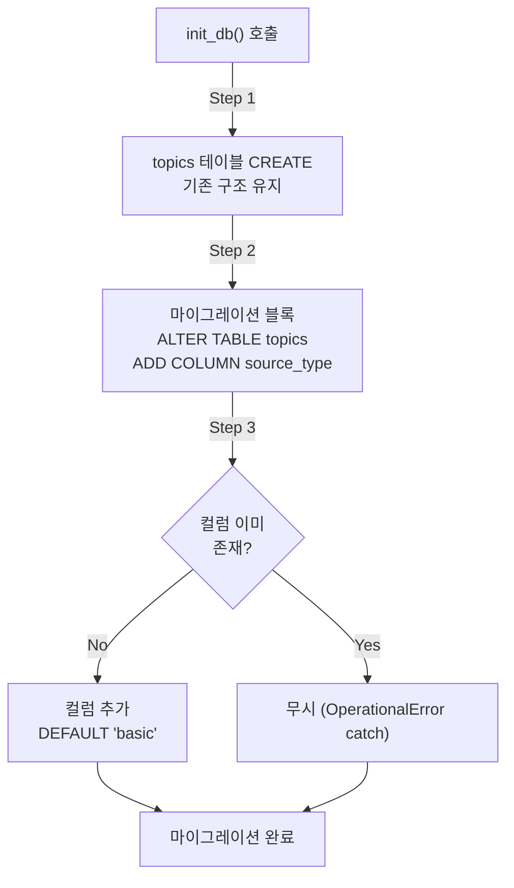
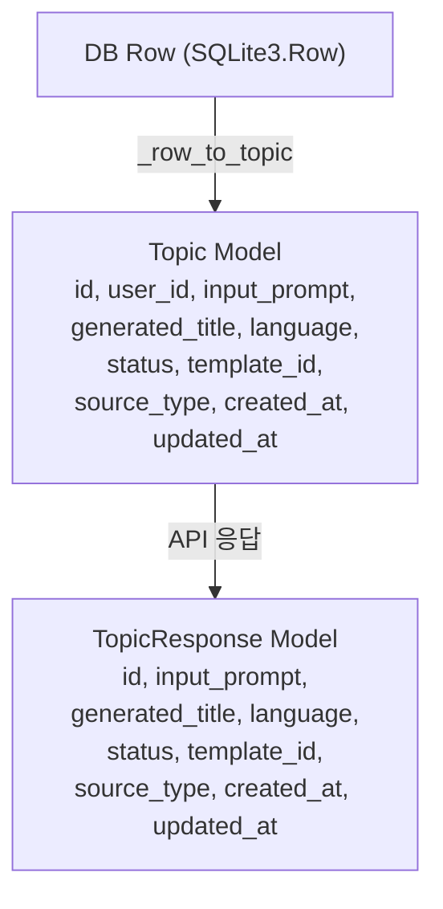
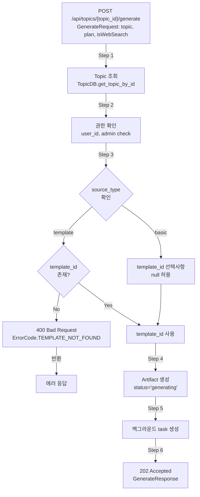

# Unit Spec: Topics DB에 source_type 컬럼 추가

**작성일**: 2025-11-27
**버전**: 1.1
**상태**: 사용자 피드백 반영 (구현 대기)
**Spec ID**: 20251127_add_source_type_column_to_topics

---

## 1. 요구사항 요약

### Purpose
Topics 테이블에 `source_type` 컬럼을 추가하여 각 topic이 어떤 방식으로 생성되었는지(Template 기반 vs Basic) 추적할 수 있도록 함.

### Type
신규기능 (Feature)

### Core Requirements
1. **DB 스키마**: topics 테이블에 `source_type` 컬럼 신설
   - 타입: TEXT (Enum 값: "template", "basic")
   - 기본값: "basic" (null 불가)
   - Template을 사용한 topic은 "template", Basic은 "basic"으로 저장
   - **마이그레이션**: 기존 데이터 모두 삭제 후 재기동 (마이그레이션 스크립트 불필요)

2. **Enum 정의**: TopicSourceType 추가
   - shared/types/enums.py에 새 Enum 정의
   - 값: TEMPLATE = "template", BASIC = "basic"

3. **모델 업데이트**: 모든 Topic 관련 모델에 source_type 필드 추가
   - Topic (DB 엔티티): source_type 필드 추가
   - TopicCreate (요청 모델): source_type 필드 추가 (필수)
   - TopicUpdate: source_type 미포함 (불변 필드)
   - TopicResponse (응답 모델): source_type 필드 추가

4. **DB 작업**: topic_db.py 수정
   - create_topic()에서 source_type 처리
   - _row_to_topic()에서 source_type 파싱
   - update_topic()에서 source_type 업데이트 지원하지 않음 (불변)

5. **API 엔드포인트 - /api/topics/plan**: source_type 자동 결정 및 설정
   - `isTemplateUsed=true` → `source_type='template'` (template_id 필수)
   - `isTemplateUsed=false` → `source_type='basic'` (template_id null 처리)

6. **API 엔드포인트 - /api/topics/{topic_id}/generate**: source_type 기반 조건부 검증 추가
   - **source_type='template'**: template_id 필수 검증
     - template_id 없으면 400 Bad Request 반환 (기존 로직 유지)
   - **source_type='basic'**: template_id 선택사항 (검증 로직 추가)
     - template_id null 허용
     - template_id 있으면 사용, 없으면 기본 프롬프트 사용

---

## 2. 구현 대상 파일

| 구분 | 파일 경로 | 설명 |
|------|---------|------|
| 신규 | - | - |
| 변경 | shared/types/enums.py | TopicSourceType Enum 추가 |
| 변경 | shared/types/__init__.py | TopicSourceType export 추가 |
| 변경 | backend/app/database/connection.py | topics 테이블 스키마 추가 (source_type 컬럼) |
| 변경 | backend/app/models/topic.py | Topic, TopicCreate, TopicResponse에 source_type 필드 추가 |
| 변경 | backend/app/database/topic_db.py | create_topic(), _row_to_topic() 수정 |
| 변경 | backend/app/routers/topics.py | /api/topics/plan: source_type 자동 결정 + /api/topics/{topic_id}/generate: source_type 기반 검증 |
| 변경 | backend/tests/test_topics.py | source_type 관련 테스트 케이스 추가 |

---

## 3. 동작 흐름

### 3.1 Topic 생성 흐름 (/api/topics/plan)



### 3.2 DB 마이그레이션 흐름



### 3.3 Model 변환 흐름



### 3.4 보고서 생성 흐름 (/api/topics/{topic_id}/generate) - source_type 기반 조건부 검증



---

## 4. 테스트 계획

### TC-001: Enum 정의 확인
**목표**: TopicSourceType Enum이 올바르게 정의되었는지 확인
**입력**: shared/types/enums.py
**실행**:
```python
from shared.types.enums import TopicSourceType
assert TopicSourceType.TEMPLATE.value == "template"
assert TopicSourceType.BASIC.value == "basic"
```
**기대결과**: 두 Enum 값이 올바르게 정의됨

---

### TC-002: DB 마이그레이션 확인
**목표**: topics 테이블에 source_type 컬럼이 추가되었는지 확인
**실행**:
```python
conn = get_db_connection()
cursor = conn.cursor()
cursor.execute("PRAGMA table_info(topics)")
columns = [row[1] for row in cursor.fetchall()]
assert "source_type" in columns
```
**기대결과**: topics 테이블에 source_type 컬럼이 존재

---

### TC-003: Topic 생성 - Template 기반 (source_type='template')
**목표**: template_id와 is_template_used=true 시 source_type이 'template'으로 설정
**입력**:
```python
request = PlanRequest(
    topic="AI 시장 분석",
    template_id=1,
    is_template_used=True,
    is_web_search=False
)
```
**실행**: POST /api/topics/plan (인증된 사용자)
**기대결과**:
```python
{
    "success": True,
    "data": {
        "topic_id": <int>,
        "plan": <str>
    }
}
# DB 확인:
topic = TopicDB.get_topic_by_id(topic_id)
assert topic.source_type == TopicSourceType.TEMPLATE
```

---

### TC-004: Topic 생성 - Basic 기반 (source_type='basic', template_id 존재하나 is_template_used=false)
**목표**: is_template_used=false 시 template_id가 있어도 source_type이 'basic'으로 설정
**입력**:
```python
request = PlanRequest(
    topic="AI 시장 분석",
    template_id=1,  # 제공되지만 무시됨
    is_template_used=False,
    is_web_search=False
)
```
**실행**: POST /api/topics/plan (인증된 사용자)
**기대결과**:
```python
topic = TopicDB.get_topic_by_id(topic_id)
assert topic.source_type == TopicSourceType.BASIC
assert topic.template_id is None  # 값이 저장되지 않음
```

---

### TC-005: Topic 생성 - Basic 기반 (source_type='basic', template_id 미제공)
**목표**: template_id가 제공되지 않으면 source_type이 'basic'으로 설정
**입력**:
```python
request = PlanRequest(
    topic="AI 시장 분석",
    template_id=None,
    is_template_used=True,  # template_id가 없으므로 무시됨
    is_web_search=False
)
```
**실행**: POST /api/topics/plan (인증된 사용자)
**기대결과**:
```python
topic = TopicDB.get_topic_by_id(topic_id)
assert topic.source_type == TopicSourceType.BASIC
```

---

### TC-006: Topic 조회 - source_type 필드 포함
**목표**: GET /api/topics/{id} 응답에 source_type이 포함
**입력**: topic_id (TC-003에서 생성된 topic)
**실행**: GET /api/topics/{id}
**기대결과**:
```python
{
    "success": True,
    "data": {
        "id": <int>,
        "input_prompt": "AI 시장 분석",
        "generated_title": <str>,
        "language": "ko",
        "status": "active",
        "template_id": 1,
        "source_type": "template",  # ✅ 포함됨
        "created_at": <ISO8601>,
        "updated_at": <ISO8601>
    }
}
```

---

### TC-007: Topic 목록 조회 - source_type 필드 포함
**목표**: GET /api/topics 응답의 각 topic에 source_type이 포함
**실행**: GET /api/topics?page=1&page_size=20 (인증된 사용자)
**기대결과**:
```python
{
    "success": True,
    "data": {
        "topics": [
            {
                "id": <int>,
                "input_prompt": "...",
                "source_type": "template" or "basic",  # ✅ 각 topic에 포함
                ...
            },
            ...
        ],
        "total": <int>,
        "page": 1,
        "page_size": 20
    }
}
```

---

### TC-008: TopicCreate 모델 - source_type 자동 처리
**목표**: TopicCreate 생성 시 source_type이 자동으로 결정
**입력**:
```python
# /api/topics/plan에서 자동으로 결정
is_template_used = True
template_id = 1

source_type = TopicSourceType.TEMPLATE if (is_template_used and template_id) else TopicSourceType.BASIC

topic_data = TopicCreate(
    input_prompt="AI 시장 분석",
    template_id=1,
    source_type=source_type
)
```
**기대결과**: source_type이 'template'으로 설정되고, DB에 저장됨

---

### TC-009: DB 역호환성 - 기존 topic 조회
**목표**: 마이그레이션 전에 생성된 topic(source_type 없음)을 조회했을 때 기본값 'basic'이 적용
**실행**:
```python
# 직접 SQL로 source_type 없이 topic 삽입
cursor.execute("""
    INSERT INTO topics (user_id, input_prompt, language, status, created_at, updated_at)
    VALUES (1, '기존 topic', 'ko', 'active', NOW(), NOW())
""")

# _row_to_topic에서 source_type 처리 확인
topic = TopicDB.get_topic_by_id(topic_id)
```
**기대결과**: source_type이 'basic'으로 기본값 처리 (또는 NULL 에러 처리)

---

### TC-010: Generate API - source_type='template'일 때 template_id 필수 검증
**목표**: source_type='template'인 topic으로 /api/topics/{topic_id}/generate 호출 시 template_id 필수 검증
**입력**:
```python
# Step 1: source_type='template'인 topic 생성
topic = create_topic_with_template(source_type='template', template_id=1)

# Step 2: /api/topics/{topic_id}/generate 호출
request = GenerateRequest(
    topic="AI 시장 분석",
    plan="# 계획\n...",
    is_web_search=False
)
```
**실행**: POST /api/topics/{topic.id}/generate (인증된 사용자)
**기대결과**:
```python
{
    "success": True,
    "data": {
        "topic_id": <int>,
        "artifact_id": <int>,
        "status": "generating",
        "status_check_url": "/api/topics/{topic_id}/status"
    }
}
# HTTP 202 Accepted
```

---

### TC-011: Generate API - source_type='basic'일 때 template_id null 허용
**목표**: source_type='basic'인 topic으로 /api/topics/{topic_id}/generate 호출 시 template_id null 허용
**입력**:
```python
# Step 1: source_type='basic'인 topic 생성 (template_id=null)
topic = create_topic_basic(source_type='basic', template_id=None)

# Step 2: /api/topics/{topic_id}/generate 호출
request = GenerateRequest(
    topic="AI 시장 분석",
    plan="# 계획\n...",
    is_web_search=False
)
```
**실행**: POST /api/topics/{topic.id}/generate (인증된 사용자)
**기대결과**:
```python
{
    "success": True,
    "data": {
        "topic_id": <int>,
        "artifact_id": <int>,
        "status": "generating",
        "message": "보고서 생성이 시작되었습니다.",
        "status_check_url": "/api/topics/{topic_id}/status"
    }
}
# HTTP 202 Accepted
# 기본 프롬프트 사용
```

---

### TC-012: Generate API - source_type='template'일 때 template_id 누락 → 400 에러
**목표**: source_type='template'인 topic에서 template_id가 null이면 400 Bad Request 반환
**상황**: (데이터 오류) source_type='template'이지만 template_id가 null인 토픽
**입력**:
```python
# 직접 SQL로 생성 (오류 상태 재현)
cursor.execute("""
    INSERT INTO topics (user_id, input_prompt, language, status, source_type, template_id, created_at, updated_at)
    VALUES (1, 'AI 분석', 'ko', 'active', 'template', NULL, NOW(), NOW())
""")
```
**실행**: POST /api/topics/{corrupted_topic_id}/generate
**기대결과**:
```python
{
    "success": False,
    "error_code": "TOPIC.TEMPLATE_NOT_FOUND",
    "message": "이 토픽에는 템플릿이 지정되어 있지 않습니다.",
    "http_status": 400
}
```

---

### TC-013: Generate API - source_type='basic'일 때 template_id 제공하면 사용
**목표**: source_type='basic'인 topic이지만 template_id가 있으면 그것을 사용 (호환성)
**입력**:
```python
# Step 1: source_type='basic'이지만 template_id=1 설정
topic = create_topic_basic(source_type='basic', template_id=1)

# Step 2: /api/topics/{topic_id}/generate 호출
request = GenerateRequest(
    topic="AI 시장 분석",
    plan="# 계획\n...",
    is_web_search=False
)
```
**실행**: POST /api/topics/{topic.id}/generate (인증된 사용자)
**기대결과**:
```python
{
    "success": True,
    "data": {
        "status": "generating",
        "artifact_id": <int>
    }
}
# HTTP 202 Accepted
# template_id=1의 템플릿 프롬프트 사용
```

---

### TC-014: 기존 테스트 호환성 - regression 확인
**목표**: 기존 test_topics.py의 모든 테스트가 여전히 통과
**실행**:
```bash
pytest backend/tests/test_topics.py -v
```
**기대결과**:
- 모든 기존 테스트 통과
- source_type 추가로 인한 regression 없음
- 특히 /api/topics/{topic_id}/generate 기존 테스트 통과 (source_type='template' 가정)

---

## 5. 에러 처리 시나리오

### 시나리오 1: TopicCreate에서 source_type 미제공
**상황**: API 레이어에서 source_type을 결정하지 않고 전달
**처리**:
- API 레이어에서 **반드시** source_type을 결정하고 전달
- TopicCreate 모델에서 source_type은 **필수 필드** (Optional 아님)
- 누락 시 422 Unprocessable Entity 반환

**예시 에러**:
```python
{
    "success": False,
    "error_code": "VALIDATION.MISSING_FIELD",
    "message": "source_type 필드는 필수입니다",
    "http_status": 422
}
```

---

### 시나리오 2: 잘못된 source_type 값
**상황**: API에서 "template", "basic" 이외의 값을 전달
**처리**:
- Pydantic의 Enum 자동 검증으로 처리
- 잘못된 값 시 422 Unprocessable Entity 반환

**예시 에러**:
```python
{
    "success": False,
    "error_code": "VALIDATION.INVALID_ENUM",
    "message": "source_type은 'template' 또는 'basic' 중 하나여야 합니다",
    "http_status": 422
}
```

---

### 시나리오 3: Generate API에서 source_type='template'인데 template_id 누락
**상황**: /api/topics/{topic_id}/generate 호출 시 source_type='template'이지만 template_id=null
**처리**:
```python
# routers/topics.py의 generate_report_background()에서
topic = TopicDB.get_topic_by_id(topic_id)

if topic.source_type == TopicSourceType.TEMPLATE and not topic.template_id:
    return error_response(
        code=ErrorCode.TEMPLATE_NOT_FOUND,
        http_status=400,
        message="이 토픽에는 템플릿이 지정되어 있지 않습니다."
    )
```
**결과**: 400 Bad Request (데이터 무결성 오류)

---

### 시나리오 4: Generate API에서 source_type='basic'이고 template_id=null
**상황**: /api/topics/{topic_id}/generate 호출 시 source_type='basic'이고 template_id=null
**처리**:
```python
# routers/topics.py의 generate_report_background()에서
topic = TopicDB.get_topic_by_id(topic_id)

if topic.source_type == TopicSourceType.BASIC and not topic.template_id:
    # prompt_optimization_result 활용
    optimization_record = PromptOptimizationDB.get_latest_by_topic_id(topic_id)

    if optimization_record:
        # 고도화된 프롬프트 사용 (role, context, task 조합)
        system_prompt = _build_system_prompt_from_optimization(
            role=optimization_record['role'],
            context=optimization_record['context'],
            task=optimization_record['task']
        )
    else:
        # 기본 프롬프트 사용
        system_prompt = FINANCIAL_REPORT_SYSTEM_PROMPT
```

**결과**: 202 Accepted (정상 진행)
- 프롬프트 우선순위:
  1. prompt_optimization 결과 (source_type='basic'일 때)
  2. 기본 프롬프트 (FINANCIAL_REPORT_SYSTEM_PROMPT)
  3. 템플릿 프롬프트 (source_type='template'일 때)

---

## 6. 기술 선택사항

### Enum 저장 방식
- **선택**: TEXT 타입 (Enum 값의 문자열 저장)
- **이유**:
  - SQLite는 native enum 미지원
  - 문자열 저장으로 가독성 향상
  - 쿼리 시 직관적 처리 가능

### source_type 자동 결정 로직 위치
- **선택**: API 레이어 (/api/topics/plan)에서 결정
- **방식**:
  ```python
  if request.is_template_used:
      source_type = TopicSourceType.TEMPLATE
  else:
      source_type = TopicSourceType.BASIC
  ```
- **이유**:
  - API 요청 파라미터에서 직접 읽을 수 있음
  - 비즈니스 로직 명확화
  - DB 레이어 책임 분리

### Generate API의 조건부 검증
- **선택**: source_type을 기반으로 한 조건부 검증
- **방식**:
  ```python
  if topic.source_type == TopicSourceType.TEMPLATE:
      # template_id 필수
      if not topic.template_id:
          return error_response(...)
  else:  # BASIC
      # template_id 선택사항 (null 허용)
      template_id = topic.template_id or None
  ```
- **이유**:
  - source_type으로 topic 생성 의도 파악 가능
  - 유연한 구조 (Basic은 나중에 template_id 추가 가능)
  - 기존 로직과의 호환성 유지

### NULL 허용 여부
- **선택**: NOT NULL (source_type), NULL 허용 (template_id)
- **이유**:
  - source_type은 항상 존재 (필수 정보)
  - template_id는 source_type='basic'일 때 null 가능

---

## 7. 가정사항

1. **API 레이어 책임**
   - source_type은 API 레이어에서 자동으로 결정
   - `/api/topics/plan`에서 `isTemplateUsed` 파라미터로부터 자동 결정
   - TopicCreate를 생성할 때 source_type 값이 **반드시** 설정됨

2. **데이터 마이그레이션**
   - 기존 데이터 모두 삭제 후 재기동 (마이그레이션 스크립트 불필요)
   - 새 DB 스키마: source_type 컬럼 필수

3. **Generate API의 유연성**
   - source_type='template' → template_id 필수 (기존 로직 유지)
   - source_type='basic' → template_id 선택사항 (새 로직)
   - 향후 source_type='basic'이어도 template_id 동적 추가 가능

4. **TopicUpdate에서 source_type 수정**
   - source_type은 topic 생성 후 수정 불가능 (불변 필드)
   - TopicUpdate 모델에는 포함하지 않음

5. **기존 테스트**
   - 기존 /api/topics/{topic_id}/generate 테스트는 source_type='template' 가정
   - source_type='basic'은 새로운 TC-011 등에서 테스트

---

## 8. 구현 체크리스트

### Step 0: Spec 검토 (현재 단계)
- [ ] Unit Spec 완성 ✅
- [ ] 사용자 검토 및 승인 대기 ⏳

### Step 1: 구현 (사용자 승인 후)

#### 1-1. 테스트 먼저 작성 (TDD)
- [ ] backend/tests/test_topics.py에 TC-001~TC-010 구현
- [ ] 모든 테스트 FAIL 상태 확인

#### 1-2. Enum 정의
- [ ] shared/types/enums.py에 TopicSourceType 추가
- [ ] shared/types/__init__.py에서 export
- [ ] TC-001 테스트 통과 확인

#### 1-3. DB 마이그레이션
- [ ] backend/app/database/connection.py에 ALTER TABLE 추가
- [ ] TC-002 테스트 통과 확인

#### 1-4. 모델 업데이트
- [ ] backend/app/models/topic.py: Topic에 source_type 필드 추가
- [ ] backend/app/models/topic.py: TopicCreate에 source_type 필드 추가
- [ ] backend/app/models/topic.py: TopicResponse에 source_type 필드 추가
- [ ] TopicUpdate는 source_type 미포함 (불변 필드)

#### 1-5. DB 작업 로직
- [ ] backend/app/database/topic_db.py: create_topic()에 source_type 파라미터 추가
- [ ] backend/app/database/topic_db.py: _row_to_topic()에 source_type 파싱 추가
- [ ] backend/app/database/topic_db.py: INSERT/SELECT 쿼리 수정
- [ ] TC-009 테스트 통과 (역호환성)

#### 1-6. API 로직 - /api/topics/plan
- [ ] backend/app/routers/topics.py: plan_report()에서 source_type 결정 로직 추가
  ```python
  if request.is_template_used:
      source_type = TopicSourceType.TEMPLATE
  else:
      source_type = TopicSourceType.BASIC

  topic_data = TopicCreate(
      input_prompt=request.topic,
      template_id=request.template_id if request.is_template_used else None,
      source_type=source_type
  )
  ```
- [ ] TC-003~TC-009 테스트 통과 확인

#### 1-7. API 로직 - /api/topics/{topic_id}/generate
- [ ] backend/app/routers/topics.py: generate_report_background()에서 source_type 기반 검증 및 프롬프트 결정 추가
  ```python
  from app.database.prompt_optimization_db import PromptOptimizationDB
  from shared.types.enums import TopicSourceType

  topic = TopicDB.get_topic_by_id(topic_id)

  # Step 1: 조건부 template_id 검증
  if topic.source_type == TopicSourceType.TEMPLATE:
      # template_id 필수
      if not topic.template_id:
          return error_response(
              code=ErrorCode.TEMPLATE_NOT_FOUND,
              http_status=400,
              message="이 토픽에는 템플릿이 지정되어 있지 않습니다."
          )
      template_id = topic.template_id
  else:  # BASIC
      # template_id 선택사항 (null 허용)
      template_id = topic.template_id

  # Step 2: 프롬프트 결정 (source_type 기반)
  system_prompt = None

  if topic.source_type == TopicSourceType.TEMPLATE:
      # 템플릿 프롬프트
      template = TemplateDB.get_template_by_id(template_id, topic.user_id)
      system_prompt = template.prompt_system
  elif topic.source_type == TopicSourceType.BASIC:
      if template_id:
          # Basic이지만 template_id 있으면 템플릿 사용 (호환성)
          template = TemplateDB.get_template_by_id(template_id, topic.user_id)
          system_prompt = template.prompt_system
      else:
          # template_id 없으면 prompt_optimization 활용
          optimization = PromptOptimizationDB.get_latest_by_topic_id(topic_id)
          if optimization:
              # 고도화된 프롬프트 사용
              system_prompt = _build_system_prompt_from_optimization(
                  role=optimization['role'],
                  context=optimization['context'],
                  task=optimization['task']
              )
          else:
              # 기본 프롬프트
              system_prompt = FINANCIAL_REPORT_SYSTEM_PROMPT

  # system_prompt를 _background_generate_report()에 전달
  ```
- [ ] _build_system_prompt_from_optimization() 헬퍼 함수 구현 (role + context + task 조합)
- [ ] TC-010~TC-014 테스트 통과 확인
- [ ] 기존 template_id null 검증 로직 변경 (조건부로 변경)

#### 1-8. 통합 테스트
- [ ] pytest backend/tests/test_topics.py -v 실행
- [ ] TC-001~TC-014 모두 통과
- [ ] 기존 테스트(TC-014) 모두 통과
- [ ] 커버리지 검증

### Step 2: 검증 및 최종 확인
- [ ] 기존 test_topics.py 모든 테스트 통과
- [ ] 전체 backend 테스트 실행: pytest backend/ -v
- [ ] CLAUDE.md 업데이트
  - 새 Enum 추가 문서화
  - /api/topics/plan 응답 스키마 업데이트
  - DB 스키마 문서 업데이트
- [ ] Git 커밋
  ```bash
  git add backend/doc/specs/20251127_add_source_type_column_to_topics.md
  git add backend/app/
  git add backend/tests/
  git add shared/types/
  git commit -m "feat: add source_type column to topics and conditional template validation

  - Add TopicSourceType enum (template, basic) to shared/types/enums.py
  - Add source_type field to Topic, TopicCreate, TopicResponse models
  - Add source_type column to topics table (NOT NULL, TEXT)
  - Implement source_type auto-detection in /api/topics/plan based on isTemplateUsed
  - Add conditional template_id validation in /api/topics/{topic_id}/generate
    * source_type='template': template_id required
    * source_type='basic': template_id optional (null allowed)
  - Add 14 test cases for source_type functionality (TC-001~TC-014)

  Spec: backend/doc/specs/20251127_add_source_type_column_to_topics.md"
  ```

---

## 9. 사용자 피드백 반영 완료

### 반영된 요구사항

| 항목 | 피드백 | 반영 결과 |
|------|--------|----------|
| source_type 자동 결정 | isTemplateUsed → true: "template", false: "basic" | ✅ 구현 방식 명시 (6. 기술 선택사항) |
| TopicCreate 필수 여부 | 필수 | ✅ 필수 필드로 설정 (3. 요구사항) |
| 불변 필드 | 예, 불변 | ✅ TopicUpdate 미포함, TC-001~TC-014에서 검증 |
| 마이그레이션 | 기존 데이터 삭제 후 재기동 | ✅ 마이그레이션 스크립트 불필요 (1. 요구사항) |
| 다른 엔드포인트 | 없음 | ✅ /api/topics/plan, /api/topics/{topic_id}/generate만 해당 |
| **추가 영향도** | source_type 기반 template_id 검증 | ✅ 3.4 동작 흐름, TC-010~TC-013에서 검증 |

### 추가 영향도 - /api/topics/{topic_id}/generate 조건부 검증

사용자가 요청한 추가 영향도가 반영되었습니다:

**변경 전**:
```python
# 모든 경우 template_id 필수
if not topic.template_id:
    return error_response(...)
```

**변경 후**:
```python
# source_type에 따라 조건부 검증
if topic.source_type == TopicSourceType.TEMPLATE:
    if not topic.template_id:
        return error_response(...)  # 필수
else:  # BASIC
    # template_id null 허용
    pass
```

---

## 10. 최종 확인 사항 - 프롬프트 우선순위

구현 시 다음 프롬프트 우선순위를 따르세요:

### source_type='template'인 경우
```python
# 템플릿 기반 프롬프트 사용
template = TemplateDB.get_template_by_id(topic.template_id, topic.user_id)
system_prompt = template.prompt_system
```

### source_type='basic'이고 template_id=null인 경우
```python
# 우선순위
1. prompt_optimization 결과 사용
   optimization = PromptOptimizationDB.get_latest_by_topic_id(topic_id)
   if optimization:
       system_prompt = 조합(role + context + task)
   else:
       system_prompt = FINANCIAL_REPORT_SYSTEM_PROMPT

2. 기본 프롬프트 사용 (optimization 없을 때)
   system_prompt = FINANCIAL_REPORT_SYSTEM_PROMPT
```

### source_type='basic'이지만 template_id가 있는 경우
```python
# 호환성: 사용자가 template_id 제공했으므로 템플릿 사용
template = TemplateDB.get_template_by_id(topic.template_id, topic.user_id)
system_prompt = template.prompt_system
```

### 최종 프롬프트 결정 로직

| source_type | template_id | optimization 유무 | 사용 프롬프트 |
|-------------|------------|------------------|------------|
| template | 있음 | 무관 | 템플릿 프롬프트 |
| template | 없음 | 무관 | ❌ 에러 (400) |
| basic | 있음 | 무관 | 템플릿 프롬프트 (호환성) |
| basic | 없음 | 있음 | prompt_optimization 프롬프트 |
| basic | 없음 | 없음 | 기본 프롬프트 (FINANCIAL_REPORT_SYSTEM_PROMPT) |

---

## 참고자료

### 파일 위치
- **Enum 정의**: shared/types/enums.py (line 35+, TopicStatus 참고)
- **Enum export**: shared/types/__init__.py (line 11, TopicStatus 참고)
- **DB 스키마**: backend/app/database/connection.py (line 77-92, topics 테이블)
- **모델 정의**: backend/app/models/topic.py (Topic, TopicCreate, TopicResponse)
- **DB 작업**: backend/app/database/topic_db.py (TopicDB.create_topic, _row_to_topic)
- **라우터**: backend/app/routers/topics.py (plan_report 함수, line 1052+)
- **라우터**: backend/app/routers/topics.py (generate_report_background 함수, line 1164+)

### 관련 문서
- **프로젝트 가이드**: CLAUDE.md (백엔드 Unit Spec 규칙)
- **백엔드 가이드**: backend/CLAUDE.md
- **테스트 가이드**: backend/BACKEND_TEST.md
- **Enum 참고**: shared/types/enums.py의 MessageRole, ArtifactKind, TopicStatus
- **에러 코드**: app/shared/response_helper.py의 ErrorCode 클래스

### 구현 시 참고 코드

**Enum 정의 참고**:
```python
# shared/types/enums.py
class TopicStatus(str, Enum):
    ACTIVE = "active"
    ARCHIVED = "archived"
    DELETED = "deleted"

# TopicSourceType도 같은 방식으로 정의
```

**Model 필드 추가 참고**:
```python
# backend/app/models/topic.py
class Topic(BaseModel):
    status: TopicStatus = TopicStatus.ACTIVE  # Enum 필드 예시
```

---

## 상태 요약

✅ **Unit Spec v1.2 최종 완성**
- 사용자 피드백 5가지 모두 반영 ✅
  - source_type 자동 결정 로직
  - TopicCreate 필수 필드
  - 불변 필드 설정
  - 마이그레이션 전략
  - 엔드포인트 확인
- 추가 영향도(source_type 기반 조건부 검증) 반영 ✅
- 프롬프트 우선순위 체계 정의 ✅
  - source_type='template' → 템플릿 프롬프트
  - source_type='basic' + template_id 있음 → 템플릿 프롬프트 (호환성)
  - source_type='basic' + template_id 없음 → prompt_optimization 또는 기본 프롬프트
- 14개 테스트 케이스 정의 ✅
- 구현 체크리스트 작성 ✅
- 프롬프트 결정 로직 표 작성 ✅

🎯 **준비 완료**: Spec 최종 검토 후 구현 시작
- Spec 최종 검토
- 문제 없으면 "좋습니다. 구현하세요." 신호 대기
- Step 1 (구현) 시작
