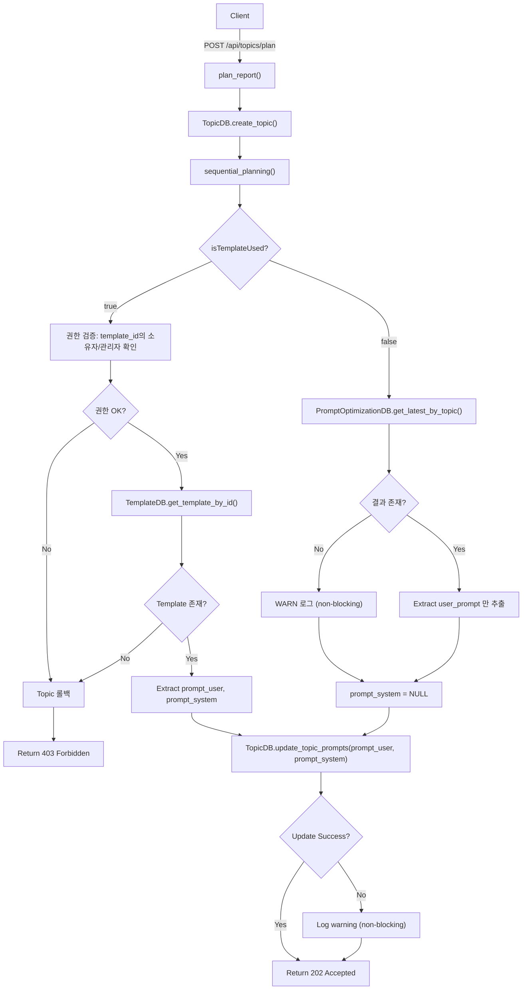

# Unit Spec: /api/topics/plan 기능 개선 - prompt_user/prompt_system 조건부 저장

## 1. 요구사항 요약

- **목적:** `/api/topics/plan` 엔드포인트에서 `isTemplateUsed` 값에 따라 다른 prompt 데이터를 Topic에 업데이트하는 기능 추가
- **유형:** ☑ 변경 (plan_report 함수 수정)
- **핵심 요구사항:**
  - 입력:
    - `PlanRequest` (topic, template_id, is_template_used, is_web_search)
    - 인증된 사용자 (current_user)
  - 출력:
    - HTTP 202 Accepted (기존)
    - Topic에 prompt_user, **prompt_system 모두** 저장됨 (신규)
  - 조건부 로직:
    - `isTemplateUsed == true`: templates 테이블에서 prompt_user, prompt_system 조회 → Topic에 저장 (권한 검증 필수)
    - `isTemplateUsed == false`: prompt_optimization_result 테이블에서 user_prompt, output_format 조회 → Topic.prompt_user, Topic.prompt_system 저장
  - 예외/제약:
    - 토픽 생성 실패 시 기존 롤백 로직 유지
    - Template 미존재 또는 권한 없음 시 404/403 + 롤백
    - PromptOptimization 미존재 시 WARN 로그만 (non-blocking)
    - prompt 저장 실패는 non-blocking (warn 로그만)
    - 응답시간 제약: 2초 이내 (기존)
  - 처리흐름 요약:
    1. Topic 생성
    2. Sequential Planning 호출 (기존)
    3. **NEW**: isTemplateUsed 값에 따라 prompt 데이터 조회 및 접근제어 검증
    4. **NEW**: Topic에 prompt_user, prompt_system 저장

---

## 2. 구현 대상 파일

| 구분 | 경로                                          | 설명                                                          |
| ---- | --------------------------------------------- | ------------------------------------------------------------- |
| 변경 | backend/app/routers/topics.py                 | plan_report() 함수: 주석 코드 활성화 + 조건부 prompt 저장 로직 추가 |
| 참조 | backend/app/database/template_db.py           | TemplateDB.get_template_by_id() 메서드 참고                  |
| 참조 | backend/app/database/prompt_optimization_db.py | PromptOptimizationDB.get_latest_by_topic() 메서드 참고       |
| 참조 | backend/app/database/topic_db.py              | TopicDB.update_topic_prompts() 메서드 참고                   |

---

## 3. 동작 플로우 (Mermaid)



---

## 4. 테스트 계획

### 4.1 원칙

- **테스트 우선(TDD)**: 아래 항목 중 P0 테스트부터 구현 후 코드 작성
- **계층별 커버리지**: Unit (Template/PromptOptimization 조회) → Integration (조건부 저장) → API (전체 흐름)
- **독립성/재현성**: 데이터베이스는 pytest fixture로 임베디드 DB 사용
- **판정 기준**: HTTP 상태코드, Topic.prompt_user/prompt_system 실제 저장 여부, 로그 확인

### 4.2 테스트 항목

| TC ID       | 계층        | 시나리오                              | 목적                                      | 입력/사전조건                                              | 기대결과                                                      |
| ----------- | ----------- | ------------------------------------- | ----------------------------------------- | ---------------------------------------------------------- | ------------------------------------------------------------- |
| TC-001      | Integration | isTemplateUsed=true (권한 OK)         | 템플릿에서 prompt 조회 & 저장            | template_id=1 (소유자), is_template_used=true             | Topic.prompt_user/system = Template.prompt_user/system     |
| TC-002      | Integration | isTemplateUsed=false (최적화 기반)    | PromptOptimization에서 prompt 조회 & 저장 | topic 생성 후 is_template_used=false, sequential_planning 완료 | Topic.prompt_user = PromptOptimization.user_prompt, prompt_system = PromptOptimization.output_format |
| TC-003      | Integration | 템플릿 미존재 (404)                   | 오류 처리 & 롤백 검증                     | template_id=999, is_template_used=true                    | Topic 롤백, 404 NOT_FOUND 반환                              |
| TC-004      | Integration | 템플릿 권한 없음 (403)                | 접근제어 & 롤백 검증                      | template_id=다른사용자템플릿, is_template_used=true        | Topic 롤백, 403 FORBIDDEN 반환                              |
| TC-005      | Integration | PromptOptimization 결과 없음          | NULL 처리 & 로깅                        | topic 생성 후 is_template_used=false, prompt_opt 미저장    | Topic.prompt_user = NULL, prompt_system = NULL, WARN 로그   |
| TC-006      | API         | 전체 흐름 (isTemplateUsed=true)       | 엔드포인트 & 응답 검증                    | POST /api/topics/plan {topic:"AI", template_id:1, is_template_used:true} | 202 Accepted, topic_id 반환, Topic.prompt_user/system 저장됨 |
| TC-007      | API         | 전체 흐름 (isTemplateUsed=false)      | 엔드포인트 & 응답 검증                    | POST /api/topics/plan {topic:"AI", is_template_used:false} | 202 Accepted, topic_id 반환, Topic.prompt_user, prompt_system 저장 |
| TC-008      | Unit        | prompt_user/system 필드 검증          | Pydantic 모델 스키마 확인                | UPDATE topics SET prompt_user=?, prompt_system=?           | 필드 타입: Optional[str], 길이 제약 없음                     |
| TC-009      | Unit        | 응답시간 검증                         | 2초 제약 준수 확인                       | 프로필링 시작 후 plan_report() 호출                         | elapsed_time < 2000ms                                       |

---

## 5. 에러 처리 시나리오

### 5.1 Template 권한 없음 (403 FORBIDDEN)

**조건:** `isTemplateUsed == true && template_id != None && Template 소유자 != current_user && current_user가 관리자 아님`

**처리:**
- Status: `403 FORBIDDEN`
- Error Code: `ACCESS_DENIED`
- Message: `"이 템플릿에 접근할 수 없습니다."`
- Action: Topic 롤백 (TopicDB.delete_topic)
- Log: `WARNING "[PLAN] Access denied - template_id={id}, user_id={user_id}"`

### 5.2 Template 미존재 (404 NOT_FOUND)

**조건:** `isTemplateUsed == true && template_id != None && TemplateDB.get_template_by_id() 반환 None`

**처리:**
- Status: `404 NOT_FOUND`
- Error Code: `RESOURCE_NOT_FOUND`
- Message: `"템플릿을 찾을 수 없습니다."`
- Action: Topic 롤백 (TopicDB.delete_topic)
- Log: `WARNING "[PLAN] Template not found - template_id={id}"`

### 5.3 PromptOptimization 결과 없음

**조건:** `isTemplateUsed == false && PromptOptimizationDB.get_latest_by_topic() 반환 None`

**처리:**
- Status: `202 Accepted` (기존 대로, non-blocking)
- Log: `WARNING "[PLAN] PromptOptimization result not found - topic_id={id}"`
- Action: Topic.prompt_user = NULL, Topic.prompt_system = NULL, 계속 진행

### 5.4 prompt 저장 실패 (DB 오류)

**조건:** `TopicDB.update_topic_prompts() 실패 (DB lock, 트랜잭션 실패 등)`

**처리:**
- Status: `202 Accepted` (기존 대로, non-blocking)
- Log: `WARNING "[PLAN] Update topic prompts failed (non-blocking) - topic_id={id}, error={err}"`
- Action: 계속 진행, 클라이언트는 topic_id 반환받음

---

## 6. 기술 선택 사항

### 6.1 조건부 로직 위치

**선택:** `plan_report()` 함수 내부 (라우터 계층)

**이유:**
- isTemplateUsed는 API 요청의 비즈니스 로직 제어 파라미터
- 템플릿/최적화 결과 조회는 API 응답과 함께 처리되어야 함
- sequential_planning()은 이미 neutral한 함수로 분리되어 있음

### 6.2 Data Source 우선순위

```
Case 1: isTemplateUsed == true
  1. Template 권한 검증 (owner_id == user_id 또는 admin 확인)
  2. Template 존재 여부 확인
  3. prompt_user   = templates.prompt_user
  4. prompt_system = templates.prompt_system

Case 2: isTemplateUsed == false
  1. PromptOptimizationDB.get_latest_by_topic() 조회 (topic_id 기반)
  2. prompt_user   = prompt_optimization_result.user_prompt (최신)
  3. prompt_system = prompt_optimization_result.output_format (최신)
```

### 6.3 권한 검증 로직

**조건:** `isTemplateUsed == true` 일 때만 수행

```python
# 권한 검증 순서
1. Template 조회
2. IF template is None → 404 RESOURCE_NOT_FOUND
3. IF template.user_id != current_user.id AND current_user.role != "admin" → 403 ACCESS_DENIED
4. ELSE → 계속 진행
```

---

## 7. 가정사항

- ✅ Topic 모델에 이미 `prompt_user`, `prompt_system` 필드 존재 (v2.8 이상)
- ✅ TopicDB.update_topic_prompts() 메서드 이미 구현됨
- ✅ TemplateDB.get_template_by_id() 메서드 이미 구현됨
- ✅ PromptOptimizationDB.get_latest_by_topic() 메서드 이미 구현됨
- ✅ sequential_planning()에서 이미 prompt_user/system 반환 (isTemplateUsed=false 경우)
- ✅ Template 생성 시 prompt_user, prompt_system 저장되어 있음
- 사용자 ID는 항상 유효한 상태로 전달됨
- template_id는 이미 권한 검증됨 (GET /api/templates/{id}에서 처리)

---

## 8. 사용자 요청 프롬프트

### Original User Request (1차)

```
기능 수정 요청: /api/topics/plan 기능 개선

[요구사항]
- topic에 컬럼중 prompt_user, prompt_system 업데이트
- isTemplateUsed 의 값에 따라 조회해오는 데이터 달라짐.
  isTemplateUsed: true (templates DB 의 prompt_user, prompt_system )
  isTemplateUsed: false (prompt_optimization_result의 user_prompt, output_format)
```

### 최종 명확화 (통합)

- ✅ isTemplateUsed=true: templates 테이블에서 prompt_user, **prompt_system 모두** 조회해서 Topic에 저장
- ✅ isTemplateUsed=false: prompt_optimization_result 테이블에서 user_prompt, output_format 조회해서 Topic.prompt_user, Topic.prompt_system에 저장
- ✅ Template 접근제어: 권한 검증 필수 (소유자/관리자만 사용 가능)
  - Template 미존재 → 404 NOT_FOUND + Topic 롤백
  - 권한 없음 → 403 FORBIDDEN + Topic 롤백
- ✅ PromptOptimization 미존재: WARN 로그 + non-blocking (202 계속 반환)
- ✅ 조건부 저장 위치: plan_report() 함수 (sequential_planning() 호출 후)
- ✅ 기존 exception handling & rollback 로직 유지
- ✅ prompt 저장 실패는 non-blocking (202 Accepted 계속 반환)

---

## 9. 구현 체크리스트

### Phase 1: 테스트 작성 (TDD)

- [ ] TC-001 작성: isTemplateUsed=true (권한 OK) 템플릿 조회 & 저장
- [ ] TC-002 작성: isTemplateUsed=false 최적화 결과 조회 & 저장
- [ ] TC-003 작성: 템플릿 미존재 (404) & 롤백
- [ ] TC-004 작성: 템플릿 권한 없음 (403) & 롤백
- [ ] TC-005 작성: PromptOptimization 결과 없음 & WARN 로깅
- [ ] TC-006 작성: API 전체 흐름 (template)
- [ ] TC-007 작성: API 전체 흐름 (optimization)
- [ ] TC-008 작성: 필드 타입 & 스키마 검증
- [ ] TC-009 작성: 응답시간 < 2초 검증
- [ ] 모든 테스트 실행 및 FAIL 확인

### Phase 2: 코드 구현

- [ ] plan_report() 함수 수정 (sequential_planning() 호출 후 new section)
  - [ ] isTemplateUsed=true 경로:
    - [ ] Template 권한 검증 (owner_id == user_id 또는 admin)
    - [ ] Template 미존재 → 404 + Topic 롤백
    - [ ] 권한 없음 → 403 + Topic 롤백
    - [ ] TemplateDB.get_template_by_id() 호출
    - [ ] prompt_user, prompt_system 추출
  - [ ] isTemplateUsed=false 경로:
    - [ ] PromptOptimizationDB.get_latest_by_topic() 호출
    - [ ] prompt_user 추출, prompt_system = NULL
    - [ ] 결과 없음 → WARN 로그 + 계속 진행
  - [ ] TopicDB.update_topic_prompts(prompt_user, prompt_system) 호출
  - [ ] 에러 처리 & 로깅 추가
    - [ ] 각 경로별 WARN/ERROR 로깅
    - [ ] 응답시간 측정 로깅

### Phase 3: 검증

- [ ] TC-001 ~ TC-009 모두 통과
- [ ] 기존 테스트 회귀 검증 (topics 테스트 전체)
- [ ] 커버리지 확인 (plan_report 함수 100% 커버)
- [ ] 수동 테스트: curl로 3가지 경로 (template-OK, template-403, template-404, optimization) 동작 확인

### Phase 4: 문서화 & 커밋

- [ ] CLAUDE.md 업데이트 (v2.9 변경사항 추가)
  - [ ] 신규 엔드포인트 및 기능 설명
  - [ ] 접근제어 로직 설명
  - [ ] prompt_user/system 저장 로직
- [ ] git commit with Spec reference
  ```bash
  git add backend/doc/specs/20251127_api_topics_plan_prompt_enhancement.md
  git add backend/app/routers/topics.py
  git add backend/tests/test_topics.py
  git commit -m "feat: /api/topics/plan에 조건부 prompt_user/system 저장 & 접근제어 추가 (v2.9)

  - isTemplateUsed=true: templates DB에서 prompt_user, prompt_system 조회 & 저장
  - isTemplateUsed=false: prompt_optimization_result에서 user_prompt만 조회 & 저장
  - Template 권한 검증 추가 (owner_id == user_id 또는 admin)
  - Template 미존재/권한 없음 시 404/403 + Topic 롤백
  - PromptOptimization 미존재 시 WARN 로그 + non-blocking (202 계속 반환)

  Spec: backend/doc/specs/20251127_api_topics_plan_prompt_enhancement.md
  Tests: 9 test cases added (TC-001~TC-009)"
  ```

---

## 10. 참고자료

- `backend/app/routers/topics.py:plan_report()` - 현재 구현 (주석 코드 포함)
- `backend/app/utils/sequential_planning.py:_two_step_planning()` - prompt 생성 로직
- `backend/app/database/template_db.py:TemplateDB.get_template_by_id()` - 템플릿 조회
- `backend/app/database/prompt_optimization_db.py:PromptOptimizationDB.get_latest_by_topic()` - 최적화 결과 조회
- `backend/app/database/topic_db.py:TopicDB.update_topic_prompts()` - prompt 업데이트
- `backend/doc/specs/20251112_sequential_planning_with_sse_progress.md` - sequential_planning 스펙 참고
- `backend/doc/specs/20251127_prompt_optimization_enhancement.md` - v2.8 prompt_optimization 스펙 참고

---

**생성일:** 2025-11-27
**버전:** 2.0 (피드백 반영)
**상태:** ✅ 재검토 대기

---

## 최종 요약 (v2.0 변경사항)

### 반영된 피드백

1. ✅ **prompt_system 저장**: isTemplateUsed=false 경우 prompt_optimization_result의 output_format을 prompt_system으로 저장

2. ✅ **output_format 처리**: v2.8 (20251127_prompt_optimization_enhancement.md)에서 prompt_optimization_result에 저장된 output_format을 topics.plan_report()에서 추출해서 Topic.prompt_system으로 저장

3. ✅ **접근제어 추가**: Template 사용 시 권한 검증 로직 추가
   - Template 소유자/관리자만 사용 가능
   - Template 미존재 → 404 NOT_FOUND + Topic 롤백
   - 권한 없음 → 403 FORBIDDEN + Topic 롤백
   - 테스트 케이스: TC-001, TC-003, TC-004 (권한 검증 관련)

### 핵심 로직

```
POST /api/topics/plan
  ↓
1. Topic 생성
2. sequential_planning() 호출 (prompt_user, prompt_system 생성)
3. isTemplateUsed 값에 따라 분기:

   Case A: isTemplateUsed == true
   ├─ 권한 검증 (template.user_id == user_id 또는 admin)
   ├─ Template 존재 확인
   ├─ template.prompt_user, template.prompt_system 조회
   ├─ TopicDB.update_topic_prompts(prompt_user, prompt_system) 저장

   Case B: isTemplateUsed == false
   ├─ PromptOptimizationDB.get_latest_by_topic() 조회
   ├─ optimization_result.user_prompt, optimization_result.output_format 추출
   ├─ TopicDB.update_topic_prompts(prompt_user=user_prompt, prompt_system=output_format) 저장

4. Return 202 Accepted
```

### 데이터 흐름

**isTemplateUsed=true (Template 기반)**
```
templates.prompt_user     → Topic.prompt_user
templates.prompt_system   → Topic.prompt_system
```

**isTemplateUsed=false (최적화 기반)**
```
prompt_optimization_result.user_prompt    → Topic.prompt_user
prompt_optimization_result.output_format  → Topic.prompt_system
```

