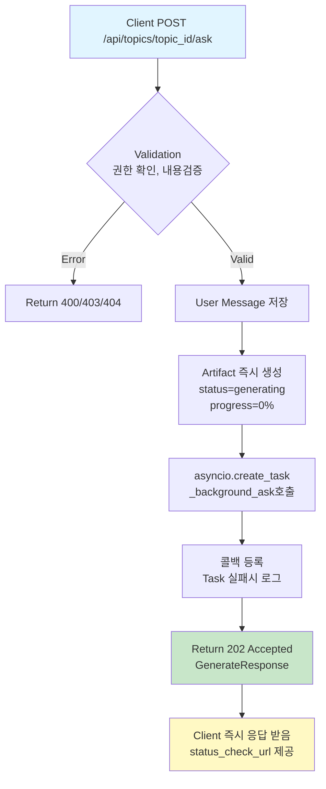
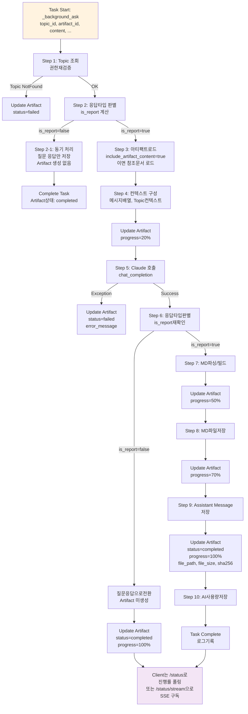
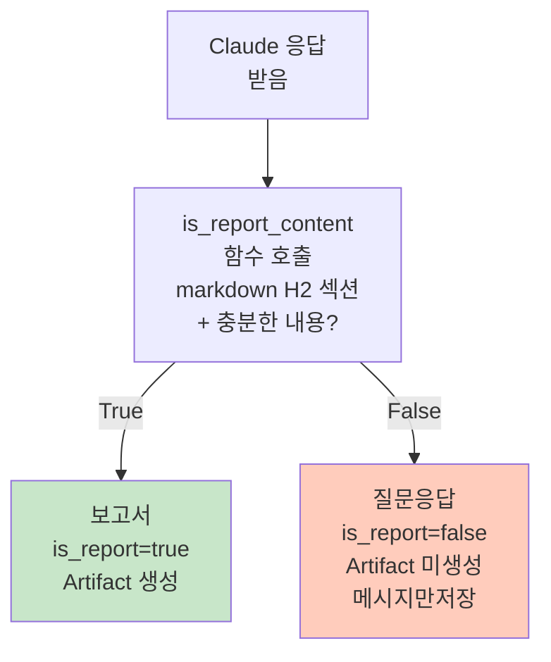

# Unit Spec: POST /api/topics/:topic_id/ask API 백그라운드 변환

## 1. 요구사항 요약

- **목적:** `/api/topics/:topic_id/ask` API를 백그라운드 asyncio task 방식으로 전환하여 긴 응답 시간 문제 해결 및 사용자가 생성 진행률을 `/status` 엔드포인트로 모니터링할 수 있게 함
- **유형:** ☐ 신규 ☑️ 변경
- **핵심 요구사항:**
  - 입력: `POST /api/topics/{topic_id}/ask` 요청 (AskRequest: content, artifact_id, include_artifact_content, max_messages, is_web_search)
  - 출력: 202 Accepted + GenerateResponse 모델 (topic_id, status="answering", message, status_check_url)
  - 백그라운드 처리: `_background_ask()` 함수에서 실제 AI 호출 및 Artifact 생성
  - 상태 추적: Artifact 상태 업데이트로 진행률 모니터링 (0% → 50% → 100%)
  - 조건: `is_report=true`인 경우만 백그라운드 처리 (질문 응답은 동기 처리 유지)
  - 선택사항: `include_artifact_content=true`인 경우만 기존 Artifact 내용 주입 처리

---

## 2. 구현 대상 파일

| 구분 | 경로 | 설명 |
| ---- | ---- | ---- |
| 변경 | backend/app/routers/topics.py | `ask()` 함수 로직 변경: 202 반환, Artifact 즉시 생성, task 생성 |
| 신규 | backend/app/routers/topics.py (내부) | `_background_ask()` 함수 신규: 기존 ask 로직 이동 + 상태 업데이트 |
| 참조 | backend/app/routers/topics.py | `_background_generate_report()` 참고: 백그라운드 task 패턴, 예외 처리, 콜백 |
| 참조 | backend/app/utils/generation_status.py | 상태 관리 메커니즘 참고 |
| 참조 | backend/app/routers/topics.py | `generate_report_background()` 참고: 202 응답, Artifact 생성 순서 |

---

## 3. 동작 플로우 (Mermaid)

### 3.1 ask() 엔드포인트 - 즉시 반환 (동기)



### 3.2 _background_ask() 함수 - 백그라운드 처리 (비동기)



### 3.3 is_report 판별 로직 (핵심)



---

## 4. 테스트 계획

### 4.1 원칙

- **테스트 우선(TDD)**: 이 섹션의 항목을 먼저 구현하고 코드 작성
- **계층별 커버리지**: Unit (함수 로직) → Integration (_background_ask 전체) → API (ask 엔드포인트)
- **독립성/재현성**: Claude 호출, DB, 파일 I/O는 모킹 또는 임베디드 DB 사용
- **판정 기준**: HTTP 상태코드, 응답 스키마, Artifact 상태 변화, 저장된 파일 검증

### 4.2 테스트 항목

| TC ID | 계층 | 시나리오 | 목적(검증 항목) | 입력/사전조건 | 기대 결과 | 검증 포인트 |
| ----- | ---- | -------- | -------------- | ------------ | -------- | --------- |
| TC-001 | API | ask() 즉시 응답 (동기 반환) | 202 Accepted 반환 및 응답 시간 < 500ms | 유효한 topic_id, AskRequest | HTTP 202, GenerateResponse 모델 (topic_id, status="answering", status_check_url) | 응답시간 < 500ms, Content-Type: application/json, Artifact 즉시 생성됨 (status=generating) |
| TC-002 | Unit | _background_ask: is_report=true 경로 (보고서) | 보고서 생성 시 Artifact 업데이트 및 MD 파일 저장 | Mock Claude 응답 (H2 섹션 + 내용), DB/파일 모킹 | Artifact status: generating→50%→70%→100%→completed, MD 파일 생성, Message 저장 | 진행률 단계별 업데이트 확인, file_path/file_size/sha256 필드 채워짐 |
| TC-003 | Unit | _background_ask: is_report=false 경로 (질문응답) | 질문응답 시 Artifact 미생성 | Mock Claude 응답 (H2 섹션 없음/짧은 내용), DB/파일 모킹 | Artifact status: completed, Message 저장, 파일 생성 안됨 | Message만 저장됨, Artifact 파일정보(file_path) NULL |
| TC-004 | API | 권한 검증 실패 (400 before task) | 유효하지 않은 topic_id 또는 권한 없음 | 존재하지 않는 topic_id 또는 다른 사용자 topic | HTTP 404/403, error_response | Artifact 생성 안됨, 즉시 에러 반환 |
| TC-005 | Unit | include_artifact_content=true (참조문서 포함) | 기존 Artifact 내용 주입 및 컨텍스트 구성 | Mock 참조 Artifact 파일, artifact_id 지정 | Claude에 전달되는 컨텍스트에 참조문서 내용 포함 | claude_messages 배열에 artifact 내용 주입 확인 |
| TC-006 | Unit | include_artifact_content=false (참조문서 미포함) | 참조문서 내용 미주입 | artifact_id 지정하지 않음 또는 include_artifact_content=false | Claude에 전달되는 컨텍스트에 참조문서 미포함 | claude_messages 배열에 artifact 내용 없음 |
| TC-007 | Unit | max_messages 필터링 | max_messages 파라미터로 컨텍스트 제한 | max_messages=3, topic 내 메시지 10개 이상 | user_messages 최대 3개만 포함 | len(user_messages) <= max_messages 검증 |
| TC-008 | API | /status로 진행률 폴링 | Artifact 상태 업데이트 반영 in /status | _background_ask 실행 중 /status 조회 | status="answering", progress_percent 0-100 변화 | 여러 번 폴링 시 진행률 증가 확인 |
| TC-009 | Unit | Claude 호출 실패 (Exception) | 예외 처리 및 Artifact 상태 업데이트 | Mock Claude 호출 Exception | Artifact status: failed, error_message 채워짐, Message 저장 안됨 | ArtifactDB.update_artifact_status() 호출 확인, 롤백 검증 |
| TC-010 | Integration | 전체 흐름: ask() → _background_ask() → 완료 | 엔드-투-엔드 보고서 생성 | 유효한 요청, Mock Claude | HTTP 202 → 즉시 응답 → Artifact 상태 변화 → 최종 completed | Artifact 생성, Message 저장, 파일 저장 모두 확인 |
| TC-011 | API | 동시 다중 ask 요청 | 여러 topic의 ask 동시 처리 | 3개 topic에서 동시 ask 요청 | 각각 202 반환, 독립적 task 생성, 상호 간섭 없음 | /status로 각각 진행률 추적 가능, 최종 모두 completed |
| TC-012 | Unit | Artifact 없는 상태에서 ask (기존) | artifact_id 미지정 시 최신 MD artifact 자동 로드 | artifact_id=None | 최신 MD artifact 조회 후 참조문서 포함 | ArtifactDB.get_latest_artifact_by_kind() 호출 확인 |

---

## 5. 에러 처리 시나리오

| 에러 코드 | HTTP 상태 | 발생 시점 | 처리 방식 | 메시지 |
| -------- | -------- | -------- | ------- | ------ |
| TOPIC.NOT_FOUND | 404 | ask() Step 1 (즉시) | error_response 반환 | "토픽을 찾을 수 없습니다." |
| TOPIC.UNAUTHORIZED | 403 | ask() Step 1 (즉시) | error_response 반환 | "이 토픽에 접근할 권한이 없습니다." |
| VALIDATION.REQUIRED_FIELD | 400 | ask() Step 1 (즉시) | error_response 반환 | "입력 메시지가 비어있습니다." |
| VALIDATION.MAX_LENGTH_EXCEEDED | 400 | ask() Step 1 (즉시) | error_response 반환 | "입력 메시지가 너무 깁니다." (50,000자 한계) |
| TEMPLATE.NOT_FOUND | 404 | ask() Step 1 (즉시) | error_response 반환 | "이 토픽에는 템플릿이 지정되어 있지 않습니다." |
| ARTIFACT.NOT_FOUND | 404 | ask() Step 3 (즉시) | error_response 반환 | "지정한 아티팩트를 찾을 수 없습니다." |
| ARTIFACT.UNAUTHORIZED | 403 | ask() Step 3 (즉시) | error_response 반환 | "이 아티팩트에 접근할 권한이 없습니다." |
| ARTIFACT.INVALID_KIND | 400 | ask() Step 3 (즉시) | error_response 반환 | "MD 형식의 아티팩트만 참조할 수 있습니다." |
| MESSAGE.CONTEXT_TOO_LARGE | 400 | ask() Step 4 (즉시) | error_response 반환 | "컨텍스트 크기가 너무 큽니다." (50,000자 한계) |
| SERVER.SERVICE_UNAVAILABLE | 503 | _background_ask() Step 5 (백그라운드) | Artifact status=failed, error_message 저장 | "AI 응답 생성 중 오류가 발생했습니다." |
| ARTIFACT.CREATION_FAILED | 500 | _background_ask() Step 7 (백그라운드) | Artifact status=failed, error_message 저장 | "응답 파일 저장 중 오류가 발생했습니다." |
| SERVER.INTERNAL_ERROR | 500 | ask() 또는 _background_ask() (일반) | error_response 반환 또는 status=failed | "시스템 오류가 발생했습니다." |

### 에러 처리 상세 규칙

1. **즉시 에러** (ask() Step 1-3 시점):
   - Artifact 생성 전 발생 → 즉시 error_response 반환
   - 202 Accepted 반환 안함
   - Artifact 레코드 생성 안함

2. **백그라운드 에러** (_background_ask 실행 중):
   - Artifact status = "failed"
   - error_message 필드에 에러 내용 저장
   - completed_at 기록
   - /status 조회 시 status="failed", error_message 반환
   - 사용자는 /status로 진행 상황 확인

3. **Task 예외 처리**:
   - asyncio.create_task() 후 add_done_callback() 등록
   - Task 실패 시 ERROR 로그 기록
   - Artifact status 자동 업데이트 불가능 → _background_ask() 내부에서 try-except로 명시적 처리

---

## 6. 기술 선택 및 고려사항

### 6.1 왜 백그라운드 방식인가?

| 현재 (동기) | 개선 후 (백그라운드) |
| -------- | ----------- |
| HTTP 연결 유지 | 즉시 202 Accepted 반환 |
| 수십 초 응답 | < 500ms 응답 |
| 사용자 대기 | 폴링/SSE로 비동기 추적 |
| 타임아웃 위험 | 네트워크 안정성 향상 |

### 6.2 is_report 판별 (기존 로직 재사용)

- 기존 `is_report_content()` 함수 재사용
- 보고서: H2 섹션 + 충분한 내용 (1000자 이상) → MD 파일 생성
- 질문응답: 추가 정보 요청 또는 짧은 응답 → 메시지만 저장

### 6.3 Artifact 상태 진행률

```
Step 1: Validation (0%)
  ↓
Step 2: User Message Save (0%)
  ↓
Step 4: Reference Artifact Load (20%)  ← 백그라운드 시작
  ↓
Step 5: Claude API Call (50%)
  ↓
Step 7: Markdown Build (70%)
  ↓
Step 8: File Save (85%)
  ↓
Step 9: Complete (100%)
```

### 6.4 include_artifact_content 처리

- `include_artifact_content=true` AND `artifact_id` 또는 최신 MD artifact 존재 → 참조문서 주입
- `include_artifact_content=false` → 참조문서 주입 안함
- 파일 로드 실패 → error_response (백그라운드 아님, ask() 내부에서 처리)

---

## 7. 구현 상세 (아키텍처)

### 7.1 ask() 함수 구조 (변경)

```python
@router.post("/{topic_id}/ask", ...)
async def ask(...):
    """
    Step 0: 권한 검증 (즉시)
    Step 1: User Message 저장 (즉시)
    Step 2: 응답타입 사전판별 불가 → 백그라운드에서 판별
    Step 3: Artifact 즉시 생성 (status=generating, progress=0%)
    Step 4: asyncio.create_task(_background_ask) 호출
    Step 5: 콜백 등록 (Task 실패 시 로그)
    Step 6: 202 Accepted 반환 + GenerateResponse
    """
    # 1. Validation (권한, 내용)
    # 2. User Message 저장
    # 3. Artifact 생성 (MD kind)
    # 4. _background_ask Task 생성
    # 5. 콜백 등록
    # 6. 202 반환
```

### 7.2 _background_ask() 함수 구조 (신규)

```python
async def _background_ask(
    topic_id: int,
    artifact_id: int,
    user_message_id: int,
    content: str,
    artifact_id: Optional[int],
    include_artifact_content: bool,
    max_messages: Optional[int],
    is_web_search: bool,
    user_id: str
):
    """
    백그라운드에서 실제 처리

    Step 1: Topic 재조회
    Step 2: is_report 판별 준비
    Step 3: 아티팩트 로드 (include_artifact_content=true)
    Step 4: 컨텍스트 구성
    Step 5: Claude 호출
    Step 6: is_report 재판별
    Step 7: 보고서면 MD 파싱/빌드
    Step 8: MD 파일 저장
    Step 9: Message/Artifact 저장
    Step 10: AI 사용량 저장
    """
    try:
        # Exception handling with Artifact status update
    except Exception as e:
        # status=failed, error_message 저장
```

### 7.3 GenerateResponse 모델 재사용

기존 `GenerateResponse`를 ask() 202 응답으로도 사용:

```python
class GenerateResponse(BaseModel):
    topic_id: int
    status: str  # "answering" for ask, "generating" for generate
    message: str
    status_check_url: str
```

---

## 8. 사용자 요청 프롬프트 기록

### Original User Request (1차)

```
/api/topics/:topic_id/ask API 기능 개선 요청

현재 프로젝트를 분석 후 요구사항에 맞게 수정 할 수 있는지 점검해줘.

[요구사항]
- 해당 api 도 /api/topics/:topic_id/generate 처럼 백그라운드로 전환 후 "_background_generate_report" 를 사용가능한지 여부 확인.
- 해당 부분 이외에 다른 부분은 기능 유지
- 백그라운드로 작업하는 중에는 /api/topics/:topic_id/status 와 /api/topcis/:topic_id/status/stream 에서 확인 할 수 있어야함.
```

### Claude 분석 응답

```
✅ 가능합니다! 다음과 같이 개선할 수 있습니다:

1. ask API를 백그라운드 방식으로 전환 가능
2. _background_generate_report 직접 재사용 불가 (ask는 보고서 + 질문응답 처리)
3. 새로운 _background_ask 함수 생성 권장
4. /status, /status/stream 엔드포인트 그대로 활용
```

### User Clarification/Modification (2차)

```
[확인 사항 회신]:
1. include_artifact_content 가 true 일 경우에만 유지 필요. (optional 로 해도 무관 니가  더좋은 방법으로 선택)
2. /api/topics/:topic_id/generate 에서 사용하는 상태 진행과 비슷하게 유지.
3. is_report=true 일 경우만 유지.
```

### 최종 명확화 (통합)

- ✅ `include_artifact_content=true`인 경우만 참조문서 주입 처리 유지
- ✅ `/generate` API의 Artifact 상태 진행 방식 (0% → 50% → 70% → 100%) 동일하게 적용
- ✅ `is_report=true`인 경우만 백그라운드 처리 (질문응답은 동기/메시지만)
- ✅ ask() 함수는 202 Accepted 즉시 반환
- ✅ _background_ask() 함수 신규 생성
- ✅ 기존 기능 유지: artifact_id 선택, max_messages 필터링, is_web_search 옵션

---

**요청 일시:** 2025-11-27

**컨텍스트/배경:**
- 프로젝트: HWP Report Generator v2.9.0
- 관련 엔드포인트: /api/topics/:topic_id/generate (이미 백그라운드 방식), /api/topics/:topic_id/ask (현재 동기)
- 참고 기능: Sequential Planning (v2.4), Background Generation with Event Loop Non-Blocking (v2.5)

---

## 9. 구현 체크리스트

### 9.1 코드 작성 전

- [ ] Unit Spec 문서 검토 및 사용자 승인 ✅ (현재)
- [ ] 기존 tests 실행 (regression 확인) → `pytest backend/tests/test_topics.py -v`
- [ ] `_background_generate_report()` 코드 검토 (패턴 참고)
- [ ] generation_status.py 메커니즘 이해

### 9.2 테스트 작성 (TDD)

- [ ] `backend/tests/test_ask_background.py` 생성
- [ ] TC-001 ~ TC-012 모두 구현
- [ ] Mock 설정: Claude 호출, DB CRUD, 파일 I/O
- [ ] 모든 테스트 실행: `pytest backend/tests/test_ask_background.py -v`

### 9.3 코드 구현

- [ ] ask() 함수 리팩토링 (Step 1-3까지만, 나머지는 _background_ask로 이동)
- [ ] _background_ask() 함수 신규 (기존 ask의 Step 4-10 이동)
- [ ] Artifact 생성 로직 ask() 내에 추가
- [ ] asyncio.create_task() 호출 + 콜백 등록
- [ ] 202 Accepted 응답 + GenerateResponse 사용

### 9.4 기존 기능 검증

- [ ] 모든 기존 tests 통과 (regression)
- [ ] /generate API 정상 작동 (혼입 확인)
- [ ] /status, /status/stream 정상 작동

### 9.5 문서 및 커밋

- [ ] CLAUDE.md 버전 업데이트 (v2.10 추가)
- [ ] 신규 엔드포인트/함수 설명 추가
- [ ] 깃 커밋: Unit Spec + 코드 + 테스트
  ```bash
  git add backend/doc/specs/20251127_ask_api_background_conversion.md
  git add backend/app/routers/topics.py
  git add backend/tests/test_ask_background.py
  git commit -m "feat: POST /api/topics/:topic_id/ask 백그라운드 전환 (v2.10)

  - ask() 함수: 즉시 202 Accepted 반환
  - _background_ask() 함수: 실제 처리 (Task 기반)
  - Artifact 상태 추적: 0% → 100%
  - 조건: include_artifact_content=true인 경우 참조문서 주입, is_report=true인 경우만 Artifact 생성

  Spec: backend/doc/specs/20251127_ask_api_background_conversion.md"
  ```

---

## 10. 가정사항

1. **Claude API 호출 시간**: 평균 5-20초 → 백그라운드로 이동하여 HTTP 타임아웃 방지
2. **Artifact 상태 진행**: /status 폴링 또는 /status/stream SSE로 추적 가능
3. **is_report 판별**: 기존 `is_report_content()` 함수 로직 유지 (H2 섹션 + 내용 검증)
4. **database.artifact**: `update_artifact_status()` 메서드 이미 구현됨 (v2.5 기준)
5. **error_response()**: ErrorCode 상수 사용 (security, logging 일관성)
6. **asyncio 환경**: FastAPI + uvicorn 환경에서 asyncio.create_task() 정상 작동
7. **메모리 관리**: Task 생성 후 메모리 누수 없음 (콜백으로 정리)

---

## 11. 참고자료

- `backend/app/routers/topics.py`:
  - `generate_report_background()` (line 1222-1344): 202 반환, Artifact 생성 패턴
  - `_background_generate_report()` (line 1834-2064): 백그라운드 처리 로직, 예외 처리
  - `ask()` (line 555-1044): 현재 ask 로직 (이동할 부분)
- `backend/app/utils/generation_status.py`: Artifact 상태 관리 메커니즘
- `backend/doc/specs/20251114_fix_background_generation_event_loop_blocking.md`: v2.5 백그라운드 기법
- `backend/doc/Backend_UnitSpec.md`: Unit Spec 템플릿
