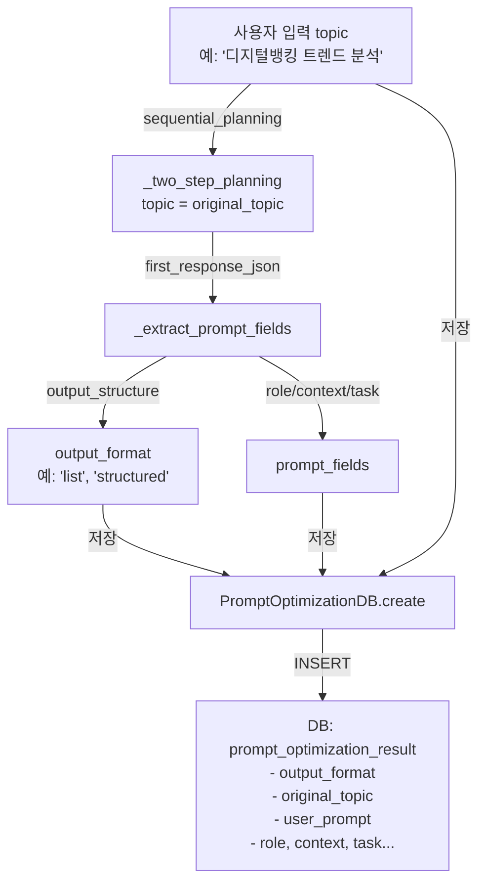

# Unit Spec: prompt_optimization_result에 신규 컬럼 추가 (output_format, original_topic)

**버전:** 1.0 (최종)
**작성일:** 2025-11-27
**상태:** ✅ 승인 완료

---

## 1. 요구사항 요약

**Purpose:**
프롬프트 최적화 결과 저장 시 Claude의 응답 구조 정보(`output_format`)와 원래 사용자 요청(`original_topic`)을 함께 기록하여 데이터 분석에 활용

**Type:** DB 스키마 확장

**Core Requirements:**
- ✅ `prompt_optimization_result` 테이블에 2개 신규 컬럼 추가:
  - `output_format` (TEXT, nullable): Claude 응답 구조 정보
  - `original_topic` (TEXT, nullable): 사용자 원본 입력 주제
- ✅ `PromptOptimizationDB.create()`에 2개 파라미터 추가
- ✅ `sequential_planning._two_step_planning()`에서 두 값 저장
- ✅ `output_format` 미저장 시 사용자에게 안내 (로깅/응답)
- ✅ Pydantic 모델에 신규 필드 추가
- ✅ **기존 데이터는 유지 (NULL로 남음, 마이그레이션 없음)**

---

## 2. 구현 대상 파일

| 파일 | 변경 | 설명 |
|------|------|------|
| backend/app/database/connection.py | CHANGE | 신규 컬럼 마이그레이션 추가 |
| backend/app/database/prompt_optimization_db.py | CHANGE | create() 메서드 파라미터 & INSERT 쿼리 수정 |
| backend/app/utils/sequential_planning.py | CHANGE | _two_step_planning()에서 output_format, original_topic 전달 |
| backend/app/models/prompt_optimization.py | CHANGE | Create/Response 모델에 필드 추가 |
| backend/tests/test_prompt_optimization.py | CHANGE | 테스트 케이스 업데이트 |

---

## 3. 데이터 모델 (흐름도)



### 데이터 흐름 상세

```
1. 입력 (sequential_planning._two_step_planning)
   topic = "디지털뱅킹 트렌드 분석"  ← original_topic 저장

2. 첫 번째 API 호출 (Advanced Role Planner)
   first_response_json = {
       "output_structure": "list",  ← output_format 저장
       "role": "시니어 분석가",
       "context": "금융 시장",
       ...
   }

3. 필드 추출
   prompt_fields = _extract_prompt_fields(first_response_json)

4. DB 저장
   PromptOptimizationDB.create(
       original_topic=topic,  ✅ NEW
       output_format=prompt_fields.get("output_format"),  ✅ NEW
       user_prompt=prompt_user,  (기존)
       ...
   )

5. 저장 결과
   prompt_optimization_result 행 생성:
   {
       id: 1,
       topic_id: 10,
       user_id: 5,
       original_topic: "디지털뱅킹 트렌드 분석",  ✅ NEW
       output_format: "list",  ✅ NEW
       user_prompt: "## 선택된 역할: ...",
       role: "시니어 분석가",
       context: "금융 시장",
       task: "요청 정리",
       ...
   }
```

---

## 4. 기술 구현 상세

### 4-1. DB 스키마 변경 (connection.py)

**위치:** `init_db()` 함수, 기존 prompt_optimization_result 마이그레이션 블록 다음 (Line 299 이후)

**코드 추가:**
```python
# prompt_optimization_result 테이블 마이그레이션: output_format, original_topic 컬럼 추가 (v2.8+)
for column_def in (
    "output_format TEXT DEFAULT NULL",
    "original_topic TEXT DEFAULT NULL",
):
    try:
        cursor.execute(f"ALTER TABLE prompt_optimization_result ADD COLUMN {column_def}")
    except sqlite3.OperationalError:
        pass  # 컬럼이 이미 존재하면 무시
```

**스키마 변경 후 테이블 구조:**
```sql
CREATE TABLE prompt_optimization_result (
    id INTEGER PRIMARY KEY,
    topic_id INTEGER NOT NULL,
    user_id INTEGER NOT NULL,

    -- 입력값
    user_prompt TEXT NOT NULL,
    original_topic TEXT DEFAULT NULL,  -- ✅ NEW

    -- 분석 결과
    hidden_intent TEXT,
    emotional_needs TEXT,
    underlying_purpose TEXT,
    formality TEXT,
    confidence_level TEXT,
    decision_focus TEXT,
    output_format TEXT DEFAULT NULL,  -- ✅ NEW

    -- 최적화 프롬프트
    role TEXT NOT NULL,
    context TEXT NOT NULL,
    task TEXT NOT NULL,

    -- 메타데이터
    model_name TEXT NOT NULL,
    latency_ms INTEGER DEFAULT 0,
    created_at TIMESTAMP,
    updated_at TIMESTAMP,

    FOREIGN KEY (topic_id) REFERENCES topics(id),
    FOREIGN KEY (user_id) REFERENCES users(id)
)
```

---

### 4-2. PromptOptimizationDB.create() 업데이트

**파일:** `backend/app/database/prompt_optimization_db.py`
**위치:** Line 20-35 (메서드 시그니처) + Line 104-144 (INSERT 쿼리)

**메서드 시그니처 변경:**
```python
@staticmethod
def create(
    topic_id: int,
    user_id: int,
    user_prompt: str,
    hidden_intent: Optional[str],
    role: str,
    context: str,
    task: str,
    model_name: str,
    latency_ms: int,
    emotional_needs: Optional[Dict[str, Any]] = None,
    underlying_purpose: Optional[str] = None,
    formality: Optional[str] = None,
    confidence_level: Optional[str] = None,
    decision_focus: Optional[str] = None,
    output_format: Optional[str] = None,  # ✅ NEW (위치: 16번째)
    original_topic: Optional[str] = None,  # ✅ NEW (위치: 17번째)
) -> int:
    """새 고도화 결과를 저장한다.

    파라미터:
        ... (기존)
        output_format: Claude 응답 구조 정보 (str)
        original_topic: 사용자 원본 입력 주제 (str)
    """
```

**INSERT 쿼리 변경 (cursor.execute 블록):**
```python
cursor.execute(
    """
    INSERT INTO prompt_optimization_result (
        topic_id,
        user_id,
        user_prompt,
        hidden_intent,
        emotional_needs,
        underlying_purpose,
        formality,
        confidence_level,
        decision_focus,
        output_format,  -- ✅ NEW
        original_topic,  -- ✅ NEW
        role,
        context,
        task,
        model_name,
        latency_ms,
        created_at,
        updated_at
    )
    VALUES (?, ?, ?, ?, ?, ?, ?, ?, ?, ?, ?, ?, ?, ?, ?, ?, ?, ?)
    """,
    (
        topic_id,
        user_id,
        user_prompt_value,
        hidden_intent_value,
        emotional_needs_payload,
        underlying_purpose_value,
        formality_value,
        confidence_value,
        decision_value,
        output_format or None,  -- ✅ NEW (11번째)
        original_topic or None,  -- ✅ NEW (12번째)
        role_value,
        context_value,
        task_value,
        model_name_value,
        latency_ms,
        now,
        now,
    ),
)
```

---

### 4-3. sequential_planning._two_step_planning() 업데이트

**파일:** `backend/app/utils/sequential_planning.py`
**위치:** Line 119-256 (_two_step_planning 함수)

**변경 1: PromptOptimizationDB.create() 호출 부분 (Line 220-235)**

```python
# ❌ 기존 코드
PromptOptimizationDB.create(
    topic_id=topic_id,
    user_id=int(user_id) if isinstance(user_id, str) else user_id,
    user_prompt=prompt_user,
    hidden_intent=prompt_fields.get("hidden_intent"),
    emotional_needs=emotional_needs,
    underlying_purpose=prompt_fields.get("underlying_purpose"),
    formality=emotional_needs.get("formality"),
    confidence_level=emotional_needs.get("confidence_level"),
    decision_focus=emotional_needs.get("decision_focus"),
    role=prompt_fields.get("role"),
    context=prompt_fields.get("context"),
    task=prompt_fields.get("task"),
    model_name=PROMPT_OPTIMIZATION_DEFAULT_MODEL,
    latency_ms=int((time.time() - start_time) * 1000)
)

# ✅ 수정 코드
PromptOptimizationDB.create(
    topic_id=topic_id,
    user_id=int(user_id) if isinstance(user_id, str) else user_id,
    user_prompt=prompt_user,
    hidden_intent=prompt_fields.get("hidden_intent"),
    emotional_needs=emotional_needs,
    underlying_purpose=prompt_fields.get("underlying_purpose"),
    formality=emotional_needs.get("formality"),
    confidence_level=emotional_needs.get("confidence_level"),
    decision_focus=emotional_needs.get("decision_focus"),
    output_format=prompt_fields.get("output_format"),  # ✅ NEW
    original_topic=topic,  # ✅ NEW
    role=prompt_fields.get("role"),
    context=prompt_fields.get("context"),
    task=prompt_fields.get("task"),
    model_name=PROMPT_OPTIMIZATION_DEFAULT_MODEL,
    latency_ms=int((time.time() - start_time) * 1000)
)
```

**변경 2: output_format 미저장 시 안내 로깅 추가 (Line 237-247 후)**

```python
# 기존 로깅 유지
logger.info(
    "Sequential Planning - Prompt optimization result saved - topic_id=%s",
    topic_id
)

# ✅ NEW: output_format 미저장 시 경고
if not prompt_fields.get("output_format"):
    logger.warning(
        "Sequential Planning - output_format not detected in Claude response - topic_id=%s",
        topic_id
    )
```

---

### 4-4. Pydantic 모델 업데이트

**파일:** `backend/app/models/prompt_optimization.py`

**PromptOptimizationCreate 클래스 (Line 11-46)**

```python
class PromptOptimizationCreate(BaseModel):
    """Payload for creating a new prompt optimization entry."""

    model_config = ConfigDict(from_attributes=True)

    # 기존 필드들...
    user_prompt: str = Field(..., min_length=10, max_length=5000, description="고도화 요청 사용자 입력")
    hidden_intent: Optional[str] = Field(None, description="사용자가 드러내지 않은 실제 의도")
    emotional_needs: Optional[Dict[str, Any]] = Field(None, description="사용자가 원하는 정성적 니즈")
    underlying_purpose: Optional[str] = Field(None, description="상위 목적 (전략/결정/분석 등)")
    role: str = Field(..., description="Claude에게 부여된 역할 설명")
    context: str = Field(..., description="토픽 관련 시장/업무/환경 맥락")
    task: str = Field(..., description="Claude가 수행해야 할 구조화된 작업 내용")
    model_name: str = Field(default="claude-sonnet-4-5-20250929", description="사용된 Claude 모델명")
    latency_ms: int = Field(default=0, description="Claude 호출 지연 시간 (ms)")

    # ✅ NEW 필드
    output_format: Optional[str] = Field(None, description="Claude 응답 구조 정보 (list, structured, etc.)")
    original_topic: Optional[str] = Field(None, description="사용자 원본 입력 주제")
```

**PromptOptimizationResponse 클래스 (Line 48-97)**

```python
class PromptOptimizationResponse(BaseModel):
    """Response model for prompt optimization records exposed to clients."""

    model_config = ConfigDict(from_attributes=True)

    # 기존 필드들...
    id: int = Field(..., description="고도화 결과 ID")
    topic_id: int = Field(..., description="관련 토픽 ID")
    user_id: int = Field(..., description="소유 사용자 ID")
    user_prompt: str = Field(..., min_length=10, max_length=5000, description="고도화 요청 사용자 입력")
    hidden_intent: Optional[str] = Field(None, description="사용자가 드러내지 않은 실제 의도")
    emotional_needs: Optional[Dict[str, Any]] = Field(None, description="사용자가 원하는 정성적 니즈")
    underlying_purpose: Optional[str] = Field(None, description="상위 목적 (전략/결정/분석 등)")
    role: str = Field(..., description="Claude에게 부여된 역할 설명")
    context: str = Field(..., description="토픽 관련 시장/업무/환경 맥락")
    task: str = Field(..., description="Claude가 수행해야 할 구조화된 작업 내용")
    model_name: str = Field(default="claude-sonnet-4-5-20250929", description="사용된 Claude 모델명")
    latency_ms: int = Field(default=0, description="Claude 호출 지연 시간 (ms)")
    created_at: datetime = Field(..., description="생성 날짜")
    updated_at: datetime = Field(..., description="수정 날짜")

    # ✅ NEW 필드
    output_format: Optional[str] = Field(None, description="Claude 응답 구조 정보 (list, structured, etc.)")
    original_topic: Optional[str] = Field(None, description="사용자 원본 입력 주제")
```

---

## 5. 테스트 계획

### TC-001: DB 스키마 마이그레이션

| 항목 | 내용 |
|------|------|
| **목표** | output_format, original_topic 컬럼이 정상 생성됨 |
| **테스트** | `init_db()` 호출 후 `PRAGMA table_info(prompt_optimization_result)` 검증 |
| **검증** | 두 컬럼 존재, 타입=TEXT, nullable (DEFAULT NULL) |
| **기대값** | ✅ 통과 |

**테스트 코드:**
```python
def test_db_schema_migration_output_format_original_topic():
    """DB 스키마: output_format, original_topic 컬럼 추가 확인"""
    from app.database.connection import get_db_connection, init_db

    init_db()
    conn = get_db_connection()
    cursor = conn.cursor()

    cursor.execute("PRAGMA table_info(prompt_optimization_result)")
    columns = {row[1]: row for row in cursor.fetchall()}

    assert "output_format" in columns, "output_format 컬럼 없음"
    assert "original_topic" in columns, "original_topic 컬럼 없음"
    assert columns["output_format"][2] == "TEXT", "output_format 타입 불일치"
    assert columns["original_topic"][2] == "TEXT", "original_topic 타입 불일치"

    conn.close()
```

---

### TC-002: CREATE 기본 저장

| 항목 | 내용 |
|------|------|
| **목표** | output_format, original_topic이 정상 저장됨 |
| **테스트** | 값을 지정하여 create() 호출 후 get_by_id()로 검증 |
| **기대값** | DB에 두 값이 정확히 저장됨 |

**테스트 코드:**
```python
def test_create_with_output_format_and_original_topic():
    """CRUD: output_format, original_topic 저장 확인"""
    topic_id = topic_factory().id  # 기존 fixture
    user_id = create_test_user.id

    opt_id = PromptOptimizationDB.create(
        topic_id=topic_id,
        user_id=user_id,
        user_prompt="우리 시장 전략 분석",
        hidden_intent="시장 점유율 확대",
        role="분석가",
        context="금융 시장",
        task="상세 분석",
        model_name="claude-sonnet-4-5-20250929",
        latency_ms=150,
        output_format="list",  # ✅ NEW
        original_topic="디지털뱅킹 트렌드"  # ✅ NEW
    )

    result = PromptOptimizationDB.get_by_id(opt_id)
    assert result["output_format"] == "list"
    assert result["original_topic"] == "디지털뱅킹 트렌드"
```

---

### TC-003: CREATE NULL 처리

| 항목 | 내용 |
|------|------|
| **목표** | 신규 필드 없이 호출 시 NULL로 저장되고 에러 없음 |
| **테스트** | 파라미터 없이 create() 호출 (기본값 None) |
| **기대값** | DB에 NULL로 저장, 호출 성공 |

**테스트 코드:**
```python
def test_create_without_new_fields_defaults_to_null():
    """CRUD: output_format/original_topic 없을 시 NULL 처리"""
    topic_id = topic_factory().id
    user_id = create_test_user.id

    # output_format, original_topic 파라미터 없이 호출
    opt_id = PromptOptimizationDB.create(
        topic_id=topic_id,
        user_id=user_id,
        user_prompt="샘플 프롬프트 1234567890",
        hidden_intent=None,
        role="분석가",
        context="시장",
        task="분석",
        model_name="claude-sonnet-4-5-20250929",
        latency_ms=100
    )

    result = PromptOptimizationDB.get_by_id(opt_id)
    assert result["output_format"] is None
    assert result["original_topic"] is None
```

---

### TC-004: Integration - sequential_planning 연동

| 항목 | 내용 |
|------|------|
| **목표** | _two_step_planning() 실행 후 output_format, original_topic이 DB에 저장됨 |
| **테스트** | Mock Claude 응답으로 _two_step_planning() 호출, DB 확인 |
| **기대값** | 두 필드가 저장되고 조회 가능 |

**테스트 코드:**
```python
@pytest.mark.asyncio
async def test_two_step_planning_saves_output_format_and_original_topic(monkeypatch):
    """Integration: sequential_planning과 DB 연동 확인"""
    from app.utils.sequential_planning import _two_step_planning
    from app.database.topic_db import TopicDB

    # 테스트 토픽 생성
    topic_data = TopicCreate(input_prompt="테스트 주제", language="ko")
    topic = TopicDB.create_topic(user_id=create_test_user.id, topic_data=topic_data)

    # Mock Claude 응답
    mock_first_response = json.dumps({
        "output_structure": "bullet_list",
        "role": "전문가",
        "context": "맥락",
        "task": "작업",
        "hidden_intent": "의도",
        "sections": []
    })

    async def mock_call_sequential_planning(*args, **kwargs):
        if "위 분석 결과를 참고하여" in args[0]:
            # 두 번째 호출
            return json.dumps({
                "title": "계획",
                "sections": [],
                "estimated_word_count": 1000
            })
        else:
            # 첫 번째 호출
            return mock_first_response

    monkeypatch.setattr(
        "app.utils.sequential_planning._call_sequential_planning",
        mock_call_sequential_planning
    )

    # _two_step_planning 실행
    result = await _two_step_planning(
        topic="디지털뱅킹 분석",  # ← original_topic으로 저장될 값
        user_id=str(create_test_user.id),
        is_web_search=False,
        topic_id=topic.id
    )

    # DB 확인
    opt = PromptOptimizationDB.get_latest_by_topic(topic.id)
    assert opt is not None, "저장된 결과 없음"
    assert opt["output_format"] == "bullet_list", f"output_format 불일치: {opt.get('output_format')}"
    assert opt["original_topic"] == "디지털뱅킹 분석", f"original_topic 불일치: {opt.get('original_topic')}"
```

---

### TC-005: 기존 테스트 호환성

| 항목 | 내용 |
|------|------|
| **목표** | 기존 _create_sample_optimization() 호출이 실패하지 않음 |
| **테스트** | test_prompt_optimization.py의 기존 4개 CRUD 테스트 실행 |
| **기대값** | 모든 테스트 통과 (기본값 None 처리) |

**검증:**
```bash
pytest backend/tests/test_prompt_optimization.py -v
```

**기대 결과:**
```
test_create_and_retrieve_optimization PASSED
test_create_optimization_multiple_users PASSED
test_update_optimization PASSED
test_delete_optimization PASSED
test_db_schema_migration_output_format_original_topic PASSED
test_create_with_output_format_and_original_topic PASSED
test_create_without_new_fields_defaults_to_null PASSED
test_two_step_planning_saves_output_format_and_original_topic PASSED

====== 8 passed in 2.34s ======
```

---

## 6. 에러 처리 시나리오

| 시나리오 | 에러 | 처리 방식 | 영향 |
|---------|------|---------|------|
| `output_format`이 None | None | `prompt_fields.get("output_format")` → None | 로깅 경고, DB NULL 저장 |
| `original_topic`이 None | None | 함수 파라미터 topic은 필수 | 항상 값 있음 (topic은 필수 파라미터) |
| DB 마이그레이션 중복 | `sqlite3.OperationalError` | try-except 무시 | 두 번째 init_db() 호출 시 무시 |
| INSERT 실패 | `IntegrityError` | 기존 로직 (rollback, exception) | 저장 실패, logger.exception() |

---

## 7. 추가 안내사항

### output_format 미저장 시 처리

**현황:**
- Advanced Role Planner (first_response_json)에서 "output_structure" 필드가 항상 있지는 않음
- Claude 응답 구조에 따라 미포함될 수 있음

**처리 방식:**
- ✅ None 값 허용 (nullable)
- ✅ 로깅으로 안내 (line 237-247)
- ✅ 사용자에게 응답 시 특별 안내 없음 (백그라운드 저장이므로)

### original_topic 저장 의도

**데이터 분석 활용:**
- 원래 입력된 주제와 Claude의 재분석된 prompt_user 비교
- 분석 품질 개선을 위한 원본 데이터 보존
- 향후 머신러닝/패턴 분석에 활용

---

## 8. 구현 체크리스트

### Phase 1: 준비 (0.5시간)
- [ ] Unit Spec 검토 완료 (사용자 승인)
- [ ] 테스트 케이스 구현 준비

### Phase 2: 구현 (1.5시간)
- [ ] DB 스키마 마이그레이션 코드 작성 (connection.py)
  - [ ] output_format 컬럼 추가 마이그레이션
  - [ ] original_topic 컬럼 추가 마이그레이션
  - [ ] 테스트: init_db() 호출 후 PRAGMA 검증

- [ ] PromptOptimizationDB.create() 메서드 업데이트
  - [ ] 파라미터 추가 (output_format, original_topic)
  - [ ] INSERT 쿼리 수정
  - [ ] Docstring 업데이트
  - [ ] 테스트: 값 저장 및 조회 검증

- [ ] sequential_planning._two_step_planning() 업데이트
  - [ ] PromptOptimizationDB.create() 호출 수정
  - [ ] output_format 미저장 시 로깅 추가
  - [ ] 테스트: Integration 테스트 통과

- [ ] Pydantic 모델 업데이트 (prompt_optimization.py)
  - [ ] PromptOptimizationCreate 필드 추가
  - [ ] PromptOptimizationResponse 필드 추가
  - [ ] 테스트: 모델 검증 확인

### Phase 3: 테스트 (1시간)
- [ ] TC-001: DB 스키마 마이그레이션 (단위 테스트)
- [ ] TC-002: CREATE 기본 저장 (단위 테스트)
- [ ] TC-003: CREATE NULL 처리 (단위 테스트)
- [ ] TC-004: Integration - sequential_planning 연동 (통합 테스트)
- [ ] TC-005: 기존 테스트 호환성 (회귀 테스트)
- [ ] 전체 테스트 실행: `pytest backend/tests/test_prompt_optimization.py -v`
- [ ] 전체 테스트 통과 확인: 8/8 PASSED

### Phase 4: 문서화 (0.5시간)
- [ ] CLAUDE.md v2.8 섹션 추가
  - [ ] 신규 컬럼 설명
  - [ ] 데이터 활용 예시
- [ ] 코드 주석 확인
- [ ] 테스트 주석 확인

### Phase 5: 최종 확인 (0.5시간)
- [ ] 기존 코드 영향도 확인
- [ ] 기존 테스트 모두 통과
- [ ] 로깅 메시지 적절성 확인
- [ ] Backward Compatibility 확인

### Phase 6: 커밋 (0.25시간)
- [ ] Git add 모든 파일
- [ ] Unit Spec 문서 포함 확인
- [ ] 커밋 메시지 작성: `feat: prompt_optimization_result에 output_format, original_topic 컬럼 추가 (v2.8)`
- [ ] 커밋 실행

**총 예상 시간:** 4-5시간

---

## 9. 추가 정보

| 항목 | 값 |
|------|-----|
| 버전 | v2.8 |
| 작성 날짜 | 2025-11-27 |
| 예상 개발 시간 | 4-5시간 |
| DB 마이그레이션 | Backward Compatible (기존 NULL 처리) |
| API 변경 | 없음 (내부 저장만) |
| 의존성 추가 | 없음 |
| Breaking Change | 없음 |

---

## 10. 최종 확인 사항

- ✅ **컬럼명:** `output_format`, `original_topic`
- ✅ **데이터 타입:** TEXT, nullable (DEFAULT NULL)
- ✅ **저장 여부:** 미저장 시 로깅으로 안내
- ✅ **모델 필드:** Pydantic Create/Response에 추가
- ✅ **원본 데이터:** topic 입력값을 original_topic으로 저장
- ✅ **테스트:** 5개 TC (DB, CRUD, Integration, 호환성, NULL 처리)
- ✅ **Backward Compatible:** 기존 코드 영향 없음
- ✅ **데이터 마이그레이션:** 없음 (구조 마이그레이션만)

---

**상태:** ✅ Unit Spec 작성 완료 - 구현 대기
