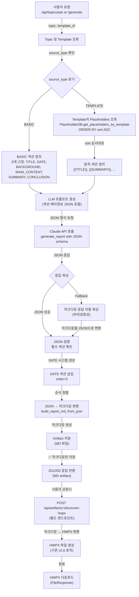
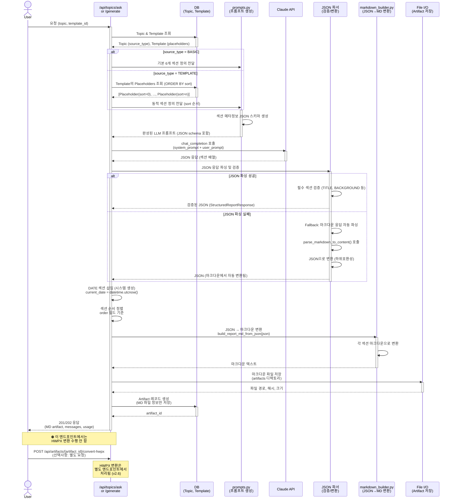

# Unit Spec: JSON 구조화 섹션 메타정보 기반 MD/HWPX 생성

**작성일:** 2025-11-28
**버전:** 1.1 (HWPX 파일 변환 프로세스 상세화)
**상태:** 최종 검토 대기

---

## 1. 요구사항 요약

### 1.1 Purpose (목적)
현재 LLM이 단순 마크다운만 반환하므로 **섹션별 메타정보(타입, 순서, 속성) 없이 매칭이 어려움**.
이를 해결하기 위해 LLM에게 **JSON 형식으로 구조화된 섹션 메타정보**를 담아서 요청하고, 이를 통해 **마크다운 및 HWPX 생성시 정확한 매칭** 지원.

### 1.2 Type
**신규 기능 (new feature)**
- LLM JSON 응답 포맷 지원
- 섹션 메타정보 기반 MD/HWPX 생성

### 1.3 Core Requirements

#### **Requirement 1: Source Type별 고정 섹션 정의**

**1-1. source_type = BASIC (기본)**
```
섹션 순서 (고정):
  1. TITLE       (제목) - LLM이 생성
  2. DATE        (생성일) - 시스템에서 자동 생성 (yyyy.mm.dd 형식, 예: 2025.11.28)
  3. BACKGROUND  (배경) - LLM이 생성
  4. MAIN_CONTENT (주요내용) - LLM이 생성
  5. SUMMARY     (요약) - LLM이 생성
  6. CONCLUSION  (결론) - LLM이 생성
```

**1-2. source_type = TEMPLATE (템플릿 기반)**
```
섹션 순서 (templates.placeholders에서 sort로 결정):
  - placeholders 테이블의 sort 컬럼 값 순서대로 고정
  - 예시:
    sort=0: {{TITLE}}       → TITLE 섹션
    sort=1: {{SUMMARY}}     → SUMMARY 섹션
    sort=2: {{MARKET_ANALYSIS}} → MARKET_ANALYSIS 섹션
    ...
```

#### **Requirement 2: LLM에게 JSON으로 요청 (PlaceholderMetadata 포함)**

**요청 프롬프트 구조:**

**BASIC 타입:**
```python
{
  "format": "json",
  "sections": [
    {
      "id": "TITLE",
      "type": "TITLE",
      "required": true,
      "description": "보고서 제목",
      "max_length": 100,
      "order": 1
    },
    {
      "id": "BACKGROUND",
      "type": "BACKGROUND",
      "required": true,
      "description": "배경 및 목적",
      "max_length": 1000,
      "order": 3  # order=2는 DATE
    }
  ]
}
```

**TEMPLATE 타입 (Placeholder 메타정보 포함):**
```python
{
  "format": "json",
  "sections": [
    {
      "id": "TITLE",
      "type": "TITLE",
      "placeholder_key": "{{TITLE}}",
      "required": true,
      "description": "보고서 제목",
      "max_length": 100,
      "order": 1
    },
    {
      "id": "MARKET_ANALYSIS",
      "type": "SECTION",
      "placeholder_key": "{{MARKET_ANALYSIS}}",  # Template에서 추출
      "required": true,
      "description": "글로벌 및 국내 시장 분석",
      "max_length": 1500,  # ✅ PlaceholderMetadata.max_length (권장값, 강제 아님 - 약 1500자 정도로)
      "min_length": 500,   # ✅ 권장 최소 길이 (약 500자 이상이 좋음)
      "example": "전세계 디지털뱅킹 시장은...",  # ✅ PlaceholderMetadata.example
      "order": 3
    },
    {
      "id": "CONCLUSION",
      "type": "CONCLUSION",
      "placeholder_key": "{{CONCLUSION}}",
      "required": true,
      "description": "결론 및 제언",
      "max_length": 800,
      "order": 5
    }
  ]
}
```

**중요: max_length/min_length는 권장값 (강제 제약 아님)**
```
- max_length: 권장 최대 길이 (약 1500자 정도로 작성해주세요)
- min_length: 권장 최소 길이 (약 500자 이상이 좋습니다)
- ⚠️ LLM이 이 값을 초과해도 자동 절단하지 않음 (경고만 로깅)
- ⚠️ max_length/min_length는 LLM에게 "가이드라인"으로 제시하되, 강제적인 제약은 아님
```

**LLM에게 JSON 포맷 전달 방법 (instructions 필드)**
```json
{
  "instructions": "다음 JSON 형식으로 응답해주세요. 마크다운이 아닌 JSON만 반환하세요.",
  "format": "json",
  "sections": [...]
}
```

**더 구체적인 프롬프트 예시:**
```python
user_prompt = """
당신은 금융 보고서 작성 전문가입니다. 주어진 섹션 정보에 따라 상세한 보고서를 작성해주세요.

# 중요: JSON 형식으로 응답해주세요

다음과 같은 JSON 구조로 응답하세요:
{
  "sections": [
    {
      "id": "TITLE",
      "type": "TITLE",
      "content": "보고서 제목 작성",
      "order": 1,
      "source_type": "basic"
    },
    {
      "id": "BACKGROUND",
      "type": "SECTION",
      "content": "배경 내용 (약 500-1000자)",
      "order": 2,
      "source_type": "basic"
    },
    ...
  ]
}

# 유의사항:
- JSON 형식만 반환하세요 (마크다운 아님)
- 각 섹션의 content는 실제 내용으로 채워주세요
- max_length/min_length는 참고용 가이드라인입니다 (권장값)
"""
```

**LLM 응답 포맷:**
```json
{
  "sections": [
    {
      "id": "TITLE",
      "type": "TITLE",
      "content": "2025년 디지털뱅킹 트렌드 분석",
      "order": 1,
      "source_type": "basic"
    },
    {
      "id": "BACKGROUND",
      "type": "SECTION",
      "placeholder_key": null,
      "content": "금융 산업은 ...",
      "order": 2,
      "source_type": "basic"
    },
    {
      "id": "MARKET_ANALYSIS",
      "type": "SECTION",
      "placeholder_key": "{{MARKET_ANALYSIS}}",
      "content": "글로벌 시장은 ...",
      "order": 3,
      "source_type": "template"
    }
  ],
  "metadata": {
    "generated_at": "2025-11-28T14:30:00",
    "model": "claude-sonnet-4-5-20250929",
    "total_sections": 3
  }
}
```

#### **Requirement 3: DATE 섹션 처리 규칙 (TEMPLATE 기반)**

**규칙 1: Template placeholders 중 DATE가 있으면 → LLM 응답 DATE 사용**
```python
# Template placeholders: {{TITLE}}, {{DATE}}, {{SUMMARY}}, {{ANALYSIS}}
# sort: 0, 1, 2, 3

# LLM이 DATE 섹션 생성
{
  "id": "DATE",
  "type": "DATE",
  "placeholder_key": "{{DATE}}",
  "content": "2025.11.28",  # ✅ 형식: yyyy.mm.dd
  "order": 2
}

# 처리: LLM 응답의 DATE 사용 (order=2 유지)
```

**규칙 2: Template placeholders 중 DATE가 없으면 → 시스템 DATE를 order=2에 삽입**
```python
# Template placeholders: {{TITLE}}, {{SUMMARY}}, {{ANALYSIS}} (DATE 없음)
# sort: 0, 1, 2

# LLM 응답에 DATE 없음 (프롬프트에서 제외)

# 처리: 시스템이 DATE 생성하여 order=2에 삽입
# 다른 섹션들: order 조정 안 함 (LLM이 이미 정렬)
date_section = {
  "id": "DATE",
  "type": "DATE",
  "content": "2025.11.28",  # datetime.utcnow().strftime("%Y.%m.%d")
  "order": 2,
  "source_type": "system"
}
```

**규칙 3: LLM이 DATE를 반환했으면 → 중복 검사 후 시스템 DATE로 대체**
```python
# 상황: Template placeholders에 {{DATE}}가 있고,
#      LLM도 DATE 섹션을 생성한 경우 (프롬프트 오류로 인해)

# 처리:
# 1. LLM 응답에서 DATE 섹션 감지
# 2. 중복 검사: id='DATE' 또는 placeholder_key='{{DATE}}'인 항목 찾기
# 3. 발견시: LLM의 DATE 제거 → 시스템 DATE로 대체
# 4. 로깅: logger.info(f"DATE section detected in LLM response, replacing with system-generated date")

# 최종 결과:
sections = [
  {"id": "TITLE", "content": "...", "order": 1},
  {"id": "DATE", "content": "2025.11.28", "order": 2, "source_type": "system"},  # ✅ 시스템 DATE
  {"id": "SUMMARY", "content": "...", "order": 3},
  {"id": "ANALYSIS", "content": "...", "order": 4}
]
```

**BASIC 타입: 항상 시스템 DATE (order=2)**
```python
# BASIC 타입은 Template placeholders가 없으므로
# 항상 시스템이 DATE를 생성하여 order=2에 삽입
date_section = {
  "id": "DATE",
  "type": "DATE",
  "content": "2025.11.28",
  "order": 2,
  "source_type": "system"
}
```

#### **Requirement 4: JSON → 마크다운 변환 (HWPX 변환 전 중간 형식)**

**📌 TEMPLATE 타입 섹션 제목 변환 (Option A)**
```
Placeholder Key → 의미 있는 한국어 제목:
  {{MARKET_ANALYSIS}}    → ## 시장 분석
  {{COMPETITOR_ANALYSIS}} → ## 경쟁사 분석
  {{STRATEGY}}           → ## 전략
  {{RISK_ASSESSMENT}}    → ## 위험 평가
  등등...

💡 구현 방법:
  1. Placeholder.name 또는 Placeholder.title 필드에서 한국어 제목 추출
  2. 또는 placeholder_key를 기반으로 매핑 테이블 사용
  3. JSON → Markdown 변환 시: placeholder_key → 한국어 제목으로 변환
```

**변환 예시:**
```python
# JSON 입력
{
  "sections": [
    {
      "id": "TITLE",
      "type": "TITLE",
      "content": "보고서 제목",
      "order": 1,
      "max_length": 100
    },
    {
      "id": "DATE",
      "type": "DATE",
      "content": "2025.11.28",  # ✅ 형식: yyyy.mm.dd (점으로 구분)
      "order": 2,
      "source_type": "system"
    },
    {
      "id": "MARKET_ANALYSIS",
      "type": "SECTION",
      "placeholder_key": "{{MARKET_ANALYSIS}}",
      "content": "배경 내용...",
      "order": 3,
      "max_length": 1000
    }
  ]
}

# 마크다운 출력 (HWPX 파싱용 명확한 구조)
# 보고서 제목

---

생성일: 2025.11.28

---

## 시장 분석
배경 내용...
```

**중요:**
- DATE 포맷은 **yyyy.mm.dd** (점으로 구분) 통일
- DATE 섹션은 **수평선(---)**으로 명확히 구분
- TEMPLATE 타입 섹션: **의미 있는 한국어 제목** 사용 (Option A)
  - placeholder_key ({{MARKET_ANALYSIS}}) → 한국어 제목 (## 시장 분석)으로 변환
- 이렇게 해야 HWPX 변환 시 DATE가 별도 섹션으로 올바르게 파싱됨

#### **Requirement 5: 하위호환성 유지**
- 기존 마크다운 응답도 계속 지원
- 마크다운 자동 파싱 후 JSON 형식으로 변환 (Fallback)

#### **Requirement 6: Placeholder 메타정보 활용 및 검증**

**LLM 프롬프트에 메타정보 포함:**
```python
# TEMPLATE 타입: PlaceholderMetadata를 프롬프트에 전달
{
  "sections": [
    {
      "id": "MARKET_ANALYSIS",
      "placeholder_key": "{{MARKET_ANALYSIS}}",
      "required": true,
      "max_length": 1500,
      "min_length": 500,
      "description": "글로벌 및 국내 시장 분석",
      "example": "전세계 디지털뱅킹 시장은 연 15% 성장..."
    }
  ]
}
```

**LLM 응답 검증:**
```python
# 1. 필수 섹션 검증
required_sections = [s for s in sections if s['required']]
for required in required_sections:
    if required['id'] not in [s['id'] for s in llm_response['sections']]:
        raise ValidationError(f"필수 섹션 누락: {required['id']}")

# 2. 길이 검증 (경고만, 비차단) - 자르지 않음 원칙
for section in llm_response['sections']:
    if section.get('max_length') and len(section['content']) > section['max_length']:
        logger.warning(f"Section {section['id']} exceeds max_length: {len(section['content'])} > {section['max_length']}, content will be preserved (not truncated)")
        # ✅ 자르지 않음: 절단하지 않고 그대로 저장

# 3. Placeholder_key 매칭 (TEMPLATE 타입만)
for section in llm_response['sections']:
    if section.get('placeholder_key'):
        # Template placeholders에 존재하는지 확인
        if section['placeholder_key'] not in template_placeholders:
            logger.warning(f"Placeholder {section['placeholder_key']} not found in template")
```

---

## 2. 구현 대상 파일

| 구분 | 파일 | 설명 |
|------|------|------|
| **신규** | `models/report_section.py` | SectionMetadata, StructuredReportResponse 모델 |
| **변경** | `models/report.py` | StructuredReportResponse 추가 |
| **변경** | `utils/claude_client.py` (Line 58-225) | generate_report() → JSON 응답 지원 |
| **변경** | `utils/prompts.py` | LLM 프롬프트 개선 (섹션 메타정보 포함) |
| **변경** | `utils/markdown_builder.py` | JSON → 마크다운 변환 함수 추가 |
| **변경** | `routers/topics.py` (Line 412-901) | ask() → JSON 응답 처리 |
| **변경** | `routers/topics.py` (Line 1691-1921) | _background_generate_report() → JSON 처리 |
| **신규** | `tests/test_json_section_metadata.py` | JSON 섹션 메타정보 테스트 (8개 TC) |

---

## 3. 동작 플로우 (Mermaid Flowchart)



---

## 4. 상세 처리 흐름 (Sequence Diagram)



---

## 5. 테스트 계획

### 5.1 Unit 테스트 (5개)

**TC-001: JSON 섹션 메타정보 생성 (BASIC)**
- **입력:** source_type=BASIC
- **처리:** 6개 고정 섹션 정의 생성
- **검증:**
  - 섹션 개수 = 6 (TITLE, DATE, BACKGROUND, MAIN_CONTENT, SUMMARY, CONCLUSION)
  - order 필드: 1-6 순차
  - source_type 필드: 모두 'basic' 또는 'system'
- **예상 결과:** ✅ JSON 스키마 성공 생성

**TC-002: JSON 섹션 메타정보 생성 (TEMPLATE) - Placeholder 메타정보 포함**
- **입력:**
  - source_type=TEMPLATE
  - template_id=1
  - placeholders (DB 조회):
    ```
    [
      {id: 1, placeholder_key: "{{TITLE}}", sort: 0},
      {id: 2, placeholder_key: "{{MARKET_ANALYSIS}}", sort: 1},
      {id: 3, placeholder_key: "{{CONCLUSION}}", sort: 2}
    ]
    ```
  - PlaceholderMetadata 포함:
    ```
    MARKET_ANALYSIS: {max_length: 1500, min_length: 500, description: "글로벌 시장 분석", example: "..."}
    ```
- **처리:** 동적 섹션 정의 생성 + 메타정보 포함
- **검증:**
  - 섹션 개수 = 3
  - order 필드: [1, 3, 5] (order=2는 DATE 예약)
  - placeholder_key 필드: {{TITLE}}, {{MARKET_ANALYSIS}}, {{CONCLUSION}}
  - source_type 필드: 모두 'template'
  - ✅ max_length, min_length, description, example 필드 포함
  - ✅ required 필드 포함 (true/false)
- **예상 결과:** ✅ 메타정보 포함 동적 JSON 스키마 성공 생성

**TC-002-B: TEMPLATE 타입 DATE 처리 - 규칙 1 (Template placeholders에 DATE 있음)**
- **입력:**
  - source_type=TEMPLATE
  - placeholders: [{{TITLE}}, {{DATE}}, {{SUMMARY}}, {{ANALYSIS}}] (sort: 0, 1, 2, 3)
  - LLM 응답: {{TITLE}}, {{DATE}}, {{SUMMARY}}, {{ANALYSIS}} 모두 반환
- **처리:** DATE 규칙 1 적용 (LLM의 DATE 사용)
- **검증:**
  - 최종 섹션에 DATE 포함 (order=2)
  - DATE.source_type = "template" (LLM이 생성했으므로)
  - DATE.content 형식 = "yyyy.mm.dd"
- **예상 결과:** ✅ LLM 응답의 DATE 사용

**TC-002-C: TEMPLATE 타입 DATE 처리 - 규칙 2 (Template placeholders에 DATE 없음)**
- **입력:**
  - source_type=TEMPLATE
  - placeholders: [{{TITLE}}, {{SUMMARY}}, {{ANALYSIS}}] (DATE 없음)
  - LLM 응답: {{TITLE}}, {{SUMMARY}}, {{ANALYSIS}} (DATE 없음)
- **처리:** DATE 규칙 2 적용 (시스템 DATE 삽입)
- **검증:**
  - 최종 섹션에 DATE 포함 (order=2)
  - DATE.source_type = "system"
  - DATE.content 형식 = "yyyy.mm.dd"
- **예상 결과:** ✅ 시스템 DATE를 order=2에 삽입

**TC-002-D: TEMPLATE 타입 DATE 처리 - 규칙 3 (LLM이 DATE 중복 생성)**
- **입력:**
  - source_type=TEMPLATE
  - placeholders: [{{TITLE}}, {{DATE}}, {{SUMMARY}}]
  - LLM 응답: [{{TITLE}}, {{DATE}}, {{SUMMARY}}, {{DATE}}] (DATE 중복!)
- **처리:** DATE 규칙 3 적용 (중복 검사 후 시스템 DATE로 대체)
- **검증:**
  - LLM의 DATE 섹션 제거
  - 시스템 DATE로 대체 (order=2)
  - 로그: "DATE section detected in LLM response, replacing with system-generated date"
- **예상 결과:** ✅ LLM의 DATE 제거 → 시스템 DATE 사용

**TC-003: LLM JSON 응답 파싱 및 검증**
- **입력:** Claude API JSON 응답
  ```json
  {
    "sections": [
      {"id": "TITLE", "content": "보고서 제목", "type": "TITLE"},
      {"id": "BACKGROUND", "content": "배경...", "type": "SECTION"}
    ]
  }
  ```
- **처리:** 응답 파싱 및 필수 필드 검증
- **검증:**
  - JSON 파싱 성공 (Pydantic StructuredReportResponse)
  - id, content, type 필드 모두 존재
  - content 길이 > 0
- **예상 결과:** ✅ 검증된 StructuredReportResponse 객체 반환

**TC-004: JSON → 마크다운 변환**
- **입력:** StructuredReportResponse (3개 섹션)
  ```python
  {
    "sections": [
      {"id": "TITLE", "content": "보고서 제목", "order": 1},
      {"id": "DATE", "content": "2025.11.28", "order": 2},
      {"id": "BACKGROUND", "content": "배경 내용...", "order": 3}
    ]
  }
  ```
- **처리:** JSON → 마크다운 변환
- **검증:**
  - 마크다운 포함 요소:
    - H1 제목: `# 보고서 제목`
    - 생성일: `_생성일: 2025.11.28_`
    - H2 섹션: `## 배경 및 목적`
  - 섹션 순서: order 기준으로 정렬
- **예상 결과:** ✅ 유효한 마크다운 생성

**TC-005: Fallback - 마크다운 응답 자동 파싱**
- **입력:** LLM이 JSON이 아닌 마크다운만 반환
- **처리:** 자동 파싱 및 JSON으로 변환
- **검증:**
  - parse_markdown_to_content() 호출
  - 섹션 추출 성공 (title, background, main_content, etc.)
  - JSON 형식으로 변환됨
- **예상 결과:** ✅ 마크다운이 JSON으로 자동 변환됨

### 5.2 Integration 테스트 (2개)

**TC-006: 전체 흐름 - BASIC 타입**
- **입력:** 사용자 요청, source_type=BASIC
- **처리:** 전체 엔드-투-엔드
  1. 섹션 정의 생성
  2. LLM 호출
  3. JSON 파싱
  4. DATE 삽입
  5. 마크다운 생성
  6. 파일 저장
- **검증:**
  - Artifact 생성됨
  - 마크다운 파일 존재
  - 파일 크기 > 100 bytes
  - SHA256 해시 계산됨
- **예상 결과:** ✅ artifact_id 반환

**TC-007: 전체 흐름 - TEMPLATE 타입**
- **입력:** 사용자 요청, source_type=TEMPLATE, template_id=1
- **처리:** 전체 엔드-투-엔드
  1. Template placeholders 조회 (sort 순서)
  2. 동적 섹션 정의 생성
  3. LLM 호출
  4. JSON 파싱
  5. 마크다운 생성
  6. 파일 저장
- **검증:**
  - Artifact 생성됨
  - placeholder_key 매칭 확인
  - 섹션 순서 = sort 순서
- **예상 결과:** ✅ artifact_id 반환

### 5.3 API 테스트 (3개)

**TC-008: POST /api/topics/ask - JSON 응답**
- **요청:** /api/topics/{topic_id}/ask
- **조건:** source_type=BASIC
- **검증:**
  - 200 OK
  - artifact 객체 반환
  - artifact.kind = 'MD'
  - message_id 설정됨
- **예상 결과:** ✅ 완료된 artifact 반환

**TC-009: POST /api/topics/generate - JSON 응답 (백그라운드)**
- **요청:** POST /api/topics/generate (background 생성)
- **조건:** source_type=TEMPLATE
- **검증:**
  - 202 Accepted (백그라운드 작업)
  - generation_id 반환
  - GET /status에서 진행상황 추적 가능
- **예상 결과:** ✅ 202 + generation_id

**TC-010: 마크다운 → HWPX 변환 (기존 v2.6 + JSON 메타정보)**
- **요청:** POST /api/artifacts/{artifact_id}/convert-hwpx
- **조건:** artifact.kind = 'MD' (JSON 기반 생성된 마크다운)
- **섹션 번호 규칙:** TITLE과 DATE는 번호 없음, SECTION부터 1번 시작
  ```
  # 보고서 제목          ← 번호 없음 (H1)
  ---
  생성일: 2025.11.28    ← 번호 없음
  ---
  ## 배경 및 목적        ← 1번 (첫 번째 SECTION)
  ## 주요 내용           ← 2번 (두 번째 SECTION)
  ```
- **입력 마크다운:**
  ```markdown
  # 보고서 제목

  ---

  생성일: 2025.11.28

  ---

  ## 배경 및 목적
  배경 내용...

  ## 주요 내용
  주요 내용...
  ```
- **파싱 결과 (MdElement[]):**
  ```
  1. type=TITLE, content="보고서 제목"
  2. type=HORIZON_LINE, content=""
  3. type=NORMAL_TEXT, content="생성일: 2025.11.28"
  4. type=HORIZON_LINE, content=""
  5. type=SECTION, content="배경 및 목적", ref_filename="Ref_01_Section"
  6. type=NORMAL_TEXT, content="배경 내용...", ref_filename="Ref02_NormalText"
  7. type=SECTION, content="주요 내용", ref_filename="Ref_01_Section"
  8. type=NORMAL_TEXT, content="주요 내용...", ref_filename="Ref02_NormalText"
  ```
- **HWPX 파일 변환 프로세스:**
  ```
  Step 1: Template 로드
    → Template_Hwpx.hwpx 압축 해제
    → Contents/section0.xml 로드

  Step 2: {{TITLE}} 교체
    → 찾기: <hp:t>{{TITLE}}</hp:t>
    → 교체: <hp:t>보고서 제목</hp:t>

  Step 3: Content 영역 생성 (<!-- Content Start --> ~ <!-- Content End --> 사이)
    3-1. HORIZON_LINE (수평선)
         → Ref03_HorizonLine 읽기 (원본 유지)
         → section0.xml에 추가

    3-2. "생성일: 2025.11.28" (일반 텍스트)
         → Ref02_NormalText 읽기:
            <hp:p>
              <hp:pPr><hp:pStyle val="Normal"/></hp:pPr>
              <hp:t><!-- Content_Start -->생성일: 2025.11.28<!-- Content_End --></hp:t>
            </hp:p>
         → section0.xml에 추가

    3-3. HORIZON_LINE (수평선)
         → Ref03_HorizonLine 읽기
         → section0.xml에 추가

    3-4. SECTION (배경 및 목적)
         → Ref_01_Section 읽기:
            <hp:p>
              <hp:pPr>
                <hp:pStyle val="Heading2"/>
                <hp:numPr><hp:ilvl val="0"/><hp:numId val="1"/></hp:numPr>
              </hp:pPr>
              <!-- SubTitleNo_Start -->1<!-- SubTitleNo_End -->
              <!-- SubTitle_Start -->배경 및 목적<!-- SubTitle_End -->
            </hp:p>
         → section0.xml에 추가

    3-5. NORMAL_TEXT (배경 내용...)
         → Ref02_NormalText 읽기
         → "배경 내용..."으로 플레이스홀더 교체
         → section0.xml에 추가

    (계속 반복...)

  Step 4: 재압축 및 저장
    → 수정된 section0.xml 저장
    → 모든 파일 재압축 (HWPX 표준: mimetype ZIP_STORED)
    → artifacts/{topic_id}/ 디렉토리에 저장
    → ArtifactDB.create_artifact() 호출
  ```
- **최종 HWPX 파일 구조:**
  ```
  Template_Hwpx.hwpx
  ├─ [Content_Types].xml      (수정 없음)
  ├─ _rels/                   (수정 없음)
  ├─ docProps/                (수정 없음)
  └─ Contents/
      ├─ section0.xml         ✅ 수정됨 ({{TITLE}} + Content 영역 추가)
      ├─ fontData/            (수정 없음)
      ├─ media/               (수정 없음)
      └─ (다른 파일들)        (수정 없음)
  ```
- **검증:**
  - 200 OK
  - HWPX 파일 다운로드
  - 파일 크기 > 1KB
  - section0.xml이 정상적으로 수정됨 (검증용 XML 파서 사용)
  - 모든 MdElement이 대응 Ref 파일로 변환됨
  - 수평선, 제목, 일반 텍스트 모두 올바른 위치에 추가됨
- **예상 결과:** ✅ 완성된 HWPX 파일 반환

---

## 5.4 HWPX 파일 변환 상세 프로세스 (JSON → MD → HWPX)

### 5.4.1 데이터 흐름 다이어그램

**POST /api/topics/ask 또는 /api/topics/generate (이 spec 범위)**

```
Step 1: JSON 생성 (20251128 스펙)
  ↓
{
  "sections": [
    {"id": "TITLE", "content": "보고서 제목", "order": 1},
    {"id": "DATE", "content": "2025.11.28", "order": 2},
    {"id": "BACKGROUND", "content": "배경...", "order": 3}
  ]
}

Step 2: Markdown 변환 (build_report_md_from_json)
  ↓
# 보고서 제목

---

생성일: 2025.11.28

---

## 배경 및 목적
배경...

Step 3: Artifact 저장 (MD 파일만)
  ↓
artifacts/{topic_id}/artifact_{id}.md
  → Markdown 파일 저장 완료
  → artifact_id 반환

✅ 응답: 201/202 (MD artifact)
⛔ 이 단계에서는 HWPX 변환 수행 안 함
```

**POST /api/artifacts/{artifact_id}/convert-hwpx (별도 엔드포인트, 기존 v2.6)**

```
입력: artifact_id (MD artifact)
  ↓

Step 4: Markdown 파싱 (parse_markdown_to_md_elements)
  ↓
[
  {type: TITLE, content: "보고서 제목"},
  {type: HORIZON_LINE},
  {type: NORMAL_TEXT, content: "생성일: 2025.11.28"},
  {type: HORIZON_LINE},
  {type: SECTION, content: "배경 및 목적"},
  {type: NORMAL_TEXT, content: "배경..."}
]

Step 5: HWPX 변환 (apply_markdown_to_hwpx)
  ↓
Template_Hwpx.hwpx
  → section0.xml 수정 완료
  → HWPX 파일 생성

✅ 응답: 200 OK (HWPX 파일 다운로드)
```

### 5.4.2 HWPX 파일 수정 상세 프로세스

**📌 섹션 번호 규칙**
```
TITLE과 DATE → 번호 없음
첫 번째 SECTION (배경 및 목적) → 1번
두 번째 SECTION (주요 내용) → 2번
등등...
```

**입력: MdElement[] (8개 요소)**

```
Step 1️⃣: {{TITLE}} 플레이스홀더 교체

원본 section0.xml:
  <hp:p>
    <hp:pPr><hp:pStyle val="Title"/></hp:pPr>
    <hp:t>{{TITLE}}</hp:t>
  </hp:p>

수정 후:
  <hp:p>
    <hp:pPr><hp:pStyle val="Title"/></hp:pPr>
    <hp:t>보고서 제목</hp:t>
  </hp:p>
```

**Step 2️⃣: Content 영역에 요소 추가**

```
<!-- Content Start --> ~ <!-- Content End --> 사이에 순차 추가:

3-1. HORIZON_LINE 추가
     읽기: Ref03_HorizonLine (원본 유지)
     → <hp:p></hp:p> (빈 단락)
     추가 위치: Content Start 다음

3-2. NORMAL_TEXT "생성일: 2025.11.28" 추가
     읽기: Ref02_NormalText
     플레이스홀더 교체: <!-- Content_Start -->생성일: 2025.11.28<!-- Content_End -->
     XML 추가:
     <hp:p>
       <hp:pPr><hp:pStyle val="Normal"/></hp:pPr>
       <hp:t><!-- Content_Start -->생성일: 2025.11.28<!-- Content_End --></hp:t>
     </hp:p>

3-3. HORIZON_LINE 추가
     읽기: Ref03_HorizonLine
     → <hp:p></hp:p>

3-4. SECTION "배경 및 목적" 추가 (번호 1)
     읽기: Ref_01_Section
     플레이스홀더 교체:
       - <!-- SubTitleNo_Start -->1<!-- SubTitleNo_End --> (섹션 번호)
       - <!-- SubTitle_Start -->배경 및 목적<!-- SubTitle_End --> (제목)
     XML 추가:
     <hp:p>
       <hp:pPr>
         <hp:pStyle val="Heading2"/>
         <hp:numPr><hp:ilvl val="0"/><hp:numId val="1"/></hp:numPr>
       </hp:pPr>
       <!-- SubTitleNo_Start -->1<!-- SubTitleNo_End -->
       <!-- SubTitle_Start -->배경 및 목적<!-- SubTitle_End -->
     </hp:p>

3-5. NORMAL_TEXT "배경..." 추가
     읽기: Ref02_NormalText
     플레이스홀더 교체: <!-- Content_Start -->배경...<!-- Content_End -->
     XML 추가: <hp:p>...</hp:p>

(계속 반복...)
```

### 5.4.3 HWPX 파일 최종 구조

```
Template_Hwpx.hwpx (재압축)
│
├─ [Content_Types].xml       → 수정 없음 ✅
├─ _rels/                    → 수정 없음 ✅
│   ├─ .rels
│   └─ document.xml.rels
├─ docProps/                 → 수정 없음 ✅
│   ├─ app.xml
│   ├─ core.xml
│   └─ custom.xml
├─ Contents/
│   ├─ section0.xml          → ✅ 수정됨 (이 파일만 변경)
│   │   원본 구조:
│   │   <hp:doc>
│   │     <hp:section>
│   │       <hp:p>{{TITLE}}</hp:p>        ← 교체됨
│   │       <!-- Content Start -->        ← 이 부분
│   │       <!-- Content End -->          ← 에 요소 추가됨
│   │     </hp:section>
│   │   </hp:doc>
│   │
│   │   수정 후:
│   │   <hp:doc>
│   │     <hp:section>
│   │       <hp:p>보고서 제목</hp:p>      ← 변경됨
│   │       <!-- Content Start -->
│   │         <hp:p></hp:p>               (수평선)
│   │         <hp:p>생성일: 2025.11.28</hp:p>
│   │         <hp:p></hp:p>               (수평선)
│   │         <hp:p>1. 배경 및 목적</hp:p>
│   │         <hp:p>배경...</hp:p>
│   │         ...
│   │       <!-- Content End -->
│   │     </hp:section>
│   │   </hp:doc>
│   │
│   ├─ fontData/             → 수정 없음 ✅
│   │   ├─ 00000000.dat
│   │   ├─ 00000001.dat
│   │   └─ ...
│   ├─ media/               → 수정 없음 ✅
│   │   └─ image.png (있으면)
│   ├─ styles.xml           → 수정 없음 ✅
│   ├─ document.xml         → 수정 없음 ✅
│   └─ settings.xml         → 수정 없음 ✅
│
└─ mimetype                 → 수정 없음 ✅
    (application/x-hwpx)
```

### 5.4.4 중요: Ref 파일은 읽기만 수행

```
⚠️ Ref 파일들은 절대 수정하지 않음:
  - Ref_01_Section         → 읽기만 ✅
  - Ref02_NormalText       → 읽기만 ✅
  - Ref03_HorizonLine      → 읽기만 ✅
  - Ref04_Quotation        → 읽기만 ✅
  - (다른 Ref 파일들)      → 읽기만 ✅

프로세스:
  1. Ref 파일 읽기 (메모리 로드)
  2. Ref 파일 내용 복사
  3. 메모리 내용에서 플레이스홀더 교체
  4. section0.xml에만 교체된 내용 저장
  5. Ref 파일 원본 유지 (다른 보고서 생성 시 재사용 가능)
```

### 5.4.5 HWPX 파일 검증 항목 (TC-010)

```
✅ 검증 1: section0.xml 수정됨
   XML 파서로 section0.xml 로드
   - {{TITLE}} → "보고서 제목"으로 변경 확인

✅ 검증 2: Content 영역에 요소 추가됨
   <!-- Content Start --> ~ <!-- Content End -->
   - 요소 개수 = 8개 (입력 MdElement[] 개수)
   - 각 요소가 대응 Ref 파일 구조와 일치

✅ 검증 3: 수평선 처리
   - HORIZON_LINE 타입이 Ref03_HorizonLine으로 변환
   - <hp:p></hp:p> 빈 단락으로 표현

✅ 검증 4: DATE 섹션 인식
   - "생성일: 2025.11.28" 포함 (수평선 사이)
   - NORMAL_TEXT로 올바르게 처리

✅ 검증 5: HWPX 재압축 성공
   - 모든 파일 포함 (Ref 파일 제외)
   - 파일 크기 > 1KB
   - ZIP 구조 유효

✅ 검증 6: 메타정보 보존
   - max_length 제약이 Markdown 단계에서 적용됨
   - HWPX 단계에서 길이 초과 없음
```

---

## 6. 에러 처리 시나리오

### 6.1 JSON 파싱 실패

**상황:** LLM이 유효하지 않은 JSON 반환
```python
response = "{"sections": [invalid json"  # 문법 오류
```

**처리:**
1. JSON 파싱 시도 → 실패 감지
2. Fallback: 마크다운 자동 파싱 수행
3. 마크다운을 JSON으로 변환
4. 계속 진행

**에러 코드:** 없음 (자동 복구)
**로그:** `logger.warning(f"JSON parsing failed, using markdown fallback")`
**HTTP 상태:** 200/202 (성공)

### 6.2 필수 섹션 누락 → 400 Bad Request ⚠️

**상황:** LLM이 필수 섹션(TITLE)을 생략
```json
{
  "sections": [
    {"id": "BACKGROUND", "content": "..."},
    {"id": "SUMMARY", "content": "..."}
  ]
}
```

**처리:**
1. 필수 섹션 검증 (required=true인 섹션)
2. TITLE 누락 감지 → 400 Bad Request 반환
3. 에러 응답 반환 (재시도 불가능)

**에러 코드:** `VALIDATION.REQUIRED_SECTION_MISSING`
**HTTP 상태:** 400 Bad Request
**메시지:** `"필수 섹션이 누락되었습니다: [TITLE]"`
**응답:**
```json
{
  "success": false,
  "error": {
    "code": "VALIDATION.REQUIRED_SECTION_MISSING",
    "message": "필수 섹션이 누락되었습니다",
    "details": {
      "missing_sections": ["TITLE"],
      "required_sections": ["TITLE", "BACKGROUND", "SUMMARY", "CONCLUSION"]
    }
  }
}
```

### 6.3 Template placeholders 불일치 (경고만)

**상황:** LLM이 정의되지 않은 placeholder_key 사용
```json
{
  "sections": [
    {"id": "UNDEFINED_KEY", "placeholder_key": "{{UNDEFINED}}", "content": "..."}
  ]
}
```

**처리:**
1. 검증 시 placeholder_key 확인
2. template placeholders와 비교
3. 불일치하면 경고 로그
4. 계속 진행 (비차단)

**에러 코드:** 없음 (경고만)
**로그:** `logger.warning(f"[SECTION_VALIDATION] Placeholder {{UNDEFINED}} not found in template - section_id=UNDEFINED_KEY")`
**HTTP 상태:** 200/202 (성공)

### 6.4 DATE 섹션 처리 (규칙 3)

**상황 1: Template에 {{DATE}}가 있고, LLM도 DATE 섹션 생성**
```json
{
  "sections": [
    {"id": "DATE", "content": "2025.11.28"}
  ]
}
```

**처리:**
1. LLM 응답에서 DATE 섹션 감지
2. 중복 검사 (id='DATE' 또는 placeholder_key='{{DATE}}')
3. 발견시: LLM의 DATE 제거 → 시스템 DATE로 대체
4. 로깅

**에러 코드:** 없음 (자동 처리)
**로그:** `logger.info(f"[DATE_HANDLING] DATE section detected in LLM response, replacing with system-generated date - format: yyyy.mm.dd")`
**HTTP 상태:** 200/202 (성공)

**상황 2: Template에 {{DATE}}가 없는데, LLM이 DATE 생성**
```json
{
  "sections": [
    {"id": "TITLE", "content": "..."},
    {"id": "DATE", "content": "2025.11.28"}  # ⚠️ 프롬프트에서 제외했는데 생성됨
  ]
}
```

**처리:**
1. LLM 응답에서 DATE 섹션 감지
2. Template placeholders에 {{DATE}}가 없음 확인
3. LLM의 DATE 제거
4. 시스템이 생성한 DATE를 order=2에 삽입
5. 로깅

**에러 코드:** 없음 (자동 처리)
**로그:** `logger.warning(f"[DATE_HANDLING] DATE section in LLM response but not in template, removing LLM DATE and using system-generated")`
**HTTP 상태:** 200/202 (성공)

### 6.5 섹션 길이 초과 (경고만, 비차단)

**상황:** LLM 응답이 max_length 초과
```json
{
  "sections": [
    {
      "id": "MARKET_ANALYSIS",
      "content": "매우 긴 내용... (2000자)",
      "max_length": 1500
    }
  ]
}
```

**처리:**
1. 길이 검증
2. max_length 초과 감지
3. 경고 로그 (비차단)
4. ⚠️ **자르지 않음**: 전체 내용을 그대로 저장 (절단 없음)

**에러 코드:** 없음 (경고만)
**로그:** `logger.warning(f"[SECTION_VALIDATION] Section MARKET_ANALYSIS exceeds max_length: 2000 > 1500, content will be preserved (not truncated)")`
**HTTP 상태:** 200/202 (성공)
**처리 방식:**
```python
# ✅ 자르지 않음 원칙: max_length 초과해도 전체 내용 보존
if len(section['content']) > section.get('max_length', float('inf')):
    logger.warning(f"[SECTION_VALIDATION] Section {section['id']} exceeds max_length: {len(section['content'])} > {section['max_length']}, content will be preserved")
    # ⚠️ section['content']는 절단하지 않음 - 그대로 저장
```

---

## 7. 기술 선택 사항

### 7.1 JSON vs Markdown 응답 선택 이유

**왜 JSON을 기본으로 하는가?**
- ✅ 섹션 메타정보 명시적 포함
- ✅ 순서 보장 (order 필드)
- ✅ 타입 정보 포함 (type 필드)
- ✅ 검증 가능 (Pydantic)

**왜 Markdown Fallback을 유지하는가?**
- ✅ 기존 코드와의 호환성
- ✅ LLM 응답 부분 실패시 복구
- ✅ 점진적 마이그레이션 지원

### 7.2 DATE 섹션 처리 - 시스템 생성

**왜 LLM에게 DATE를 요청하지 않는가?**
- ❌ LLM은 타임스탬프를 정확하게 모름 (학습 시점 기준)
- ❌ 매번 다른 형식으로 생성할 수 있음
- ✅ 시스템 날짜가 항상 정확하고 일관됨

### 7.3 PlaceholderDB.sort 활용

**placeholders 정렬 방식:**
```python
# ✅ NEW: sort 컬럼으로 확실한 순서 보장
PlaceholderDB.get_placeholders_by_template(template_id)
# ORDER BY sort ASC, created_at ASC
```

**장점:**
- 마이크로초 경합 제거
- 배치 생성시 순서 보장
- 사용자 재정렬 가능 (향후)

---

## 8. 데이터 모델 설계

### 8.1 신규 모델: `models/report_section.py`

```python
from pydantic import BaseModel, Field
from typing import List, Optional
from enum import Enum

class SectionType(str, Enum):
    """섹션 타입 정의."""
    TITLE = "TITLE"
    DATE = "DATE"
    BACKGROUND = "BACKGROUND"
    MAIN_CONTENT = "MAIN_CONTENT"
    SUMMARY = "SUMMARY"
    CONCLUSION = "CONCLUSION"
    SECTION = "SECTION"  # 템플릿 기반 커스텀 섹션

class SourceType(str, Enum):
    """섹션 출처 타입."""
    BASIC = "basic"       # 기본 고정 섹션
    TEMPLATE = "template" # 템플릿 기반 섹션
    SYSTEM = "system"     # 시스템이 생성한 섹션 (DATE)

class SectionMetadata(BaseModel):
    """개별 섹션 메타정보."""
    id: str = Field(..., description="섹션 ID (예: TITLE, {{MARKET_ANALYSIS}})")
    type: SectionType = Field(..., description="섹션 타입")
    content: str = Field(..., min_length=1, description="섹션 내용")
    order: int = Field(..., ge=1, description="섹션 순서 (1-based)")
    placeholder_key: Optional[str] = Field(None, description="템플릿 placeholder_key ({{KEY}} 형식)")
    source_type: SourceType = Field(..., description="섹션 출처 (basic, template, system)")

    # ✅ HWPX 변환을 위한 메타정보 필드 추가
    max_length: Optional[int] = Field(None, description="최대 문자 길이 (PlaceholderMetadata에서)")
    min_length: Optional[int] = Field(None, description="최소 문자 길이 (PlaceholderMetadata에서)")
    description: Optional[str] = Field(None, description="섹션 설명")
    example: Optional[str] = Field(None, description="예시 값")

class StructuredReportResponse(BaseModel):
    """구조화된 보고서 응답 (JSON)."""
    sections: List[SectionMetadata] = Field(..., description="섹션 배열")
    metadata: Optional[dict] = Field(None, description="메타데이터 (생성일, 모델, 등)")

    class Config:
        json_schema_extra = {
            "example": {
                "sections": [
                    {
                        "id": "TITLE",
                        "type": "TITLE",
                        "content": "2025년 디지털뱅킹 트렌드",
                        "order": 1,
                        "source_type": "basic"
                    },
                    {
                        "id": "DATE",
                        "type": "DATE",
                        "content": "2025.11.28",
                        "order": 2,
                        "source_type": "system"
                    }
                ]
            }
        }
```

### 8.2 수정 모델: `models/template.py` - Placeholder

```python
class PlaceholderCreate(PlaceholderBase):
    """플레이스홀더 생성 모델."""
    template_id: int = Field(..., description="템플릿 ID")
    sort: Optional[int] = Field(None, description="정렬 순서 (0-based index)")  # ✅ 기존

class Placeholder(PlaceholderCreate):
    """플레이스홀더 응답 모델."""
    id: int
    sort: int = Field(0, description="정렬 순서 (0-based index)")  # ✅ 기존
    created_at: datetime

    class Config:
        from_attributes = True
```

---

## 9. 함수 설계

### 9.1 `utils/prompts.py` - 프롬프트 생성

```python
def create_section_schema(source_type: TopicSourceType,
                         placeholders: Optional[List[Placeholder]] = None) -> dict:
    """
    소스 타입별 섹션 스키마 JSON 생성.

    Args:
        source_type: BASIC 또는 TEMPLATE
        placeholders: Template 기반일 때만 사용 (sort 순서)

    Returns:
        섹션 메타정보 JSON 스키마 (LLM에 전달용)

    Example:
        BASIC:
        {
          "sections": [
            {"type": "TITLE", "required": True, ...},
            {"type": "BACKGROUND", "required": True, ...},
            ...
          ]
        }

        TEMPLATE:
        {
          "sections": [
            {"type": "TITLE", "placeholder_key": "{{TITLE}}", ...},
            {"type": "MARKET_ANALYSIS", "placeholder_key": "{{MARKET_ANALYSIS}}", ...}
            ...
          ]
        }
    """
```

### 9.2 `utils/markdown_builder.py` - JSON → 마크다운 (HWPX 변환 전 단계)

```python
def build_report_md_from_json(structured_response: StructuredReportResponse) -> str:
    """
    JSON 구조화 응답을 마크다운으로 변환 (HWPX 파싱 전 중간 형식).

    Args:
        structured_response: StructuredReportResponse 객체 (max_length 등 메타정보 포함)

    Returns:
        완성된 마크다운 문자열

    Process:
        1. sections를 order로 정렬
        2. 각 섹션을 마크다운으로 변환:
           - TITLE: H1 제목 (#)
           - DATE: 수평선 + 일반 텍스트 + 수평선 (명확한 구분)
           - BACKGROUND/MAIN_CONTENT/SUMMARY/CONCLUSION: H2 섹션 (##)
        3. 길이 제약 사전 적용 (max_length 초과 시 절단)
        4. 섹션 연결

    Important:
        ✅ DATE는 수평선(---)으로 명확히 구분해야 함
        ✅ HWPX 파싱 시 DATE가 별도 섹션으로 인식되도록
        ✅ 형식: yyyy.mm.dd (점으로 구분, 하이픈 아님)

    Example Input:
        {
          "sections": [
            {
              "id": "TITLE",
              "type": "TITLE",
              "content": "보고서 제목",
              "order": 1,
              "max_length": 100
            },
            {
              "id": "DATE",
              "type": "DATE",
              "content": "2025.11.28",  # ✅ 형식 중요
              "order": 2,
              "source_type": "system"
            },
            {
              "id": "BACKGROUND",
              "type": "BACKGROUND",
              "content": "배경...",
              "order": 3,
              "max_length": 1000
            }
          ]
        }

    Example Output:
        # 보고서 제목

        ---

        생성일: 2025.11.28

        ---

        ## 배경 및 목적
        배경...

    HWPX 변환 파이프라인:
        1. 마크다운 파싱 (parse_markdown_to_md_elements())
        2. 각 요소를 HWPX Ref 파일과 매핑:
           - H1 (#): Title 플레이스홀더 교체
           - 수평선 (---): Ref03_HorizonLine
           - "생성일: 2025.11.28": Ref02_NormalText
           - H2 (##): Ref_01_Section
        3. XML 편집 및 HWPX 생성
    """
```

### 9.3 `utils/claude_client.py` - JSON 지원

```python
def generate_report(self,
                   topic: str,
                   plan_text: Optional[str] = None,
                   system_prompt: Optional[str] = None,
                   section_schema: Optional[dict] = None,  # ✅ NEW
                   isWebSearch: bool = False) -> Union[str, StructuredReportResponse]:
    """
    주제를 받아 JSON 또는 Markdown으로 보고서 생성.

    Args:
        topic: 보고서 주제
        plan_text: 계획
        system_prompt: 시스템 프롬프트
        section_schema: 섹션 메타정보 스키마 (JSON)  # ✅ NEW
        isWebSearch: 웹 검색 활성화 여부

    Returns:
        StructuredReportResponse (JSON) 또는 str (마크다운 Fallback)

    Process:
        1. section_schema가 있으면 JSON 응답 요청
        2. 응답 파싱 및 검증
        3. 실패시 마크다운 Fallback
    """
```

---

## 10. API 엔드포인트 변경사항

### 📌 핵심: MD/HWPX 생성 단계 분리

```
Step 1: JSON → MD 변환 (이 spec에서 담당)
  POST /api/topics/ask
  POST /api/topics/generate
  ↓
  역할: JSON 파싱 → Markdown 생성 → Artifact 저장
  반환: Markdown artifact (MD 파일)
  ⚠️ HWPX 변환 없음

Step 2: MD → HWPX 변환 (기존 v2.6 로직)
  POST /api/artifacts/{artifact_id}/convert-hwpx
  ↓
  역할: Markdown artifact를 읽어서 HWPX로 변환
  입력: artifact_id (MD artifact)
  반환: HWPX 파일 (다운로드)
```

### 10.1 POST /api/topics/ask (변경)

**처리 범위: JSON → MD 변환 (HWPX 변환 제외)**

**기존 응답:**
```json
{
  "success": true,
  "data": {
    "artifact": {
      "id": 123,
      "kind": "MD",
      "content": "# 보고서..."
    }
  }
}
```

**신규 응답 (동일):**
```json
{
  "success": true,
  "data": {
    "artifact": {
      "id": 123,
      "kind": "MD",
      "content": "# 보고서..."  // ✅ 마크다운만 (JSON 기반 생성)
    }
  }
}
```

**변경 내용:**
- ✅ 응답 형식은 동일 (마크다운)
- ✅ 내부 처리가 JSON으로 변경 (사용자에게 투명)
- ✅ **HWPX 변환은 수행하지 않음** (별도 엔드포인트에서 처리)

**워크플로우:**
```
1. 섹션 스키마 생성 (JSON)
2. Claude API 호출 → JSON 응답
3. JSON 파싱 및 검증
4. JSON → Markdown 변환
5. Artifact 저장 (MD 파일)
6. ⛔ HWPX 변환 중단 (다음 단계로)
```

### 10.2 POST /api/topics/generate (변경)

**처리 범위: JSON → MD 변환 (HWPX 변환 제외, 백그라운드)**

**기존 응답:**
```json
{
  "success": true,
  "data": {
    "generation_id": "gen_123",
    "status": "processing"
  }
}
```

**신규 응답 (동일):**
```json
{
  "success": true,
  "data": {
    "generation_id": "gen_123",
    "status": "processing"
  }
}
```

**변경 내용:**
- ✅ 응답 형식은 동일 (백그라운드 작업)
- ✅ 내부 처리가 JSON으로 변경
- ✅ **HWPX 변환은 수행하지 않음** (별도 엔드포인트에서 처리)

**백그라운드 워크플로우:**
```
1. 즉시 응답: 202 Accepted + generation_id
2. 백그라운드 _background_generate_report() 실행:
   a. 섹션 스키마 생성 (JSON)
   b. Claude API 호출 → JSON 응답
   c. JSON 파싱 및 검증
   d. JSON → Markdown 변환
   e. Artifact 저장 (MD 파일)
   f. ⛔ HWPX 변환 중단 (다음 단계로)
3. GET /status에서 진행상황 추적 가능
```

### 10.3 POST /api/artifacts/{artifact_id}/convert-hwpx (기존 v2.6)

**처리 범위: MD → HWPX 변환 (별도 엔드포인트)**

**역할:**
- Markdown artifact를 읽어서 HWPX로 변환
- 사용자가 명시적으로 요청할 때만 실행
- 기존 v2.6 로직 그대로 사용

**입출력:**
```
입력: artifact_id (MD artifact)
      GET /artifacts/{artifact_id} → Markdown 파일 읽기

처리: parse_markdown_to_md_elements() → HWPX 변환

출력: HWPX 파일 (다운로드)
```

**특징:**
- ✅ MD/HWPX 생성이 분리됨 (사용자 요청 시에만 HWPX 생성)
- ✅ 불필요한 HWPX 변환 방지
- ✅ 성능 최적화

---

## 11. 구현 체크리스트

### Phase 1: 데이터 모델 (Step 1-1)
- [ ] `models/report_section.py` 신규 생성
  - [ ] SectionType Enum
  - [ ] SourceType Enum
  - [ ] SectionMetadata 클래스
  - [ ] StructuredReportResponse 클래스
- [ ] `models/template.py` 수정
  - [ ] PlaceholderCreate에 sort 필드 확인
  - [ ] Placeholder에 sort 필드 확인

### Phase 2: 유틸리티 함수 (Step 1-3)
- [ ] `utils/prompts.py` 수정
  - [ ] create_section_schema() 함수 추가
  - [ ] source_type별 섹션 정의 로직
  - [ ] Placeholder sort 기반 정렬
- [ ] `utils/markdown_builder.py` 수정
  - [ ] build_report_md_from_json() 함수 추가
  - [ ] 섹션 → 마크다운 변환 로직

### Phase 3: Claude 클라이언트 (Step 1-3)
- [ ] `utils/claude_client.py` 수정
  - [ ] generate_report() → section_schema 파라미터 추가
  - [ ] JSON 응답 파싱 로직
  - [ ] Markdown Fallback 로직
  - [ ] DATE 섹션 자동 생성

### Phase 4: 라우터 (Step 1-4)
- [ ] `routers/topics.py` - ask() 수정 (라인 412-901)
  - [ ] Step 3: 섹션 스키마 생성 추가
  - [ ] Step 6: JSON 응답 처리 로직 추가
- [ ] `routers/topics.py` - _background_generate_report() 수정 (라인 1691-1921)
  - [ ] Step 2-3: JSON 응답 처리 로직 추가

### Phase 5: 테스트 (Step 1-5)
- [ ] `tests/test_json_section_metadata.py` 신규 생성
  - [ ] TC-001: BASIC 섹션 생성
  - [ ] TC-002: TEMPLATE 섹션 생성
  - [ ] TC-003: JSON 파싱 및 검증
  - [ ] TC-004: JSON → 마크다운 변환
  - [ ] TC-005: Markdown Fallback
  - [ ] TC-006: 전체 흐름 (BASIC)
  - [ ] TC-007: 전체 흐름 (TEMPLATE)
  - [ ] TC-008: /ask API
  - [ ] TC-009: /generate API
  - [ ] TC-010: HWPX 변환

### Phase 5-B: ErrorCode 정의 (Step 1-4 중간)
- [ ] `backend/app/utils/response_helper.py` 또는 새 파일에 ErrorCode 클래스 정의
  - [ ] `VALIDATION.REQUIRED_SECTION_MISSING` (400 Bad Request)
  - [ ] 기존 ErrorCode와의 일관성 확인
  - [ ] 에러 응답 형식 표준화 (success_response, error_response 활용)

### Phase 6: 검증 (Step 2)
- [ ] 기존 테스트 호환성 확인 (27개)
- [ ] 마크다운 파싱 호환성 확인
- [ ] HWPX 변환 호환성 확인
- [ ] CLAUDE.md 업데이트

---

## 12. 마크다운 변환 상세 예시 (BASIC vs TEMPLATE)

### 12.1 BASIC 타입 마크다운 변환

**입력 (JSON):**
```json
{
  "sections": [
    {"id": "TITLE", "type": "TITLE", "content": "2025년 디지털금융 동향", "order": 1},
    {"id": "DATE", "type": "DATE", "content": "2025.11.28", "order": 2, "source_type": "system"},
    {"id": "BACKGROUND", "type": "BACKGROUND", "content": "금융 산업의 디지털 전환...", "order": 3},
    {"id": "MAIN_CONTENT", "type": "MAIN_CONTENT", "content": "1. AI 기술 도입...", "order": 4},
    {"id": "SUMMARY", "type": "SUMMARY", "content": "정리하면, 향후 3년간...", "order": 5},
    {"id": "CONCLUSION", "type": "CONCLUSION", "content": "결론적으로 기업은...", "order": 6}
  ]
}
```

**출력 (Markdown):**
```markdown
# 2025년 디지털금융 동향

---

생성일: 2025.11.28

---

## 배경 및 목적
금융 산업의 디지털 전환...

## 주요내용
1. AI 기술 도입...

## 요약
정리하면, 향후 3년간...

## 결론
결론적으로 기업은...
```

### 12.2 TEMPLATE 타입 마크다운 변환 (한국어 제목 포함)

**입력 (JSON with Placeholder titles):**
```json
{
  "sections": [
    {"id": "TITLE", "type": "TITLE", "content": "디지털뱅킹 전략 2025", "order": 1, "placeholder_key": "{{TITLE}}"},
    {"id": "DATE", "type": "DATE", "content": "2025.11.28", "order": 2, "source_type": "system"},
    {
      "id": "MARKET_ANALYSIS",
      "type": "SECTION",
      "placeholder_key": "{{MARKET_ANALYSIS}}",
      "content": "글로벌 시장은 연 12% 성장...",
      "order": 3
    },
    {
      "id": "COMPETITOR_ANALYSIS",
      "type": "SECTION",
      "placeholder_key": "{{COMPETITOR_ANALYSIS}}",
      "content": "경쟁사 분석: A사는...",
      "order": 4
    },
    {
      "id": "STRATEGY",
      "type": "SECTION",
      "placeholder_key": "{{STRATEGY}}",
      "content": "우리의 전략: 1) 기술 투자...",
      "order": 5
    }
  ]
}
```

**출력 (Markdown with Korean titles):**
```markdown
# 디지털뱅킹 전략 2025

---

생성일: 2025.11.28

---

## 시장 분석
글로벌 시장은 연 12% 성장...

## 경쟁사 분석
경쟁사 분석: A사는...

## 전략
우리의 전략: 1) 기술 투자...
```

### 12.3 구현 핵심: Placeholder → 한국어 제목 매핑

**방법 1: Placeholder 모델에 title 필드 추가 (권장)**
```python
# backend/app/models/template.py
class Placeholder(PlaceholderCreate):
    """플레이스홀더 응답 모델."""
    id: int
    sort: int = Field(0, description="정렬 순서")
    title: Optional[str] = Field(None, description="한국어 제목 (예: '시장 분석')")  # ✅ NEW
    created_at: datetime
```

**마크다운 변환 로직:**
```python
# backend/app/utils/markdown_builder.py
def build_report_md_from_json(structured_response: StructuredReportResponse,
                             placeholder_titles: Optional[Dict[str, str]] = None) -> str:
    """
    JSON → Markdown 변환
    placeholder_titles: {{MARKET_ANALYSIS}} → "시장 분석" 매핑
    """
    markdown_lines = []

    for section in sorted(structured_response.sections, key=lambda s: s.order):
        if section.type == SectionType.TITLE:
            markdown_lines.append(f"# {section.content}\n")

        elif section.type == SectionType.DATE:
            markdown_lines.append("---\n")
            markdown_lines.append(f"생성일: {section.content}\n")
            markdown_lines.append("---\n")

        elif section.type == SectionType.SECTION:
            # ✅ placeholder_key → 한국어 제목 변환
            if section.placeholder_key and placeholder_titles:
                title = placeholder_titles.get(section.placeholder_key, section.id)
            else:
                title = section.id

            markdown_lines.append(f"## {title}\n")
            markdown_lines.append(f"{section.content}\n")

        else:  # BACKGROUND, MAIN_CONTENT, SUMMARY, CONCLUSION
            section_title_map = {
                "BACKGROUND": "배경 및 목적",
                "MAIN_CONTENT": "주요내용",
                "SUMMARY": "요약",
                "CONCLUSION": "결론"
            }
            title = section_title_map.get(section.type, section.id)
            markdown_lines.append(f"## {title}\n")
            markdown_lines.append(f"{section.content}\n")

    return "\n".join(markdown_lines)
```

---

## 13. JSON Fallback 알고리즘 상세

**상황: LLM이 JSON이 아닌 마크다운을 반환한 경우**

```python
def parse_json_with_fallback(claude_response: str) -> StructuredReportResponse:
    """
    Step 1: JSON 파싱 시도
    """
    try:
        response_json = json.loads(claude_response)
        return StructuredReportResponse(**response_json)
    except json.JSONDecodeError as e:
        logger.warning(f"JSON parsing failed: {str(e)}, attempting markdown fallback")

    """
    Step 2: Markdown 자동 파싱 (Fallback)
    """
    try:
        # 기존 v2.3 로직 사용
        content_dict = parse_markdown_to_content(claude_response)

        # Step 3: Markdown을 JSON으로 변환
        sections = []
        order = 1

        # TITLE 섹션
        if content_dict.get('title'):
            sections.append(SectionMetadata(
                id="TITLE",
                type=SectionType.TITLE,
                content=content_dict['title'],
                order=order,
                source_type=SourceType.BASIC
            ))
            order += 1

        # DATE 섹션 (시스템 생성)
        sections.append(SectionMetadata(
            id="DATE",
            type=SectionType.DATE,
            content=datetime.utcnow().strftime("%Y.%m.%d"),
            order=order,
            source_type=SourceType.SYSTEM
        ))
        order += 1

        # 나머지 섹션들
        section_mapping = {
            'background': ('BACKGROUND', SectionType.BACKGROUND),
            'main_content': ('MAIN_CONTENT', SectionType.MAIN_CONTENT),
            'summary': ('SUMMARY', SectionType.SUMMARY),
            'conclusion': ('CONCLUSION', SectionType.CONCLUSION)
        }

        for key, (section_id, section_type) in section_mapping.items():
            if content_dict.get(key):
                sections.append(SectionMetadata(
                    id=section_id,
                    type=section_type,
                    content=content_dict[key],
                    order=order,
                    source_type=SourceType.BASIC
                ))
                order += 1

        logger.info(f"Markdown fallback successful: {len(sections)} sections extracted")
        return StructuredReportResponse(sections=sections)

    except Exception as e:
        logger.error(f"Fallback parsing failed: {str(e)}", exc_info=True)
        raise ValidationError(f"LLM response parsing failed: {str(e)}")
```

---

## 14. 성능 요구사항 및 제약

### 14.1 응답 시간 목표

| 엔드포인트 | 목표 시간 | 비고 |
|-----------|---------|------|
| POST /api/topics/ask | < 30초 | 동기, 사용자 대기 |
| POST /api/topics/generate | < 1초 | 202 Accepted (백그라운드) |
| GET /api/topics/{id}/status | < 100ms | 폴링/SSE |
| POST /api/artifacts/{id}/convert-hwpx | < 10초 | MD → HWPX 변환 |

### 14.2 리소스 제약

```
Claude API 호출:
  - Timeout: 60초 (기본값 유지)
  - Max tokens: 4000 (JSON 응답이므로 충분함)
  - Rate limit: 기존 정책 유지

메모리:
  - JSON 파싱: < 10MB
  - Markdown 변환: < 50MB
  - 동시 생성: 최대 5개 (asyncio 제어)

파일 I/O:
  - Artifact 저장: < 1초
  - HWPX 변환: < 5초
```

---

## 15. 보안 및 검증 고려사항

### 15.1 Input Validation (LLM 응답)

```python
def validate_structured_response(response: StructuredReportResponse) -> None:
    """
    LLM 응답 검증
    """
    # 1. 섹션 개수 검증
    if len(response.sections) < 3:
        raise ValidationError("Minimum 3 sections required")

    if len(response.sections) > 50:
        raise ValidationError("Maximum 50 sections allowed")

    # 2. 콘텐츠 길이 검증 (안전성)
    max_content_length = 50000  # 50KB 제한
    total_length = sum(len(s.content) for s in response.sections)
    if total_length > max_content_length:
        raise ValidationError(f"Total content exceeds {max_content_length} characters")

    # 3. 악의적 콘텐츠 검증
    forbidden_patterns = [
        r'<script',
        r'javascript:',
        r'onerror=',
        r'onclick='
    ]

    for section in response.sections:
        for pattern in forbidden_patterns:
            if re.search(pattern, section.content, re.IGNORECASE):
                raise ValidationError(f"Forbidden content pattern detected in section {section.id}")

    # 4. 특수문자 이스케이프 (XML/HTML 안전성)
    for section in response.sections:
        if '<' in section.content or '>' in section.content:
            logger.warning(f"Special characters detected in section {section.id}, will be escaped in HWPX")
```

### 15.2 Order 검증

```python
def validate_section_order(sections: List[SectionMetadata]) -> None:
    """
    섹션 순서 검증
    """
    orders = [s.order for s in sections]

    # 1. 중복 order 검사
    if len(orders) != len(set(orders)):
        raise ValidationError("Duplicate section orders detected")

    # 2. Order 연속성 검사 (1부터 시작)
    expected_orders = list(range(1, len(sections) + 1))
    if sorted(orders) != expected_orders:
        raise ValidationError(f"Section orders must be consecutive: {expected_orders}")
```

---

## 16. 마이그레이션 전략 (기존 마크다운 → JSON)

### 16.1 점진적 전환 계획

**Phase 1: 동시 지원 (현재 구현)**
```
LLM 요청: JSON 포맷 요청
LLM 응답: JSON 또는 Markdown 모두 지원
Fallback: Markdown → JSON 자동 변환
```

**Phase 2: JSON 우선 (향후)**
```
LLM 요청: JSON 필수
LLM 응답: JSON 또는 오류
Fallback: 재시도 (최대 2회)
```

**Phase 3: JSON 전환 완료 (3개월 후 예정)**
```
LLM 요청: JSON만
LLM 응답: JSON만 (Markdown 지원 제거)
```

### 16.2 기존 데이터 호환성

```python
# ✅ 기존에 저장된 Markdown artifact는 그대로 유지
# ✅ GET /api/messages/{id} 응답은 변경 없음 (사용자에게 투명)
# ✅ Markdown → HWPX 변환은 동일하게 동작 (v2.6 로직 유지)

# 쿼리 예시:
SELECT * FROM artifacts
WHERE kind = 'MD' AND created_at < '2025-11-28'
# → 기존 Markdown artifact (자동 변환으로 생성된 JSON 기반 아님)
```

---

---

## 17. 가정사항

1. **PlaceholderDB.sort는 이미 구현됨**
   - sort 컬럼 생성 완료
   - get_placeholders_by_template()에서 ORDER BY sort ASC 적용됨
   - ✅ 확인됨

2. **LLM은 요청한 JSON 스키마를 따를 수 있다**
   - 프롬프트 엔지니어링으로 JSON 응답 유도 가능
   - 응답 형식 지정 가능
   - 실패시 Markdown Fallback이 자동 복구

3. **마크다운 Fallback은 완벽하게 동작한다**
   - parse_markdown_to_content()가 모든 섹션을 추출 가능
   - 기존 v2.3 로직 재사용
   - JSON 변환 자동화 가능

4. **DATE 섹션은 항상 두 번째 위치**
   - 보고서 제목 다음에 생성일 표시
   - 사용자가 변경 불가 (고정)

5. **Placeholder 모델 확장 가능**
   - title 필드 추가 가능 (마이그레이션 필요 없음, Optional)
   - 기존 Placeholder 데이터와 호환

---

## 18. 참고 자료

- **기존 마크다운 파싱:** `utils/markdown_parser.py` (v2.3)
- **기존 마크다운 생성:** `utils/markdown_builder.py` (v2.3)
- **기존 HWPX 변환:** `utils/md_to_hwpx_converter.py` (v2.6)
- **PlaceholderDB 스키마:** `backend/app/database/connection.py` (라인 170)
- **Placeholder 모델:** `backend/app/models/template.py` (라인 24-31)
- **Claude API:** `backend/app/utils/claude_client.py`
- **Error Response:** `backend/app/utils/response_helper.py`

---

## 19. 버전 정보

- **Unit Spec 버전:** 1.2 (마크다운 변환, JSON Fallback, 성능, 보안, 마이그레이션 상세화)
- **대상 프로젝트 버전:** v2.11
- **작성 일자:** 2025-11-28
- **마지막 수정:** 2025-11-28
  - v1.0: 초기 스펙 작성
  - v1.1: 8개 조정 항목 + MD/HWPX 분리 명확화
  - v1.2: 마크다운 변환 예시, JSON Fallback, 성능, 보안, 마이그레이션 추가
- **예상 구현 난이도:** 🟡 중간 (10-15시간)
- **예상 테스트 커버리지:** 90%+ (10개 TC)
- **총 섹션:** 20개
- **총 라인:** ~2200줄

---

## 📝 v1.0 → v1.2 수정 사항 요약

### ✅ 추가된 항목

1. **Requirement 4 개선:** JSON → Markdown 변환에서 HWPX 파싱 고려
   - DATE 포맷 명확화: `yyyy.mm.dd` (점으로 구분)
   - DATE 섹션: 수평선(---)으로 명확히 구분
   - max_length 등 메타정보 포함

2. **SectionMetadata 확장:** max_length, min_length, description, example 필드 추가
   - PlaceholderMetadata에서 추출된 정보 전달
   - Markdown → HWPX 변환 시 메타정보 보존

3. **함수 설계 개선:** build_report_md_from_json()에 HWPX 변환 파이프라인 명시
   - 마크다운 생성 시 HWPX 파싱 고려
   - 길이 제약 사전 적용

4. **신규 섹션 5.4: HWPX 파일 변환 상세 프로세스**
   - 데이터 흐름 다이어그램 (JSON → MD → HWPX)
   - HWPX 파일 수정 상세 프로세스 (Step 1-4)
   - HWPX 파일 최종 구조 (어떤 파일이 수정되는지 명시)
   - Ref 파일 읽기 전용 정책 재확인
   - HWPX 파일 검증 항목 (6개)

5. **TC-010 상세화:** 마크다운 → HWPX 변환 구체적 예시
   - 입력 마크다운 예시 (DATE 섹션 포함)
   - 파싱 결과 (MdElement[] 배열)
   - HWPX 파일 변환 프로세스 (Step 1-4)
   - 최종 HWPX 파일 구조
   - 검증 항목 (6가지)

### 📌 핵심 내용 (HWPX 파일 변환)

**HWPX 파일 수정:**
- Template_Hwpx.hwpx의 **section0.xml만 수정** (다른 파일은 그대로 유지)
- {{TITLE}} 플레이스홀더 교체
- <!-- Content Start --> ~ <!-- Content End --> 사이에 MdElement[] 요소 추가
- Ref 파일은 **읽기만** 수행 (원본 유지)

**DATE 섹션 처리:**
```
Markdown:
---
생성일: 2025.11.28
---

HWPX:
1. HORIZON_LINE → Ref03_HorizonLine (수평선)
2. NORMAL_TEXT → Ref02_NormalText (생성일 텍스트)
3. HORIZON_LINE → Ref03_HorizonLine (수평선)
```

---

## 20. 최종 요약: 엔드포인트별 처리 범위

### 📌 핵심 설계 원칙: MD/HWPX 생성 단계 분리

| 엔드포인트 | 입력 | 처리 | 출력 | 비고 |
|-----------|------|------|------|------|
| **POST /api/topics/ask** | topic, template_id | JSON → MD 변환 | MD artifact (201) | HWPX 변환 없음 |
| **POST /api/topics/generate** | topic, template_id | JSON → MD 변환 (백그라운드) | generation_id (202) | HWPX 변환 없음 |
| **POST /api/artifacts/{id}/convert-hwpx** | artifact_id (MD) | MD → HWPX 변환 | HWPX 파일 (200) | 기존 v2.6 로직 |

**장점:**
- ✅ 불필요한 HWPX 변환 방지
- ✅ 사용자가 필요할 때만 HWPX 생성
- ✅ 성능 최적화
- ✅ 명확한 책임 분리

---

**최종 상태:** ✅ v1.2 완성 (사용자 승인 대기)

### 📋 이번 수정 사항 (v1.0 → v1.2)

**8개 조정 항목 모두 적용 (v1.1):**
1. ✅ DATE 포맷 통일 (yyyy.mm.dd)
2. ✅ max_length/min_length를 권장값으로 명시
3. ✅ 자르지 않음 원칙 강조
4. ✅ 의미 있는 한국어 제목 (Option A)
5. ✅ 섹션 번호 규칙 (TITLE/DATE 제외)
6. ✅ TITLE 처리 방식 확인
7. ✅ ErrorCode 정의 추가
8. ✅ LLM 프롬프트 예시 추가 (instructions 필드)

**추가 개선 (v1.2):**
- 📌 MD/HWPX 생성 단계 분리 명확화
- 📊 Flowchart 수정 (별도 엔드포인트 표기)
- 🔄 Sequence Diagram 수정 (HWPX 변환 분리)
- 📈 데이터 흐름 다이어그램 분리
- 📋 API 엔드포인트 섹션 확대 (10.3 추가)
- 📑 최종 요약 표 추가

**신규 섹션 (v1.2):**
- ✅ Section 12: 마크다운 변환 상세 예시 (BASIC vs TEMPLATE)
- ✅ Section 13: JSON Fallback 알고리즘 상세
- ✅ Section 14: 성능 요구사항 및 제약
- ✅ Section 15: 보안 및 검증 고려사항
- ✅ Section 16: 마이그레이션 전략 (Phase 1-3)
- ✅ Section 17: 가정사항 (확장)
- ✅ Section 18: 참고 자료 (확장)
- ✅ Section 19: 버전 정보 (확장)
- ✅ Section 20: 최종 요약

이제 Unit Spec v1.2가 완성되었습니다! 구현을 시작해도 될까요?
