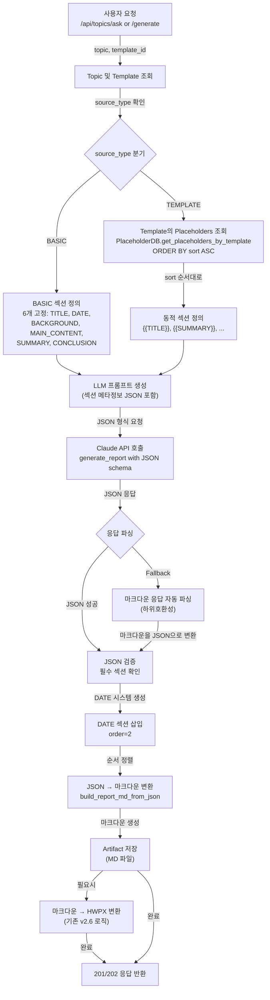
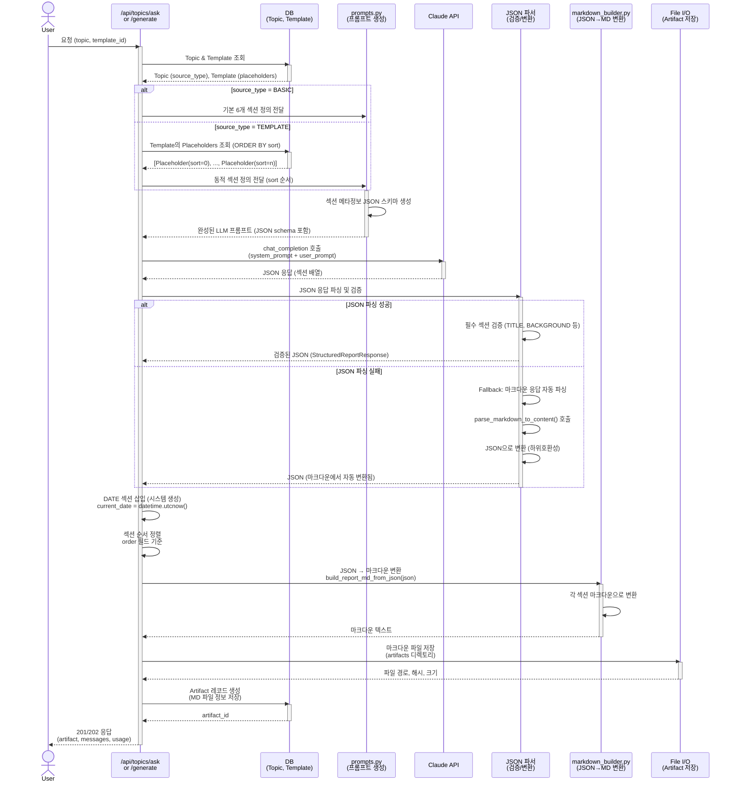

# Unit Spec: JSON 구조화 섹션 메타정보 기반 MD/HWPX 생성

**작성일:** 2025-11-28
**버전:** 1.0
**상태:** 검토 대기

---

## 1. 요구사항 요약

### 1.1 Purpose (목적)
현재 LLM이 단순 마크다운만 반환하므로 **섹션별 메타정보(타입, 순서, 속성) 없이 매칭이 어려움**.
이를 해결하기 위해 LLM에게 **JSON 형식으로 구조화된 섹션 메타정보**를 담아서 요청하고, 이를 통해 **마크다운 및 HWPX 생성시 정확한 매칭** 지원.

### 1.2 Type
**신규 기능 (new feature)**
- LLM JSON 응답 포맷 지원
- 섹션 메타정보 기반 MD/HWPX 생성

### 1.3 Core Requirements

#### **Requirement 1: Source Type별 고정 섹션 정의**

**1-1. source_type = BASIC (기본)**
```
섹션 순서 (고정):
  1. TITLE       (제목) - LLM이 생성
  2. DATE        (생성일) - 시스템에서 자동 생성 (YYYY-MM-DD)
  3. BACKGROUND  (배경) - LLM이 생성
  4. MAIN_CONTENT (주요내용) - LLM이 생성
  5. SUMMARY     (요약) - LLM이 생성
  6. CONCLUSION  (결론) - LLM이 생성
```

**1-2. source_type = TEMPLATE (템플릿 기반)**
```
섹션 순서 (templates.placeholders에서 sort로 결정):
  - placeholders 테이블의 sort 컬럼 값 순서대로 고정
  - 예시:
    sort=0: {{TITLE}}       → TITLE 섹션
    sort=1: {{SUMMARY}}     → SUMMARY 섹션
    sort=2: {{MARKET_ANALYSIS}} → MARKET_ANALYSIS 섹션
    ...
```

#### **Requirement 2: LLM에게 JSON으로 요청**

**요청 프롬프트 구조:**
```python
{
  "format": "json",
  "sections": [
    {
      "type": "TITLE",
      "required": true,
      "description": "보고서 제목 (최대 100자)"
    },
    {
      "type": "BACKGROUND",
      "required": true,
      "description": "배경 및 목적 (500-1000자)"
    },
    # source_type=TEMPLATE일 경우 placeholders 추가
    {
      "type": "MARKET_ANALYSIS",  # placeholder_key를 type으로 변환
      "placeholder_key": "{{MARKET_ANALYSIS}}",
      "required": true,
      "description": "시장 분석 내용"
    }
  ]
}
```

**LLM 응답 포맷:**
```json
{
  "sections": [
    {
      "id": "TITLE",
      "type": "TITLE",
      "content": "2025년 디지털뱅킹 트렌드 분석",
      "order": 1,
      "source_type": "basic"
    },
    {
      "id": "BACKGROUND",
      "type": "SECTION",
      "placeholder_key": null,
      "content": "금융 산업은 ...",
      "order": 2,
      "source_type": "basic"
    },
    {
      "id": "MARKET_ANALYSIS",
      "type": "SECTION",
      "placeholder_key": "{{MARKET_ANALYSIS}}",
      "content": "글로벌 시장은 ...",
      "order": 3,
      "source_type": "template"
    }
  ],
  "metadata": {
    "generated_at": "2025-11-28T14:30:00",
    "model": "claude-sonnet-4-5-20250929",
    "total_sections": 3
  }
}
```

#### **Requirement 3: DATE 섹션은 시스템에서 생성**
```python
# LLM 응답에 DATE 섹션은 없음
# 백엔드에서 생성하여 마크다운 추가
current_date = datetime.utcnow().strftime("%Y-%m-%d")
date_section = {
  "id": "DATE",
  "type": "DATE",
  "content": current_date,
  "order": 2,  # TITLE 다음
  "source_type": "system"
}
```

#### **Requirement 4: JSON → 마크다운 변환**

**변환 예시:**
```python
# JSON 입력
{
  "sections": [
    {"id": "TITLE", "content": "보고서 제목", "order": 1},
    {"id": "DATE", "content": "2025-11-28", "order": 2},
    {"id": "BACKGROUND", "content": "배경 내용...", "order": 3},
  ]
}

# 마크다운 출력
# 보고서 제목
_생성일: 2025-11-28_

## 배경 및 목적
배경 내용...
```

#### **Requirement 5: 하위호환성 유지**
- 기존 마크다운 응답도 계속 지원
- 마크다운 자동 파싱 후 JSON 형식으로 변환 (Fallback)

---

## 2. 구현 대상 파일

| 구분 | 파일 | 설명 |
|------|------|------|
| **신규** | `models/report_section.py` | SectionMetadata, StructuredReportResponse 모델 |
| **변경** | `models/report.py` | StructuredReportResponse 추가 |
| **변경** | `utils/claude_client.py` (Line 58-225) | generate_report() → JSON 응답 지원 |
| **변경** | `utils/prompts.py` | LLM 프롬프트 개선 (섹션 메타정보 포함) |
| **변경** | `utils/markdown_builder.py` | JSON → 마크다운 변환 함수 추가 |
| **변경** | `routers/topics.py` (Line 412-901) | ask() → JSON 응답 처리 |
| **변경** | `routers/topics.py` (Line 1691-1921) | _background_generate_report() → JSON 처리 |
| **신규** | `tests/test_json_section_metadata.py` | JSON 섹션 메타정보 테스트 (8개 TC) |

---

## 3. 동작 플로우 (Mermaid Flowchart)



---

## 4. 상세 처리 흐름 (Sequence Diagram)



---

## 5. 테스트 계획

### 5.1 Unit 테스트 (5개)

**TC-001: JSON 섹션 메타정보 생성 (BASIC)**
- **입력:** source_type=BASIC
- **처리:** 6개 고정 섹션 정의 생성
- **검증:**
  - 섹션 개수 = 6 (TITLE, DATE, BACKGROUND, MAIN_CONTENT, SUMMARY, CONCLUSION)
  - order 필드: 1-6 순차
  - source_type 필드: 모두 'basic' 또는 'system'
- **예상 결과:** ✅ JSON 스키마 성공 생성

**TC-002: JSON 섹션 메타정보 생성 (TEMPLATE)**
- **입력:** source_type=TEMPLATE, template_id=1, placeholders=[{sort=0, key='{{TITLE}}'}, {sort=1, key='{{MARKET_ANALYSIS}}'}, {sort=2, key='{{CONCLUSION}}'}]
- **처리:** 동적 섹션 정의 생성
- **검증:**
  - 섹션 개수 = 3 (placeholders 개수)
  - order 필드: 1-3 순차 (sort 값에 따라)
  - placeholder_key 필드: {{TITLE}}, {{MARKET_ANALYSIS}}, {{CONCLUSION}}
  - source_type 필드: 모두 'template'
- **예상 결과:** ✅ 동적 JSON 스키마 성공 생성

**TC-003: LLM JSON 응답 파싱 및 검증**
- **입력:** Claude API JSON 응답
  ```json
  {
    "sections": [
      {"id": "TITLE", "content": "보고서 제목", "type": "TITLE"},
      {"id": "BACKGROUND", "content": "배경...", "type": "SECTION"}
    ]
  }
  ```
- **처리:** 응답 파싱 및 필수 필드 검증
- **검증:**
  - JSON 파싱 성공 (Pydantic StructuredReportResponse)
  - id, content, type 필드 모두 존재
  - content 길이 > 0
- **예상 결과:** ✅ 검증된 StructuredReportResponse 객체 반환

**TC-004: JSON → 마크다운 변환**
- **입력:** StructuredReportResponse (3개 섹션)
  ```python
  {
    "sections": [
      {"id": "TITLE", "content": "보고서 제목", "order": 1},
      {"id": "DATE", "content": "2025-11-28", "order": 2},
      {"id": "BACKGROUND", "content": "배경 내용...", "order": 3}
    ]
  }
  ```
- **처리:** JSON → 마크다운 변환
- **검증:**
  - 마크다운 포함 요소:
    - H1 제목: `# 보고서 제목`
    - 생성일: `_생성일: 2025-11-28_`
    - H2 섹션: `## 배경 및 목적`
  - 섹션 순서: order 기준으로 정렬
- **예상 결과:** ✅ 유효한 마크다운 생성

**TC-005: Fallback - 마크다운 응답 자동 파싱**
- **입력:** LLM이 JSON이 아닌 마크다운만 반환
- **처리:** 자동 파싱 및 JSON으로 변환
- **검증:**
  - parse_markdown_to_content() 호출
  - 섹션 추출 성공 (title, background, main_content, etc.)
  - JSON 형식으로 변환됨
- **예상 결과:** ✅ 마크다운이 JSON으로 자동 변환됨

### 5.2 Integration 테스트 (2개)

**TC-006: 전체 흐름 - BASIC 타입**
- **입력:** 사용자 요청, source_type=BASIC
- **처리:** 전체 엔드-투-엔드
  1. 섹션 정의 생성
  2. LLM 호출
  3. JSON 파싱
  4. DATE 삽입
  5. 마크다운 생성
  6. 파일 저장
- **검증:**
  - Artifact 생성됨
  - 마크다운 파일 존재
  - 파일 크기 > 100 bytes
  - SHA256 해시 계산됨
- **예상 결과:** ✅ artifact_id 반환

**TC-007: 전체 흐름 - TEMPLATE 타입**
- **입력:** 사용자 요청, source_type=TEMPLATE, template_id=1
- **처리:** 전체 엔드-투-엔드
  1. Template placeholders 조회 (sort 순서)
  2. 동적 섹션 정의 생성
  3. LLM 호출
  4. JSON 파싱
  5. 마크다운 생성
  6. 파일 저장
- **검증:**
  - Artifact 생성됨
  - placeholder_key 매칭 확인
  - 섹션 순서 = sort 순서
- **예상 결과:** ✅ artifact_id 반환

### 5.3 API 테스트 (3개)

**TC-008: POST /api/topics/ask - JSON 응답**
- **요청:** /api/topics/{topic_id}/ask
- **조건:** source_type=BASIC
- **검증:**
  - 200 OK
  - artifact 객체 반환
  - artifact.kind = 'MD'
  - message_id 설정됨
- **예상 결과:** ✅ 완료된 artifact 반환

**TC-009: POST /api/topics/generate - JSON 응답 (백그라운드)**
- **요청:** POST /api/topics/generate (background 생성)
- **조건:** source_type=TEMPLATE
- **검증:**
  - 202 Accepted (백그라운드 작업)
  - generation_id 반환
  - GET /status에서 진행상황 추적 가능
- **예상 결과:** ✅ 202 + generation_id

**TC-010: 마크다운 → HWPX 변환 (기존 v2.6)**
- **요청:** POST /api/artifacts/{artifact_id}/convert-hwpx
- **조건:** artifact.kind = 'MD'
- **검증:**
  - 200 OK
  - HWPX 파일 다운로드
  - 파일 크기 > 1KB
- **예상 결과:** ✅ HWPX 파일 반환

---

## 6. 에러 처리 시나리오

### 6.1 JSON 파싱 실패

**상황:** LLM이 유효하지 않은 JSON 반환
```python
response = "{"sections": [invalid json"  # 문법 오류
```

**처리:**
1. JSON 파싱 시도 → 실패 감지
2. Fallback: 마크다운 자동 파싱 수행
3. 마크다운을 JSON으로 변환
4. 계속 진행

**에러 코드:** 없음 (자동 복구)
**로그:** `logger.warning(f"JSON parsing failed, using markdown fallback")`

### 6.2 필수 섹션 누락

**상황:** LLM이 필수 섹션(TITLE)을 생략
```json
{
  "sections": [
    {"id": "BACKGROUND", "content": "..."}
  ]
}
```

**처리:**
1. 검증 실패 (TITLE 없음)
2. 에러 로깅
3. 마크다운 자동 파싱 Fallback

**에러 코드:** `SERVER.VALIDATION_ERROR`
**HTTP 상태:** 400 Bad Request
**메시지:** `"필수 섹션(TITLE)이 누락되었습니다."`

### 6.3 Template placeholders 불일치

**상황:** LLM이 정의되지 않은 placeholder_key 사용
```json
{
  "sections": [
    {"id": "UNDEFINED_KEY", "placeholder_key": "{{UNDEFINED}}", "content": "..."}
  ]
}
```

**처리:**
1. 검증 시 placeholder_key 확인
2. template placeholders와 비교
3. 불일치하면 경고 로그
4. 계속 진행 (비차단)

**에러 코드:** 없음 (경고만)
**로그:** `logger.warning(f"Placeholder {{UNDEFINED}} not found in template")`

### 6.4 DATE 섹션 중복 생성

**상황:** LLM이 DATE 섹션을 이미 생성한 경우
```json
{
  "sections": [
    {"id": "DATE", "content": "2025-11-28"}
  ]
}
```

**처리:**
1. 백엔드에서 DATE 섹션 생성
2. 중복 검사 (id='DATE')
3. 중복이면 LLM 응답 제거 후 시스템 생성 DATE만 유지

**에러 코드:** 없음 (자동 처리)
**로그:** `logger.info(f"DATE section already in LLM response, using system-generated date")`

---

## 7. 기술 선택 사항

### 7.1 JSON vs Markdown 응답 선택 이유

**왜 JSON을 기본으로 하는가?**
- ✅ 섹션 메타정보 명시적 포함
- ✅ 순서 보장 (order 필드)
- ✅ 타입 정보 포함 (type 필드)
- ✅ 검증 가능 (Pydantic)

**왜 Markdown Fallback을 유지하는가?**
- ✅ 기존 코드와의 호환성
- ✅ LLM 응답 부분 실패시 복구
- ✅ 점진적 마이그레이션 지원

### 7.2 DATE 섹션 처리 - 시스템 생성

**왜 LLM에게 DATE를 요청하지 않는가?**
- ❌ LLM은 타임스탬프를 정확하게 모름 (학습 시점 기준)
- ❌ 매번 다른 형식으로 생성할 수 있음
- ✅ 시스템 날짜가 항상 정확하고 일관됨

### 7.3 PlaceholderDB.sort 활용

**placeholders 정렬 방식:**
```python
# ✅ NEW: sort 컬럼으로 확실한 순서 보장
PlaceholderDB.get_placeholders_by_template(template_id)
# ORDER BY sort ASC, created_at ASC
```

**장점:**
- 마이크로초 경합 제거
- 배치 생성시 순서 보장
- 사용자 재정렬 가능 (향후)

---

## 8. 데이터 모델 설계

### 8.1 신규 모델: `models/report_section.py`

```python
from pydantic import BaseModel, Field
from typing import List, Optional
from enum import Enum

class SectionType(str, Enum):
    """섹션 타입 정의."""
    TITLE = "TITLE"
    DATE = "DATE"
    BACKGROUND = "BACKGROUND"
    MAIN_CONTENT = "MAIN_CONTENT"
    SUMMARY = "SUMMARY"
    CONCLUSION = "CONCLUSION"
    SECTION = "SECTION"  # 템플릿 기반 커스텀 섹션

class SourceType(str, Enum):
    """섹션 출처 타입."""
    BASIC = "basic"       # 기본 고정 섹션
    TEMPLATE = "template" # 템플릿 기반 섹션
    SYSTEM = "system"     # 시스템이 생성한 섹션 (DATE)

class SectionMetadata(BaseModel):
    """개별 섹션 메타정보."""
    id: str = Field(..., description="섹션 ID (예: TITLE, {{MARKET_ANALYSIS}})")
    type: SectionType = Field(..., description="섹션 타입")
    content: str = Field(..., min_length=1, description="섹션 내용")
    order: int = Field(..., ge=1, description="섹션 순서 (1-based)")
    placeholder_key: Optional[str] = Field(None, description="템플릿 placeholder_key ({{KEY}} 형식)")
    source_type: SourceType = Field(..., description="섹션 출처 (basic, template, system)")

class StructuredReportResponse(BaseModel):
    """구조화된 보고서 응답 (JSON)."""
    sections: List[SectionMetadata] = Field(..., description="섹션 배열")
    metadata: Optional[dict] = Field(None, description="메타데이터 (생성일, 모델, 등)")

    class Config:
        json_schema_extra = {
            "example": {
                "sections": [
                    {
                        "id": "TITLE",
                        "type": "TITLE",
                        "content": "2025년 디지털뱅킹 트렌드",
                        "order": 1,
                        "source_type": "basic"
                    },
                    {
                        "id": "DATE",
                        "type": "DATE",
                        "content": "2025-11-28",
                        "order": 2,
                        "source_type": "system"
                    }
                ]
            }
        }
```

### 8.2 수정 모델: `models/template.py` - Placeholder

```python
class PlaceholderCreate(PlaceholderBase):
    """플레이스홀더 생성 모델."""
    template_id: int = Field(..., description="템플릿 ID")
    sort: Optional[int] = Field(None, description="정렬 순서 (0-based index)")  # ✅ 기존

class Placeholder(PlaceholderCreate):
    """플레이스홀더 응답 모델."""
    id: int
    sort: int = Field(0, description="정렬 순서 (0-based index)")  # ✅ 기존
    created_at: datetime

    class Config:
        from_attributes = True
```

---

## 9. 함수 설계

### 9.1 `utils/prompts.py` - 프롬프트 생성

```python
def create_section_schema(source_type: TopicSourceType,
                         placeholders: Optional[List[Placeholder]] = None) -> dict:
    """
    소스 타입별 섹션 스키마 JSON 생성.

    Args:
        source_type: BASIC 또는 TEMPLATE
        placeholders: Template 기반일 때만 사용 (sort 순서)

    Returns:
        섹션 메타정보 JSON 스키마 (LLM에 전달용)

    Example:
        BASIC:
        {
          "sections": [
            {"type": "TITLE", "required": True, ...},
            {"type": "BACKGROUND", "required": True, ...},
            ...
          ]
        }

        TEMPLATE:
        {
          "sections": [
            {"type": "TITLE", "placeholder_key": "{{TITLE}}", ...},
            {"type": "MARKET_ANALYSIS", "placeholder_key": "{{MARKET_ANALYSIS}}", ...}
            ...
          ]
        }
    """
```

### 9.2 `utils/markdown_builder.py` - JSON → 마크다운

```python
def build_report_md_from_json(structured_response: StructuredReportResponse) -> str:
    """
    JSON 구조화 응답을 마크다운으로 변환.

    Args:
        structured_response: StructuredReportResponse 객체

    Returns:
        완성된 마크다운 문자열

    Process:
        1. sections를 order로 정렬
        2. 각 섹션을 마크다운으로 변환
        3. 섹션 연결

    Example Input:
        {
          "sections": [
            {"id": "TITLE", "content": "보고서 제목", "order": 1},
            {"id": "DATE", "content": "2025-11-28", "order": 2},
            {"id": "BACKGROUND", "content": "배경...", "order": 3}
          ]
        }

    Example Output:
        # 보고서 제목
        _생성일: 2025-11-28_

        ## 배경 및 목적
        배경...
    """
```

### 9.3 `utils/claude_client.py` - JSON 지원

```python
def generate_report(self,
                   topic: str,
                   plan_text: Optional[str] = None,
                   system_prompt: Optional[str] = None,
                   section_schema: Optional[dict] = None,  # ✅ NEW
                   isWebSearch: bool = False) -> Union[str, StructuredReportResponse]:
    """
    주제를 받아 JSON 또는 Markdown으로 보고서 생성.

    Args:
        topic: 보고서 주제
        plan_text: 계획
        system_prompt: 시스템 프롬프트
        section_schema: 섹션 메타정보 스키마 (JSON)  # ✅ NEW
        isWebSearch: 웹 검색 활성화 여부

    Returns:
        StructuredReportResponse (JSON) 또는 str (마크다운 Fallback)

    Process:
        1. section_schema가 있으면 JSON 응답 요청
        2. 응답 파싱 및 검증
        3. 실패시 마크다운 Fallback
    """
```

---

## 10. API 엔드포인트 변경사항

### 10.1 POST /api/topics/ask (변경)

**기존 응답:**
```json
{
  "success": true,
  "data": {
    "artifact": {
      "id": 123,
      "kind": "MD",
      "content": "# 보고서..."
    }
  }
}
```

**신규 응답 (동일):**
```json
{
  "success": true,
  "data": {
    "artifact": {
      "id": 123,
      "kind": "MD",
      "content": "# 보고서..."  // 마크다운 (JSON 기반 생성)
    }
  }
}
```

**변경 내용:**
- ✅ 응답 형식은 동일 (마크다운)
- ⚠️ 내부 처리가 JSON으로 변경 (사용자에게 투명)

### 10.2 POST /api/topics/generate (변경)

**기존 응답:**
```json
{
  "success": true,
  "data": {
    "generation_id": "gen_123",
    "status": "processing"
  }
}
```

**신규 응답 (동일):**
```json
{
  "success": true,
  "data": {
    "generation_id": "gen_123",
    "status": "processing"
  }
}
```

**변경 내용:**
- ✅ 응답 형식은 동일 (백그라운드 작업)
- ⚠️ 내부 처리가 JSON으로 변경

---

## 11. 구현 체크리스트

### Phase 1: 데이터 모델 (Step 1-1)
- [ ] `models/report_section.py` 신규 생성
  - [ ] SectionType Enum
  - [ ] SourceType Enum
  - [ ] SectionMetadata 클래스
  - [ ] StructuredReportResponse 클래스
- [ ] `models/template.py` 수정
  - [ ] PlaceholderCreate에 sort 필드 확인
  - [ ] Placeholder에 sort 필드 확인

### Phase 2: 유틸리티 함수 (Step 1-3)
- [ ] `utils/prompts.py` 수정
  - [ ] create_section_schema() 함수 추가
  - [ ] source_type별 섹션 정의 로직
  - [ ] Placeholder sort 기반 정렬
- [ ] `utils/markdown_builder.py` 수정
  - [ ] build_report_md_from_json() 함수 추가
  - [ ] 섹션 → 마크다운 변환 로직

### Phase 3: Claude 클라이언트 (Step 1-3)
- [ ] `utils/claude_client.py` 수정
  - [ ] generate_report() → section_schema 파라미터 추가
  - [ ] JSON 응답 파싱 로직
  - [ ] Markdown Fallback 로직
  - [ ] DATE 섹션 자동 생성

### Phase 4: 라우터 (Step 1-4)
- [ ] `routers/topics.py` - ask() 수정 (라인 412-901)
  - [ ] Step 3: 섹션 스키마 생성 추가
  - [ ] Step 6: JSON 응답 처리 로직 추가
- [ ] `routers/topics.py` - _background_generate_report() 수정 (라인 1691-1921)
  - [ ] Step 2-3: JSON 응답 처리 로직 추가

### Phase 5: 테스트 (Step 1-5)
- [ ] `tests/test_json_section_metadata.py` 신규 생성
  - [ ] TC-001: BASIC 섹션 생성
  - [ ] TC-002: TEMPLATE 섹션 생성
  - [ ] TC-003: JSON 파싱 및 검증
  - [ ] TC-004: JSON → 마크다운 변환
  - [ ] TC-005: Markdown Fallback
  - [ ] TC-006: 전체 흐름 (BASIC)
  - [ ] TC-007: 전체 흐름 (TEMPLATE)
  - [ ] TC-008: /ask API
  - [ ] TC-009: /generate API
  - [ ] TC-010: HWPX 변환

### Phase 6: 검증 (Step 2)
- [ ] 기존 테스트 호환성 확인 (27개)
- [ ] 마크다운 파싱 호환성 확인
- [ ] HWPX 변환 호환성 확인
- [ ] CLAUDE.md 업데이트

---

## 12. 가정사항

1. **PlaceholderDB.sort는 이미 구현됨**
   - sort 컬럼 생성 완료
   - get_placeholders_by_template()에서 ORDER BY sort ASC 적용됨
   - ✅ 확인됨

2. **LLM은 요청한 JSON 스키마를 따를 수 있다**
   - 프롬프트 엔지니어링으로 JSON 응답 유도 가능
   - 응답 형식 지정 가능

3. **마크다운 Fallback은 완벽하게 동작한다**
   - parse_markdown_to_content()가 모든 섹션을 추출 가능
   - 기존 v2.3 로직 재사용

4. **DATE 섹션은 항상 두 번째 위치**
   - 보고서 제목 다음에 생성일 표시
   - 사용자가 변경 불가 (고정)

---

## 13. 참고 자료

- **기존 마크다운 파싱:** `utils/markdown_parser.py` (v2.3)
- **기존 마크다운 생성:** `utils/markdown_builder.py` (v2.3)
- **기존 HWPX 변환:** `utils/md_to_hwpx_converter.py` (v2.6)
- **PlaceholderDB 스키마:** `backend/app/database/connection.py` (라인 170)
- **Placeholder 모델:** `backend/app/models/template.py` (라인 24-31)

---

## 14. 버전 정보

- **Unit Spec 버전:** 1.0
- **대상 프로젝트 버전:** v2.10
- **작성 일자:** 2025-11-28
- **예상 구현 난이도:** 🟡 중간 (8-12시간)
- **예상 테스트 커버리지:** 90%+ (10개 TC)

---

**승인 대기중입니다. 위 스펙에서 수정할 부분이 있으신가요?**
