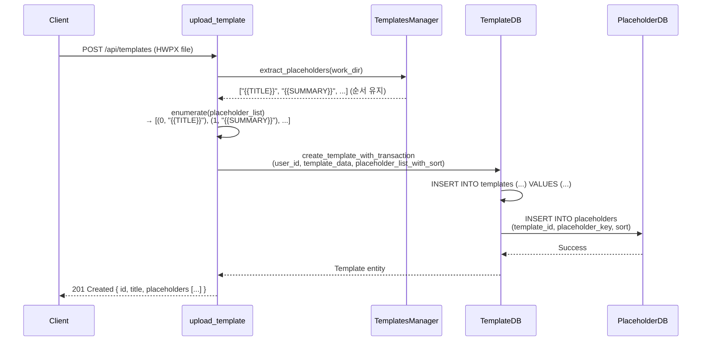

# Unit Spec: Placeholders DB에 Sort 컬럼 추가

**작성일**: 2025-11-28
**버전**: 1.0
**상태**: 검토 중

---

## 1. 요구사항 요약

### Purpose
Template 업로드 시 HWPX에서 읽어온 placeholder들의 순서를 명시적으로 DB에 저장하여, 순서 기반 관리를 가능하게 함.

### Type
- 분류: 리팩토링 (기능 개선)
- 규모: 소 (선택적 컬럼 추가)

### Core Requirements

#### 요구사항
1. **Placeholders 테이블 스키마 확장**
   - 신규 컬럼: `sort` (INTEGER, NOT NULL, DEFAULT 0)
   - 목적: Placeholder의 순서를 0부터 시작하여 저장
   - 범위: 0 이상의 정수

2. **POST /api/templates 개선**
   - upload_template 함수에서 placeholder_list의 순서를 보존하여 sort 값으로 저장
   - HWPX 파일에서 순서대로 추출된 placeholder를 그대로 DB에 저장

3. **PlaceholderDB 메서드 업데이트**
   - `create_placeholders_batch()`: sort 값 함께 저장
   - `get_placeholders_by_template()`: ORDER BY sort ASC로 순서 보장

#### 입출력 정의
**입력 (upload_template)**:
- HWPX 파일에서 추출된 placeholder list (순서 유지)
  ```python
  placeholder_list = ["{{TITLE}}", "{{SUMMARY}}", "{{BACKGROUND}}"]
  # 순서 인덱스: TITLE(0), SUMMARY(1), BACKGROUND(2)
  ```

**출력 (DB 저장)**:
```sql
INSERT INTO placeholders (template_id, placeholder_key, sort, created_at)
VALUES (1, "{{TITLE}}", 0, now),
       (1, "{{SUMMARY}}", 1, now),
       (1, "{{BACKGROUND}}", 2, now)
```

#### 제약사항
- sort 값은 0부터 시작하는 순차적 정수
- 동일 template_id 내에서 sort 값은 고유해야 함 (또는 중복 허용)
- 기존 데이터: sort = NULL 또는 0 (마이그레이션 필요)

---

## 2. 구현 대상 파일

| 구분 | 파일 경로 | 설명 |
|------|---------|------|
| **신규** | `backend/app/database/migrations/001_add_placeholder_sort.sql` | DB 마이그레이션 스크립트 (sort 컬럼 추가) |
| **변경** | `backend/app/database/connection.py` | 마이그레이션 적용 로직 (init_db 함수에 통합) |
| **변경** | `backend/app/models/template.py` | Placeholder 모델에 sort 필드 추가 |
| **변경** | `backend/app/database/template_db.py` | PlaceholderDB 클래스 업데이트 |
| **변경** | `backend/app/routers/templates.py` | upload_template 함수 개선 (sort 전달) |
| **변경** | `backend/tests/test_templates_*.py` | Placeholder 관련 테스트 수정 및 신규 테스트 추가 |

---

## 3. 동작 흐름도

### 3.1 전체 흐름 (Sequence Diagram)



### 3.2 Database Schema Change

**Before (현재)**:
```sql
CREATE TABLE placeholders (
    id INTEGER PRIMARY KEY AUTOINCREMENT,
    template_id INTEGER NOT NULL,
    placeholder_key TEXT NOT NULL,
    created_at TIMESTAMP NOT NULL,
    FOREIGN KEY(template_id) REFERENCES templates(id)
)
```

**After (변경 후)**:
```sql
CREATE TABLE placeholders (
    id INTEGER PRIMARY KEY AUTOINCREMENT,
    template_id INTEGER NOT NULL,
    placeholder_key TEXT NOT NULL,
    sort INTEGER NOT NULL DEFAULT 0,        -- ✅ 신규 컬럼
    created_at TIMESTAMP NOT NULL,
    FOREIGN KEY(template_id) REFERENCES templates(id)
)
```

### 3.3 Code Flow Changes

#### 단계 1: Placeholder 추출 (기존 동일)
```python
# backend/app/routers/templates.py - upload_template
placeholders = manager.extract_placeholders(work_dir)  # 순서 보장
placeholder_list = placeholders  # ["{{TITLE}}", "{{SUMMARY}}", ...]
```

#### 단계 2: Sort 인덱스 추가 (신규)
```python
# Sort 값과 함께 저장할 데이터 구성
placeholder_with_sort = [
    (sort_idx, key)
    for sort_idx, key in enumerate(placeholder_list)
]
# [(0, "{{TITLE}}"), (1, "{{SUMMARY}}"), (2, "{{BACKGROUND}}")]
```

#### 단계 3: Template + Placeholder 트랜잭션 저장 (변경)
```python
# backend/app/database/template_db.py - create_template_with_transaction
template = TemplateDB.create_template_with_transaction(
    current_user.id,
    template_data,
    placeholder_list,  # 기존
    placeholder_sort_list  # 신규: sort 값 리스트
)
```

#### 단계 4: DB INSERT 실행 (변경)
```python
# Before
cursor.executemany(
    """INSERT INTO placeholders (template_id, placeholder_key, created_at)
       VALUES (?, ?, ?)""",
    [(template_id, key, now) for key in placeholder_keys]
)

# After
cursor.executemany(
    """INSERT INTO placeholders (template_id, placeholder_key, sort, created_at)
       VALUES (?, ?, ?, ?)""",
    [(template_id, key, sort_idx, now)
     for sort_idx, key in enumerate(placeholder_keys)]
)
```

#### 단계 5: Placeholder 조회 (변경)
```python
# Before
cursor.execute(
    "SELECT * FROM placeholders WHERE template_id = ? ORDER BY created_at ASC",
    (template_id,)
)

# After
cursor.execute(
    "SELECT * FROM placeholders WHERE template_id = ? ORDER BY sort ASC",
    (template_id,)
)
```

---

## 4. 테스트 계획

### 4.1 테스트 케이스 목록

#### TC-001: DB 마이그레이션 - Sort 컬럼 추가 확인
**목적**: Sort 컬럼이 정상적으로 추가되었는지 확인
**시나리오**:
1. 데이터베이스 초기화 (또는 마이그레이션 실행)
2. placeholders 테이블 스키마 조회
3. sort 컬럼 존재 여부 및 속성 확인 (INTEGER, DEFAULT 0)

**기대 결과**:
```sql
-- PRAGMA table_info(placeholders);
-- 컬럼 목록에 sort (INTEGER, NOT NULL, DEFAULT 0) 포함
```

**검증**:
```python
# SQL query를 통해 컬럼 메타정보 확인
PRAGMA table_info(placeholders)
# 결과: sort 컬럼이 INTEGER, NOT NULL, DEFAULT 0로 정의됨
```

#### TC-002: PlaceholderDB.create_placeholders_batch - Sort 값 저장 확인
**목적**: 배치 INSERT 시 sort 값이 정상적으로 저장되는지 확인
**시나리오**:
1. template_id = 1, placeholder_list = ["{{TITLE}}", "{{SUMMARY}}", "{{BACKGROUND}}"]
2. PlaceholderDB.create_placeholders_batch(1, placeholder_list) 호출
3. DB에서 저장된 모든 placeholder 조회

**기대 결과**:
```
Placeholder 1: key={{TITLE}}, sort=0
Placeholder 2: key={{SUMMARY}}, sort=1
Placeholder 3: key={{BACKGROUND}}, sort=2
```

**검증 코드**:
```python
placeholders = PlaceholderDB.create_placeholders_batch(1, [
    "{{TITLE}}", "{{SUMMARY}}", "{{BACKGROUND}}"
])
assert len(placeholders) == 3
assert placeholders[0].sort == 0
assert placeholders[1].sort == 1
assert placeholders[2].sort == 2
```

#### TC-003: get_placeholders_by_template - Sort 순서 조회 확인
**목적**: Placeholder 조회 시 sort 순서로 정렬되는지 확인
**시나리오**:
1. template_id = 2, 3개 placeholder 저장 (sort = 0, 1, 2)
2. PlaceholderDB.get_placeholders_by_template(2) 호출
3. 반환된 리스트가 sort 순서대로 정렬되어 있는지 확인

**기대 결과**:
```
placeholders[0].sort == 0  ({{TITLE}})
placeholders[1].sort == 1  ({{SUMMARY}})
placeholders[2].sort == 2  ({{BACKGROUND}})
```

**검증 코드**:
```python
placeholders = PlaceholderDB.get_placeholders_by_template(2)
assert len(placeholders) == 3
assert [p.sort for p in placeholders] == [0, 1, 2]
assert placeholders[0].placeholder_key == "{{TITLE}}"
```

#### TC-004: API 통합 - upload_template에서 Sort 저장 확인
**목적**: upload_template 엔드포인트가 sort 값을 정상적으로 저장하는지 확인
**시나리오**:
1. 테스트 HWPX 파일 (3개 placeholder 포함) 업로드
2. POST /api/templates 호출
3. 응답의 placeholder 리스트 확인
4. DB에서 저장된 데이터 검증

**기대 결과**:
- 응답 201 Created
- 응답 데이터에 placeholders 리스트 포함
- DB에서 조회한 placeholder들이 sort 순서대로 정렬됨

**검증 코드**:
```python
# upload_template 호출 후
response = test_client.post("/api/templates", ...)
assert response.status_code == 201
assert len(response.json()["data"]["placeholders"]) == 3

# DB 검증
placeholders = PlaceholderDB.get_placeholders_by_template(template_id)
assert [p.sort for p in placeholders] == [0, 1, 2]
```

#### TC-005: Placeholder 모델 - Sort 필드 포함 확인
**목적**: Placeholder Pydantic 모델에 sort 필드가 정상적으로 포함되었는지 확인
**시나리오**:
1. Placeholder 모델 인스턴스 생성
2. sort 필드 존재 여부 확인
3. JSON 직렬화 시 sort 필드 포함 확인

**기대 결과**:
```python
placeholder = Placeholder(
    id=1,
    template_id=1,
    placeholder_key="{{TITLE}}",
    sort=0,  # ✅ 신규 필드
    created_at=now
)
assert placeholder.sort == 0
assert "sort" in placeholder.model_dump()
```

#### TC-006: 기존 데이터 호환성 - Sort NULL 처리
**목적**: 마이그레이션 후 기존 데이터가 정상적으로 처리되는지 확인
**시나리오**:
1. 마이그레이션 전 저장된 placeholder (sort = NULL 또는 DEFAULT 0)
2. 마이그레이션 실행 후 조회
3. NULL 값이 기본값(0)으로 처리되는지 확인

**기대 결과**:
- 모든 기존 placeholder의 sort 값이 0 (기본값)으로 설정됨
- 조회 시 오류 없음

#### TC-007: 응답 형식 - PlaceholderResponse에 Sort 필드 포함 (선택사항)
**목적**: API 응답에 sort 정보를 포함할지 여부 결정
**시나리오**:
- upload_template 응답의 placeholders 리스트에 sort 포함 여부 결정

**기대 결과**:
```json
// 포함 시
{
  "placeholders": [
    { "key": "{{TITLE}}", "sort": 0 },
    { "key": "{{SUMMARY}}", "sort": 1 }
  ]
}

// 미포함 시 (현재 PlaceholderResponse는 key만 포함)
{
  "placeholders": [
    { "key": "{{TITLE}}" },
    { "key": "{{SUMMARY}}" }
  ]
}
```

---

## 5. 에러 처리 시나리오

| 시나리오 | HTTP 상태 | 에러 코드 | 처리 방법 |
|---------|----------|----------|---------|
| 마이그레이션 실패 | 500 | SERVER.INTERNAL_ERROR | 트랜잭션 롤백, 로그 기록 |
| Sort 값 충돌 | 400 | VALIDATION.INVALID_DATA | (현재 제약 없음) |
| Placeholder 조회 시 sort NULL | 200 | - | 기본값(0)으로 처리 |

---

## 6. 기술 스택 & 선택

### 6.1 데이터베이스 선택
- **SQLite**: 기존 프로젝트와 동일
- **마이그레이션 방식**: SQL 스크립트 (자동 마이그레이션 또는 수동 스크립트)

### 6.2 모델 변경
- **Pydantic**: 기존 방식 유지 (sort: Optional[int] → sort: int)
- **DB 매핑**: _row_to_placeholder에서 sort 필드 추가

### 6.3 API 응답 설계
- **PlaceholderResponse**: sort 필드 포함 여부 미결정 (사용자 요청 시 추가)
- **기본값**: sort 필드는 최소한 DB에는 저장 (API 응답은 선택사항)

---

## 7. 가정사항

1. **Placeholder 순서 불변성**: HWPX 파일에서 추출된 placeholder의 순서는 파일 구조에 의해 결정되며, 일관성 있게 추출된다고 가정.

2. **기존 데이터 마이그레이션**: 현재 테스트 DB와 실운영 DB의 기존 placeholder 데이터에 대해 sort = 0 (또는 NULL)으로 마이그레이션.

3. **정렬 기준**: 향후 placeholder 조회 시 항상 sort ASC 순서를 유지함.

4. **중복 sort 값**: 동일 template_id 내에서 sort 값 중복을 허용 (트리거 또는 제약 없음).

---

## 8. 영향도 분석

### 변경 영향 파일 목록

| 파일 | 변경 항목 | 영향도 |
|------|---------|-------|
| `template_db.py` | `create_placeholders_batch()` | 중간 (INSERT 쿼리 수정) |
| `template_db.py` | `get_placeholders_by_template()` | 중간 (ORDER BY 수정) |
| `template_db.py` | `_row_to_placeholder()` | 중간 (row 파싱 수정) |
| `template.py` | `Placeholder` 모델 | 낮음 (필드 추가) |
| `templates.py` | `upload_template()` | 중간 (sort 전달 로직 추가) |
| `tests/` | 테스트 수정 | 낮음 (기존 테스트 호환성 확인) |

### 기존 기능에 대한 영향

1. **기존 Placeholder 조회**: ORDER BY 변경으로 인한 정렬 순서 변경
   - **영향**: 플레이스홀더 표시 순서가 created_at → sort 순서로 변경
   - **호환성**: ✅ 기존 데이터 sort = 0으로 처리되므로 큰 문제 없음

2. **템플릿 삭제**: 기존 로직 영향 없음 (DELETE 쿼리 변경 없음)

3. **기존 테스트**: Placeholder 리스트 순서 검증 필요 (그리 많지 않을 것으로 예상)

---

## 9. 구현 체크리스트

### Phase 1: Database Preparation
- [ ] migration 스크립트 작성 (`001_add_placeholder_sort.sql`)
- [ ] connection.py의 init_db()에 마이그레이션 로직 추가
- [ ] 로컬 테스트 DB에서 마이그레이션 검증

### Phase 2: Model & Database Layer
- [ ] Placeholder 모델에 sort 필드 추가
- [ ] PlaceholderDB.create_placeholders_batch() 수정
- [ ] PlaceholderDB.get_placeholders_by_template() ORDER BY 수정
- [ ] PlaceholderDB._row_to_placeholder() 수정
- [ ] 단위 테스트 (TC-001~003) 작성 및 통과

### Phase 3: Router & API Layer
- [ ] upload_template에서 enumerate(placeholder_list) 추가
- [ ] create_template_with_transaction 호출 시 sort 값 전달
- [ ] API 통합 테스트 (TC-004) 작성 및 통과

### Phase 4: Testing & Validation
- [ ] 모든 테스트 케이스 (TC-001~007) 통과 확인
- [ ] 기존 테스트 (test_templates*.py) 호환성 검증
- [ ] 전체 test suite 실행 및 회귀 검증

### Phase 5: Documentation & Commit
- [ ] CLAUDE.md 업데이트 (v2.10 changelog)
- [ ] 코드 주석/Docstring 완성
- [ ] Git commit with spec reference

---

## 10. 예상 구현 시간 (참고용)

| Phase | 예상 소요 시간 |
|-------|-------------|
| Phase 1: Database | 30분 |
| Phase 2: Models & DB Layer | 1시간 |
| Phase 3: Router & API | 45분 |
| Phase 4: Testing | 1시간 |
| Phase 5: Documentation | 30분 |
| **총계** | **약 4시간** |

---

## 11. 참고 자료

- **Template 업로드 플로우**: [templates.py:120-331](backend/app/routers/templates.py#L120-L331)
- **PlaceholderDB 클래스**: [template_db.py:429-633](backend/app/database/template_db.py#L429-L633)
- **Placeholder 모델**: [template.py:12-31](backend/app/models/template.py#L12-L31)
- **기존 마이그레이션 패턴**: DB 초기화 시 테이블 생성 (connection.py 참조)

---

## 12. 질문 & 피드백 사항

**검토 시 확인 필요한 사항:**

1. **API 응답에 sort 필드 포함 여부**: PlaceholderResponse에 sort를 추가할지, 아니면 내부 DB에만 저장할지?
   - 선택지: (a) 포함 (b) 미포함

2. **마이그레이션 방식**:
   - 선택지: (a) SQL 스크립트 (b) Python 코드 (connection.py에 통합)

3. **기존 데이터 처리**:
   - 선택지: (a) sort = DEFAULT 0 (b) sort = NULL 허용

4. **Placeholder 순서 검증**: 리스트 반환 시 항상 sort ASC로 정렬할지?
   - 선택지: (a) 항상 정렬 (b) 조건부 정렬

---

**Spec 작성 완료**
**다음: 사용자 검토 및 승인 대기**
