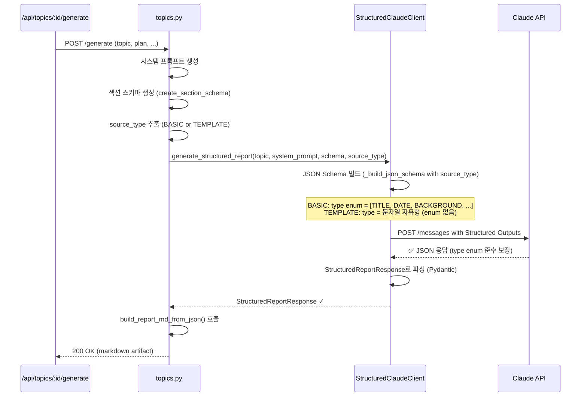

# Unit Spec: Claude Structured Outputs 통합

**작성일**: 2025-11-28
**버전**: 1.0
**상태**: 신규 (승인 대기)

---

## 1. 요구사항 요약

### Purpose
Claude API의 Structured Outputs 기능을 사용하여 보고서 생성 API 응답을 항상 유효한 JSON 형식으로 강제하기

### Type
기능 개선 (Feature Enhancement)

### Core Requirements
1. Claude API Structured Outputs 기능 통합
2. `StructuredReportResponse` 모델을 JSON Schema로 변환
3. 보고서 생성 시 항상 JSON 응답 강제
4. 기존 마크다운 폴백 제거 (JSON 전용)
5. 응답 신뢰도 향상

---

## 2. 구현 대상 파일

| 구분 | 파일 | 변경 내용 |
|------|------|---------|
| **New** | `backend/app/utils/structured_client.py` | Structured Outputs 전용 Claude 클라이언트 (320줄) |
| **Change** | `backend/app/models/report_section.py` | `SectionMetadata.type` 필드: `SectionType` → `str` (동적 type 지원) |
| **Change** | `backend/app/routers/topics.py` | `ask()`, `_background_generate_report()` 수정 (Structured Client 호출) |
| **Reference** | `backend/app/utils/claude_client.py` | 기존 로직 참고 (JSON 파싱) |
| **Reference** | `backend/app/utils/markdown_builder.py` | 기존 함수 사용 (JSON → Markdown) |

### 📌 공식 API 문서 기준
- **출처**: https://platform.claude.com/docs/en/build-with-claude/structured-outputs
- **Beta Header**: `anthropic-beta: structured-outputs-2025-11-13` (필수)
- **API 파라미터**: `output_format` (NOT response_format)
- **JSON Schema**: `additionalProperties: false` (필수)

---

## 3. 상세 설계

### 3-1. Structured Outputs JSON Schema 생성 (동적)

`StructuredReportResponse` 모델을 JSON Schema로 변환. **source_type에 따라 type enum이 동적으로 결정됨**:

#### BASIC 모드 (고정 섹션)
```json
{
  "type": "object",
  "properties": {
    "sections": {
      "type": "array",
      "items": {
        "type": "object",
        "properties": {
          "id": {"type": "string"},
          "type": {"type": "string", "enum": ["TITLE", "DATE", "BACKGROUND", "MAIN_CONTENT", "SUMMARY", "CONCLUSION"]},
          "content": {"type": "string"},
          "order": {"type": "integer"},
          "source_type": {"type": "string", "enum": ["basic", "system"]},
          "placeholder_key": {"type": ["string", "null"]},
          "description": {"type": ["string", "null"]},
          "example": {"type": ["string", "null"]}
        },
        "required": ["id", "type", "content", "order", "source_type"],
        "additionalProperties": false
      }
    }
  },
  "required": ["sections"],
  "additionalProperties": false
}
```

#### TEMPLATE 모드 (동적 섹션)
Placeholders에서 추출한 id들이 `type` 필드로 자유롭게 들어옴 (enum 제약 없음):
```json
{
  "type": "object",
  "properties": {
    "sections": {
      "type": "array",
      "items": {
        "type": "object",
        "properties": {
          "id": {"type": "string"},
          "type": {"type": "string"},
          "content": {"type": "string"},
          "order": {"type": "integer"},
          "source_type": {"type": "string", "enum": ["template", "system"]},
          "placeholder_key": {"type": ["string", "null"]},
          "description": {"type": ["string", "null"]},
          "example": {"type": ["string", "null"]}
        },
        "required": ["id", "type", "content", "order", "source_type"],
        "additionalProperties": false
      }
    }
  },
  "required": ["sections"],
  "additionalProperties": false
}
```

**주요 차이점:**
1. **type field**:
   - BASIC: enum 고정 ["TITLE", "DATE", "BACKGROUND", "MAIN_CONTENT", "SUMMARY", "CONCLUSION"]
   - TEMPLATE: 문자열 자유형 (placeholder id와 일치해야 함, enum 제약 없음)
2. **source_type enum**: BASIC은 ["basic", "system"], TEMPLATE은 ["template", "system"]

### 3-2. Structured Client 설계

**파일**: `backend/app/utils/structured_client.py`

```python
class StructuredClaudeClient:
    """Claude API Structured Outputs를 사용한 전용 클라이언트"""

    def __init__(self):
        """Anthropic 클라이언트 초기화"""

    def generate_structured_report(
        self,
        topic: str,
        system_prompt: str,
        section_schema: dict,
        source_type: str,
        context_messages: Optional[List[dict]] = None,
        temperature: float = 0.7,
        max_tokens: int = 4000
    ) -> StructuredReportResponse:
        """구조화된 보고서 생성 (Structured Outputs 사용)

        Args:
            topic: 보고서 주제
            system_prompt: 시스템 프롬프트
            section_schema: 섹션 스키마 (create_section_schema 결과)
            source_type: "BASIC" 또는 "TEMPLATE" (JSON Schema 동적 생성용)
            context_messages: 선택 메시지 (대화형)
            temperature: Claude 온도 값 (0-1)
            max_tokens: 최대 토큰 수

        Returns:
            StructuredReportResponse 객체 (항상 유효한 JSON)

        Raises:
            APIError: Claude API 호출 실패
            ValidationError: JSON Schema 검증 실패 (Claude에서 처리)
        """

    def _build_json_schema(self, section_schema: dict, source_type: str) -> dict:
        """StructuredReportResponse의 JSON Schema 생성 (동적)

        Args:
            section_schema: create_section_schema() 결과
            source_type: "BASIC" 또는 "TEMPLATE"

        Returns:
            JSON Schema dict (type enum은 source_type에 따라 동적 또는 자유형)

        Logic:
            1. BASIC 모드:
               - type enum = ["TITLE", "DATE", "BACKGROUND", "MAIN_CONTENT", "SUMMARY", "CONCLUSION"] (고정)
               - source_type enum = ["basic", "system"]
            2. TEMPLATE 모드:
               - type = 문자열 자유형 (enum 제약 없음, placeholder id와 일치)
               - source_type enum = ["template", "system"]
        """

    def _invoke_with_structured_output(
        self,
        system_prompt: str,
        user_message: str,
        json_schema: dict,
        temperature: float = 0.7,
        max_tokens: int = 4000,
        context_messages: Optional[List[dict]] = None
    ) -> dict:
        """Structured Outputs로 Claude API 호출

        Args:
            json_schema: Structured Output JSON Schema

        Returns:
            검증된 JSON dict (Claude가 보장)
        """
```

### 3-3. 호출 흐름 (Mermaid)



---

## 4. 테스트 계획

### TC-001: Structured Output JSON Schema 빌드 (BASIC)
**목표**: BASIC 모드 JSON Schema 생성 및 검증

```python
# Arrange
client = StructuredClaudeClient()
section_schema = {"sections": [...]}  # create_section_schema("BASIC") 결과
source_type = "BASIC"

# Act
json_schema = client._build_json_schema(section_schema, source_type)

# Assert
assert json_schema is not None
assert json_schema["type"] == "object"
assert "sections" in json_schema["properties"]
type_enum = json_schema["properties"]["sections"]["items"]["properties"]["type"]["enum"]
assert "TITLE" in type_enum
assert "BACKGROUND" in type_enum
assert "MAIN_CONTENT" in type_enum
assert "SUMMARY" in type_enum
assert "CONCLUSION" in type_enum
assert len(type_enum) == 6  # 고정값
```

**기대 결과**: BASIC type enum = 고정 6개

---

### TC-001B: Structured Output JSON Schema 빌드 (TEMPLATE)
**목표**: TEMPLATE 모드 JSON Schema 생성 및 검증 (type = 자유형)

```python
# Arrange
client = StructuredClaudeClient()
section_schema = {
    "sections": [
        {"id": "TITLE", "type": "TITLE", ...},
        {"id": "MARKET_ANALYSIS", "type": "MARKET_ANALYSIS", ...},
        {"id": "CUSTOM_SECTION", "type": "CUSTOM_SECTION", ...},
    ]
}
source_type = "TEMPLATE"

# Act
json_schema = client._build_json_schema(section_schema, source_type)

# Assert
assert json_schema is not None
type_field = json_schema["properties"]["sections"]["items"]["properties"]["type"]
assert type_field["type"] == "string"
assert "enum" not in type_field  # ✅ enum 제약 없음 (자유형)
source_type_enum = json_schema["properties"]["sections"]["items"]["properties"]["source_type"]["enum"]
assert "template" in source_type_enum
assert "system" in source_type_enum
```

**기대 결과**: TEMPLATE type = 문자열 자유형 (enum 없음), source_type enum = ["template", "system"]

---

### TC-002: 유효한 Structured Output 응답 처리
**목표**: Claude API의 Structured Output 응답 파싱

```python
# Arrange
mock_response = {
    "sections": [
        {
            "id": "TITLE",
            "type": "TITLE",
            "content": "보고서 제목",
            "order": 1,
            "source_type": "basic"
        },
        {
            "id": "BACKGROUND",
            "type": "SECTION",
            "content": "배경 내용",
            "order": 3,
            "source_type": "basic"
        }
    ]
}

client = StructuredClaudeClient()

# Act
response = StructuredReportResponse(**mock_response)

# Assert
assert len(response.sections) == 2
assert response.sections[0].id == "TITLE"
assert response.sections[1].order == 3
```

**기대 결과**: Pydantic 검증 성공, StructuredReportResponse 객체 생성

---

### TC-003: Markdown 변환 통합
**목표**: JSON → Markdown 변환 (build_report_md_from_json)

```python
# Arrange
response = StructuredReportResponse(
    sections=[
        SectionMetadata(id="TITLE", type=SectionType.TITLE,
                       content="테스트", order=1, source_type=SourceType.BASIC),
        SectionMetadata(id="DATE", type=SectionType.DATE,
                       content="2025.11.28", order=2, source_type=SourceType.SYSTEM),
    ]
)

# Act
markdown = build_report_md_from_json(response)

# Assert
assert "# 테스트" in markdown
assert "생성일: 2025.11.28" in markdown
assert len(markdown) > 0
```

**기대 결과**: 유효한 마크다운 문자열 생성

---

### TC-004: API 통합 - /api/topics/{id}/generate
**목표**: 실제 API 엔드포인트 호출

```python
# Arrange
topic_id = 85
request = GenerateRequest(
    isWebSearch=True,
    plan="...",
    topic="AI 시장 분석"
)

# Act
response = await client.post(
    f"/api/topics/{topic_id}/generate",
    json=request.dict(),
    headers={"Authorization": f"Bearer {token}"}
)

# Assert
assert response.status_code == 200
assert "artifact" in response.json()
artifact = response.json()["artifact"]
assert artifact["kind"] == "MD"
assert len(artifact["content"]) > 0
assert "# " in artifact["content"]  # Markdown heading
```

**기대 결과**: 200 OK, artifact with markdown content

---

### TC-005: API 통합 - /api/topics/{id}/ask
**목표**: 대화형 API 엔드포인트 호출

```python
# Arrange
topic_id = 85
request = MessageAsk(
    message="다음 섹션을 추가해줘",
    isReportRequest=True
)

# Act
response = await client.post(
    f"/api/topics/{topic_id}/ask",
    json=request.dict(),
    headers={"Authorization": f"Bearer {token}"}
)

# Assert
assert response.status_code == 200
body = response.json()
assert "artifact" in body
assert body["artifact"]["kind"] == "MD"
```

**기대 결과**: 200 OK, artifact with markdown

---

### TC-006: 에러 처리 - 빈 섹션
**목표**: 빈 섹션 배열 처리

```python
# Arrange
mock_response = {"sections": []}

# Act & Assert
with pytest.raises(ValueError):
    StructuredReportResponse(**mock_response)
```

**기대 결과**: ValueError 발생 (최소 1개 섹션 필수)

---

### TC-007: 에러 처리 - 필수 필드 누락
**목표**: 필수 필드 검증

```python
# Arrange
mock_response = {
    "sections": [
        {
            "id": "TITLE",
            # ❌ "type" 필드 누락
            "content": "제목",
            "order": 1,
            "source_type": "basic"
        }
    ]
}

# Act & Assert
with pytest.raises(ValidationError):
    StructuredReportResponse(**mock_response)
```

**기대 결과**: ValidationError 발생

---

### TC-008: 응답 시간 검증
**목표**: API 응답 시간 < 10초

```python
# Act
start_time = time.time()
response = await client.post(f"/api/topics/{topic_id}/generate", ...)
elapsed = time.time() - start_time

# Assert
assert elapsed < 10, f"Response took {elapsed}s (expected < 10s)"
```

**기대 결과**: 10초 이내 응답

---

## 5. 에러 처리 시나리오

| 시나리오 | 조건 | 처리 |
|---------|------|------|
| **API 속도 제한** | rate_limit_error | 재시도 로직 (3회, 지수백오프) |
| **API 장애** | api_error | 500 Internal Server Error 반환 |
| **토큰 초과** | invalid_request_error (max_tokens) | 토큰 한도 조정 후 재시도 |
| **JSON Schema 불일치** | Never (Claude 보장) | - |
| **네트워크 오류** | Connection error | 503 Service Unavailable |

---

## 6. 기술 스택

- **Claude API Structured Outputs** (공식 문서)
  - 참조: https://platform.claude.com/docs/en/build-with-claude/structured-outputs
  - Beta Header: `anthropic-beta: structured-outputs-2025-11-13`
  - API 파라미터: `output_format` (type: "json_schema", schema: {...})
  - ⚠️ 주의: `response_format`, `name`, `strict` 필드는 사용하지 않음

- **Anthropic SDK**: >= 0.71.0 (output_format 파라미터 지원)
- **Pydantic**: >= 2.0 (JSON Schema 생성)
- **Python**: >= 3.12

---

## 7. 함수 설계

### StructuredClaudeClient 주요 메서드

```python
class StructuredClaudeClient:
    def __init__(self):
        """인스턴스 초기화

        Beta Header 설정:
        - anthropic-beta: structured-outputs-2025-11-13 (필수)
        """

    def generate_structured_report(
        self,
        topic: str,
        system_prompt: str,
        section_schema: dict,
        source_type: str,  # "basic" 또는 "template"
        context_messages: Optional[List[dict]] = None,
        temperature: float = 0.7,
        max_tokens: int = 4000
    ) -> StructuredReportResponse:
        """구조화된 보고서 생성 (Structured Outputs)"""

    def _build_json_schema(self, section_schema: dict, source_type: str) -> dict:
        """JSON Schema 생성 (additionalProperties: false 포함)

        - BASIC 모드: type enum = 고정값
        - TEMPLATE 모드: type = 문자열 자유형
        """

    def _invoke_with_structured_output(
        self,
        system_prompt: str,
        messages: List[dict],
        json_schema: dict,
        temperature: float = 0.7,
        max_tokens: int = 4000
    ) -> dict:
        """Structured Outputs로 Claude API 호출

        ⭐ 공식 API 파라미터:
        api_params["output_format"] = {
            "type": "json_schema",
            "schema": json_schema
        }

        NOT response_format (구식)
        """

    def _build_user_message(
        self,
        topic: str,
        section_schema: dict
    ) -> str:
        """Claude에 전달할 User Message 빌드"""
```

---

## 8. 구현 체크리스트

### 단계 0: 모델 수정 (0.5h)
- [ ] `backend/app/models/report_section.py` 수정
  - `SectionMetadata.type` 필드: `SectionType` Enum → `str` (문자열)
  - 이유: TEMPLATE 모드에서 동적 type 값 지원 필요
  - 수정 내용:
    ```python
    # BEFORE
    type: SectionType = Field(...)

    # AFTER
    type: str = Field(..., description="섹션 타입 (BASIC: 고정값, TEMPLATE: 동적값)")
    ```
  - markdown_builder.py의 `section.type.value` 코드 호환성 확인 (문자열이므로 직접 사용 가능)

### 단계 1: StructuredClaudeClient 구현 (3.5h)
- [ ] Pydantic 모델에서 JSON Schema 추출 로직 (1.5h)
- [ ] StructuredClaudeClient 클래스 구현 (2h)
  - `__init__()`: Anthropic 클라이언트 초기화 (Beta Header 필수)
    - `default_headers={"anthropic-beta": "structured-outputs-2025-11-13"}`
  - `generate_structured_report()`: 메인 함수
  - `_build_json_schema()`: 동적 JSON Schema 생성 (BASIC/TEMPLATE 분기)
    - `additionalProperties: false` 추가 (root + items level)
  - `_invoke_with_structured_output()`: Claude API 호출 with output_format
    - 공식 파라미터: `output_format` (NOT response_format)
    - 필드 구조: `{"type": "json_schema", "schema": {...}}`

### 단계 2: Router 통합 (3h)
- [ ] topics.py `ask()` 함수 수정 (1.5h)
  - ClaudeClient → StructuredClaudeClient로 변경
  - section_schema, source_type 전달
- [ ] topics.py `_background_generate_report()` 수정 (1.5h)
  - 동일한 변경사항 적용

### 단계 3: 테스트 (2h)
- [ ] 테스트 케이스 작성 (TC-001 ~ TC-008) (1.5h)
- [ ] 기존 테스트 호환성 확인 (0.5h)

### 단계 4: 최종화 (1h)
- [ ] CLAUDE.md 업데이트 (0.5h)
- [ ] Unit Spec 문서 최종 확인 (0.5h)

**총 예상 시간**: 10h (모델 수정 + StructuredClient + Router 통합 + 테스트 + 문서)

---

## 9. 참고자료

### ⭐ 공식 API 문서 (필독)
- **Claude Structured Outputs 공식 가이드**
  - https://platform.claude.com/docs/en/build-with-claude/structured-outputs
  - Beta Header 설정: `anthropic-beta: structured-outputs-2025-11-13`
  - API 파라미터: `output_format` with `json_schema` type
  - JSON Schema 요구사항: `additionalProperties: false`

### 라이브러리 문서
- [Pydantic JSON Schema](https://docs.pydantic.dev/latest/concepts/json_schema/)
- [Anthropic Python SDK](https://github.com/anthropics/anthropic-sdk-python)
- [JSON Schema Specification](https://json-schema.org/)

---

## 10. 가정사항

1. **Anthropic SDK >= 0.71.0** (output_format 파라미터 지원 필수)
   - 현재 환경: anthropic==0.75.0 ✅
   - 공식 API 문서: https://platform.claude.com/docs/en/build-with-claude/structured-outputs
2. Claude Sonnet 4.5 모델이 Structured Outputs를 지원함 (API 문서 기준) ✅
3. Beta Header `anthropic-beta: structured-outputs-2025-11-13` 지원 (필수)
4. 기존 `build_report_md_from_json()` 함수가 정상 작동함 (이미 검증됨) ✅
5. 모든 JSON 응답이 유효한 UTF-8 인코딩

---

## 승인 대기 항목

- [ ] 위 설계가 요구사항을 올바르게 반영하는가?
- [ ] TC-001~TC-008이 충분한가?
- [ ] 에러 처리 시나리오가 완전한가?
- [ ] 예상 시간(13h)이 합리적인가?
- [ ] 다른 변경 사항이 필요한가?
