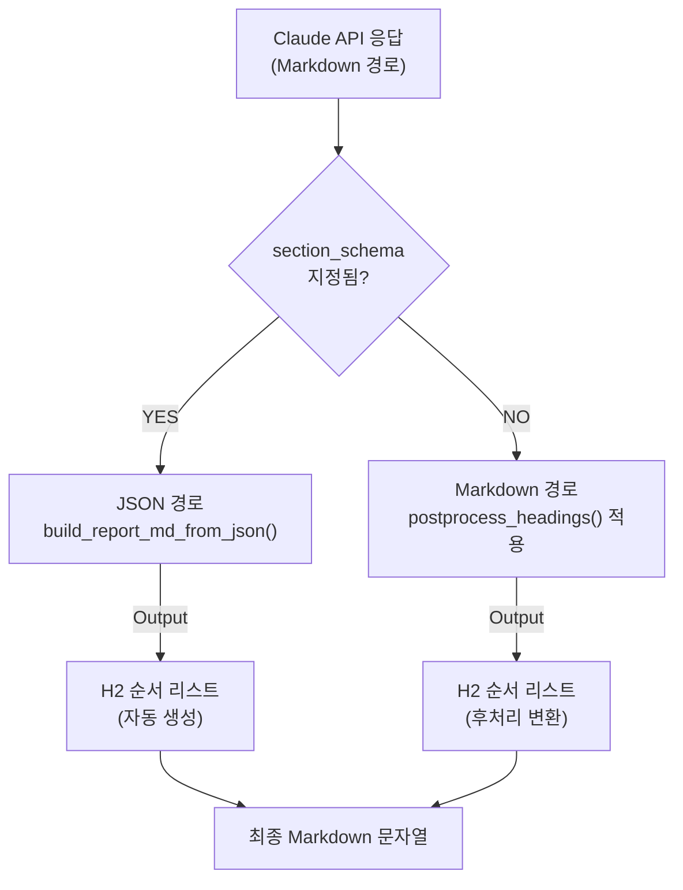
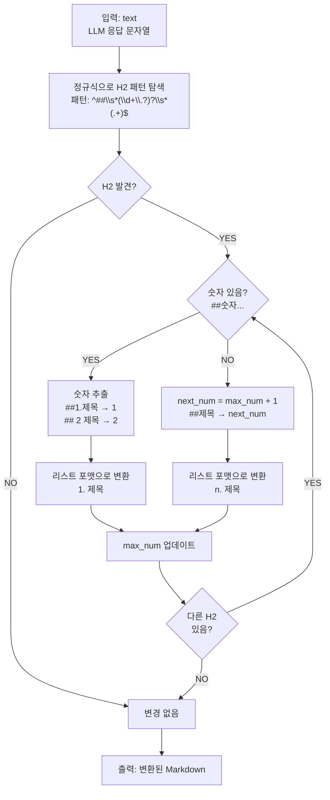

# Unit Spec: LLM H2 → 순서 리스트 변환

## 1. 요구사항 요약

### 1.1 목적 및 배경

**목적:**
- Claude API의 **Markdown 기반 응답 경로**에서 H2(`##`) 마크다운 헤딩을 순서 있는 리스트(`n. 제목`) 형식으로 자동 변환하는 전처리 함수 추가
- 현재 JSON 기반 응답(section_schema 사용)은 이미 순서 리스트를 생성하므로 이 기능은 Markdown 경로에만 적용

**배경:**
- 프로젝트는 두 가지 Claude 응답 경로 지원:
  - A. **JSON 경로** (현행, `section_schema` 지정): build_report_md_from_json() 이미 H2를 순서대로 생성 ✅
  - B. **Markdown 경로** (유산, `section_schema` 미지정): 원본 문자열만 반환, H2 후처리 로직 부재 ❌
- 이 Spec은 경로 B의 후처리 로직 구현

**유형:** ☑ 변경 ☐ 신규 ☐ 삭제

### 1.2 핵심 요구사항

- **입력:** LLM Markdown 응답 문자열 (H2 헤딩 포함)
- **출력:** H2를 순서형 리스트(`n. 제목`)로 치환한 Markdown 문자열
- **처리 규칙:**
  - **숫자가 있는 H2:** 원본 번호 신뢰, `##` 뒤 공백을 1칸으로 강제
    - `##1.제목` → `1. 제목`
    - `## 2 제목` → `2. 제목`
    - `##3.내용` → `3. 내용`
  - **숫자가 없는 H2:** `##` 제거 후 자동 순번 부여 (이전 번호 +1)
    - 첫 번호 없는 H2 → `1. 제목`
    - 다음 번호 없는 H2 → `2. 제목` (이전 처리된 항목이 2번이면 3번 부여)
  - **본문/불릿/기타:** 형태 유지, 불필요한 개행 삽입/삭제 금지
- **성능:** 정규식 기반 경량 처리 (< 100ms 응답 시간)

### 1.3 제약사항 (제외 대상)

| 항목 | 상태 | 이유 |
|------|------|------|
| H1 헤딩 (`#제목`) | ❌ 미변환 | JSON 경로의 TITLE로 이미 처리됨 |
| H3+ 헤딩 (`###제목`) | ❌ 미변환 | 범위 밖 (명시적으로 H2만) |
| 이미 리스트 포맷 (`1. 항목`) | ❌ 미변환 | 기존 리스트는 보존 |
| 코드블록 내 H2 | ❌ 스킵 | ` ``` ` 또는 ` ~~~ ` 내부 무시 (향후 개선) |
| 테이블 내 H2 | ❌ 스킵 | `\|...\|` 패턴 무시 (향후 개선) |

---

## 2. 구현 대상 파일

| 구분 | 경로 | 설명 | 우선순위 |
| ---- | ---- | ---- | ---- |
| 신규 | `backend/tests/test_markdown_builder.py` | 7개 TC 작성 (TDD 방식) | 1순위 |
| 변경 | `backend/app/utils/markdown_builder.py` | `postprocess_headings()` 함수 추가 (40줄) | 2순위 |
| 변경 | `backend/app/utils/claude_client.py` | `generate_report()` 내 Markdown 경로에서 `postprocess_headings()` 호출 추가 (1줄) | 3순위 |
| 참조 | `backend/CLAUDE.md` | 새 함수 문서화 (1-2줄) | 4순위 |

---

## 3. 동작 플로우 (Mermaid)

### 3.1 구현 흐름



### 3.2 postprocess_headings() 상세 로직



---

## 4. 테스트 계획

### 4.1 원칙

- 정규식 기반 전처리 단위 테스트 우선.
- 입력 변형 없이 본문/불릿을 보존하는지 스냅샷 검증.
- 숫자/비숫자 H2, 공백 변종, H2 없는 입력을 커버.

### 4.2 구현 예상 테스트 항목

| TC ID | 계층 | 시나리오 | 목적 | 입력/사전조건 | 기대결과 |
| --- | --- | --- | --- | --- | --- |
| TC-UT-001 | Unit | 숫자 H2 붙어 있음 | `##1.제목` → `1. 제목` 변환 | `##1.제목\n내용` | `1. 제목\n내용` (리스트 포맷, 공백 1칸, 본문 유지) |
| TC-UT-002 | Unit | 숫자 H2 공백 변종 | `## 2 제목` → `2. 제목` | `## 2 제목\n- bullet` | `2. 제목\n- bullet` (불릿 보존) |
| TC-UT-003 | Unit | 비숫자 H2 단일 | `##제목` → `1. 제목` | `##제목\n본문` | `1. 제목\n본문` (순번 자동 부여, 본문 유지) |
| TC-UT-004 | Unit | H2 없음 | 본문만 있는 경우 | `일반 텍스트\n내용` | `일반 텍스트\n내용` (변화 없음) |
| TC-UT-005 | Unit | 연속 H2 혼합 | H2 여러 개 혼합 | `##1.첫\n##제목\n## 3 셋` | `1. 첫\n2. 제목\n3. 셋` (번호 자동 조정) |
| **TC-UT-006** | Unit | **혼합 포맷 (숫자/비숫자)** | **여러 H2 유형이 섞여 있는 경우** | `##1. 배경\n##내용\n##방법\n## 4 결론` | `1. 배경\n2. 내용\n3. 방법\n4. 결론` (번호 연속성 유지) |
| **TC-UT-007** | Unit | **숫자 중복 처리** | **같은 번호가 반복되는 경우** | `##1. 첫\n##1. 중복` | `1. 첫\n2. 중복` (자동으로 다음 번호로 조정) |

**테스트 코드 위치:** `backend/tests/test_markdown_builder.py`

### 4.3 에러 처리 시나리오

| 상황 | 처리 방식 | 로깅 |
|------|---------|------|
| H2가 없는 일반 텍스트 | 원본 그대로 반환 | INFO: "No H2 headings found" |
| 숫자 형식 이상 (`##1a.제목`) | 원본 숫자 부분 추출 시도 (`1` 추출), 실패 시 자동 번호 부여 | WARN: "Failed to parse number from H2, using auto-numbering" |
| 빈 H2 (`##` 만 있음) | 빈 제목 그대로 처리 (`1. ` 형식) | DEBUG: "Empty H2 heading detected" |
| 매우 큰 번호 (`##9999.제목`) | 원본 번호 신뢰하고 유지 | INFO: "Large number detected: 9999" |
| 정규식 매칭 오류 | 무시하고 다음 라인 처리 | ERROR: "Regex error in postprocess_headings: {error}" |

---

## 5. 사용자 요청 프롬프트

**Original User Request (1차):**
```
LLM API 에서 받은 ${응답본문} 에서 ## 과같은 H2 마크다운 언어를 순서가 있는 리스트로 들어갈 수 있도록 하려면 어떻게 해야될까? 우선 계획만 세워줘. (관련 소스코드: backend/app/utils/markdown_builder.py)
```

**User Clarification/Modification (2차+):**
```
요구 정제:
- 숫자가 있는 H2의 경우: 원본 숫자를 신뢰. ##와 텍스트 사이 공백/줄바꿈을 띄어쓰기 한칸으로 변경.
- 숫자가 없는 H2의 경우: ##을 띄어쓰기 한칸으로 변경.
구현 방식: 부하가 적은 방향으로 추천.
```

**최종 명확화 (통합):**
- ✅ H2만 대상으로 정규식 전처리로 리스트 포맷 변환.
- ✅ 숫자 포함 H2: 번호 유지, `##` 뒤 공백 1칸.
- ✅ 숫자 미포함 H2: `##` 제거 후 공백 1칸 + 자동 순번 부여.
- ✅ 본문/불릿 등 나머지 콘텐츠는 원형 유지.
- ✅ 경량 처리(정규식 기반) 우선.

---

**요청 일시:** 2025-11-29

**컨텍스트/배경:**
- LLM 응답을 Markdown → HWP 등 후처리에 사용
- `backend/app/utils/markdown_builder.py`가 Markdown 생성의 진입점
- 현재 JSON 경로는 이미 구현됨 (v2.11+), Markdown 경로만 미구현

---

## 6. 구현 체크리스트

### 6.1 함수 설계

```python
def postprocess_headings(text: str) -> str:
    """H2 마크다운을 순서 리스트로 변환

    Args:
        text: 원본 Markdown 문자열 (H2 헤딩 포함 가능)

    Returns:
        H2를 순서 리스트로 변환한 문자열

    로직:
        1. 정규식으로 모든 H2 라인 탐색: ^##\s*(\d+\.?)?\s*(.+)$
        2. 각 H2에 대해:
           a. 숫자 있음 → 숫자 추출, max_num 업데이트
           b. 숫자 없음 → next_num = max(max_num, 0) + 1 할당
           c. '##' 제거, 'n. 제목' 형식으로 변환
        3. 본문/불릿/기타는 그대로 유지
        4. 변환된 텍스트 반환

    예:
        "## 배경\n내용\n##내용" → "1. 배경\n내용\n2. 내용"
    """
```

### 6.2 통합 위치

**파일:** `backend/app/utils/claude_client.py`

**함수:** `generate_report()` (Line 62~170)

**변경 위치:**
```python
# Markdown 경로 (section_schema is None)
if section_schema is None:
    response_text = client.messages.create(...)
    response_text = postprocess_headings(response_text)  # ← 추가
    return response_text
```

### 6.3 테스트 작성 순서 (TDD)

1. `backend/tests/test_markdown_builder.py` 신규 생성
2. 7개 TC 모두 작성 (test_* 함수)
3. `postprocess_headings()` 구현
4. 모든 테스트 통과 확인 (`pytest test_markdown_builder.py -v`)
5. 기존 테스트 호환성 확인 (`pytest backend/tests/ -v`)

### 6.4 코드 리뷰 포인트

- [ ] 정규식 패턴이 모든 H2 변종 포함 (`##1.`, `## 2`, `##제목` 등)
- [ ] max_num 추적이 정확한지 (중복 번호 시 조정)
- [ ] 본문/불릿이 정확히 보존되는지 (개행 유지)
- [ ] 로깅이 적절한지 (INFO/WARN/DEBUG/ERROR 레벨)
- [ ] 성능이 < 100ms 이내인지 (1000자 이상 텍스트에서도)
- [ ] 공백 처리가 일관된지 (##뒤 공백 1칸)

### 6.5 배포 전 확인

- [ ] 기존 40+ 테스트 모두 통과
- [ ] 새로운 7개 테스트 모두 통과
- [ ] 코드 커버리지: markdown_builder.py 80% 이상
- [ ] CLAUDE.md 업데이트 (새 함수 문서화)
- [ ] Unit Spec 문서 최종 검토

---

## 7. 기술 정보

### 7.1 정규식 패턴

```python
# H2 라인 매칭
pattern = r'^##\s*(\d+\.?)?\s*(.+)$'

# 설명:
# ^ : 라인 시작
# ## : 정확히 2개의 '#'
# \s* : 0개 이상의 공백
# (\d+\.?)? : 숫자 + 선택적 마침표 (그룹 1)
# \s* : 0개 이상의 공백
# (.+) : 1개 이상의 문자 = 제목 (그룹 2)
# $ : 라인 끝
```

### 7.2 알고리즘 시간 복잡도

- **시간:** O(n) - 문자열 길이 n에 비례
- **공간:** O(n) - 변환된 문자열 저장
- **정규식:** `re.MULTILINE` 플래그 사용

### 7.3 의존성

- `re` (Python 표준 라이브러리)
- `logging` (Python 표준 라이브러리)

---

## 8. 참고자료

- [Python 정규식 문서](https://docs.python.org/3/library/re.html)
- [Markdown 헤딩 문법](https://www.markdownguide.org/basic-syntax/#headings)
- `backend/CLAUDE.md` - Backend 개발 가이드
- `backend/tests/test_markdown_builder.py` - 테스트 예제
