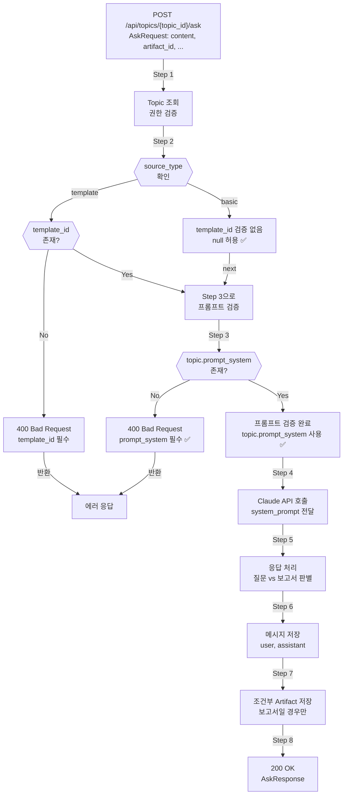

# Unit Spec: /api/topics/{topic_id}/ask 엔드포인트 source_type 기반 조건부 검증

**작성일**: 2025-12-01
**버전**: 1.3 (최종)
**상태**: 구현 대기
**Spec ID**: 20251201_ask_endpoint_source_type_conditional_validation

---

## 1. 요구사항 요약

### Purpose

`/api/topics/{topic_id}/ask` 엔드포인트에서 `source_type` 기반 조건부 `template_id` 검증을 구현합니다.
현재는 모든 토픽에서 `template_id`를 필수로 요구하고 있어, `source_type='basic'`인 토픽에서 질문할 수 없는 문제를 해결합니다.

### Type

변경 (Change) - 기존 엔드포인트 로직 개선

### Core Requirements

1. **Step 2: 조건부 template_id 검증** ✅
   - source_type 값 추출: `topic.source_type` (Enum, 기본값 'basic')
   - **source_type='template'** → `template_id` 필수 (없으면 400 에러)
   - **source_type='basic'** → `template_id` 검증 없음 (null 허용) ✅ **신규**

2. **Step 3: System Prompt 필수 검증** ✅ **신규**
   - `topic.prompt_system` 필수 필드 (없으면 400 에러)
   - ❌ template_id로 조회하지 않음 (get_system_prompt 호출 제거)
   - prompt_system은 POST /api/topics/plan에서 이미 저장되어야 함

3. **에러 처리**
   - source_type='template' + template_id 없음 → 400 Bad Request
   - prompt_system 없음 → 400 Bad Request (필수 필드) ✅ **신규**

4. **로깅 개선**
   - template_id 검증 상황 로깅
   - prompt_system 필수 검증 로깅

---

## 2. 구현 대상 파일

| 구분 | 파일 경로 | 설명 |
|------|---------|------|
| 변경 | backend/app/routers/topics.py | ask() 함수 - Step 2 조건부 검증 + Step 3 프롬프트 필수 검증 (Line 561-710) |

---

## 3. 동작 흐름

### 3.1 ask() 엔드포인트 - 전체 플로우



### 3.2 Step 2: source_type 기반 조건부 검증 (상세)

```python
# Step 2: 조건부 template_id 검증
source_type_str = "basic"  # default
if topic.source_type:
    source_type_str = topic.source_type.value if hasattr(topic.source_type, 'value') else str(topic.source_type)

logger.info(f"[ASK] source_type detected - source_type={source_type_str}")

# ✅ source_type='template'일 때만 template_id 필수 검증
if source_type_str == "template" and not topic.template_id:
    logger.warning(f"[ASK] Template required for source_type=template but missing - topic_id={topic_id}")
    return error_response(
        code=ErrorCode.TEMPLATE_NOT_FOUND,
        http_status=400,
        message="이 토픽에는 템플릿이 지정되어 있지 않습니다.",
        hint="source_type='template'인 토픽에는 템플릿이 반드시 필요합니다."
    )

logger.info(f"[ASK] template_id validation passed - source_type={source_type_str}, template_id={topic.template_id}")
```

### 3.3 Step 3: System Prompt 필수 검증 (상세) ✅ **신규**

```python
# Step 3: System Prompt 필수 검증 ✅
# ❌ template_id로 조회하지 않음 (get_system_prompt 호출 제거)
# ✅ topic.prompt_system 필수 사용

system_prompt = topic.prompt_system

if not system_prompt:
    # ❌ prompt_system이 없으면 에러 처리 (필수 필드)
    logger.error(f"[ASK] prompt_system not found (required field) - topic_id={topic_id}, source_type={source_type_str}")
    return error_response(
        code=ErrorCode.VALIDATION_REQUIRED_FIELD,
        http_status=400,
        message="이 토픽의 프롬프트가 설정되어 있지 않습니다.",
        hint="POST /api/topics/plan으로 계획을 먼저 생성해주세요."
    )

logger.info(f"[ASK] Using prompt_system from topic - source_type={source_type_str}, length={len(system_prompt)}")
```

---

## 4. 테스트 계획

### TC-001: source_type='template' + template_id 있음 + prompt_system 있음 (정상)

**목표**: template_id 검증 통과, prompt_system 사용

**입력**:
```python
topic = Topic(
    id=1,
    source_type=TopicSourceType.TEMPLATE,
    template_id=10,
    prompt_system="당신은 금융 분석가입니다..."  # ✅ 필수
)
request = AskRequest(content="질문 내용")
```

**실행**: POST /api/topics/1/ask (인증된 사용자)

**기대결과**:
- ✅ Step 2: template_id 검증 통과
- ✅ Step 3: prompt_system 필수 검증 통과
- ✅ 200 OK 응답
- ✅ assistant_message, artifact 생성

**로그 검증**:
```
[ASK] source_type detected - source_type=template
[ASK] template_id validation passed - source_type=template, template_id=10
[ASK] Using prompt_system from topic - source_type=template, length=XXX
[ASK] Calling Claude API
```

---

### TC-002: source_type='template' + template_id 없음 (Step 2 에러)

**목표**: Step 2에서 template_id 필수 검증 실패

**입력**:
```python
topic = Topic(
    id=2,
    source_type=TopicSourceType.TEMPLATE,
    template_id=None,  # ❌ 필수
    prompt_system="프롬프트..."
)
request = AskRequest(content="질문 내용")
```

**실행**: POST /api/topics/2/ask

**기대결과**:
```json
{
    "success": false,
    "error_code": "TOPIC.TEMPLATE_NOT_FOUND",
    "message": "이 토픽에는 템플릿이 지정되어 있지 않습니다.",
    "http_status": 400
}
```

**로그 검증**:
```
[ASK] source_type detected - source_type=template
[ASK] Template required for source_type=template but missing - topic_id=2
```

---

### TC-003: source_type='basic' + template_id 없음 + prompt_system 있음 (정상) ✅ **신규**

**목표**: basic 타입에서 template_id 검증 없음, prompt_system 사용

**입력**:
```python
topic = Topic(
    id=3,
    source_type=TopicSourceType.BASIC,
    template_id=None,  # ✅ null 허용
    prompt_system="기본 금융 분석 프롬프트..."
)
request = AskRequest(content="질문 내용")
```

**실행**: POST /api/topics/3/ask

**기대결과**:
- ✅ Step 2: template_id 검증 스킵 (null 허용)
- ✅ Step 3: prompt_system 필수 검증 통과
- ✅ 200 OK 응답
- ✅ assistant_message, artifact 생성

**로그 검증**:
```
[ASK] source_type detected - source_type=basic
[ASK] template_id validation passed - source_type=basic, template_id=None
[ASK] Using prompt_system from topic - source_type=basic, length=XXX
```

---

### TC-004: source_type='basic' + template_id 없음 + prompt_system 없음 (Step 3 에러) ✅ **신규**

**목표**: Step 3에서 prompt_system 필수 검증 실패

**입력**:
```python
topic = Topic(
    id=4,
    source_type=TopicSourceType.BASIC,
    template_id=None,
    prompt_system=None  # ❌ 필수 필드 누락
)
request = AskRequest(content="질문 내용")
```

**실행**: POST /api/topics/4/ask

**기대결과**:
```json
{
    "success": false,
    "error_code": "VALIDATION.REQUIRED_FIELD",
    "message": "이 토픽의 프롬프트가 설정되어 있지 않습니다.",
    "http_status": 400
}
```

**로그 검증**:
```
[ASK] source_type detected - source_type=basic
[ASK] template_id validation passed - source_type=basic, template_id=None
[ASK] prompt_system not found (required field) - topic_id=4, source_type=basic
```

---

### TC-005: source_type='template' + template_id 있음 + prompt_system 없음 (Step 3 에러) ✅ **신규**

**목표**: Step 2는 통과하지만 Step 3에서 prompt_system 필수 검증 실패

**입력**:
```python
topic = Topic(
    id=5,
    source_type=TopicSourceType.TEMPLATE,
    template_id=10,  # ✅ Step 2 통과
    prompt_system=None  # ❌ Step 3 실패
)
request = AskRequest(content="질문 내용")
```

**실행**: POST /api/topics/5/ask

**기대결과**:
```json
{
    "success": false,
    "error_code": "VALIDATION.REQUIRED_FIELD",
    "message": "이 토픽의 프롬프트가 설정되어 있지 않습니다.",
    "http_status": 400
}
```

**로그 검증**:
```
[ASK] source_type detected - source_type=template
[ASK] template_id validation passed - source_type=template, template_id=10
[ASK] prompt_system not found (required field) - topic_id=5, source_type=template
```

---

### TC-006: source_type='basic' + template_id 있음 + prompt_system 있음 (호환성)

**목표**: basic 타입에서 template_id 무시, prompt_system만 사용

**입력**:
```python
topic = Topic(
    id=6,
    source_type=TopicSourceType.BASIC,
    template_id=10,  # ✅ 검증 스킵
    prompt_system="사용자 맞춤 프롬프트..."
)
request = AskRequest(content="질문 내용")
```

**실행**: POST /api/topics/6/ask

**기대결과**:
- ✅ template_id 검증 스킵
- ✅ prompt_system 사용
- ✅ 200 OK 응답

**로그 검증**:
```
[ASK] source_type detected - source_type=basic
[ASK] template_id validation passed - source_type=basic, template_id=10
[ASK] Using prompt_system from topic - source_type=basic, length=XXX
```

---

### TC-007: source_type=None (기본값 처리)

**목표**: source_type이 NULL이면 'basic'으로 취급

**입력**:
```python
topic = Topic(
    id=7,
    source_type=None,
    template_id=None,
    prompt_system="프롬프트..."
)
request = AskRequest(content="질문 내용")
```

**실행**: POST /api/topics/7/ask

**기대결과**:
- ✅ source_type을 'basic'으로 기본값 처리
- ✅ template_id 검증 스킵
- ✅ 200 OK 응답

---

### TC-008: 기존 테스트 호환성 - regression 확인

**목표**: 기존 ask() 테스트가 모두 통과 (breaking change 없음)

**실행**:
```bash
pytest backend/tests/test_topics.py -k ask -v
pytest backend/tests/test_topics.py -v  # 전체
```

**기대결과**:
- ✅ 기존 ask 관련 모든 테스트 통과

---

## 5. 에러 처리 시나리오

### 시나리오 1: source_type='template'이지만 template_id 누락

**처리**:
```python
if source_type_str == "template" and not topic.template_id:
    return error_response(
        code=ErrorCode.TEMPLATE_NOT_FOUND,
        http_status=400,
        message="이 토픽에는 템플릿이 지정되어 있지 않습니다."
    )
```

**결과**: 400 Bad Request

---

### 시나리오 2: prompt_system 없음 (필수 필드)

**처리**:
```python
if not system_prompt:
    return error_response(
        code=ErrorCode.VALIDATION_REQUIRED_FIELD,
        http_status=400,
        message="이 토픽의 프롬프트가 설정되어 있지 않습니다.",
        hint="POST /api/topics/plan으로 계획을 먼저 생성해주세요."
    )
```

**결과**: 400 Bad Request

---

## 6. 기술 선택사항

### System Prompt 획득 방식

**선택**: topics DB의 `prompt_system` 컬럼에서 필수적으로 사용

**이유**:
- POST /api/topics/plan에서 이미 저장됨 (필수 선행 작업)
- template_id 조회 로직 제거 (간단화)
- prompt_system이 없으면 에러 (데이터 무결성 보장)

---

### template_id 검증의 역할

**용도**:
- source_type='template'인 토픽의 데이터 무결성 확인
- prompt_system 조회 목적 아님

---

### source_type 기본값

**선택**: source_type이 NULL이면 'basic'으로 취급

**이유**:
- 기존 토픽(source_type 없음)과의 호환성
- 'basic' 모드가 더 유연함 (template_id 검증 없음)

---

## 7. 가정사항

1. **Topics 테이블 컬럼**
   - `source_type` (TEXT, DEFAULT 'basic')
   - `prompt_system` (TEXT, NOT NULL) - **필수 필드** ✅
   - `template_id` (INTEGER, NULL 가능)

2. **POST /api/topics/plan에서 저장**
   - `prompt_system` 필드는 **반드시 저장**되어야 함
   - ask()는 plan() 이후 호출 가능 (선행 조건)

3. **기존 /ask 동작 유지**
   - Step 4 이후의 모든 로직은 변경 없음
   - Step 2와 Step 3만 수정

4. **get_system_prompt 호출 제거**
   - ❌ ask() 함수에서 get_system_prompt 호출 제거
   - ✅ topic.prompt_system 직접 사용

---

## 8. 구현 체크리스트

### Step 0: Spec 검토 ✅
- [x] Unit Spec 최종 검토
- [x] Step 2: source_type='basic'일 때 template_id null 허용 확인
- [x] Step 3: prompt_system 필수 검증 확인
- [ ] 사용자 최종 승인

### Step 1: 구현 (사용자 승인 후)

#### 1-1. ask() 함수 수정 - Step 2 (조건부 검증)
- [ ] source_type 값 추출 로직 추가 (Line 561)
- [ ] 조건부 template_id 검증 로직 추가
  - source_type='template' + template_id 없음 → 400 에러
  - source_type='basic' → 검증 스킵
- [ ] 상세 로깅 추가

#### 1-2. ask() 함수 수정 - Step 3 (프롬프트 필수 검증) ✅ **신규**
- [ ] ❌ get_system_prompt() 호출 제거
- [ ] ✅ topic.prompt_system 필수 검증 추가
- [ ] prompt_system 없으면 400 에러 반환
- [ ] 로깅 추가

#### 1-3. 테스트 작성
- [ ] TC-001: template + template_id 있음 + prompt_system 있음
- [ ] TC-002: template + template_id 없음 (Step 2 에러)
- [ ] TC-003: basic + template_id 없음 + prompt_system 있음 (신규)
- [ ] TC-004: basic + template_id 없음 + prompt_system 없음 (Step 3 에러, 신규)
- [ ] TC-005: template + template_id 있음 + prompt_system 없음 (Step 3 에러, 신규)
- [ ] TC-006: basic + template_id 있음 + prompt_system 있음 (호환성)
- [ ] TC-007: source_type=None (기본값)
- [ ] TC-008: 기존 회귀 테스트

#### 1-4. 코드 리뷰
- [ ] Step 2 검증이 명확한가?
- [ ] Step 3 prompt_system 필수 검증이 올바른가?
- [ ] get_system_prompt 호출이 제거되었나?
- [ ] 로깅이 충분한가?

### Step 2: 검증 및 최종 확인

#### 2-1. 테스트 실행
```bash
pytest backend/tests/test_topics.py -k ask -v
pytest backend/tests/test_topics.py -v  # 전체
```

#### 2-2. 문서 업데이트
- [ ] CLAUDE.md 업데이트 (ask() 설명)

#### 2-3. Git 커밋
```bash
git add backend/app/routers/topics.py
git add backend/tests/
git add backend/doc/specs/20251201_ask_endpoint_source_type_conditional_validation.md
git commit -m "fix: /api/topics/{topic_id}/ask source_type 기반 조건부 검증 + prompt_system 필수 검증

- Step 2: source_type='template'에서만 template_id 필수
- Step 2: source_type='basic'에서 template_id null 허용
- Step 3: prompt_system 필수 검증 추가 (없으면 400 에러)
- ❌ template_id 기반 프롬프트 조회 제거
- TC-001~TC-008 테스트 케이스 추가

Spec: backend/doc/specs/20251201_ask_endpoint_source_type_conditional_validation.md"
```

---

## 9. 참고 자료

### 파일 위치

- **현재 코드**: backend/app/routers/topics.py (ask 함수, line 523-1072)
- **Topic 모델**: backend/app/models/topic.py
  - `source_type: TopicSourceType = TopicSourceType.BASIC`
  - `prompt_system: Optional[str] = None` → ✅ **필수로 변경**
  - `template_id: Optional[int] = None`
- **Enum 정의**: shared/types/enums.py (TopicSourceType)

### 관련 스펙

- **Spec 20251127**: Topics DB에 source_type 컬럼 추가
- **Spec v2.9**: POST /api/topics/plan 프롬프트 데이터 저장

---

## 10. 주요 변경사항 요약

### 기존 방식 (X)
```python
# Step 2: 항상 template_id 필수
if not topic.template_id:
    return error_response(...)

# Step 3: template_id로 조회
system_prompt = get_system_prompt(template_id=topic.template_id)
```

### 신규 방식 (O)
```python
# Step 2: source_type 기반 조건부 검증 ✅
if source_type_str == "template" and not topic.template_id:
    return error_response(...)

# Step 3: prompt_system 필수 검증 ✅ (get_system_prompt 호출 제거)
system_prompt = topic.prompt_system
if not system_prompt:
    return error_response(...)
```

---

## 상태 요약

✅ **Unit Spec v1.3 최종 완성**

**Step 2 변경**:
- ✅ source_type='basic' → template_id null 허용

**Step 3 변경** ✅ **신규**:
- ✅ topic.prompt_system 필수 검증
- ❌ get_system_prompt 호출 제거
- ❌ prompt_system 없으면 기본 프롬프트가 아닌 **에러 처리**

**테스트 케이스**:
- 8개 테스트 케이스 (TC-001~TC-008)
- Step 2 에러, Step 3 에러, 정상 케이스 모두 포함

---

**이 Spec으로 구현해도 괜찮으신가요?**
