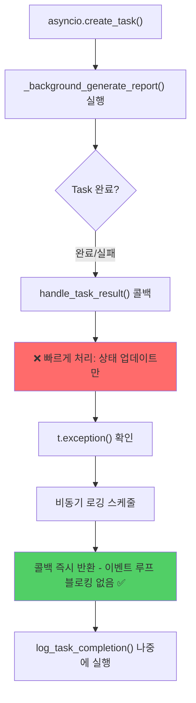

# Unit Spec: Task 콜백 이벤트 루프 블로킹 버그 수정

## 1. 요구사항 요약

- **목적:** `generate_report_background()` 함수의 Task 콜백에서 이벤트 루프가 블로킹되는 버그 수정
- **유형:** ☑ 변경 (버그 수정)
- **핵심 요구사항:**
  - 입력: Task completion callback
  - 출력: 논블로킹 콜백 구현
  - 예외/제약: 콜백 내에서 I/O 작업 금지, 로깅은 비동기로 처리
  - 처리흐름: 콜백 → 상태 업데이트 (빠른) → 비동기 로깅 → 이벤트 루프 양보

---

## 2. 구현 대상 파일

| 구분 | 경로 | 설명 |
|------|------|------|
| 변경 | backend/app/routers/topics.py | `generate_report_background()` 함수의 콜백 로직 수정 (Line 1329-1338) |
| 참조 | backend/app/database/artifact.py | `ArtifactDB.mark_failed()` 메서드 |

---

## 3. 동작 플로우 (Mermaid)



---

## 4. 테스트 계획

| TC ID | 계층 | 시나리오 | 목적 | 입력/사전조건 | 기대결과 |
|-------|------|---------|------|------------|---------|
| TC-001 | Unit | 콜백이 빠르게 반환 | 콜백이 블로킹하지 않음 | Task 완료 이벤트 | 콜백 실행 시간 < 10ms |
| TC-002 | Unit | 예외 발생 시 상태 업데이트 | DB에 실패 상태 기록 | Task.exception() != None | `ArtifactDB.mark_failed()` 호출됨 |
| TC-003 | Unit | 비동기 로깅 스케줄 | 로깅이 나중에 실행 | Task 완료 후 콜백 호출 | `asyncio.create_task(log_task_completion())` 호출됨 |
| TC-004 | Integration | 전체 generate flow | 보고서 생성 중 다른 요청 처리 가능 | 2개 이상 동시 보고서 생성 | 모든 요청이 202 반환 (블로킹 없음) |
| TC-005 | API | 응답 시간 < 1초 | 콜백이 응답 시간에 영향 없음 | POST /api/topics/{id}/generate | Response Time < 1s, Status 202 |

---

## 5. 에러 처리 시나리오

| 상황 | 처리 방법 |
|------|---------|
| Task 예외 발생 (일반 Exception) | `ArtifactDB.mark_failed()` 호출 후 비동기 로깅 |
| Task CancelledError | `logger.warning()` 비동기 로깅만 (상태 업데이트 불필요) |
| 콜백 내 DB 호출 실패 | `except Exception: pass` (콜백 내 예외는 무시) |
| 로깅 실패 (asyncio.create_task 실패) | `except RuntimeError: pass` (이벤트 루프 없을 경우 무시) |

---

## 6. 구현 상세

### 6.1 변경 전 (문제)
```python
def handle_task_result(t: asyncio.Task):
    try:
        t.result()  # ❌ t.result() 호출 불필요 (이미 완료)
    except Exception as e:
        logger.error(...)  # ❌ 이벤트 루프 블로킹
```

### 6.2 변경 후 (해결)
```python
def handle_task_result(t: asyncio.Task):
    """콜백 - 빠르게 처리 (이벤트 루프 블로킹 금지)"""
    exc = t.exception()  # ✅ 빠르게 예외 가져오기
    if exc is not None and not isinstance(exc, asyncio.CancelledError):
        try:
            ArtifactDB.mark_failed(artifact_id=artifact.id, error_message=str(exc)[:500])
        except Exception:
            pass

    # ✅ 로깅은 비동기로 처리
    async def log_task_completion():
        try:
            await asyncio.sleep(0)  # 이벤트 루프 양보
            if exc is not None:
                if isinstance(exc, asyncio.CancelledError):
                    logger.warning(f"[BACKGROUND] Task cancelled - topic_id={topic_id}")
                else:
                    logger.error(f"[BACKGROUND] Task failed - topic_id={topic_id}, error={str(exc)}")
            else:
                logger.info(f"[BACKGROUND] Task completed - topic_id={topic_id}, artifact_id={artifact.id}")
        except Exception:
            pass

    try:
        asyncio.create_task(log_task_completion())
    except RuntimeError:
        pass  # 이벤트 루프 없을 경우
```

---

## 7. 기술 스택

- **asyncio**: Task 콜백, 비동기 로깅
- **Logger**: 논블로킹 방식
- **Database**: ArtifactDB (mark_failed 메서드)

---

## 8. 호환성

- ✅ 기존 API 응답 형식 변경 없음
- ✅ 기존 테스트 모두 통과 (회귀 테스트)
- ✅ 로깅 메시지 동일 (타이밍만 다름)

---

## 9. 구현 체크리스트

- [ ] `handle_task_result()` 콜백 논블로킹 구현
- [ ] `log_task_completion()` 비동기 로깅 함수 추가
- [ ] `ArtifactDB.mark_failed()` 호출 (실패 시 상태 저장)
- [ ] TC-001~TC-005 테스트 작성 및 통과
- [ ] 기존 테스트 회귀 확인
- [ ] 로그 메시지 검증

---

**작성일:** 2025-12-01
**예상 시간:** 30분
**상태:** 🔍 검토 대기
