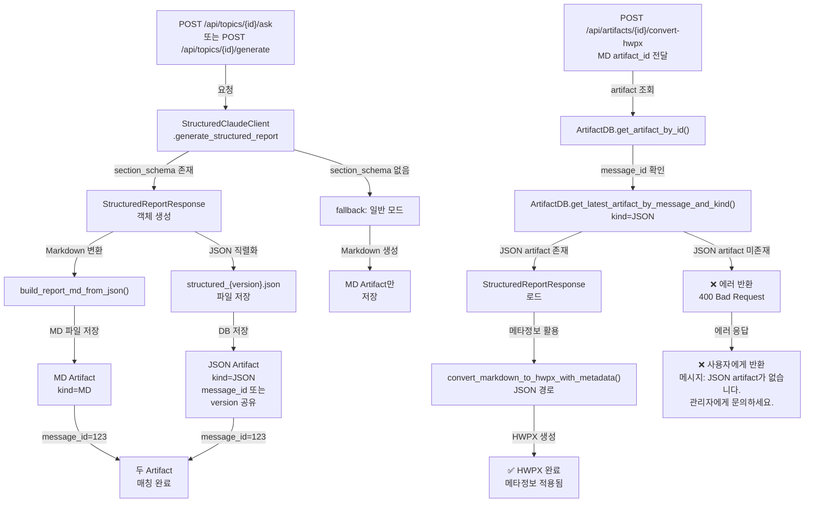

# Unit Spec: StructuredReportResponse JSON Artifact 저장 및 메타정보 활용

## 1. 요구사항 요약

- **목적:** `POST /api/topics/{topic_id}/ask`와 `POST /api/topics/{topic_id}/generate` 엔드포인트에서 생성되는 `StructuredReportResponse` (Claude Structured Outputs의 JSON 응답)를 파일로 저장하고, MD artifact와 `message_id` (ask) 또는 `version` (generate)으로 명확히 매칭하여, `POST /api/artifacts/{artifact_id}/convert-hwpx`에서 JSON 메타정보를 활용한 고도화된 HWPX 변환을 가능하게 함.

- **유형:** ☑️ 변경

- **핵심 요구사항:**
  - 입력: `StructuredReportResponse` 객체 (ask/generate에서 생성된 JSON 응답)
  - 출력: JSON artifact 파일 + DB 레코드 (2개 엔드포인트에서)
  - 예외/제약:
    - `section_schema` 존재 시에만 JSON artifact 생성 (BASIC 타입 토픽은 JSON 미생성)
    - ask(): MD + JSON artifact는 같은 `message_id` 공유
    - generate(): MD + JSON artifact는 같은 `version` + `topic_id` 공유
    - JSON artifact `kind = "json"`, 파일명 = `structured_{version}.json`
  - 처리흐름 요약:
    1. ask()/generate()에서 StructuredReportResponse 생성
    2. JSON을 파일로 저장 (structured_{version}.json)
    3. MD artifact와 동일 version/message_id로 JSON artifact DB 레코드 생성
    4. convert-hwpx에서 MD artifact 기반 조회 시 JSON artifact도 자동 매칭
    5. JSON artifact 미존재 시 400 Bad Request 에러 반환 (관리자 문의 메시지 포함)

---

## 2. 구현 대상 파일

| 구분 | 경로 | 설명 |
|------|------|------|
| 변경 | backend/app/routers/topics.py (ask) | Line ~950: JSON artifact 저장 로직 추가 |
| 변경 | backend/app/routers/topics.py (_background_generate_report) | Line ~1930: JSON artifact 저장 로직 추가 |
| 변경 | backend/app/routers/artifacts.py (convert_artifact_to_hwpx) | Line ~441: JSON artifact 조회 + 메타정보 활용 |
| 참조 | backend/app/models/report_section.py | StructuredReportResponse, SectionMetadata 스키마 |
| 참조 | backend/app/utils/structured_client.py | StructuredClaudeClient.generate_structured_report() |
| 참조 | backend/app/database/artifact_db.py | ArtifactDB.create_artifact(), get_latest_artifact_by_message_and_kind() |
| 참조 | backend/app/utils/markdown_parser.py | parse_markdown_to_md_elements() (fallback 경로) |
| 참조 | backend/app/utils/md_to_hwpx_converter.py | convert_markdown_to_hwpx() (현재 유지, 확장 예정) |

---

## 3. 동작 플로우 (Mermaid)



---

## 4. 테스트 계획

### 4.1 원칙

- **테스트 우선(TDD)**: 각 TC를 먼저 구현한 후 기능 개발
- **계층별 커버리지**: Unit (DB/파일) → Integration (엔드포인트) → E2E (convert-hwpx 통합)
- **독립성/재현성**: 임시 디렉토리, 테스트 DB 트랜잭션 사용
- **판정 기준**:
  - 파일 존재 여부 (JSON 파일 생성)
  - DB 레코드 (artifact 종류, message_id/version 매칭)
  - JSON 유효성 (StructuredReportResponse 스키마 준수)
  - convert-hwpx 통합 (JSON artifact 자동 조회)

### 4.2 구현 예상 테스트 항목

| TC ID | 계층 | 시나리오 | 목적 | 입력/사전조건 | 기대결과 |
|-------|------|---------|------|--------------|---------|
| TC-001 | Integration | ask() - JSON artifact 저장 성공 (message_id 매칭) | JSON 파일 생성 + DB 저장 + message_id 공유 검증 | section_schema 존재, StructuredReportResponse 반환 | 파일 존재 (structured_v1.json), MD + JSON artifact 모두 DB에 저장, message_id 동일 |
| TC-002 | Integration | generate() - JSON artifact 저장 성공 (version 매칭) | 백그라운드 JSON 저장 + version 공유 검증 | _background_generate_report() 실행, section_schema 존재 | 파일 존재 (structured_v1.json), MD + JSON artifact version 동일, message_id=NULL |
| TC-003 | Unit | message_id 기반 매칭 - ask() | MD artifact로 JSON artifact 자동 조회 | ask() 완료, message_id=123 | ArtifactDB.get_latest_artifact_by_message_and_kind(123, "json") → JSON artifact 반환 |
| TC-004 | Unit | version 기반 매칭 - generate() | MD artifact로 JSON artifact 자동 조회 (version 기반) | generate() 완료, version=1 | ArtifactDB.get_artifacts_by_topic(topic_id) → version=1인 JSON artifact 존재 |
| TC-005 | Unit | JSON artifact 파일 유효성 | 저장된 JSON이 StructuredReportResponse 스키마 준수 | 파일 읽기 + model_validate_json() | StructuredReportResponse 객체 정상 역직렬화, sections 배열 포함 |
| TC-006 | E2E | convert-hwpx에서 JSON artifact 활용 | MD artifact로 convert-hwpx 호출 시 JSON artifact 자동 조회 및 메타정보 활용 | POST /artifacts/{md_artifact_id}/convert-hwpx | JSON artifact 존재 시 convert_markdown_to_hwpx_with_metadata() 호출, placeholder_key 등 메타정보 HWPX에 적용 |
| TC-007 | Unit | section_schema 없을 때 JSON artifact 미생성 | BASIC 타입 토픽은 JSON artifact 스킵 | topic.source_type = BASIC (section_schema=None) | MD artifact만 생성, JSON artifact 없음 (DB에 레코드 미생성) |
| TC-008 | E2E | convert-hwpx JSON artifact 미존재 에러 | JSON artifact 미존재 시 에러 반환 검증 | JSON artifact 없는 MD artifact ID, POST /artifacts/{id}/convert-hwpx | 400 Bad Request, 에러 메시지: "JSON artifact가 없습니다. 관리자에게 문의하세요." |
| TC-009 | Unit | JSON artifact 파일명 규칙 | structured_{version}.json 형식 준수 | version=2 | 파일명 = "structured_2.json" |
| TC-010 | Integration | ask() - 다중 메시지 시나리오 | 동일 토픽, 다중 ask() 호출 시 각각 독립된 MD + JSON artifact 생성 | ask() x3 호출 (message_id=1, 2, 3) | 6개 artifact (MD x3 + JSON x3), 각각 다른 message_id |

---

## 5. 데이터 흐름 상세

### 5.1 ask() 엔드포인트 (message_id 기반)

```
1. StructuredClaudeClient.generate_structured_report()
   → StructuredReportResponse (메모리)

2. build_report_md_from_json(json_response)
   → markdown (문자열)

3. MD artifact 저장 (기존)
   artifact_md = ArtifactDB.create_artifact(
       topic_id=123,
       message_id=456,  # 중요
       kind="md",
       ...
   )

4. JSON artifact 저장 (NEW)
   json_text = json_response.model_dump_json(indent=2)
   Path(json_path).write_text(json_text)

   artifact_json = ArtifactDB.create_artifact(
       topic_id=123,
       message_id=456,  # ⭐ 같은 message_id!
       kind="json",
       file_path=json_path,
       ...
   )

결과: 같은 message_id(456)를 가진 2개 artifact
  - artifact_md (artifact_id=10, kind=md, message_id=456)
  - artifact_json (artifact_id=11, kind=json, message_id=456)
```

### 5.2 generate() 엔드포인트 (_background_generate_report, version 기반)

```
1. StructuredClaudeClient.generate_structured_report()
   → StructuredReportResponse (메모리)

2. build_report_md_from_json(json_response)
   → markdown (문자열)

3. version 계산
   version = next_artifact_version(topic_id, MD, locale)
   # version = 1

4. MD artifact 저장 (기존)
   artifact_md = ArtifactDB.create_artifact(
       topic_id=123,
       message_id=None,  # background task이므로 None
       kind="md",
       version=1,
       ...
   )

5. JSON artifact 저장 (NEW)
   json_text = json_response.model_dump_json(indent=2)
   json_path = build_artifact_paths(topic_id, version=1, "structured_1.json")
   Path(json_path).write_text(json_text)

   artifact_json = ArtifactDB.create_artifact(
       topic_id=123,
       message_id=None,  # background task
       kind="json",
       version=1,        # ⭐ 같은 version!
       file_path=json_path,
       ...
   )

결과: 같은 version(1)을 가진 2개 artifact
  - artifact_md (artifact_id=10, kind=md, version=1, message_id=None)
  - artifact_json (artifact_id=11, kind=json, version=1, message_id=None)
```

### 5.3 convert-hwpx에서 JSON artifact 조회

```
POST /api/artifacts/{artifact_id}/convert-hwpx
  artifact_id = 10 (MD artifact)

1. MD artifact 조회
   md_artifact = ArtifactDB.get_artifact_by_id(10)
   # artifact_id=10, kind=md, message_id=456 (또는 version=1)

2. JSON artifact 조회 (message_id 기반, ask의 경우)
   json_artifact = ArtifactDB.get_latest_artifact_by_message_and_kind(
       message_id=456,
       kind="json"
   )
   # artifact_id=11, kind=json, message_id=456 자동 조회 ✅

3. JSON artifact 존재 여부 확인
   if not json_artifact or not json_artifact.file_path:
       ❌ 에러 반환 (400 Bad Request)
       error_response(
           code=ErrorCode.ARTIFACT_JSON_NOT_FOUND,
           http_status=400,
           message="JSON artifact가 없습니다.",
           hint="관리자에게 문의하세요."
       )

4. JSON artifact 활용
   structured_response = StructuredReportResponse.model_validate_json(
       Path(json_artifact.file_path).read_text()
   )
   # sections[] 메타정보 추출
   # placeholder_key, max_length, min_length, description 등 활용

   convert_markdown_to_hwpx_with_metadata(
       md_elements,
       structured_response.sections,
       output_path
   )
```

---

## 6. 파일별 역할 변화 요약

### parse_markdown_to_md_elements()
- **현재**: 모든 convert-hwpx에서 호출 (100%)
- **개선 후**: ❌ convert-hwpx에서 호출 안 함 (JSON artifact 필수)
- **역할**: 더 이상 convert-hwpx의 경로가 아님 (다른 곳에서는 참고용으로 유지 가능)

### md_to_hwpx_converter.py
- **현재**: convert_markdown_to_hwpx(md_elements) 단일 경로
- **개선 후**: 현재는 호출되지 않음 (JSON artifact 필수이므로)
- **역할**: 향후 확장을 위해 convert_markdown_to_hwpx_with_metadata(JSON 경로) 추가 가능

### convert_artifact_to_hwpx()
- **현재**: MD artifact 조회 후 Markdown 경로로 변환
- **개선 후**:
  1. MD artifact 조회
  2. JSON artifact 조회 (필수)
  3. JSON artifact 없으면 400 Bad Request 에러 반환
  4. JSON artifact 있으면 메타정보 활용하여 HWPX 변환
- **역할**: JSON artifact 필수 검증 + 메타정보 기반 변환

---

## 7. 에러 처리 시나리오

| 시나리오 | 처리 | HTTP 상태 |
|---------|------|---------|
| section_schema 없음 | JSON artifact 미생성, MD만 저장 | 200 OK |
| JSON 파일 쓰기 실패 | 경고 로그, MD artifact만 저장 (비차단) | 200 OK |
| JSON artifact 미존재 (convert-hwpx) | ❌ 에러 반환: "JSON artifact가 없습니다. 관리자에게 문의하세요." | 400 Bad Request |
| JSON artifact 손상 | 에러 발생 (역직렬화 실패) | 500 Internal Server Error |
| message_id 중복 조회 | 최신 JSON artifact 선택 (get_latest_*) | 200 OK |

---

## 8. 구현 체크리스트

### Phase 1: ask() 함수 (Line ~950-980)
- [ ] JSON artifact 파일 경로 생성 (structured_{version}.json)
- [ ] StructuredReportResponse.model_dump_json() 직렬화
- [ ] 파일 저장 (asyncio.to_thread)
- [ ] ArtifactDB.create_artifact() 호출 (kind="json", message_id 공유)
- [ ] 로깅 추가

### Phase 2: _background_generate_report() 함수 (Line ~1930-1960)
- [ ] JSON artifact 파일 경로 생성 (structured_{version}.json)
- [ ] StructuredReportResponse.model_dump_json() 직렬화
- [ ] 파일 저장 (asyncio.to_thread)
- [ ] ArtifactDB.create_artifact() 호출 (kind="json", version 공유, message_id=None)
- [ ] 로깅 추가

### Phase 3: convert_artifact_to_hwpx() 함수 (Line ~441-530)
- [ ] JSON artifact 조회 (message_id 기반)
- [ ] JSON artifact 필수 검증 (미존재 시 400 Bad Request 에러 반환)
- [ ] JSON 파일 로드 + 역직렬화
- [ ] error_response() 호출 (code=ErrorCode.ARTIFACT_JSON_NOT_FOUND, message="JSON artifact가 없습니다. 관리자에게 문의하세요.")
- [ ] convert_markdown_to_hwpx_with_metadata() 호출 (JSON artifact 존재 시)
- [ ] 로깅 추가

### Phase 4: 테스트 구현
- [ ] 10개 TC 모두 구현 (pytest)
- [ ] 모든 테스트 통과 확인
- [ ] 기존 artifact 테스트 회귀 검증 (5개 이상)

---

## 참고: 기술 스택

- **Claude API**: Structured Outputs (v2.11 기반)
- **DB**: artifact, message 테이블
- **파일 시스템**: `/artifacts/{topic_id}/{version}/` 디렉토리
- **직렬화**: Pydantic `model_dump_json()`
- **비동기**: asyncio.to_thread()
