# Unit Spec: System Prompt 조회 기능 개선 (prompt_user + prompt_system 합성)

## 1. 요구사항 요약

- **목적:** Topic DB의 `prompt_user`와 `prompt_system`을 별도 함수로 합성하여 system prompt로 사용. PromptOptimizationDB 의존도 제거
- **유형:** ☐ 신규 ☑️ 변경 ☐ 삭제
- **핵심 요구사항:**
  - 입력: `prompt_user` (Optional[str]), `prompt_system` (Optional[str])
  - 출력: `system_prompt` = `prompt_user` + `"\n\n"` + `prompt_system` (합성)
  - 예외/제약:
    - 하나만 NULL이면 존재하는 값만 사용
    - 둘 다 NULL이면 400 에러 (VALIDATION_REQUIRED_FIELD)
  - 처리흐름 요약: 별도 함수 `_compose_system_prompt()`로 합성 로직 집중화. `ask()` & `_background_generate_report()` 2곳에서 사용

---

## 2. 구현 대상 파일

| 구분 | 경로 | 설명 |
|------|------|------|
| 변경 | backend/app/routers/topics.py | 신규: `_compose_system_prompt()` 함수 추가 (line ~150) |
| 변경 | backend/app/routers/topics.py | 변경: `ask()` 함수 (line 760-789) |
| 변경 | backend/app/routers/topics.py | 변경: `_background_generate_report()` 함수 (line 1892-1907) |
| 삭제 | backend/app/routers/topics.py | 삭제: `_apply_prompt_optimization()` 함수 (line 153-195) |
| 참조 | backend/app/models/topic.py | Topic 모델의 prompt_user, prompt_system 필드 확인 |
| 참조 | backend/app/database/topic_db.py | TopicDB.get_topic_by_id() 조회 로직 확인 |

---

## 3. 동작 플로우 (Mermaid)

```mermaid
flowchart TD
    subgraph "ask() 함수"
        A1["GET /api/topics/{topic_id}/ask"] -->|요청| B1["ask() 함수"]
        B1 --> C1["Topic 조회"]
        C1 --> D1["메시지 준비 1-4단계"]
        D1 --> E1["❌ 제거: _apply_prompt_optimization()<br/>❌ 제거: optimized_messages 처리"]
        E1 --> F1["✅ 새로운: _compose_system_prompt()<br/>(prompt_user, prompt_system)"]
        F1 --> G1["JSON 스키마 생성 5.5단계"]
        G1 --> H1["Claude API 호출"]
        H1 --> I1["응답 반환"]
    end

    subgraph "_background_generate_report() 함수"
        A2["POST /api/topics/{id}/generate"] -->|백그라운드 task| B2["_background_generate_report()"]
        B2 --> C2["Topic 조회"]
        C2 --> D2["Status 업데이트: 10%"]
        D2 --> E2["❌ 제거: _apply_prompt_optimization()"]
        E2 --> F2["✅ 새로운: _compose_system_prompt()<br/>(prompt_user, prompt_system)"]
        F2 --> G2["Claude API 호출"]
        G2 --> H2["Status 업데이트: 100%"]
        H2 --> I2["완료"]
    end

    subgraph "_compose_system_prompt() 함수"
        C["입력: prompt_user, prompt_system"]
        C --> D{"둘 다 NULL?"}
        D -->|Yes| E["Return None (caller가 에러 처리)"]
        D -->|No| F["parts = []"]
        F --> G["prompt_user 존재?"]
        G -->|Yes| H["parts.append(prompt_user)"]
        G -->|No| I["Skip"]
        H --> J["prompt_system 존재?"]
        I --> J
        J -->|Yes| K["parts.append(prompt_system)"]
        J -->|No| L["Skip"]
        K --> M["Return '\\n\\n'.join(parts)"]
        L --> M
        E --> N["로깅: 합성 정보"]
        M --> N
    end
```



---

## 4. 신규 함수: _compose_system_prompt()

### 4.1 함수 정의

```python
def _compose_system_prompt(
    prompt_user: Optional[str],
    prompt_system: Optional[str]
) -> Optional[str]:
    """Topic DB의 prompt_user와 prompt_system을 합성하여 system prompt 반환.

    Args:
        prompt_user: Sequential Planning 결과 (Optional)
        prompt_system: 마크다운 규칙 (Optional)

    Returns:
        str: 합성된 system_prompt (둘 다 NULL이면 None)

    Raises:
        None (None 반환 시 caller가 에러 처리)

    Logic:
        1. 빈 문자열 제거 (strip)
        2. prompt_user, prompt_system 중 하나 이상 존재하면 '\n\n'으로 join
        3. 둘 다 NULL이면 None 반환
    """
    # 빈 문자열 처리 (strip 후 다시 None 체크)
    user_part = prompt_user.strip() if prompt_user else None
    system_part = prompt_system.strip() if prompt_system else None

    # 둘 다 없으면 None 반환
    if not user_part and not system_part:
        return None

    # 합성
    parts = []
    if user_part:
        parts.append(user_part)
    if system_part:
        parts.append(system_part)

    composed = "\n\n".join(parts)

    # 로깅
    logger.info(
        f"[COMPOSE_PROMPT] Composed system prompt - "
        f"user_part={len(user_part) if user_part else 0}B, "
        f"system_part={len(system_part) if system_part else 0}B, "
        f"total={len(composed)}B"
    )

    return composed
```

### 4.2 위치

- 파일: `backend/app/routers/topics.py`
- 위치: Line 150 (기존 `_apply_prompt_optimization()` 함수 위치에 추가, 곧 삭제될 함수이므로)
- 스코프: private (언더스코어 접두사)

---

## 5. 변경 상세

### 5.1 ask() 함수 (Line 760-789)

#### 기존 코드
```python
# === 4.5단계: 프롬프트 고도화 결과 확인 및 적용 ===
optimized_system_prompt, optimized_messages = await _apply_prompt_optimization(
    topic_id,
    user_message_content
)
if optimized_messages:
    optimized_first_message = optimized_messages[0]
    if claude_messages:
        claude_messages[0] = optimized_first_message
    else:
        claude_messages = [optimized_first_message]

if optimized_system_prompt:
    logger.info("[ASK] Optimization result found - using optimized prompts")

# === 5단계: System Prompt 필수 검증 ===
system_prompt = topic.prompt_system

if not system_prompt:
    logger.error(f"[ASK] prompt_system not found (required field) - topic_id={topic_id}, source_type={source_type_str}")
    return error_response(
        code=ErrorCode.VALIDATION_REQUIRED_FIELD,
        http_status=400,
        message="이 토픽의 프롬프트가 설정되어 있지 않습니다.",
        hint="POST /api/topics/plan으로 계획을 먼저 생성해주세요."
    )
```

#### 변경된 코드
```python
# === 4.5단계: 삭제됨 (프롬프트 고도화) ===
# ❌ _apply_prompt_optimization() 제거
# ❌ optimized_messages 처리 제거

# === 5단계: System Prompt 합성 (TopicDB 기반) ===
system_prompt = _compose_system_prompt(
    prompt_user=topic.prompt_user,
    prompt_system=topic.prompt_system
)

if not system_prompt:
    logger.error(
        f"[ASK] prompt_user and prompt_system both NULL (required) - "
        f"topic_id={topic_id}, source_type={source_type_str}"
    )
    return error_response(
        code=ErrorCode.VALIDATION_REQUIRED_FIELD,
        http_status=400,
        message="이 토픽의 프롬프트가 설정되어 있지 않습니다.",
        hint="POST /api/topics/plan으로 계획을 먼저 생성해주세요."
    )

logger.info(
    f"[ASK] Using composed system prompt from topic DB - "
    f"length={len(system_prompt)}B"
)
```

### 5.2 _background_generate_report() 함수 (Line 1892-1907)

#### 기존 코드
```python
optimized_system_prompt, _ = await _apply_prompt_optimization(
    topic_id,
    user_prompt
)
if optimized_system_prompt:
    logger.info("[BACKGROUND] Optimization result found - using optimized prompts")

if optimized_system_prompt:
    system_prompt = optimized_system_prompt
else:
    logger.info("[BACKGROUND] No optimization result - using default system prompt")
    system_prompt = await asyncio.to_thread(
        get_system_prompt,
        template_id=template_id,
        user_id=int(user_id) if isinstance(user_id, str) else user_id
    )
```

#### 변경된 코드
```python
# === Step 2.5: System Prompt 합성 (TopicDB 기반) ===
system_prompt = _compose_system_prompt(
    prompt_user=topic_obj.prompt_user,
    prompt_system=topic_obj.prompt_system
)

if not system_prompt:
    logger.warning(
        f"[BACKGROUND] prompt_user and prompt_system both NULL - "
        f"topic_id={topic_id}, using fallback system prompt"
    )
    system_prompt = await asyncio.to_thread(
        get_system_prompt,
        template_id=template_id,
        user_id=int(user_id) if isinstance(user_id, str) else user_id
    )
else:
    logger.info(
        f"[BACKGROUND] Using composed system prompt from topic DB - "
        f"length={len(system_prompt)}B"
    )
```

### 5.3 _apply_prompt_optimization() 함수 삭제

- **위치**: Line 153-195
- **영향**: 해당 함수는 ask()와 _background_generate_report()에서만 호출됨 (2곳, 모두 교체됨)
- **테스트 영향**: `_apply_prompt_optimization` 관련 테스트도 함께 검토/삭제 필요

---

## 6. 테스트 계획

### 6.1 원칙

- **TDD 우선**: 테스트 케이스 먼저 작성, 구현 후 통과 검증
- **계층별 커버리지**: Unit (함수 로직) → Integration (엔드포인트)
- **에러 케이스**: NULL, 빈 문자열, 공백 처리
- **회귀 테스트**: 기존 ask/generate 테스트 모두 통과 확인

### 6.2 테스트 항목

| TC ID | 계층 | 시나리오 | 목적 | 입력/사전조건 | 기대결과 |
|-------|------|---------|------|--------|---------|
| TC-001 | Unit | _compose_system_prompt: 두 파트 모두 존재 | 합성 로직 검증 | user="Step 1", system="Rules: X" | "Step 1\n\nRules: X" (로그 확인) |
| TC-002 | Unit | _compose_system_prompt: prompt_user만 존재 | 선택적 필드 (user만) | user="Step 1", system=None | "Step 1" (system_part=0B 로그) |
| TC-003 | Unit | _compose_system_prompt: prompt_system만 존재 | 선택적 필드 (system만) | user=None, system="Rules: X" | "Rules: X" (user_part=0B 로그) |
| TC-004 | Unit | _compose_system_prompt: 둘 다 NULL | NULL 처리 | user=None, system=None | None 반환 |
| TC-005 | Unit | _compose_system_prompt: 빈 문자열 처리 | 공백 필터링 | user="  ", system="Rules" | "Rules" (공백 제거 후) |
| TC-006 | Unit | _compose_system_prompt: 양쪽 공백 | 전체 공백 필터링 | user="  ", system="  " | None 반환 |
| TC-007 | API | ask() 성공 - 합성 프롬프트 사용 | E2E 엔드포인트 | topic.prompt_user + prompt_system 설정 | 200 OK, artifact 생성, response_text 존재 |
| TC-008 | API | ask() 실패 - 프롬프트 NULL | 엔드포인트 에러 처리 | topic.prompt_user=None, prompt_system=None | 400 VALIDATION_REQUIRED_FIELD |
| TC-009 | API | _background_generate_report() 성공 - 합성 프롬프트 | 백그라운드 E2E | topic.prompt_user + prompt_system 설정 | 202 Accepted, 상태 추적 > 완료 |
| TC-010 | API | _background_generate_report() fallback - 프롬프트 NULL | 백그라운드 Fallback | topic.prompt_user=None, prompt_system=None | 202 Accepted, WARN 로그 확인, default 프롬프트 사용 |
| Regression | API | 기존 ask() 테스트 (프롬프트 있음) | 호환성 확인 | 기존 테스트 케이스 모두 | 모두 PASS |
| Regression | API | 기존 generate() 테스트 | 호환성 확인 | 기존 테스트 케이스 모두 | 모두 PASS |

---

## 7. 에러 처리 시나리오

| 시나리오 | HTTP Status | ErrorCode | 메시지 | 로그 레벨 | 발생 함수 |
|---------|-------------|----------|--------|---------|---------|
| ask() - 프롬프트 NULL (둘 다) | 400 | VALIDATION_REQUIRED_FIELD | "이 토픽의 프롬프트가 설정되어 있지 않습니다." | ERROR | ask() |
| _background_generate_report() - 프롬프트 NULL | (없음, 처리함) | N/A | (로그만) | WARNING | _background_generate_report() → fallback |
| Topic 미조회 (이미 처리) | 404 | RESOURCE_NOT_FOUND | "토픽을 찾을 수 없습니다." | ERROR | ask() / _background_generate_report() |

---

## 8. 구현 체크리스트

### Phase 1: 준비 (테스트 작성)
- [ ] Unit 테스트 작성 (`test_compose_system_prompt.py`)
  - [ ] TC-001: 두 파트 모두
  - [ ] TC-002: user만
  - [ ] TC-003: system만
  - [ ] TC-004: 둘 다 NULL
  - [ ] TC-005: 빈 문자열
  - [ ] TC-006: 양쪽 공백
- [ ] API 테스트 작성 (`test_ask_and_background_with_composed_prompt.py`)
  - [ ] TC-007: ask() 성공
  - [ ] TC-008: ask() 실패
  - [ ] TC-009: _background_generate_report() 성공
  - [ ] TC-010: _background_generate_report() fallback

### Phase 2: 구현
- [ ] `_compose_system_prompt()` 함수 구현 (Line 150)
- [ ] `ask()` 함수 수정 (Line 760-789)
- [ ] `_background_generate_report()` 함수 수정 (Line 1892-1907)
- [ ] `_apply_prompt_optimization()` 함수 삭제 (Line 153-195)

### Phase 3: 검증
- [ ] 신규 테스트 모두 통과 (10 + 2 regression = 12/12)
- [ ] 기존 테스트 모두 통과 (회귀 테스트)
- [ ] 로깅 확인 (합성 정보 출력)
- [ ] 코드 리뷰

### Phase 4: 최종화
- [ ] 코드 스타일 검증 (flake8, black)
- [ ] 타입 체크 (mypy)
- [ ] CLAUDE.md 업데이트 (선택사항)
- [ ] Git 커밋

---

## 9. 사용자 요청 프롬프트

### Original User Request (1차)

```
"/api/topics/:topic_id/ask" 에서 4.5단계 프롬프트 고도화 결과 확인 및 적용하는 내용을 사용하는 대신
해당 topic_id 에 해당하는 topics DB에 있는 prompt_system, prompt_user의 값을 합쳐서
823번에 있는 system_prompt에 넣을 수 있게 해줘.
```

### Claude 분석 (2차)

- 현재 코드: topics.py Line 761-773에서 `_apply_prompt_optimization()` 호출 (4.5단계)
- 요청사항: Topic DB의 `prompt_user` + `prompt_system`을 합쳐서 system_prompt 설정
- 구현 위치: Line 760-789 (4.5단계 & 5단계 교체)
- 추가 발견: `_background_generate_report()` (Line 1892)에서도 동일 호출
- 선택적 필드 처리 필요: 한쪽이 NULL일 수 있음
- 함수 분리 제안: 별도의 `_compose_system_prompt()` 함수로 중복 제거

### User Clarification/Modification (3차)

```
확인사항 회신:
1. 네, 함께 제거하세요. (optimized_messages 제거)
2. 합성 포멧 맞음, 단 별도의 함수로 빼서 개발 진행
3. 삭제시 문제점 확인요청.

→ 문제점: _apply_prompt_optimization() 함수가 2곳에서 호출
  - ask() Line 761
  - _background_generate_report() Line 1892
```

### 최종 명확화 (통합)

- ✅ `_apply_prompt_optimization()` 함수 완전 삭제 (2곳 호출 모두 교체)
- ✅ 별도 함수 `_compose_system_prompt()` 생성 (합성 로직 집중화)
- ✅ `ask()` 함수 수정 (Line 760-789)
- ✅ `_background_generate_report()` 함수 수정 (Line 1892-1907)
- ✅ optimized_messages 처리도 제거
- ✅ 합성 포맷: `prompt_user` + `"\n\n"` + `prompt_system`
- ✅ 선택적 필드: 하나만 NULL이면 존재하는 값만 사용
- ✅ 둘 다 NULL이면 기존 에러 응답 (ask) 또는 fallback (background)

---

**요청 일시:** 2025-12-01

**컨텍스트:**
- `/api/topics/{topic_id}/ask` 엔드포인트의 system prompt 조회 방식 변경
- PromptOptimizationDB 의존도 제거
- Topic DB의 직접 저장된 프롬프트 사용으로 더 명시적/단순화
- 2개 함수에서 동일 로직 사용 → 함수 분리로 중복 제거

---

## 10. 기술 스택 & 참고사항

- **언어**: Python 3.12, FastAPI
- **DB**: SQLite3
- **모델**: Pydantic (Topic 모델에 prompt_user, prompt_system 필드 있음)
- **로깅**: Python logging (logger.info, logger.warning, logger.error)
- **테스트**: pytest, pytest-asyncio
- **관련 함수**:
  - `TopicDB.get_topic_by_id()`: Topic 조회
  - `get_system_prompt()`: Fallback 시스템 프롬프트
  - `_build_section_schema()`: JSON 스키마 생성
  - `StructuredClaudeClient.generate_structured_report()`: Claude API 호출

---

## 11. 의존성 & 호환성

### 제거되는 의존성
- PromptOptimizationDB (더 이상 사용 안 함)
- `_apply_prompt_optimization()` 함수 (완전 삭제)

### 유지되는 의존성
- Topic.prompt_user, Topic.prompt_system 필드
- TopicDB.get_topic_by_id() (이미 호출 중)

### 호환성
- ✅ 기존 API 응답 형식: 변경 없음
- ✅ 기존 데이터: prompt_user/system이 NULL인 경우도 처리
- ✅ 기존 테스트: 대부분 호환 (프롬프트 설정된 경우)

---

**마지막 업데이트:** 2025-12-01
**작성자:** Claude Code
**상태:** 📋 Unit Spec 작성 완료 (사용자 검토 대기)
**버전:** 1.0
