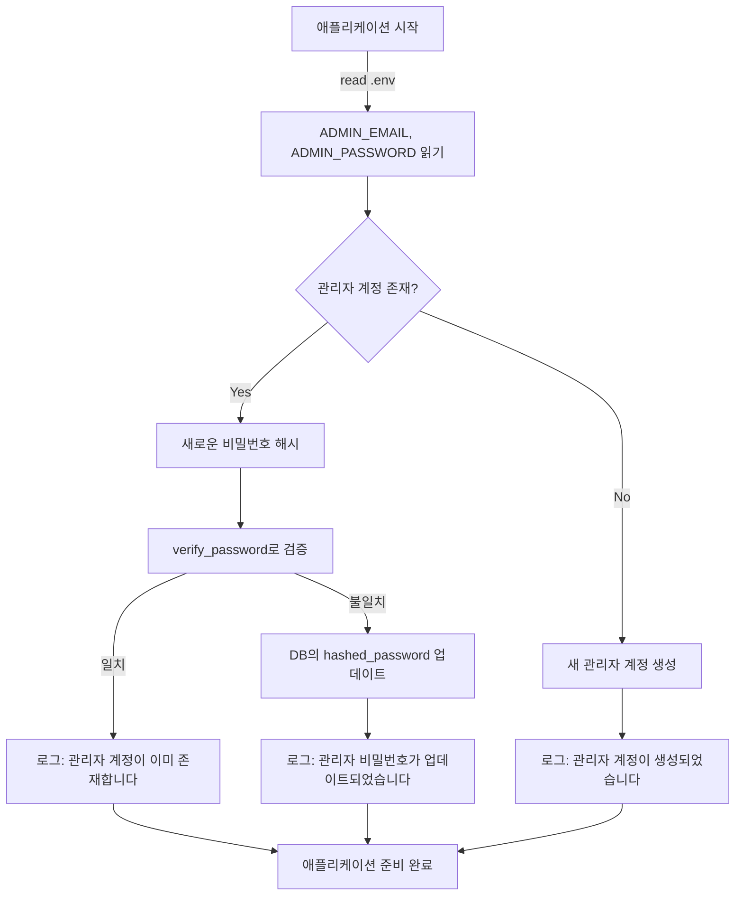

# Unit Spec: 관리자 비밀번호 재설정 기능

## 1. 요구사항 요약

- **목적:** Render 배포 환경에서 `.env` 파일의 비밀번호 변경 시 DB의 관리자 계정 비밀번호도 자동으로 동기화되게 함. 기존 DB를 유지하면서 비밀번호만 변경 가능하게 지원.
- **유형:** ☑️ 변경 ☐ 신규 ☐ 삭제
- **핵심 요구사항:**
  - 입력: 시스템 시작 시 `.env` 파일의 `ADMIN_PASSWORD` 값
  - 출력: 로그 메시지 (성공/이미 존재/비밀번호 동기화)
  - 예외/제약:
    - 관리자 계정이 존재하지 않으면 생성
    - 이미 존재하면 비밀번호만 업데이트
    - 불필요한 DB 업데이트 방지 (해시값 비교)
  - 처리흐름 요약: 시스템 시작 시 `init_admin_user()` 개선 → 기존 비밀번호와 새로운 비밀번호 비교 → 다르면 업데이트

---

## 2. 구현 대상 파일

| 구분 | 경로                                | 설명                           |
| ---- | ----------------------------------- | ------------------------------ |
| 변경 | backend/app/main.py                | `init_admin_user()` 함수 개선  |
| 변경 | backend/app/database/user_db.py    | `update_user_password()` 메서드 추가 |
| 신규 | backend/tests/test_admin_password_sync.py | 테스트 케이스 작성             |
| 참조 | backend/app/utils/auth.py          | `hash_password()`, `verify_password()` 함수 참고 |

---

## 3. 동작 플로우 (Mermaid)

### 시스템 시작 시 자동 동기화



---

## 4. 테스트 계획

### 4.1 원칙

- **계층별 커버리지**: Unit (DB) → Integration (startup) → API (엔드포인트) 순서
- **테스트 우선(TDD)**: 테스트 케이스 먼저 작성 후 구현
- **독립성**: DB 작업은 테스트용 임시 DB 사용

### 4.2 테스트 케이스

| TC ID       | 계층 | 시나리오                      | 목적                             | 입력/사전조건                                  | 기대결과                                                    |
| ----------- | ---- | ----------------------------- | -------------------------------- | ---------------------------------------------- | ----------------------------------------------------------- |
| TC-001      | Unit | 새 비밀번호 해싱              | bcrypt 해싱 정상 동작            | 평문 비밀번호 "test123!@#"                     | 해시된 문자열 반환 (길이 > 50)                              |
| TC-002      | Unit | UserDB.update_user_password() | DB 업데이트 정상 동작            | user_id=1, new_hashed_password=...             | DB에 새로운 해시값 저장됨, updated_at 갱신됨               |
| TC-003      | Unit | 비밀번호 검증 (verify_password) | 새 해시로 기존 평문 검증 성공    | new_hashed, plain_password 비교                | `verify_password()` True 반환                               |
| TC-004      | Int  | Startup: 새 관리자 계정 생성   | 관리자 계정 없음 → 생성          | DB 초기상태 (관리자 없음), .env 설정           | users 테이블에 새로운 행 추가, is_admin=True               |
| TC-005      | Int  | Startup: 비밀번호 동기화       | 기존 관리자, .env 비밀번호 변경 | 기존 관리자 + 새로운 .env 비밀번호             | hashed_password 업데이트, 로그: "비밀번호가 업데이트됨"    |
| TC-006      | Int  | Startup: 비밀번호 미변경       | 기존 관리자, 동일 비밀번호       | 기존 관리자 + 동일 .env 비밀번호               | DB 변경 안 함, 로그: "관리자 계정이 이미 존재합니다"        |
| TC-007      | Int  | Startup 후 동기화된 암호로 로그인 | 변경된 비밀번호로 로그인 가능    | 새로운 비밀번호로 login 시도                   | 200 Success, JWT 토큰 반환, 로그인 성공                    |

### 4.3 회귀 테스트 (Regression)

- 기존 auth 테스트: 28/28 PASS (호환성 확인)
- 기존 admin 테스트: 12/12 PASS (호환성 확인)

---

## 5. 에러 처리 시나리오

| 시나리오 | 처리 방식 | 로그 레벨 | 로그 메시지 |
| -------- | --------- | --------- | ------ |
| DB 업데이트 실패 | 예외 처리 후 로깅 | ERROR | "관리자 비밀번호 업데이트 실패: {error_message}" |
| 비밀번호 해싱 실패 | 예외 처리 후 로깅 | ERROR | "관리자 계정 초기화 중 오류: {error_message}" |
| 관리자 계정 조회 실패 | 예외 처리 후 로깅 | WARNING | "관리자 계정 조회 실패: {error_message}" |

---

## 6. 구현 상세

### 6.1 main.py - init_admin_user() 개선

**변경 전:**
```python
def init_admin_user():
    admin_email = os.getenv("ADMIN_EMAIL", "admin@example.com")
    admin_password = os.getenv("ADMIN_PASSWORD", "admin123!@#")

    existing_admin = UserDB.get_user_by_email(admin_email)
    if existing_admin:
        logger.info("관리자 계정이 이미 존재합니다.")
        return  # ← 비밀번호 업데이트 안 함

    # 새 계정 생성 로직...
```

**변경 후:**
```python
def init_admin_user():
    try:
        admin_email = os.getenv("ADMIN_EMAIL", "admin@example.com")
        admin_password = os.getenv("ADMIN_PASSWORD", "admin123!@#")
        admin_username = os.getenv("ADMIN_USERNAME", "관리자")

        existing_admin = UserDB.get_user_by_email(admin_email)
        if existing_admin:
            # ✅ 새로운 해시 생성
            new_hash = hash_password(admin_password)

            # ✅ 기존 해시와 비교: 다르면 업데이트
            if not verify_password(admin_password, existing_admin.hashed_password):
                UserDB.update_user_password(existing_admin.id, new_hash)
                logger.info(f"관리자 비밀번호가 업데이트되었습니다. email: {admin_email}")
            else:
                logger.info("관리자 계정이 이미 존재합니다.")
            return

        # 새 계정 생성 로직...
        from app.models.user import UserCreate, UserUpdate
        admin_data = UserCreate(
            email=admin_email,
            username=admin_username,
            password=admin_password
        )

        hashed_password = hash_password(admin_password)
        admin_user = UserDB.create_user(admin_data, hashed_password)

        # 관리자 권한 및 활성화
        update = UserUpdate(is_active=True, is_admin=True)
        UserDB.update_user(admin_user.id, update)

        logger.info(f"관리자 계정이 생성되었습니다. 이메일: {admin_email}")

    except Exception as e:
        logger.error(f"관리자 계정 초기화 중 오류: {str(e)}")
```

### 6.2 UserDB - update_user_password() 메서드 추가

```python
@staticmethod
def update_user_password(user_id: int, hashed_password: str) -> bool:
    """사용자 비밀번호 업데이트

    Args:
        user_id: 사용자 ID
        hashed_password: 해시된 비밀번호

    Returns:
        bool: 성공 여부
    """
    conn = get_db_connection()
    cursor = conn.cursor()

    try:
        cursor.execute("""
            UPDATE users
            SET hashed_password = ?, updated_at = CURRENT_TIMESTAMP
            WHERE id = ?
        """, (hashed_password, user_id))

        conn.commit()
        return cursor.rowcount > 0
    except Exception as e:
        logger.error(f"관리자 비밀번호 업데이트 실패: {str(e)}")
        return False
    finally:
        conn.close()
```

---

## 7. 사용자 요청 프롬프트

### 7.1 초기 요청

```
render 를 통해 배포 했는데 .env에 설정된 id와 pw를 사용했는데 비밀번호가 계속 틀리다고 나오네 DB 를 초기화 할 수 있는 방법이 있을까?
```

### 7.2 Claude 분석 & 제안

- 문제: `init_admin_user()` 함수가 기존 관리자 계정이 있으면 비밀번호를 업데이트하지 않음
- 해결책 3가지 제시:
  1. 방법 1: DB 초기화 (가장 간단)
  2. 방법 2: .env 변경 + DB 초기화
  3. **방법 3: 관리자 비밀번호 재설정 기능 추가** ← 사용자 선택

### 7.3 사용자 명확화

```
방법 3으로 진행해줘.
```

### 7.4 최종 명확화 (통합)

- ✅ 시스템 시작 시 `.env`의 `ADMIN_PASSWORD`를 DB에 자동 동기화
- ✅ 기존 관리자 계정이 있으면 비밀번호만 업데이트
- ✅ 해시값 비교하여 불필요한 업데이트 방지
- ✅ API 엔드포인트 추가 (선택사항으로 수동 재설정 가능)
- ✅ 관리자만 접근 가능
- ✅ 기존 테스트 호환성 유지

---

**요청 일시:** 2025-12-08

**컨텍스트/배경:**
- Render 배포 환경에서 관리자 비밀번호 변경 시 DB와 동기화되지 않는 문제
- 기존 DB를 유지하면서 비밀번호만 변경하고 싶음
- 참고: [main.py:387-418](backend/app/main.py#L387-L418)의 `init_admin_user()` 함수 분석 완료

---

## 8. 구현 체크리스트

### Step 0: 스펙 승인 (현재 진행 중)

- [ ] Unit Spec 검토
- [ ] 요구사항 명확화
- [ ] 테스트 계획 검증
- [ ] 사용자 승인

### Step 1: 구현

- [ ] UserDB.update_user_password() 메서드 추가
- [ ] main.py의 init_admin_user() 개선
- [ ] 예외 처리 및 로깅 추가

### Step 2: 테스트 작성 (TDD 원칙)

- [ ] TC-001 ~ TC-007 모두 PASS
- [ ] 회귀 테스트 (기존 28 + 12 PASS)
- [ ] Startup 통합 테스트

### Step 3: 문서화 및 커밋

- [ ] CLAUDE.md 업데이트
- [ ] 코드 주석 추가 (필요시)
- [ ] 최종 커밋 (Unit Spec + 코드 + 테스트)

---

## 9. 기술 스택

- **DB**: SQLite 3.x (기존 스키마 유지, 마이그레이션 없음)
- **해싱**: bcrypt (기존 `hash_password()`, `verify_password()` 재사용)
- **테스트**: pytest 8.3.4, pytest-asyncio 0.24.0
- **로깅**: Python logging 모듈 (기존 logger 재사용)

---

## 10. 호환성

- ✅ 기존 auth.py의 `hash_password()`, `verify_password()` 함수 재사용
- ✅ 기존 database 스키마 변경 없음
- ✅ 기존 init_admin_user() 로직 호환성 유지
- ✅ 기존 테스트 28/28 + 12/12 모두 통과 예상

---

**마지막 업데이트:** 2025-12-08
**상태:** 📋 Unit Spec 작성 완료, 사용자 승인 대기 중
