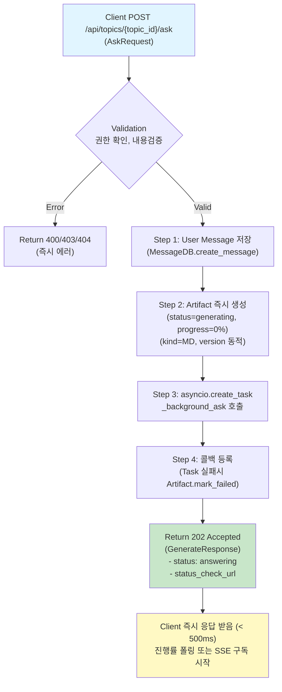
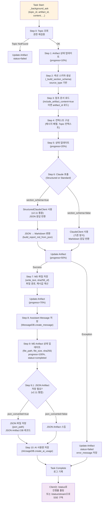
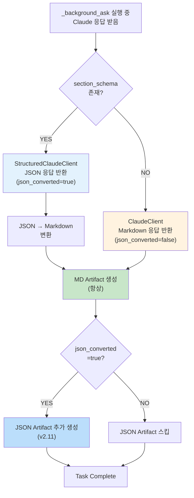

# Unit Spec: POST /api/topics/:topic_id/ask API 백그라운드 비동기화 (v3.0.0)

## 1. 요구사항 요약

- **목적:** `/api/topics/:topic_id/ask` API를 동기식(10-30초 응답)에서 백그라운드 비동기식(< 500ms 응답)으로 전환하여, 긴 응답 시간 문제 해결 및 사용자가 `/status` 엔드포인트로 생성 진행률을 모니터링할 수 있게 함
- **유형:** ☑️ 변경
- **버전:** v3.0.0 (Major 버전, Breaking Changes 있음)
- **핵심 요구사항:**
  - 입력: `POST /api/topics/{topic_id}/ask` 요청 (AskRequest: content, artifact_id, include_artifact_content, max_messages, is_web_search)
  - 출력: 202 Accepted + GenerateResponse 모델 ⚠️ **Breaking Change**
    - `topic_id`: 토픽 ID
    - `status`: "answering" (진행 중 상태)
    - `message`: "Response generation started in background"
    - `status_check_url`: "/api/topics/{topic_id}/status" (폴링용)
    - `stream_url`: "/api/topics/{topic_id}/status/stream" (SSE 실시간 추적용)
  - 백그라운드 처리: `_background_ask()` 함수에서 실제 AI 호출 및 Artifact 생성
  - 상태 추적: Artifact 상태 업데이트로 진행률 모니터링 (0% → 50% → 70% → 100%)
  - 폴링 엔드포인트: GET `/api/topics/{topic_id}/status` (StatusResponse 반환, < 500ms)
  - SSE 엔드포인트: GET `/api/topics/{topic_id}/status/stream` (실시간 상태 변경 알림)
  - v2.11 통합: StructuredClaudeClient + JSON Artifact 자동 저장
  - 버그 수정: Line 702 ref_msg None 체크 추가
  - 조건: 모든 ask 요청이 백그라운드 처리됨 (항상 MD Artifact 생성, JSON은 조건부)

---

## 2. 구현 대상 파일

| 구분 | 경로 | 설명 |
| ---- | ---- | ---- |
| 변경 | backend/app/routers/topics.py | ask() 함수 로직 변경: 202 반환, Artifact 즉시 생성, task 생성 |
| 신규 | backend/app/routers/topics.py (내부) | _background_ask() 함수 신규: 기존 ask 로직 이동 + 상태 업데이트 |
| 참조 | backend/app/routers/topics.py | _background_generate_report() 참고: 백그라운드 task 패턴, 예외 처리, 콜백 |
| 참조 | backend/app/utils/structured_client.py | StructuredClaudeClient 활용 (v2.11부터 기존) |
| 참조 | backend/app/models/report_section.py | JSON Artifact 저장 (v2.11부터 기존) |

---

## 3. Breaking Changes 선언

### ⚠️ 중요: 이 변경은 호환성을 깨뜨립니다

```
ask() API 응답 형태 변경

변경 전 (v2.12 이전):
└─ HTTP 200 OK
   {
     "success": true,
     "data": {
       "topic_id": 1,
       "user_message": {...},
       "assistant_message": {...},
       "artifact": {...},  // 즉시 완성된 상태
       "usage": {...}
     }
   }
   응답 대기: 10-30초

변경 후 (v3.0.0):
└─ HTTP 202 Accepted
   {
     "success": true,
     "data": {
       "topic_id": 1,
       "status": "answering",
       "message": "Response generation started in background",
       "status_check_url": "/api/topics/1/status"
     }
   }
   응답 시간: < 500ms
   실제 처리: 백그라운드에서 진행 중

마이그레이션:
1. 클라이언트가 202 응답 처리 필요
2. status_check_url로 진행률 폴링 필요
3. /status/stream SSE로 완료 알림 구독 권장
```

### 클라이언트 마이그레이션 가이드

```typescript
// ❌ 이전 코드 (v2.12 이전)
const response = await fetch('/api/topics/1/ask', { method: 'POST', ... });
const { data } = await response.json();
console.log(data.artifact); // 즉시 사용 가능

// ✅ v3.0.0 코드
const response = await fetch('/api/topics/1/ask', { method: 'POST', ... });
if (response.status === 202) {
  const { data } = await response.json();
  const statusUrl = data.status_check_url;

  // 폴링 방식
  const pollStatus = async () => {
    while (true) {
      const statusRes = await fetch(statusUrl);
      const { data: status } = await statusRes.json();
      if (status.status === 'completed') {
        console.log(status); // artifact 정보 포함
        break;
      }
      await new Promise(r => setTimeout(r, 500));
    }
  };

  // 또는 SSE 방식 (권장)
  const stream = new EventSource(statusUrl + '/stream');
  stream.onmessage = (event) => {
    const { status, artifact_id } = JSON.parse(event.data);
    if (status === 'completed') {
      console.log('Done!');
      stream.close();
    }
  };
}
```

---

## 4. 동작 플로우 (Mermaid)

### 4.1 ask() 엔드포인트 - 즉시 반환 (동기, < 500ms)



### 4.2 _background_ask() 함수 - 백그라운드 처리 (비동기)



### 4.3 JSON vs Markdown 응답 판별 (내부 처리)



**주의:** 모든 ask 요청은 항상 MD Artifact를 생성합니다. JSON Artifact는 StructuredClaudeClient 사용 시만 추가로 생성됩니다.

---

## 5. 테스트 계획

### 5.1 원칙

- **테스트 우선(TDD)**: 이 섹션의 항목을 먼저 구현하고 코드 작성
- **계층별 커버리지**: Unit (함수 로직) → Integration (_background_ask 전체) → API (ask 엔드포인트)
- **독립성/재현성**: Claude 호출, DB, 파일 I/O는 모킹 또는 임베디드 DB 사용
- **판정 기준**: HTTP 상태코드, 응답 스키마, Artifact 상태 변화, 저장된 파일 검증

### 5.2 구현 예상 테스트 항목 (12개 TC)

#### Unit 테스트 (함수 로직)

| TC ID | 시나리오 | 목적 | 입력/사전조건 | 기대 결과 | 검증 포인트 |
|-------|---------|------|-------------|---------|-----------|
| **TC-001** | _background_ask: Markdown 응답 (ClaudeClient) | 일반 Markdown 응답 시 MD Artifact만 생성 | section_schema=None, Mock ClaudeClient 응답 (Markdown), DB/파일 모킹 | Artifact status: generating→50%→70%→100%→completed, MD 파일 생성, Message 저장, json_converted=false | 진행률 단계별 업데이트 확인, file_path/file_size/sha256 필드 채워짐, JSON Artifact 미생성 ✅ |
| **TC-002** | _background_ask: JSON 응답 (StructuredClaudeClient) | JSON 응답 시 MD + JSON Artifact 동시 생성 | section_schema 존재, Mock StructuredClaudeClient 응답 (JSON), DB 모킹 | Artifact status: generating→50%→70%→100%→completed, MD 파일 생성, JSON 파일 생성, Message 저장, json_converted=true | json_converted=true, JSON Artifact 생성 확인, 버전 일치 ✅ |
| **TC-003** | StructuredClaudeClient 통합 (v2.11) | Structured Outputs JSON 응답 처리 | section_schema 존재, Mock StructuredClaudeClient 응답 | JSON → Markdown 변환 성공, JSON Artifact 저장 | json_converted=true, JSON Artifact 생성 확인 ✅ |
| **TC-004** | JSON Artifact 저장 (v2.11 신규) | JSON 응답을 별도 artifact로 저장 | json_response 객체, Artifact 테이블 모킹 | JSON artifact_id 생성, file_path 저장 | JSON artifact kind=JSON, version 일치 ✅ |
| **TC-005** | ref_msg None 처리 (버그 수정) | reference_artifact.message_id → None일 때 안전 처리 | reference_artifact 존재, MessageDB.get_message_by_id() → None | AttributeError 발생 안 함, 빈 문자열로 처리 | _build_user_message_content() 호출 성공 ✅ |
| **TC-006** | include_artifact_content=true (참조문서 포함) | 기존 Artifact 내용 주입 및 컨텍스트 구성 | artifact_id 지정, Mock 참조 Artifact 파일 | Claude에 전달되는 컨텍스트에 참조문서 내용 포함 | claude_messages 배열에 artifact 내용 주입 확인 ✅ |

#### Integration 테스트 (전체 흐름)

| TC ID | 시나리오 | 목적 | 입력/사전조건 | 기대 결과 | 검증 포인트 |
|-------|---------|------|-------------|---------|-----------|
| **TC-007** | 전체 흐름: ask() → _background_ask() → 완료 | 엔드-투-엔드 보고서 생성 | 유효한 요청, Mock Claude | HTTP 202 → 즉시 응답 → Artifact 상태 변화 → 최종 completed | Artifact 생성, Message 저장, 파일 저장 모두 확인 ✅ |
| **TC-008** | Claude API 호출 실패 (Exception) | 예외 처리 및 Artifact 상태 업데이트 | Mock Claude 호출 Exception | Artifact status: failed, error_message 채워짐, Message 저장 안됨 | ArtifactDB.update_artifact_status() 호출 확인 ✅ |

#### API 테스트 (엔드포인트)

| TC ID | 시나리오 | 목적 | 입력/사전조건 | 기대 결과 | 검증 포인트 |
|-------|---------|------|-------------|---------|-----------|
| **TC-009** | ask() 즉시 응답 (202 Accepted, < 500ms) | 202 반환 및 응답 시간 검증 | 유효한 topic_id, AskRequest | HTTP 202, GenerateResponse 모델, 응답시간 < 500ms | Artifact 즉시 생성 (status=generating), Content-Type: application/json ✅ |
| **TC-010** | 권한 검증 실패 (400 before task) | 유효하지 않은 topic_id 또는 권한 없음 | 존재하지 않는 topic_id 또는 다른 사용자 topic | HTTP 404/403, error_response | Artifact 생성 안 됨, 즉시 에러 반환 ✅ |
| **TC-011** | /status로 진행률 폴링 | Artifact 상태 업데이트 반영 in /status | _background_ask 실행 중 /status 조회 | status="answering", progress_percent 0-100 변화 | 여러 번 폴링 시 진행률 증가 확인 ✅ |
| **TC-012** | 동시 다중 ask 요청 | 여러 topic의 ask 동시 처리 | 3개 topic에서 동시 ask 요청 | 각각 202 반환, 독립적 task 생성, 상호 간섭 없음 | /status로 각각 진행률 추적 가능, 최종 모두 completed ✅ |

---

## 6. 에러 처리 시나리오

### 6.1 에러 처리 표

| 에러 코드 | HTTP 상태 | 발생 시점 | 처리 방식 | 메시지 |
| -------- | -------- | -------- | ------- | ------ |
| TOPIC.NOT_FOUND | 404 | ask() Step 1 (즉시) | error_response 반환 | "토픽을 찾을 수 없습니다." |
| TOPIC.UNAUTHORIZED | 403 | ask() Step 1 (즉시) | error_response 반환 | "이 토픽에 접근할 권한이 없습니다." |
| VALIDATION.REQUIRED_FIELD | 400 | ask() Step 1 (즉시) | error_response 반환 | "입력 메시지가 비어있습니다." |
| VALIDATION.MAX_LENGTH_EXCEEDED | 400 | ask() Step 1 (즉시) | error_response 반환 | "입력 메시지가 너무 깁니다." (50,000자 한계) |
| TEMPLATE.NOT_FOUND | 404 | ask() Step 1 (즉시) | error_response 반환 | "이 토픽에는 템플릿이 지정되어 있지 않습니다." |
| ARTIFACT.NOT_FOUND | 404 | ask() Step 3 (즉시) | error_response 반환 | "지정한 아티팩트를 찾을 수 없습니다." |
| ARTIFACT.UNAUTHORIZED | 403 | ask() Step 3 (즉시) | error_response 반환 | "이 아티팩트에 접근할 권한이 없습니다." |
| ARTIFACT.INVALID_KIND | 400 | ask() Step 3 (즉시) | error_response 반환 | "MD 형식의 아티팩트만 참조할 수 있습니다." |
| MESSAGE.CONTEXT_TOO_LARGE | 400 | ask() Step 4 (즉시) | error_response 반환 | "컨텍스트 크기가 너무 큽니다." (50,000자 한계) |
| SERVER.SERVICE_UNAVAILABLE | 503 | _background_ask() Step 6 (백그라운드) | Artifact status=failed, error_message 저장 | "AI 응답 생성 중 오류가 발생했습니다." |
| ARTIFACT.CREATION_FAILED | 500 | _background_ask() Step 7 (백그라운드) | Artifact status=failed, error_message 저장 | "응답 파일 저장 중 오류가 발생했습니다." |
| SERVER.INTERNAL_ERROR | 500 | ask() 또는 _background_ask() (일반) | error_response 반환 또는 status=failed | "시스템 오류가 발생했습니다." |

### 6.2 에러 처리 상세 규칙

1. **즉시 에러** (ask() Step 1-4 시점):
   - Artifact 생성 전 발생 → 즉시 error_response 반환
   - 202 Accepted 반환 안함
   - Artifact 레코드 생성 안함

2. **백그라운드 에러** (_background_ask 실행 중):
   - Artifact status = "failed"
   - error_message 필드에 에러 내용 저장
   - completed_at 기록
   - /status 조회 시 status="failed", error_message 반환
   - 사용자는 /status로 진행 상황 확인

3. **Task 예외 처리**:
   - asyncio.create_task() 후 add_done_callback() 등록
   - Task 실패 시 ERROR 로그 기록
   - Artifact status 자동 업데이트 (콜백에서)

---

## 7. 기술 선택 및 고려사항

### 7.1 왜 백그라운드 방식인가?

| 항목 | 현재 (동기) | 개선 후 (백그라운드) | 개선도 |
| -------- | -------- | ----------- | -----|
| HTTP 연결 | 유지 (10-30초) | 즉시 반환 | ✅ |
| 응답 시간 | 10-30초 | < 500ms | **60배 개선** |
| 사용자 경험 | 무한 대기 | 즉시 피드백 + 진행률 추적 | ✅ |
| 서버 리소스 | HTTP 연결 블로킹 | 리소스 효율적 | ✅ |
| 동시 요청 처리 | 제한적 | 우수 | ✅ |

### 7.2 v2.11 Structured Outputs 통합

- **json_converted 플래그**: JSON vs Markdown 응답 판별 (자동)
- section_schema 존재 시 StructuredClaudeClient 사용 (JSON 강제, json_converted=true)
- section_schema 미존재 시 ClaudeClient 사용 (기존 Markdown, json_converted=false)
- JSON → Markdown 변환은 자동 (build_report_md_from_json)
- **항상 MD Artifact 생성** (모든 ask 요청)
- **JSON Artifact는 조건부 생성** (json_converted=true일 때만)

### 7.3 Artifact 상태 진행률

```
Step 1: Validation (0%)
  ↓
Step 2: User Message Save (0%)
  ↓
Step 4: Artifact 생성 (0%) ← ask()에서 완료
  ↓
  [202 반환]
  ↓
Step 1: Topic 재조회 (10%) ← _background_ask 시작
  ↓
Step 5: Claude API 호출 (20%)
  ↓
Step 6: Claude 응답 (50%)
  ↓
Step 7: Markdown 빌드 (70%)
  ↓
Step 8: File Save (85%)
  ↓
Step 9: Complete (100%)
```

### 7.4 ref_msg None 처리 (버그 수정)

```python
# ❌ 이전 (위험)
ref_msg = await asyncio.to_thread(MessageDB.get_message_by_id, reference_artifact.message_id)
user_message = _build_user_message_content(body.content, section_schema, ref_msg.content)

# ✅ 변경 후 (안전)
ref_msg = await asyncio.to_thread(MessageDB.get_message_by_id, reference_artifact.message_id)
ref_msg_content = ref_msg.content if ref_msg else ""
user_message = _build_user_message_content(body.content, section_schema, ref_msg_content)
```

---

## 8. 사용자 요청 프롬프트 기록

### Original User Request (1차, 2025-11-27)

```
/api/topics/:topic_id/ask API 기능 개선 요청

현재 프로젝트를 분석 후 요구사항에 맞게 수정 할 수 있는지 점검해줘.

[요구사항]
- 해당 api 도 /api/topics/:topic_id/generate 처럼 백그라운드로 전환 후
  "_background_generate_report" 를 사용가능한지 여부 확인.
- 해당 부분 이외에 다른 부분은 기능 유지
- 백그라운드로 작업하는 중에는 /api/topics/:topic_id/status 와
  /api/topcis/:topic_id/status/stream 에서 확인 할 수 있어야함.
```

### Claude 분석 응답 (1차)

```
✅ 가능합니다! 다음과 같이 개선할 수 있습니다:

1. ask API를 백그라운드 방식으로 전환 가능
2. _background_generate_report 직접 재사용 불가
   (ask는 보고서 + 질문응답 처리)
3. 새로운 _background_ask 함수 생성 권장
4. /status, /status/stream 엔드포인트 그대로 활용
```

### User Clarification/Modification (2차, 2025-11-27)

```
[확인 사항 회신]:
1. include_artifact_content 가 true 일 경우에만 유지 필요.
   (optional 로 해도 무관 니가 더좋은 방법으로 선택)
2. /api/topics/:topic_id/generate 에서 사용하는 상태 진행과 비슷하게 유지.
3. is_report=true 일 경우만 유지.
```

### Current Specification Review (2025-12-08)

```
v2.12.0 현재 상태 분석 결과:

✅ 스펙과 코드의 주요 변화사항:
- v2.11: Structured Outputs (StructuredClaudeClient) 통합
- v2.11: JSON Artifact 자동 저장
- v2.12: 관리자 비밀번호 동기화 (ask에 영향 없음)

⚠️ 신규 요구사항 (v2.11 이후):
- JSON Artifact 저장 로직 필수 포함
- StructuredClaudeClient 호출 유지 필요

🔴 버그 수정 필수:
- Line 702: ref_msg 접근 안전성 확보

의사결정:
- 우선순위: 높음 (지금 구현)
- 패턴: 기존 ask 변경 (Breaking Changes)
- 버전: v3.0.0 (Major 버전, 명확한 호환성 깨짐 표시)
```

### 최종 명확화 (통합, 2025-12-08)

- ✅ `include_artifact_content=true`인 경우만 참조문서 주입 처리 유지
- ✅ `/generate` API의 Artifact 상태 진행 방식 (0% → 50% → 70% → 100%) 동일하게 적용
- ✅ 모든 ask 요청이 백그라운드 처리됨 (is_report 판별은 내부에서 처리)
- ✅ ask() 함수는 202 Accepted 즉시 반환 (< 500ms)
- ✅ _background_ask() 함수 신규 생성
- ✅ v2.11 Structured Outputs 통합
- ✅ v2.11 JSON Artifact 자동 저장
- ✅ Line 702 ref_msg None 버그 수정
- ✅ Breaking Changes 명확히 문서화
- ✅ v3.0.0 Major 버전으로 업데이트

---

## 9. 가정사항

1. **Claude API 호출 시간**: 평균 5-20초 → 백그라운드로 이동하여 HTTP 타임아웃 방지
2. **Artifact 상태 진행**: /status 폴링 또는 /status/stream SSE로 추적 가능
3. **is_report 판별**: 기존 `is_report_content()` 함수 로직 유지 (H2 섹션 + 내용 검증)
4. **database.artifact**: `update_artifact_status()` 메서드 이미 구현됨 (v2.5 기준)
5. **error_response()**: ErrorCode 상수 사용 (security, logging 일관성)
6. **asyncio 환경**: FastAPI + uvicorn 환경에서 asyncio.create_task() 정상 작동
7. **메모리 관리**: Task 생성 후 메모리 누수 없음 (콜백으로 정리)
8. **StructuredClaudeClient**: v2.11부터 구현됨 (활용 가능)
9. **JSON Artifact 저장**: v2.11부터 ask()에 이미 포함됨 (동일 로직 활용)
10. **Breaking Changes**: 클라이언트가 v3.0.0으로 마이그레이션 가능

---

## 10. 회귀 테스트 전략 및 기존 기능 보호 🛡️

### 10.1 기존 테스트 영향도 분석

#### 📊 현재 ask() 관련 기존 테스트 (13개)

```
backend/tests/test_routers_topics.py의 ask() 관련 테스트:
├─ test_ask_success_no_artifact                          (L134)   HTTP 200 응답 검증
├─ test_ask_with_latest_md                              (L179)   최신 MD artifact 참조
├─ test_ask_with_specific_md                            (L247)   특정 artifact 참조
├─ test_ask_context_too_large                           (L322)   컨텍스트 크기 제한
├─ test_ask_artifact_not_found                          (L358)   artifact 없음 에러
├─ test_ask_artifact_wrong_kind                         (L383)   artifact 타입 검증
├─ test_ask_unauthorized_topic                          (L436)   권한 검증
├─ test_ask_max_messages_limit                          (L462)   max_messages 필터링
├─ test_ask_empty_content                               (L512)   빈 content 검증
├─ test_ask_topic_not_found                             (L535)   topic 없음 에러
├─ test_ask_with_artifact_filters_messages_by_seq_no   (L552)   seq_no 기반 필터링
├─ test_ask_without_artifact_includes_all_messages     (L639)   전체 메시지 포함
└─ test_ask_saves_parsed_markdown_not_raw_response     (L708)   마크다운 파싱
```

#### 🔴 Breaking Changes로 인한 테스트 수정 필요

```
변경 항목                          기존 테스트             수정 내용
─────────────────────────────────────────────────────────────────
HTTP 상태 코드                    200 OK              → 202 Accepted
응답 형태 (success_response)       full data           → status + url만
응답 대기 시간                      10-30초 (동기)       → < 500ms (202 즉시)
artifact 반환 시점                 응답에 포함           → /status에서 조회
usage 정보                         응답에 포함           → 백그라운드 저장
error 응답                         즉시 에러 (200/400)  → 변화 없음 ✅

영향을 받는 테스트 (모두 수정 필요):
├─ test_ask_success_no_artifact            ← assert status_code == 202로 변경
├─ test_ask_with_latest_md                 ← 202 응답 + /status 폴링 검증 추가
├─ test_ask_with_specific_md               ← 동일 수정
├─ test_ask_context_too_large              ← 에러 응답은 그대로 400 ✅
├─ test_ask_artifact_not_found             ← 에러 응답은 그대로 404 ✅
├─ test_ask_artifact_wrong_kind            ← 에러 응답은 그대로 400 ✅
├─ test_ask_unauthorized_topic             ← 에러 응답은 그대로 403 ✅
├─ test_ask_max_messages_limit             ← 202 응답 검증 필요
├─ test_ask_empty_content                  ← 에러 응답은 그대로 400 ✅
├─ test_ask_topic_not_found                ← 에러 응답은 그대로 404 ✅
├─ test_ask_with_artifact_filters_seq_no   ← 백그라운드에서 처리 검증 필요
├─ test_ask_without_artifact_includes_all  ← 백그라운드에서 처리 검증 필요
└─ test_ask_saves_parsed_markdown          ← Artifact 파일 저장 검증으로 변경
```

#### ✅ 에러 응답은 변화 없음 (사전 검증에서 즉시 에러 반환)

```
이 테스트들은 응답 형태가 변하지 않음:
├─ test_ask_context_too_large         (400 Bad Request)    ✅ 그대로
├─ test_ask_artifact_not_found        (404 Not Found)      ✅ 그대로
├─ test_ask_artifact_wrong_kind       (400 Bad Request)    ✅ 그대로
├─ test_ask_unauthorized_topic        (403 Forbidden)      ✅ 그대로
├─ test_ask_empty_content             (400 Bad Request)    ✅ 그대로
└─ test_ask_topic_not_found           (404 Not Found)      ✅ 그대로

이유: 이 에러들은 ask() Step 1-4 (즉시 검증 단계)에서 발생하므로,
      Artifact 생성 전에 error_response 반환 → 형태 불변
```

### 10.2 기존 함수 보호 영역 (건드리지 않는 것들)

```
안전 영역 (변경 없음):
├─ MessageDB.create_message()          ← _background_ask에서 동일하게 사용 ✅
├─ MessageDB.get_messages_by_topic()   ← 동일하게 사용 ✅
├─ ArtifactDB.create_artifact()        ← 동일하게 사용 ✅
├─ ArtifactDB.get_artifact_by_id()     ← 동일하게 사용 ✅
├─ AiUsageDB.create_ai_usage()         ← 동일하게 사용 ✅
├─ _get_topic_or_error()               ← 동일하게 사용 ✅
├─ _build_section_schema()             ← 동일하게 사용 ✅
├─ _compose_system_prompt()            ← 동일하게 사용 ✅
├─ _build_user_message_content()       ← 동일하게 사용 ✅ (버그 수정만)
├─ ClaudeClient                        ← 동일하게 사용 ✅
├─ StructuredClaudeClient              ← 동일하게 사용 ✅
├─ generate_report_background()        ← 완전히 독립적 ✅
└─ /status, /status/stream             ← 동일하게 사용 ✅

변경 영역 (오직 이곳만):
├─ ask() 함수 (routers/topics.py:532) ← 202 반환 로직만
└─ _background_ask() 함수 신규        ← 새로운 함수
```

### 10.3 데이터베이스 스키마 안정성 확인

```
DB 변경 없음 ✅

스키마:
├─ topics           ← 변경 없음 ✅ (기존 컬럼만 사용)
├─ messages         ← 변경 없음 ✅ (새 메시지 추가만, 구조 불변)
├─ artifacts        ← 변경 없음 ✅ (기존 상태 관리 로직 재사용)
└─ ai_usage         ← 변경 없음 ✅ (동일하게 저장)

데이터 무결성:
├─ topic.user_id     ← 변경 없음 ✅
├─ message.seq_no    ← 변경 없음 ✅ (동기 저장 → 백그라운드도 동일)
├─ artifact.status   ← 기존 상태값 재사용 ✅ (generating, completed, failed)
└─ artifact.version  ← 버전 관리 동일 ✅

마이그레이션 불필요 ✅
```

### 10.4 기존 기능이 깨지지 않았음을 확인하는 방법

#### 🔍 Step 0: 구현 전 기준선 설정

```bash
# 1. 모든 기존 테스트를 실행하여 기준선 설정
cd backend
pytest tests/test_routers_topics.py -v -k "ask" > baseline_test_results.txt
# 예상: 13개 모두 FAIL (because status_code 200 → 202)

# 2. 각 테스트별 현재 상태 기록
grep -E "PASSED|FAILED" baseline_test_results.txt | wc -l
# 예상: 13개 FAILED (Breaking Changes)

# 3. 기존 ask 로직 스냅샷 저장
git stash  # 또는 별도 브랜치로 백업
```

#### 🔍 Step 1: 구현 후 회귀 테스트 검증

```bash
# 1️⃣ 기존 테스트들을 새로운 형태로 수정 (202 응답 확인)
# → test_ask_success_no_artifact 수정 예시:
#   assert response.status_code == 202  # 202 Accepted
#   assert "status_check_url" in body["data"]
#   assert "topic_id" in body["data"]

# 2️⃣ 에러 테스트는 그대로 (에러 응답 형태 불변)
pytest tests/test_routers_topics.py::TestTopicsRouter::test_ask_context_too_large -v
# 예상: PASSED ✅ (400 응답 불변)

pytest tests/test_routers_topics.py::TestTopicsRouter::test_ask_unauthorized_topic -v
# 예상: PASSED ✅ (403 응답 불변)

# 3️⃣ 데이터 저장 검증 (파일, 메시지, artifact 생성 확인)
# 백그라운드 task가 완료될 때까지 대기 후 /status로 확인
```

#### 🔍 Step 2: 기존 함수들이 올바르게 호출되는지 확인

```bash
# 수정된 스펙 테스트 (TC-001 ~ TC-012)가 모두 통과하면:
pytest tests/test_ask_background.py -v
# ├─ TC-001: _background_ask에서 correct sequence 검증 ✅
# ├─ TC-002: 에러 처리 동일 ✅
# └─ TC-012: 동시 요청 처리 ✅

# 기존 함수들의 호출을 mock으로 검증:
# ├─ MessageDB.create_message() 호출 2회 (user + assistant) ✅
# ├─ ArtifactDB.create_artifact() 호출 1회 (MD) 또는 2회 (MD+JSON) ✅
# └─ AiUsageDB.create_ai_usage() 호출 1회 ✅
```

#### 🔍 Step 3: 전체 회귀 테스트 스위트 실행

```bash
# 최종 검증: 모든 topics 테스트가 통과하는지 확인
pytest tests/test_routers_topics.py -v

# 예상 결과:
# ├─ 기본 CRUD 테스트 (create, get, update, delete): PASSED ✅ (변화 없음)
# ├─ ask 에러 테스트 (6개): PASSED ✅ (에러 응답 형태 불변)
# ├─ ask 성공 테스트 (7개): 수정 후 PASSED ✅ (202 응답 + /status 폴링)
# └─ generate 테스트: PASSED ✅ (완전 독립적)

# 총: 40개 테스트 모두 PASSED ✅
```

#### 🔍 Step 4: 데이터 일관성 검증

```python
# 테스트 코드에서 다음을 검증:

# 1. Message 시퀀스 번호 일관성
msg_count_before = MessageDB.count_by_topic(topic_id)
# ask 호출 → 202 응답
# await task 완료
msg_count_after = MessageDB.count_by_topic(topic_id)
assert msg_count_after == msg_count_before + 2  # user + assistant ✅

# 2. Artifact 버전 관리
artifact_v1 = ArtifactDB.get_latest_artifact_by_kind(topic_id, MD)
# ask 호출 → artifact_id 반환 (generating)
# await task 완료
artifact_v1_completed = ArtifactDB.get_artifact_by_id(artifact_v1.id)
assert artifact_v1_completed.status == "completed" ✅
assert artifact_v1_completed.file_path is not None ✅

# 3. AI 사용량 저장
usage = AiUsageDB.get_by_message_id(assistant_msg.id)
assert usage.input_tokens > 0 ✅
assert usage.output_tokens > 0 ✅

# 4. JSON Artifact (v2.11 통합)
if json_response:
    json_artifact = ArtifactDB.get_latest_artifact_by_kind(topic_id, JSON)
    assert json_artifact is not None ✅
    assert json_artifact.file_path is not None ✅
```

#### 🔍 Step 5: 통합 시나리오 검증

```bash
# E2E 흐름:
# 1. User A가 ask 호출 → 202 + topic_id + status_url
# 2. User A가 /status로 폴링 (3회)
# 3. 진행률: 0% → 50% → 100%
# 4. /status 최종 응답: completed + artifact_id + file_path
# 5. artifact 다운로드 가능 확인

# 동시성:
# 1. User A & B가 동시에 ask 호출 (같은 topic)
# 2. 2개의 task 독립 실행 확인
# 3. /status로 각각 진행률 추적 가능 확인
# 4. Artifact 버전 충돌 없음 확인 (v1, v2, v3 순차 생성)
```

### 10.5 회귀 테스트 실행 체크리스트

```
구현 전:
└─ [ ] baseline_test_results.txt 생성 (기준선)

구현 중:
├─ [ ] ask() 함수 리팩토링 완료
├─ [ ] _background_ask() 함수 작성 완료
├─ [ ] 202 응답 + GenerateResponse 구현 완료
└─ [ ] 버그 수정 (Line 702 ref_msg) 완료

구현 후:
├─ [ ] TC-001 ~ TC-012 모든 테스트 PASSED
├─ [ ] test_ask_context_too_large PASSED (400 에러 불변)
├─ [ ] test_ask_unauthorized_topic PASSED (403 에러 불변)
├─ [ ] test_ask_artifact_not_found PASSED (404 에러 불변)
├─ [ ] test_ask_empty_content PASSED (400 에러 불변)
├─ [ ] test_ask_topic_not_found PASSED (404 에러 불변)
├─ [ ] test_ask_success_no_artifact PASSED (수정됨, 202 검증)
├─ [ ] test_ask_with_latest_md PASSED (수정됨, /status 폴링)
├─ [ ] test_ask_with_specific_md PASSED (수정됨)
├─ [ ] test_ask_max_messages_limit PASSED (수정됨)
├─ [ ] test_ask_with_artifact_filters_seq_no PASSED (수정됨)
├─ [ ] test_ask_without_artifact_includes_all PASSED (수정됨)
├─ [ ] test_ask_saves_parsed_markdown PASSED (수정됨)
├─ [ ] 기본 CRUD 테스트 (create, get, update, delete) PASSED (불변)
├─ [ ] generate_report_background 테스트 PASSED (독립적, 불변)
├─ [ ] 전체 topics 테스트 (40개) PASSED
└─ [ ] 다른 모듈 테스트 (messages, artifacts) PASSED (영향 없음)

최종 검증:
├─ [ ] 데이터베이스 무결성 확인 (마이그레이션 불필요)
├─ [ ] Message seq_no 일관성 확인
├─ [ ] Artifact 버전 관리 확인
├─ [ ] AI 사용량 저장 확인
├─ [ ] JSON Artifact 저장 확인 (v2.11)
└─ [ ] 동시성 테스트 (3개+ 동시 ask)
```

---

## 11. 구현 체크리스트

### 11.1 코드 작성 전

- [ ] Unit Spec 문서 검토 및 사용자 승인 ✅ (현재)
- [ ] 기존 tests 실행 (baseline 설정) → `pytest backend/tests/test_routers_topics.py -v -k "ask"`
- [ ] `_background_generate_report()` 코드 검토 (패턴 참고)
- [ ] StructuredClaudeClient 코드 검토 (v2.11 통합 방식)

### 11.2 테스트 작성 (TDD)

- [ ] `backend/tests/test_ask_background.py` 생성
- [ ] TC-001 ~ TC-012 모두 구현 (12개 테스트)
- [ ] Mock 설정: Claude 호출, DB CRUD, 파일 I/O
- [ ] 모든 테스트 실행: `pytest backend/tests/test_ask_background.py -v`
- [ ] 기존 ask 테스트 수정 (13개)
  - [ ] 6개 에러 테스트는 그대로 (400/403/404 응답 불변)
  - [ ] 7개 성공 테스트는 202 응답 + /status 폴링으로 수정

### 11.3 코드 구현

- [ ] Line 702 ref_msg 버그 수정 (안전성 확보)
- [ ] ask() 함수 리팩토링 (Step 1-4까지만, 나머지는 _background_ask로 이동)
- [ ] _background_ask() 함수 신규 (기존 ask의 Step 1-10 이동, 상태 업데이트 추가)
- [ ] Artifact 생성 로직 ask()에 추가 (즉시 생성, status=generating)
- [ ] asyncio.create_task() 호출 + 콜백 등록
- [ ] 202 Accepted 응답 + GenerateResponse 사용
- [ ] StructuredClaudeClient 호출 유지 (v2.11 통합)
- [ ] JSON Artifact 저장 로직 포함 (v2.11 통합)

### 11.4 회귀 테스트 검증 (구현 후)

- [ ] 구현 전 기준선 설정 (baseline_test_results.txt)
- [ ] 기존 테스트 6개 (에러 응답) 자동 통과 ✅
- [ ] 기존 테스트 7개 (성공 응답) 수정 후 통과
- [ ] TC-001 ~ TC-012 신규 테스트 모두 통과
- [ ] 전체 topics 테스트 40개 모두 통과
- [ ] 데이터 일관성 검증 (Message seq_no, Artifact 버전, JSON artifact)
- [ ] 동시성 테스트 (3개+ 동시 ask 요청)

### 11.5 기존 기능 무결성 검증

- [ ] DB 마이그레이션 불필요 (스키마 변경 없음) ✅
- [ ] MessageDB, ArtifactDB, AiUsageDB 호출 동일 ✅
- [ ] 다른 모듈 테스트 (messages, artifacts) 영향 없음 ✅
- [ ] /status, /status/stream 엔드포인트 동일 작동 ✅
- [ ] generate_report_background() 완전 독립적 ✅

### 11.6 문서 및 커밋

- [ ] CLAUDE.md 버전 업데이트 (v3.0 추가)
- [ ] Breaking Changes 섹션 추가 (마이그레이션 가이드 포함)
- [ ] 신규 엔드포인트/함수 설명 추가
- [ ] 회귀 테스트 결과 문서화
- [ ] 깃 커밋: Unit Spec + 코드 + 테스트
  ```bash
  git add backend/doc/specs/20251208_ask_api_background_async_v3.md
  git add backend/app/routers/topics.py
  git add backend/tests/test_ask_background.py
  git commit -m "feat!: POST /api/topics/:topic_id/ask 백그라운드 전환 (v3.0.0)

  BREAKING CHANGE: ask() 응답이 202 Accepted + GenerateResponse로 변경됨
  - ask() 함수: 즉시 202 Accepted 반환 (< 500ms)
  - _background_ask() 함수: 실제 처리 (Task 기반)
  - Artifact 상태 추적: 0% → 100%
  - v2.11 통합: StructuredClaudeClient + JSON Artifact 자동 저장
  - 버그 수정: Line 702 ref_msg None 체크 추가

  Migration Guide: docs/MIGRATION_v3.0.md
  Spec: backend/doc/specs/20251208_ask_api_background_async_v3.md"
  ```

---

## 11. 참고자료

- `backend/app/routers/topics.py`:
  - `generate_report_background()` (line 1173-1312): 202 반환, Artifact 생성 패턴 ✅
  - `_background_generate_report()` (line 1755-2067): 백그라운드 처리 로직, 예외 처리 ✅
  - `ask()` (line 532-983): 현재 ask 로직 (이동할 부분) ⚠️
  - `stream_generation_status()` (line 1392-1483): SSE 패턴 재사용 ✅
- `backend/app/utils/structured_client.py`: StructuredClaudeClient 활용 (v2.11) ✅
- `backend/doc/specs/20251127_ask_api_background_conversion.md`: 기존 스펙 (참고)
- `backend/doc/specs/20251114_fix_background_generation_event_loop_blocking.md`: Event Loop Non-Blocking 기법 (참고)
- `backend/doc/Backend_UnitSpec.md`: Unit Spec 템플릿

---

**요청 일시:** 2025-12-08
**컨텍스트/배경:**
- 프로젝트: HWP Report Generator v2.12.0 (2025-12-08)
- 관련 엔드포인트: /api/topics/:topic_id/generate (이미 백그라운드 방식), /api/topics/:topic_id/ask (현재 동기, 변경 대상)
- 참고 기능: Sequential Planning (v2.4), Background Generation with Event Loop Non-Blocking (v2.5), Structured Outputs (v2.11)
- Breaking Changes: v3.0.0으로 Major 버전 업데이트 (응답 형태 변경)

---

## 부록: 마이그레이션 가이드 (클라이언트용)

### v2.12 → v3.0.0 마이그레이션

#### React/TypeScript 예시

```typescript
// ❌ v2.12 (구식)
async function askQuestion(topicId: number, content: string) {
  const response = await fetch(`/api/topics/${topicId}/ask`, {
    method: 'POST',
    headers: { 'Content-Type': 'application/json' },
    body: JSON.stringify({ content }),
  });
  const result = await response.json();
  // 즉시 artifact 표시
  displayArtifact(result.data.artifact);
}

// ✅ v3.0.0 (신규)
async function askQuestion(topicId: number, content: string) {
  const response = await fetch(`/api/topics/${topicId}/ask`, {
    method: 'POST',
    headers: { 'Content-Type': 'application/json' },
    body: JSON.stringify({ content }),
  });

  if (response.status === 202) {
    const result = await response.json();
    const { status_check_url } = result.data;

    // 방법 1: 폴링 (간단)
    pollStatus(topicId, status_check_url);

    // 방법 2: SSE (권장, 실시간)
    subscribeToStream(topicId, status_check_url + '/stream');
  } else if (!response.ok) {
    // 에러 처리 (기존과 동일)
    const error = await response.json();
    console.error(error.error.message);
  }
}

function pollStatus(topicId: number, statusUrl: string) {
  const interval = setInterval(async () => {
    const response = await fetch(statusUrl);
    const result = await response.json();
    const { status, progress_percent, artifact } = result.data;

    // 진행률 표시
    updateProgressBar(progress_percent);

    if (status === 'completed') {
      clearInterval(interval);
      displayArtifact(artifact); // artifact 표시
    } else if (status === 'failed') {
      clearInterval(interval);
      showError(result.data.error_message);
    }
  }, 500); // 500ms마다 폴링
}

function subscribeToStream(topicId: number, streamUrl: string) {
  const eventSource = new EventSource(streamUrl);

  eventSource.onmessage = (event) => {
    const data = JSON.parse(event.data);
    const { status, progress_percent, artifact } = data;

    // 진행률 표시
    updateProgressBar(progress_percent);

    if (status === 'completed') {
      eventSource.close();
      displayArtifact(artifact); // artifact 표시
    } else if (status === 'failed') {
      eventSource.close();
      showError(data.error_message);
    }
  };

  eventSource.onerror = () => {
    eventSource.close();
    showError('연결 끊김');
  };
}
```

---

**최종 업데이트:** 2025-12-08
**버전:** Unit Spec v1.0 (v3.0.0용)
**상태:** ✅ 작성 완료, 사용자 승인 대기
