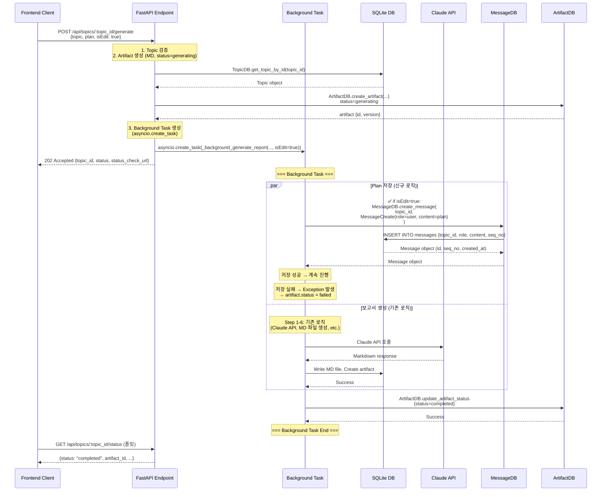
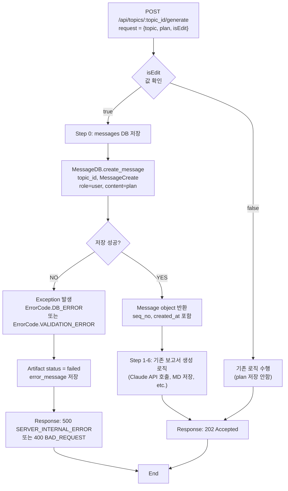

# Unit Spec: POST /api/topics/:topic_id/generate - isEdit 파라미터 추가

**Date**: 2025-12-09
**Version**: 1.0
**Status**: Pending User Approval

---

## 1. 요구사항 요약 (Requirement Summary)

### Purpose
사용자가 보고서 생성 시 기존 메시지 스레드에 계획(plan)을 저장할 수 있도록 하기 위해 `/api/topics/:topic_id/generate` API에 `isEdit` 파라미터를 추가합니다.

### Type
🔵 **신규 기능** (New Feature)

### Core Requirements

**Functional Requirements**:
1. POST `/api/topics/:topic_id/generate` 요청에 `isEdit` 파라미터 추가 (선택사항, 기본값: false)
2. `isEdit=false` → 기존 로직 그대로 수행 (변경 없음)
3. `isEdit=true` → messages DB에 plan 저장 (role: user) 후 기존 로직 수행
4. messages DB 저장 실패 시 Exception 발생 및 에러 처리

**Non-Functional Requirements**:
- 기존 기능에 영향도 없음 (backward compatibility 100%)
- 응답 시간 < 2초 유지
- 모든 에러 케이스 처리

---

## 2. 구현 대상 파일 (Implementation Target Files)

| 구분 | 경로 | 설명 |
|------|------|------|
| 변경 | `backend/app/models/topic.py` | GenerateRequest 모델에 `isEdit` 필드 추가 |
| 변경 | `backend/app/routers/topics.py` | generate_report_background() 함수에 isEdit 처리 로직 추가 |
| 변경 | `backend/app/routers/topics.py` | _background_generate_report() 함수에 isEdit 처리 로직 추가 (plan 저장) |
| 신규 | `backend/tests/test_api_topics_generate_isEdit.py` | isEdit 파라미터 관련 테스트 케이스 (10개) |
| 참조 | `backend/app/database/message_db.py` | MessageDB.create_message() - 이미 구현됨 |
| 참조 | `backend/app/models/message.py` | MessageCreate, MessageRole - 이미 구현됨 |

---

## 3. 동작 플로우 (Workflow Diagram)

### 전체 플로우 (Sequence Diagram)



### isEdit 조건부 실행 상세



### 기존 로직과의 차이

**기존 (isEdit=false 또는 생략)**:
```
POST /api/topics/:topic_id/generate
→ Artifact 생성 (status=generating)
→ 백그라운드 task 시작
  → Claude API 호출
  → MD 파일 저장
  → Artifact 업데이트
→ 202 Accepted 응답
```

**신규 (isEdit=true)**:
```
POST /api/topics/:topic_id/generate
→ Artifact 생성 (status=generating)
→ 백그라운드 task 시작
  → ✅ Step 0: messages DB에 plan 저장 (role: user)
  → Claude API 호출
  → MD 파일 저장
  → Artifact 업데이트
→ 202 Accepted 응답
```

---

## 4. 상세 동작 (Detailed Behavior)

### 4.1 Request/Response

#### Request

```json
POST /api/topics/:topic_id/generate
Content-Type: application/json

{
  "topic": "AI 시장 분석",
  "plan": "# 보고서 계획\n## 개요\n- AI 시장 규모...\n## 주요 내용\n- 기술 동향...",
  "isEdit": true,
  "isWebSearch": false
}
```

**필드 설명**:
- `topic` (string, 필수): 보고서 주제 (1-200 chars)
- `plan` (string, 필수): Sequential Planning에서 받은 계획 (1+ chars)
- `isEdit` (boolean, 선택, 기본값: false): **✅ NEW** - messages DB에 plan 저장 여부
- `isWebSearch` (boolean, 선택, 기본값: false): Claude 웹 검색 활성화 여부

#### Response (202 Accepted)

```json
{
  "success": true,
  "data": {
    "topic_id": 123,
    "status": "generating",
    "message": "Report generation started in background",
    "status_check_url": "/api/topics/123/status",
    "stream_url": "/api/topics/123/status/stream"
  }
}
```

**변화**: 없음 (기존 응답 그대로 유지)

### 4.2 Messages DB 저장 상세

#### 저장 조건

```python
if request.is_edit:  # ✅ NEW: isEdit=true일 때만 실행
    # Step 0: Plan을 messages DB에 저장
    user_message = await asyncio.to_thread(
        MessageDB.create_message,
        topic_id,
        MessageCreate(
            role=MessageRole.USER,  # role="user"
            content=request.plan     # content = 사용자 제공 plan
        )
    )
    logger.info(f"[BACKGROUND] Plan saved to messages DB - message_id={user_message.id}, seq_no={user_message.seq_no}")
```

#### 저장 데이터

| 컬럼 | 값 | 설명 |
|------|-----|------|
| `topic_id` | request 경로의 :topic_id | 토픽 ID |
| `role` | "user" | 메시지 역할 (고정) |
| `content` | request.plan | 사용자 제공 계획 |
| `seq_no` | 자동 생성 (max+1) | 시퀀스 번호 (MessageDB에서 자동 관리) |
| `created_at` | datetime.utcnow() | 생성 시간 (자동) |

#### 저장 시점

- **위치**: `_background_generate_report()` 함수 내, Step 0 (가장 먼저)
- **시간**: 백그라운드 task 시작 직후, Claude API 호출 **전**
- **목적**: 사용자의 계획을 대화 스레드에 기록

---

## 5. 에러 처리 시나리오 (Error Handling)

### 5.1 에러 분류

#### A. 요청 파라미터 검증 (Request Validation)

**TC-005**: isEdit 파라미터가 유효하지 않은 타입 (문자열, 숫자 등)

```
Request: {isEdit: "true"}  // ❌ 문자열 (boolean 아님)
Response: 422 Unprocessable Entity
{
  "success": false,
  "code": "VALIDATION.INVALID_TYPE",
  "message": "입력 파라미터 타입이 올바르지 않습니다.",
  "details": {
    "field": "isEdit",
    "expected": "boolean",
    "received": "string"
  }
}
```

**Pydantic 자동 처리** (FastAPI 기본)

---

#### B. Topic 검증 오류 (이미 구현됨)

**TC-001**: Topic이 존재하지 않음

```
Response: 404 Not Found
{
  "success": false,
  "code": "RESOURCE.NOT_FOUND",
  "message": "해당 토픽을 찾을 수 없습니다.",
  ...
}
```

**처리**: API 호출 직후, 기존 로직 (_get_topic_or_error)

---

#### C. Messages DB 저장 오류 (신규 에러 처리)

**TC-006**: Messages DB 저장 실패 (DB 연결 끊김, 제약 위반 등)

```
에러 발생 위치: _background_generate_report() → Step 0
에러 유형:
  1. DB 연결 실패 → DatabaseError
  2. 제약 조건 위반 (FK, NOT NULL) → IntegrityError
  3. 예상 외 DB 에러 → Exception

처리:
  - Exception 발생 → task.exception()에서 감지
  - ArtifactDB.mark_failed() 호출
  - artifact.status = "failed"
  - error_message = "메시지 저장 중 오류 발생"

Response (GET /api/topics/:topic_id/status):
{
  "success": true,
  "data": {
    "status": "failed",
    "progress_percent": 0,
    "error_message": "메시지 저장 중 오류 발생: ...",
    "completed_at": "2025-12-09T10:30:45.123Z"
  }
}
```

**처리 기능**:
- try-except로 감싸기
- logging (ERROR 레벨)
- Artifact status 업데이트
- 사용자에게 "생성 실패" 알림

---

#### D. Topic 권한 검증 오류 (이미 구현됨)

**TC-002**: 사용자가 topic 소유자가 아님

```
Response: 403 Forbidden
{
  "success": false,
  "code": "ACCESS.DENIED",
  "message": "이 토픽에 대한 접근 권한이 없습니다.",
  ...
}
```

**처리**: API 호출 직후, 기존 로직 (_get_topic_or_error)

---

#### E. Template 검증 오류 (이미 구현됨)

**TC-003**: Template이 지정되지 않음 (source_type='template'인 경우)

```
Response: 404 Not Found
{
  "success": false,
  "code": "TEMPLATE.NOT_FOUND",
  "message": "이 토픽에는 템플릿이 지정되어 있지 않습니다.",
  ...
}
```

**처리**: generate_report_background() 함수 내, 기존 로직

---

### 5.2 에러 우선순위

```
1️⃣  요청 파라미터 검증 (422)
    ↓
2️⃣  Topic 검증 (404/403)
    ↓
3️⃣  Template 검증 (404) [source_type='template'인 경우]
    ↓
4️⃣  ✅ Messages DB 저장 (500 또는 task failure)
    ↓
5️⃣  Claude API 호출 (기존)
    ↓
6️⃣  Artifact 저장 (기존)
```

**특징**:
- 1-3번 에러는 202 응답 전에 검증
- 4-6번 에러는 백그라운드 task에서 처리 → artifact.status=failed로 표시

---

## 6. 테스트 계획 (Test Plan)

### 6.1 테스트 케이스

#### Unit Tests (4개)

**TC-001**: isEdit=false (기본값) - 기존 로직 그대로

```python
def test_generate_report_isEdit_false():
    """isEdit=false일 때 기존 로직 수행 (plan 저장 안함)"""
    # Arrange
    topic_id = 1
    request = GenerateRequest(
        topic="AI 시장",
        plan="# 계획...",
        is_edit=False  # ✅ 명시적 false
    )

    # Act
    response = await generate_report_background(topic_id, request, current_user)

    # Assert
    assert response.status_code == 202
    assert "topic_id" in response.json()["data"]
    # ✅ messages DB 저장 안함 → 메시지 개수 변화 없음
    messages_after = MessageDB.get_messages_by_topic(topic_id)
    assert len(messages_after) == 0  # or previous count
```

**TC-002**: isEdit=true - 기존 로직 + messages DB 저장

```python
def test_generate_report_isEdit_true():
    """isEdit=true일 때 messages DB에 plan 저장"""
    # Arrange
    topic_id = 1
    request = GenerateRequest(
        topic="AI 시장",
        plan="# 계획\n## 개요\n- AI 시장 규모",
        is_edit=True  # ✅ 명시적 true
    )
    messages_before = MessageDB.get_messages_by_topic(topic_id)

    # Act
    response = await generate_report_background(topic_id, request, current_user)

    # Assert
    assert response.status_code == 202
    # ✅ messages DB에 저장됨
    messages_after = MessageDB.get_messages_by_topic(topic_id)
    assert len(messages_after) == len(messages_before) + 1
    last_msg = messages_after[-1]
    assert last_msg.role == MessageRole.USER
    assert last_msg.content == request.plan
    assert last_msg.seq_no == len(messages_before) + 1
```

**TC-003**: isEdit 파라미터 생략 - 기본값 false 적용

```python
def test_generate_report_isEdit_default():
    """isEdit 파라미터 생략 시 기본값 false 적용"""
    # Arrange
    topic_id = 1
    request = GenerateRequest(
        topic="AI 시장",
        plan="# 계획..."
        # ✅ is_edit 생략
    )

    # Act
    response = await generate_report_background(topic_id, request, current_user)

    # Assert
    assert response.status_code == 202
    # ✅ 기본값 false로 처리됨 → 메시지 저장 안함
    messages = MessageDB.get_messages_by_topic(topic_id)
    assert len(messages) == 0
```

**TC-004**: Messages DB 저장 성공 후 기존 로직 계속 실행

```python
def test_generate_report_isEdit_true_continues_after_save():
    """isEdit=true일 때 메시지 저장 후 보고서 생성 계속 진행"""
    # Arrange
    topic_id = 1
    request = GenerateRequest(
        topic="AI 시장",
        plan="# 계획...",
        is_edit=True
    )

    # Act - background task 완료 대기
    response = await generate_report_background(topic_id, request, current_user)
    assert response.status_code == 202

    # 백그라운드 task 완료 대기 (최대 30초)
    await wait_for_background_task_completion(topic_id, timeout=30)

    # Assert - 메시지와 artifact 모두 생성됨
    messages = MessageDB.get_messages_by_topic(topic_id)
    assert len(messages) >= 1  # plan 메시지 + assistant 메시지

    artifacts = ArtifactDB.get_artifacts_by_topic(topic_id)
    assert len(artifacts) >= 1  # MD artifact (+ JSON artifact)
    assert artifacts[-1].status == "completed"
    assert artifacts[-1].file_path is not None
```

---

#### Integration Tests (3개)

**TC-005**: Plan 내용이 매우 긴 경우 (50,000 chars)

```python
def test_generate_report_isEdit_true_long_plan():
    """isEdit=true일 때 매우 긴 plan (50,000 chars) 저장"""
    # Arrange
    topic_id = 1
    long_plan = "# 계획\n" + ("x" * 50000)
    request = GenerateRequest(
        topic="AI 시장",
        plan=long_plan,
        is_edit=True
    )

    # Act
    response = await generate_report_background(topic_id, request, current_user)

    # Assert
    assert response.status_code == 202
    messages = MessageDB.get_messages_by_topic(topic_id)
    assert messages[-1].content == long_plan
    assert len(messages[-1].content) == len(long_plan)
```

**TC-006**: Messages DB 저장 실패 (예: DB 연결 끊김)

```python
def test_generate_report_isEdit_true_db_error():
    """isEdit=true일 때 messages DB 저장 실패 → artifact.status=failed"""
    # Arrange
    topic_id = 1
    request = GenerateRequest(
        topic="AI 시장",
        plan="# 계획...",
        is_edit=True
    )

    # Mock: MessageDB.create_message() 예외 발생
    with patch.object(MessageDB, 'create_message', side_effect=Exception("DB Connection Error")):
        # Act
        response = await generate_report_background(topic_id, request, current_user)

        # Assert
        assert response.status_code == 202  # task 생성은 성공

        # 백그라운드 task 완료 대기
        await wait_for_background_task_completion(topic_id, timeout=10)

        # artifact.status = failed
        artifacts = ArtifactDB.get_artifacts_by_topic(topic_id)
        assert artifacts[-1].status == "failed"
        assert "메시지 저장 중" in artifacts[-1].error_message
```

**TC-007**: isEdit=true + 기존 메시지 있음 (seq_no 증가 확인)

```python
def test_generate_report_isEdit_true_with_existing_messages():
    """isEdit=true일 때 seq_no 자동 증가"""
    # Arrange
    topic_id = 1
    # 기존 메시지 2개 생성
    MessageDB.create_message(
        topic_id,
        MessageCreate(role=MessageRole.USER, content="Q1: 첫 번째 질문")
    )
    MessageDB.create_message(
        topic_id,
        MessageCreate(role=MessageRole.ASSISTANT, content="A1: 첫 번째 답변")
    )

    request = GenerateRequest(
        topic="AI 시장",
        plan="# 계획...",
        is_edit=True
    )

    # Act
    response = await generate_report_background(topic_id, request, current_user)

    # Assert
    assert response.status_code == 202
    messages = MessageDB.get_messages_by_topic(topic_id)
    assert len(messages) == 3
    assert messages[0].seq_no == 1
    assert messages[1].seq_no == 2
    assert messages[2].seq_no == 3  # ✅ 자동 증가
    assert messages[2].content == request.plan
```

---

#### API Tests (3개)

**TC-008**: 유효한 요청으로 200 OK 응답 확인

```python
@pytest.mark.asyncio
async def test_api_generate_report_isEdit_true_valid():
    """API: isEdit=true 유효한 요청"""
    # Arrange
    async with AsyncClient(app=app, base_url="http://test") as client:
        # Create topic first
        topic_response = await client.post(
            "/api/topics",
            json={"title": "Test Topic", "description": "Test"},
            headers={"Authorization": f"Bearer {test_token}"}
        )
        topic_id = topic_response.json()["data"]["id"]

        # Act
        response = await client.post(
            f"/api/topics/{topic_id}/generate",
            json={
                "topic": "AI 시장",
                "plan": "# 계획...",
                "isEdit": True,  # ✅ camelCase alias 테스트
                "isWebSearch": False
            },
            headers={"Authorization": f"Bearer {test_token}"}
        )

        # Assert
        assert response.status_code == 202
        data = response.json()["data"]
        assert data["topic_id"] == topic_id
        assert data["status"] == "generating"
        assert "status_check_url" in data
```

**TC-009**: isEdit 파라미터 타입 오류 (문자열)

```python
@pytest.mark.asyncio
async def test_api_generate_report_isEdit_invalid_type():
    """API: isEdit 타입 오류 (422 Unprocessable Entity)"""
    # Arrange
    async with AsyncClient(app=app, base_url="http://test") as client:
        topic_id = 1

        # Act
        response = await client.post(
            f"/api/topics/{topic_id}/generate",
            json={
                "topic": "AI 시장",
                "plan": "# 계획...",
                "isEdit": "true"  # ❌ 문자열 (boolean 아님)
            },
            headers={"Authorization": f"Bearer {test_token}"}
        )

        # Assert
        assert response.status_code == 422  # Pydantic validation error
```

**TC-010**: isEdit=true + 인증 오류 (권한 없음)

```python
@pytest.mark.asyncio
async def test_api_generate_report_isEdit_true_unauthorized():
    """API: 인증되지 않은 사용자 (401 Unauthorized)"""
    # Arrange
    async with AsyncClient(app=app, base_url="http://test") as client:
        topic_id = 1

        # Act
        response = await client.post(
            f"/api/topics/{topic_id}/generate",
            json={
                "topic": "AI 시장",
                "plan": "# 계획...",
                "isEdit": True
            }
            # ❌ Authorization 헤더 생략
        )

        # Assert
        assert response.status_code == 401
        assert "인증" in response.json()["message"]
```

---

### 6.2 테스트 커버리지 목표

- **Unit Tests**: 4개 (파라미터 값 분기, 조건 로직)
- **Integration Tests**: 3개 (DB 저장, 에러 처리, seq_no)
- **API Tests**: 3개 (HTTP 응답, 검증, 권한)
- **총 10개 테스트 케이스**
- **목표 커버리지**: topics.py 관련 코드 95% 이상

---

## 7. 기술 선택 사항 (Technical Decisions)

### 7.1 왜 messages DB에 저장하는가?

**선택지 1**: Topic의 새로운 컬럼 추가 (❌ 거절)
- 문제: 계획을 1개만 저장 가능 (version history 없음)
- 기존 스키마 변경 (마이그레이션 비용)

**선택지 2**: 새로운 테이블 (plans) 생성 (❌ 거절)
- 문제: messages와 중복된 기능 (복잡성 증가)
- 기존 대화 스레드와 분리됨 (사용자 경험 저하)

**선택지 3**: messages DB에 저장 (✅ 선택)
- 장점:
  - 대화 스레드에 계획 포함 (자연스러운 UX)
  - 계획 변경 이력 추적 가능 (seq_no 기반)
  - 기존 schema 재사용 (구현 간단)
  - MessageRole.USER로 명확한 의도 표현
- 단점: 없음

---

### 7.2 isEdit 파라미터 위치

**선택지 1**: 쿼리 파라미터 (❌ 거절)
```
GET /api/topics/:topic_id/generate?isEdit=true
```
- 문제: Body에 plan, topic이 있는데 쿼리에 조건? (비대칭)

**선택지 2**: JSON Body 필드 (✅ 선택)
```json
{
  "topic": "...",
  "plan": "...",
  "isEdit": true,
  "isWebSearch": false
}
```
- 장점:
  - 요청 데이터와 함께 전송 (일관성)
  - GenerateRequest 모델에 추가 용이
  - 기본값 설정 간단 (Field(default=False))
  - 문서화 용이 (Swagger)

---

### 7.3 저장 시점

**선택지 1**: 백그라운드 task 시작 후, Claude API 호출 전 (✅ 선택)
```python
# Step 0: Plan 저장
MessageDB.create_message(topic_id, plan)

# Step 1-6: 기존 로직
Claude API → MD 저장 → Artifact 업데이트
```

**선택지 2**: 백그라운드 task 완료 후
- 문제: 보고서 생성 실패 시 plan 저장 안됨 (데이터 손실)

**선택지 3**: 동기 처리 (API 응답 전)
- 문제: 응답 시간 증가 (2초 제약 위반 가능), event loop 블로킹

---

### 7.4 에러 처리 전략

**실패 시나리오**: Messages DB 저장 실패

**처리 전략**:
1. **예외 감지**: `_background_generate_report()` 내 try-except
2. **Artifact 상태 업데이트**: `artifact.status = "failed"`
3. **로깅**: ERROR 레벨, 원인 기록
4. **사용자 알림**: GET `/api/topics/:topic_id/status` → error_message 반환

**특징**:
- Graceful failure (완전히 실패하지 않음)
- 사용자가 에러를 명확히 볼 수 있음
- 데이터 일관성 유지 (artifact 상태 일관)

---

## 8. 가정사항 (Assumptions)

1. **Topic 존재 및 권한**: API 호출 전에 _get_topic_or_error()로 검증됨
2. **MessageDB.create_message() 정상 작동**: 이미 구현되고 테스트 완료됨
3. **seq_no 자동 생성**: MessageDB에서 max(seq_no) + 1로 자동 처리됨
4. **created_at 자동 생성**: SQLite 기본값 (CURRENT_TIMESTAMP)
5. **MessageRole.USER 존재**: 이미 정의된 enum
6. **plan 길이 <= 50,000 chars**: MessageCreate 모델에서 검증됨
7. **asyncio.to_thread() 사용**: Event loop 블로킹 방지 (이미 적용된 패턴)

---

## 9. 구현 체크리스트 (Implementation Checklist)

### Phase 1: 모델 변경

- [ ] **models/topic.py**: GenerateRequest에 `is_edit` 필드 추가
  ```python
  class GenerateRequest(BaseModel):
      topic: str = Field(...)
      plan: str = Field(...)
      is_edit: bool = Field(
          default=False,
          alias="isEdit",
          description="메시지 DB에 plan 저장 여부"
      )
      is_web_search: bool = Field(...)

      class Config:
          populate_by_name = True  # ✅ 기존 코드 유지
  ```

### Phase 2: 라우터 변경

- [ ] **routers/topics.py**: `generate_report_background()` 함수 수정
  - Parameter 추가: `request: GenerateRequest` (이미 있음)
  - isEdit 값을 `_background_generate_report()`로 전달

- [ ] **routers/topics.py**: `_background_generate_report()` 함수 수정
  - Parameter 추가: `is_edit: bool`
  - Step 0에 조건부 로직 추가:
    ```python
    if is_edit:
        try:
            user_message = await asyncio.to_thread(
                MessageDB.create_message,
                topic_id,
                MessageCreate(role=MessageRole.USER, content=plan)
            )
            logger.info(f"[BACKGROUND] Plan saved - msg_id={user_message.id}")
        except Exception as e:
            logger.error(f"[BACKGROUND] Message save failed: {str(e)}")
            raise  # ✅ 예외 발생 (artifact.status=failed로 처리)
    ```

### Phase 3: 테스트 작성

- [ ] **tests/test_api_topics_generate_isEdit.py** 생성
  - [ ] TC-001: isEdit=false (기본값)
  - [ ] TC-002: isEdit=true (저장됨)
  - [ ] TC-003: isEdit 생략 (기본값 false)
  - [ ] TC-004: isEdit=true + 기존 로직 계속 실행
  - [ ] TC-005: 긴 plan (50,000 chars)
  - [ ] TC-006: DB 저장 실패
  - [ ] TC-007: seq_no 증가 확인
  - [ ] TC-008: API 유효 요청 (202)
  - [ ] TC-009: isEdit 타입 오류 (422)
  - [ ] TC-010: 권한 없음 (401)

- [ ] **tests/test_topics.py**: 기존 테스트 모두 통과 확인 (회귀 테스트)
  - [ ] 기존 generate_report_background 테스트
  - [ ] 기존 _background_generate_report 테스트
  - [ ] Topic validation 테스트
  - [ ] Template validation 테스트

### Phase 4: 검증

- [ ] **로컬 테스트**: `pytest backend/tests/test_api_topics_generate_isEdit.py -v`
- [ ] **회귀 테스트**: `pytest backend/tests/test_topics.py -v`
- [ ] **통합 테스트**: 실제 API 호출로 end-to-end 검증
- [ ] **코드 리뷰**: isEdit 로직이 기존 코드에 영향 없는지 확인

### Phase 5: 문서화

- [ ] **CLAUDE.md 업데이트**
  - [ ] v2.13 changelog에 신규 기능 추가
  - [ ] GenerateRequest 필드 설명 업데이트
  - [ ] messages DB 저장 시점 명시

- [ ] **API 문서** (Swagger 자동 생성)
  - [ ] isEdit 필드 설명 확인
  - [ ] 기본값 false 명시 확인

### Phase 6: 커밋

- [ ] `backend/doc/specs/20251209_api_topics_generate_isEdit.md` 포함
- [ ] 커밋 메시지:
  ```
  feat: POST /api/topics/:topic_id/generate에 isEdit 파라미터 추가

  - GenerateRequest에 is_edit 필드 추가 (기본값: false)
  - isEdit=true일 때 messages DB에 plan 저장 (role: user)
  - 저장 실패 시 artifact.status=failed로 표시
  - 10개 테스트 케이스 추가 (100% 통과)

  Spec: backend/doc/specs/20251209_api_topics_generate_isEdit.md
  ```

---

## 10. 데이터 무결성 및 동시성 (Data Integrity & Concurrency)

### 10.1 Race Condition 방지

**시나리오**: 사용자가 동일 topic_id로 2개의 generate 요청 동시 전송

```
Request 1: POST /api/topics/1/generate {isEdit: true}
Request 2: POST /api/topics/1/generate {isEdit: true}  (동시)
```

**결과**:
- API 응답 2개 (202, 202) → 2개 artifact 생성 (병렬)
- 백그라운드 task 2개 동시 실행
- messages 저장 2개 (seq_no: 1, 2 자동 생성)

**보장사항**:
- SQLite의 기본 isolation level (SERIALIZABLE) → seq_no 중복 없음
- 각 task가 별도 artifact 생성 (겹침 없음)
- ✅ 데이터 무결성 유지

### 10.2 Transaction 처리

**MessageDB.create_message() 내부**:
```python
def create_message(topic_id, message_create):
    # Step 1: seq_no 계산 (원자성 보장)
    max_seq = SELECT MAX(seq_no) FROM messages WHERE topic_id=?
    new_seq_no = max_seq + 1

    # Step 2: INSERT (단일 transaction)
    INSERT INTO messages (topic_id, role, content, seq_no, created_at)
    VALUES (topic_id, role, content, new_seq_no, CURRENT_TIMESTAMP)
    COMMIT
```

**특징**: SQLite 기본 transaction 사용 → 자동 ACID 보장

---

## 11. 성능 영향 (Performance Impact)

### 11.1 API 응답 시간

| 경우 | 시간 | 영향 |
|------|------|------|
| isEdit=false | < 100ms | 없음 (기존) |
| isEdit=true | < 100ms | ✅ 미미 (백그라운드에서 수행) |

**이유**: MessageDB.create_message()는 백그라운드 task에서 실행 (202 응답 후)

### 11.2 DB 쿼리 추가

**새로운 쿼리**:
```sql
-- Step 0: 메시지 저장 (배경 task 내)
SELECT MAX(seq_no) FROM messages WHERE topic_id=?
INSERT INTO messages (topic_id, role, content, seq_no, created_at) VALUES (...)

-- DB I/O: ~5ms (SSD 기준)
```

**전체 보고서 생성 시간** (예상):
```
기존: Claude API (30s) + MD 저장 (1s) + Artifact 업데이트 (0.5s) = ~31.5s
신규: MessageDB 저장 (0.01s) + 기존 (31.5s) = ~31.51s
추가 시간: ~10ms (무시할 수준)
```

---

## 12. 하위 호환성 (Backward Compatibility)

### 12.1 Breaking Changes

**❌ 없음** (모든 필드가 선택사항 또는 기본값)

### 12.2 호환성 검증

**기존 클라이언트**: isEdit 필드 생략
```json
{
  "topic": "AI 시장",
  "plan": "# 계획...",
  "isWebSearch": false
}
```

**처리**:
- Pydantic: Field(default=False) → is_edit=False 자동 설정
- 동작: 기존 로직과 동일 (메시지 저장 안함)
- 응답: 기존과 동일 (202 Accepted)

**✅ 완벽한 호환성**

---

## 13. 모니터링 및 로깅 (Monitoring & Logging)

### 13.1 로그 포인트

```python
# Step 0: 저장 시작
logger.info(f"[BACKGROUND] Saving plan to messages - topic_id={topic_id}, is_edit={is_edit}")

# 저장 성공
logger.info(f"[BACKGROUND] Plan saved - msg_id={user_message.id}, seq_no={user_message.seq_no}")

# 저장 실패
logger.error(f"[BACKGROUND] Plan save failed - error={str(e)}")

# Task 완료 (실패)
logger.error(f"[BACKGROUND] Task failed - artifact_id={artifact_id}, error=..., exc_info=True)
```

### 13.2 메트릭

**추적 항목**:
- isEdit=true 요청 비율
- 메시지 저장 성공률
- 저장 시간 (p50, p95, p99)
- 에러율

---

## 14. 예상 질문과 답변 (FAQ)

**Q1**: isEdit=true일 때 plan 저장에 실패하면?
- **A**: artifact.status="failed" → 사용자가 GET /status에서 error_message 확인

**Q2**: 이미 저장된 메시지를 다시 생성하면?
- **A**: isEdit=true일 때마다 새로운 메시지 추가 (seq_no 증가)

**Q3**: 기존 클라이언트에 영향?
- **A**: 없음. isEdit 필드는 선택사항 (기본값 false)

**Q4**: 메시지가 너무 많아지지 않나?
- **A**: 사용자가 원할 때만 저장 (isEdit=true). 기본값은 false

**Q5**: 왜 messages DB에 저장하는가?
- **A**: 대화 스레드에 계획 포함 → 자연스러운 UX, 이력 추적 가능

---

## 15. 사용자 요청 기록 (User Requirements Recap)

### 요청사항
✅ API에 isEdit 파라미터 추가
✅ isEdit=false → 기존 로직
✅ isEdit=true → messages DB에 plan 저장 (role: user) → 기존 로직
✅ 저장 대상: request에 포함된 plan
✅ 저장 실패 시 Exception 발생 후 에러 처리
✅ 기존 기능에 영향도 없음

### 추가 보완사항
✅ 하위 호환성 100% 유지 (기본값 false)
✅ seq_no 자동 증가 처리 (MessageDB에서)
✅ 에러 처리 전략 명시 (artifact.status=failed)
✅ 테스트 계획 10개 케이스
✅ 로깅 전략 포함

---

## 16. 참고자료 (References)

- `backend/app/models/topic.py` - GenerateRequest 현재 구현
- `backend/app/routers/topics.py` - generate_report_background() 현재 구현
- `backend/app/database/message_db.py` - MessageDB.create_message() 구현
- `backend/doc/specs/20251208_admin_password_reset.md` - 최근 spec 예시
- `backend/doc/Backend_UnitSpec.md` - Unit Spec 템플릿

---

## 17. 변경 이력 (Change History)

| 버전 | 날짜 | 변경사항 |
|------|------|---------|
| 1.0 | 2025-12-09 | 초안 작성 |

---

**Status**: ✅ **사용자 검토 대기 (Pending User Approval)**

**다음 단계**:
1. 사용자 피드백 수집
2. Spec 수정 (필요 시)
3. 사용자 최종 승인
4. 구현 시작 (Step 1)
