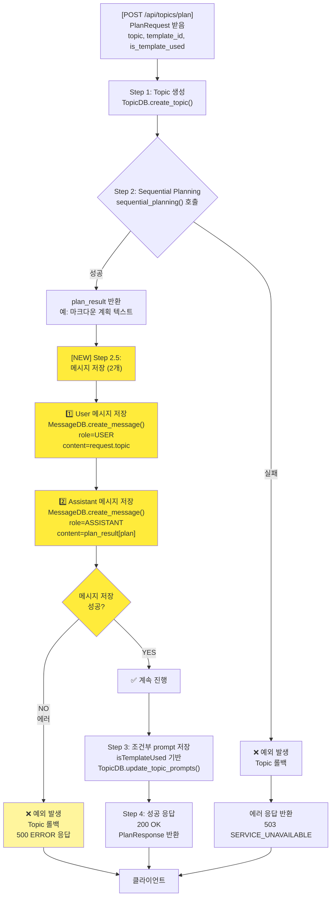

# Unit Spec: POST /api/topics/plan 메시지 저장 기능

**작성일:** 2025-12-09
**버전:** 1.1 (에러 처리 정책 변경)
**상태:** 🟡 Updated (사용자 재검토 대기)

---

## 1. 요구사항 요약

### 목적
현재 `/api/topics/plan` API는 계획(plan)을 생성하기만 하고 메시지 DB에 저장하지 않아, 대화 이력이 누락됨.
사용자가 plan을 통해 topic을 생성하고 계획을 받을 때, **사용자 메시지(role: user)**와 **생성된 계획(role: assistant)**을 메시지 DB에 저장하여 대화 컨텍스트 연속성 확보.

### 유형
- ☑️ 신규 기능 (메시지 저장 로직)
- ☐ 버그 수정
- ☐ 리팩토링

### 핵심 요구사항

| 항목 | 내용 |
|------|------|
| **입력** | `PlanRequest.topic` (사용자 입력 주제) |
| **출력** | 메시지 2개 저장 (user, assistant) |
| **기대 효과** | `/api/topics/{topic_id}/ask` 호출 시 plan 과정의 대화 이력 포함 가능 |
| **응답 시간** | < 2초 (기존 제약 유지) |
| **제약사항** | 기존 기능(prompt 저장, sequential_planning)에 영향 없을 것 |
| **에러 처리** | 메시지 저장 실패 → 예외 발생 + 500 ERROR 응답 + Topic 롤백 (차단, 필수) |

### 처리 흐름 요약
**Step 1** → topic 생성
**→ Step 2** → sequential_planning() 호출
**→ [NEW] Step 2.5** → 메시지 저장 (user + assistant) **[메시지 저장 실패 시 예외 발생 + 롤백]**
**→ Step 3** → prompt 저장
**→ 200 OK**

---

## 2. 구현 대상 파일

| 구분 | 경로 | 설명 |
|------|------|------|
| 변경 | `backend/app/routers/topics.py` | `plan_report()` 함수: Step 2.5 메시지 저장 로직 추가 (Line 1141 이후) |
| 참조 | `backend/app/database/message_db.py` | MessageDB.create_message() 호출 |
| 참조 | `backend/app/models/message.py` | MessageCreate, Message 모델 |
| 참조 | `backend/shared/types/enums.py` | MessageRole (USER, ASSISTANT) |

**신규 파일 없음** (기존 DB/모델 활용)

---

## 3. 동작 플로우 (Mermaid Flowchart)



### 상세 단계별 동작

#### **Step 2.5: 메시지 저장 (NEW)**

| 단계 | 작업 | 상세 |
|------|------|------|
| **2.5.1** | User 메시지 저장 | `MessageDB.create_message(topic_id, MessageCreate(role=MessageRole.USER, content=request.topic))` |
| **2.5.2** | Assistant 메시지 저장 | `MessageDB.create_message(topic_id, MessageCreate(role=MessageRole.ASSISTANT, content=plan_result["plan"]))` |
| **2.5.3** | 예외 처리 | 메시지 저장 실패 시 WARNING 로그만 기록 (계획은 이미 생성됨) |

**seq_no:** 자동 증가 (MessageDB 내부 처리)
**created_at:** 현재 시각 (MessageDB 내부 처리)

---

## 4. 테스트 계획

### 4.1 원칙

- **Test-Driven Development (TDD):** 테스트 코드 먼저 작성, 기대 상태 정의
- **계층별 커버리지:** Unit → Integration → API 순서
- **독립성:** Mock/Fixture 사용으로 외부 의존성 제거
- **판정 기준:** 메시지 저장 여부, seq_no 순서, 타입, 에러 로그 확인

### 4.2 테스트 항목

| TC ID | 계층 | 시나리오 | 검증 항목 | 입력 | 기대 결과 |
|-------|------|---------|---------|------|---------|
| **TC-001** | Unit | User 메시지 저장 성공 | - role=USER 확인<br/>- content=request.topic 일치<br/>- seq_no=1 | topic_id=1<br/>request.topic="금리 인상 분석" | `Message` 객체 반환<br/>message.role=USER<br/>message.seq_no=1 |
| **TC-002** | Unit | Assistant 메시지 저장 성공 | - role=ASSISTANT 확인<br/>- content=plan_result 일치<br/>- seq_no=2 | topic_id=1<br/>plan_result["plan"]="# 계획..." | `Message` 객체 반환<br/>message.role=ASSISTANT<br/>message.seq_no=2 |
| **TC-003** | Unit | 메시지 순서 검증 | - seq_no 순차 증가<br/>- user가 assistant보다 먼저 | topic_id=1<br/>2개 메시지 저장 | user.seq_no=1<br/>assistant.seq_no=2 |
| **TC-004** | Integration | plan API 전체 플로우 | - user/assistant 메시지 모두 DB 저장<br/>- 응답 시간 < 2초 | POST /api/topics/plan<br/>유효한 request | 200 OK<br/>topic_id 반환<br/>메시지 2개 저장됨 |
| **TC-005** | Integration | 메시지 저장 실패 (차단 + 롤백) | - 에러 로깅됨<br/>- Topic 롤백됨<br/>- 500 ERROR 응답 반환 | 메시지 DB 쓰기 오류 시뮬레이션 | ERROR 로그 기록<br/>500 ERROR 응답<br/>ErrorCode.SERVER_INTERNAL_ERROR<br/>Topic이 DB에서 삭제됨 |
| **TC-006** | API | /ask에서 plan 메시지 조회 | - plan 과정의 메시지 포함<br/>- seq_no 순서 유지 | 1. plan API 호출<br/>2. ask API 호출 | 응답에 user/assistant 메시지 포함<br/>seq_no 순서대로 정렬 |
| **TC-007** | Unit | 다중 topic 메시지 격리 | - 다른 topic의 메시지와 격리<br/>- topic_id별 seq_no 독립 | topic_id=1, topic_id=2 동시 저장 | 각 topic의 seq_no는 1부터 시작<br/>격리됨 |
| **TC-008** | Integration | 응답 시간 검증 | - Step 2.5 추가 오버헤드 < 100ms<br/>- 전체 응답 < 2초 유지 | plan API 10회 반복 호출 | 평균 < 1800ms<br/>메시지 저장 오버헤드 무시할 정도 |

### 4.3 테스트 파일 위치

- 파일: `backend/tests/test_plan_message_persistence.py`
- 프레임워크: `pytest`, `pytest-asyncio`
- Fixture: MessageDB Mock, Topic Mock, sequential_planning Mock

---

## 5. 에러 처리 시나리오

### 5.1 User 메시지 저장 실패

| 시나리오 | HTTP 상태 | ErrorCode | 응답 메시지 | 로그 레벨 | 동작 |
|---------|----------|-----------|-----------|----------|------|
| MessageDB 쓰기 오류 | **500** | SERVER_INTERNAL_ERROR | "대화 저장 중 오류가 발생했습니다." | ERROR | Topic 롤백 후 에러 응답 |
| Topic 이미 삭제됨 | **500** | SERVER_INTERNAL_ERROR | "대화 저장 중 오류가 발생했습니다." | ERROR | Topic 재롤백 시도 후 에러 응답 |

### 5.2 Assistant 메시지 저장 실패

| 시나리오 | HTTP 상태 | ErrorCode | 응답 메시지 | 로그 레벨 | 동작 |
|---------|----------|-----------|-----------|----------|------|
| MessageDB 쓰기 오류 | **500** | SERVER_INTERNAL_ERROR | "대화 저장 중 오류가 발생했습니다." | ERROR | Topic 롤백 후 에러 응답 |
| plan_result가 None 또는 비어있음 | **500** | SERVER_INTERNAL_ERROR | "계획 내용이 비어있습니다." | ERROR | Topic 롤백 후 에러 응답 |

### 5.3 롤백 전략

**메시지 저장 실패 시 이전 단계까지 롤백:**

```python
try:
    # Step 2.5.1: User 메시지 저장
    user_msg = MessageDB.create_message(topic_id, ...)

    # Step 2.5.2: Assistant 메시지 저장
    assistant_msg = MessageDB.create_message(topic_id, ...)

except Exception as e:
    # 메시지 저장 실패 → Topic 롤백
    logger.error(f"[PLAN] Message save failed - topic_id={topic.id}, error={str(e)}", exc_info=True)
    TopicDB.delete_topic(topic.id)  # ✅ 롤백
    logger.info(f"[PLAN] Topic rolled back - topic_id={topic.id}")

    return error_response(
        code=ErrorCode.SERVER_INTERNAL_ERROR,
        http_status=500,
        message="대화 저장 중 오류가 발생했습니다.",
        details={"error": str(e)}
    )
```

### 5.4 로깅 템플릿

```python
# Step 2.5 메시지 저장 시작
logger.info(f"[PLAN] Saving messages - topic_id={topic.id}")

# User 메시지 저장 성공
logger.info(f"[PLAN] User message saved - topic_id={topic.id}, message_id={user_msg.id}")

# Assistant 메시지 저장 성공
logger.info(f"[PLAN] Assistant message saved - topic_id={topic.id}, message_id={assistant_msg.id}")

# 메시지 저장 실패 (에러 로그 + 롤백)
logger.error(
    f"[PLAN] Message save failed - topic_id={topic.id}, error={str(e)}",
    exc_info=True
)
logger.info(f"[PLAN] Topic rolled back - topic_id={topic.id}")
```

### 5.5 기존 에러 처리는 변경 없음

- Sequential Planning 타임아웃: 504 GATEWAY_TIMEOUT (기존)
- Template 미존재: 404 NOT_FOUND (기존)
- Template 권한 거부: 403 FORBIDDEN (기존)
- prompt 저장 실패: WARNING 로그만 (기존 - Step 3는 Step 2.5 이후 실행되므로 영향 없음)

---

## 6. 기술 선택 사항

### 메시지 저장 위치 (Step 2.5가 Step 3 전)

| 선택 | 장점 | 단점 | 선택 이유 |
|------|------|------|---------|
| **Step 2.5** (현재 설계) | - 계획과 메시지가 함께 저장<br/>- /ask에서 plan 과정 포함 가능<br/>- 메시지 저장 실패 시 명확한 에러 응답 | - Topic 롤백으로 인한 사용자 재시도 필요<br/>  (하지만 데이터 무결성 우선) | 사용자 요구사항<br/>ask()와 동일한 패턴<br/>메시지 저장 필수 |
| Step 3 이후 | - 모든 데이터가 확정 후 저장<br/>- 롤백 가능 | - 계획과 메시지가 분리<br/>- plan 과정이 누락될 수 있음 | 고려하지 않음 |

### 동기 저장 + 차단 에러 처리

| 선택 | 장점 | 단점 | 선택 이유 |
|------|------|------|---------|
| **동기 저장 + 차단** (현재 설계) | - 구현 간단<br/>- 메시지 저장 보장<br/>- 메시지 저장 실패 시 즉시 에러 응답<br/>- Topic 롤백으로 데이터 무결성 확보 | - 메시지 저장 실패 시 전체 실패<br/>- 사용자는 재시도 필요<br/>- 응답 시간 +50ms (문제 없음) | 데이터 무결성 우선<br/>메시지 저장은 필수 요구사항<br/>ask()와 동일한 패턴 |
| 동기 저장 + 비차단 (이전) | - 계획은 정상 반환 | - 메시지 저장 실패해도 반환<br/>- 데이터 불일치<br/>- ask()에서 컨텍스트 누락 | ❌ 사용자가 거부 |
| 백그라운드 저장 | - 응답 빠름 | - 메시지 저장 불보장<br/>- ask()와 패턴 다름<br/>- 리스크 높음 | ❌ 고려하지 않음 |

### 메시지 content 타입

| 필드 | 타입 | 내용 | 이유 |
|------|------|------|------|
| **User 메시지** | str | `request.topic` | 사용자가 입력한 주제 그 자체 |
| **Assistant 메시지** | str | `plan_result["plan"]` | Sequential Planning 반환 마크다운 |

---

## 7. 가정사항

| 가정 | 영향 | 확인 |
|------|------|------|
| Topic이 Step 1에서 정상 생성됨 | topic_id 항상 유효 | ✅ 기존 코드 검증됨 |
| Sequential Planning이 Step 2에서 성공 | plan_result["plan"]이 존재 | ✅ 기존 코드 검증됨 |
| MessageDB.create_message()가 빠름 (< 100ms) | 응답 시간 < 2초 달성 | ✅ DB 쿼리 단순함 |
| seq_no는 MessageDB에서 자동 생성 | 별도 seq_no 계산 불필요 | ✅ 기존 구현 활용 |
| 메시지 저장은 필수 요구사항 | 저장 실패 시 전체 실패 (차단) | ✅ 사용자 요구사항 (변경됨) |
| Topic 롤백이 빠름 (< 50ms) | 메시지 저장 실패 시 신속 처리 | ✅ 단순 DELETE 쿼리 |

---

## 8. 사용자 요청 기록

### Original User Request (1차)

```
요구사항 : `/api/topics/:topic_id/plan` API 진행중 messages DB에 내용 저장.

저장될 대상
- request에 포함된 topic 정보 (role : user)
- Step 2. 이후 생성된 plan_result (role: assistant)

주의사항: 기존 수행중인 기능에 영향도가 없을 것. 해당 기능만 추가되야 할 것.
```

### Claude 분석 (추가 고려사항)

다음 항목을 확인하고 Spec에 포함:
1. **메시지 저장 시점:** Step 2 (sequential_planning 후) vs Step 3 (prompt 저장 후)
2. **메시지 내용:** request.topic 전체 vs 요약
3. **에러 처리:** 메시지 저장 실패 시 API 응답 변경 여부
4. **응답 시간:** 메시지 저장으로 인한 추가 오버헤드 허용 범위
5. **기존 기능 영향도:** prompt 저장, sequential_planning 호출과 독립성 확보

### 최종 명확화 (통합 - 수정됨)

- ✅ **저장 시점:** Step 2 이후, Step 3 전 (Step 2.5)
- ✅ **User 메시지:** `request.topic` 전체 저장
- ✅ **Assistant 메시지:** `plan_result["plan"]` (Sequential Planning 결과 마크다운)
- ✅ **에러 처리:** 메시지 저장 실패 시 예외 발생 + Topic 롤백 + 500 ERROR 응답 (차단, 필수)
- ✅ **응답 시간:** < 2초 유지 (기존 유지, 메시지 저장 오버헤드 < 100ms)
- ✅ **기존 기능 영향 없음:** prompt 저장, sequential_planning과 독립적 (try-except로 차단)

---

## 9. 구현 체크리스트

### 9.1 코드 작성

- [ ] **Step 2.5 추가 (topics.py)**
  - [ ] plan_result["plan"] 유효성 검증 (비어있으면 에러 발생)
  - [ ] User 메시지 저장: `MessageDB.create_message(topic_id, MessageCreate(role=MessageRole.USER, content=request.topic))`
  - [ ] Assistant 메시지 저장: `MessageDB.create_message(topic_id, MessageCreate(role=MessageRole.ASSISTANT, content=plan_result["plan"]))`
  - [ ] try-except로 예외 처리 (메시지 저장 실패 시 Topic 롤백 + 500 에러 응답)
  - [ ] 로그 레벨 명시: `logger.info()` (진행 중), `logger.error()` (실패 + 롤백)

### 9.2 테스트

- [ ] **Test 파일 생성**: `backend/tests/test_plan_message_persistence.py`
- [ ] **TC-001:** User 메시지 저장 검증
- [ ] **TC-002:** Assistant 메시지 저장 검증
- [ ] **TC-003:** seq_no 순서 검증
- [ ] **TC-004:** 전체 플로우 통합 테스트
- [ ] **TC-005:** 메시지 저장 실패 (비차단) 검증
- [ ] **TC-006:** /ask에서 plan 메시지 조회 검증
- [ ] **TC-007:** 다중 topic 격리 검증
- [ ] **TC-008:** 응답 시간 검증
- [ ] **모든 테스트 PASS:** pytest backend/tests/test_plan_message_persistence.py -v

### 9.3 회귀 테스트

- [ ] **기존 plan API 테스트 실행:** pytest backend/tests/test_topics.py::test_plan_* -v
- [ ] **기존 ask API 테스트 실행:** pytest backend/tests/test_topics.py::test_ask_* -v
- [ ] **메시지 관련 테스트:** pytest backend/tests/test_messages.py -v
- [ ] **모든 기존 테스트 PASS:** pytest backend/tests/ -v

### 9.4 문서화

- [ ] **CLAUDE.md 업데이트** (새 버전 항목 추가)
  - [ ] v2.13 섹션 추가
  - [ ] POST /api/topics/plan 메시지 저장 기능 설명
  - [ ] seq_no 자동 생성 설명

- [ ] **함수 DocString 업데이트** (plan_report)
  - [ ] Step 2.5 메시지 저장 단계 추가
  - [ ] 에러 처리 전략 명시

### 9.5 Git 커밋

- [ ] **파일 준비:**
  - [ ] `backend/app/routers/topics.py` (plan_report 함수 수정)
  - [ ] `backend/tests/test_plan_message_persistence.py` (신규 테스트)
  - [ ] `backend/doc/specs/20251209_api_topics_plan_message_persistence.md` (이 문서)

- [ ] **커밋 메시지:**
  ```
  feat: POST /api/topics/plan 메시지 저장 기능 추가

  - Step 2.5: User 메시지 저장 (request.topic)
  - Step 2.5: Assistant 메시지 저장 (plan_result["plan"])
  - 에러 처리: 메시지 저장 실패 시 비차단 (WARNING 로그)
  - 응답 시간: < 2초 유지 (메시지 저장 오버헤드 < 100ms)

  Spec: backend/doc/specs/20251209_api_topics_plan_message_persistence.md
  Tests: TC-001~TC-008 (8개 테스트 케이스)
  ```

---

## 10. 기타 참고사항

### 기존 ask() API의 메시지 저장 방식

**ask() 함수에서의 메시지 저장 (Step 2, Step 5):**

```python
# Step 2: User 메시지 저장
user_msg = await asyncio.to_thread(
    MessageDB.create_message,
    topic_id,
    MessageCreate(role=MessageRole.USER, content=content)
)

# Step 5 (백그라운드): Assistant 메시지 저장
assistant_msg = await asyncio.to_thread(
    MessageDB.create_message,
    topic_id,
    MessageCreate(role=MessageRole.ASSISTANT, content=markdown)
)
```

**본 기능 (plan_report)은 동기 함수이므로:**
- `await asyncio.to_thread()` 사용 불가 (이미 동기 컨텍스트)
- `MessageDB.create_message()` 직접 호출
- try-except로 예외 처리

### 메시지 DB 스키마

```sql
CREATE TABLE messages (
    id INTEGER PRIMARY KEY,
    topic_id INTEGER NOT NULL,
    role TEXT NOT NULL,  -- 'user', 'assistant', 'system'
    content TEXT NOT NULL,
    seq_no INTEGER NOT NULL,  -- 자동 증가
    created_at DATETIME NOT NULL,
    FOREIGN KEY (topic_id) REFERENCES topics(id)
);
```

**seq_no 특징:**
- 토픽당 자동 증가 (1, 2, 3, ...)
- MessageDB.create_message()에서 자동 생성
- 변수 전달 불필요

---

## 11. 확인 사항 (사용자 검토)

**Spec v1.1 수정 사항 (2025-12-09):**
- ✅ **에러 처리 변경:** 비차단(200 OK) → 차단(500 ERROR + Topic 롤백)
- ✅ **응답 시간:** 기존 < 2초 제약 그대로 유지
- ✅ **테스트 항목:** TC-005 시나리오 변경 (비차단 → 차단)

**최종 확인 사항:**

- [ ] **메시지 저장 시점:** Step 2.5 (Step 2 이후, Step 3 전)가 맞는가?
- [ ] **메시지 내용:** User=request.topic, Assistant=plan_result["plan"]이 맞는가?
- [ ] **에러 처리:** 메시지 저장 실패 시 예외 발생 + Topic 롤백 + 500 ERROR (차단)이 맞는가? ⭐ 변경됨
- [ ] **응답 시간:** < 2초 제약 (기존 유지)이 충분한가?
- [ ] **테스트 항목:** 8개 TC가 충분한가?
- [ ] **기타 고려사항:** 추가할 사항이 있는가?

**이 수정된 Spec이 맞으신가요? 추가로 수정할 부분이 있으신가요?**

---

**문서 버전 이력**

| 날짜 | 버전 | 변경 사항 |
|------|------|---------|
| 2025-12-09 | 1.1 | 에러 처리 변경: 비차단(200 OK) → 차단(500 ERROR + Topic 롤백) |
| 2025-12-09 | 1.0 | 초안 작성 |
