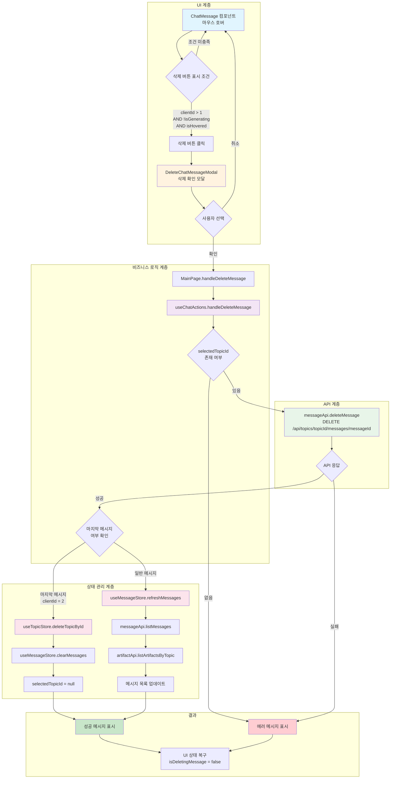
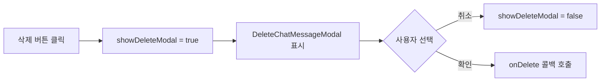
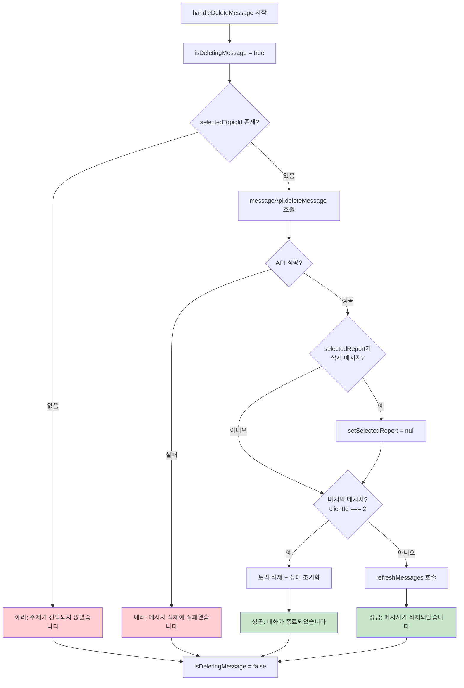
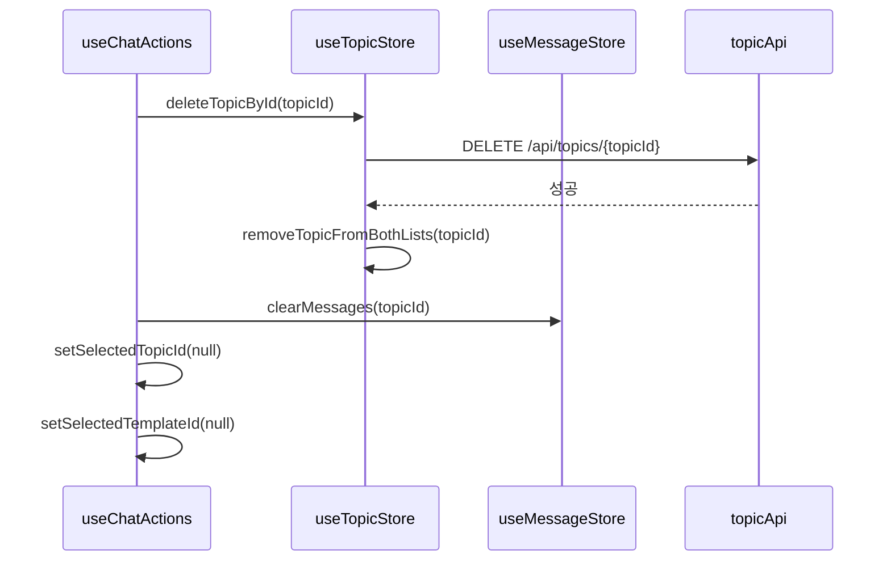
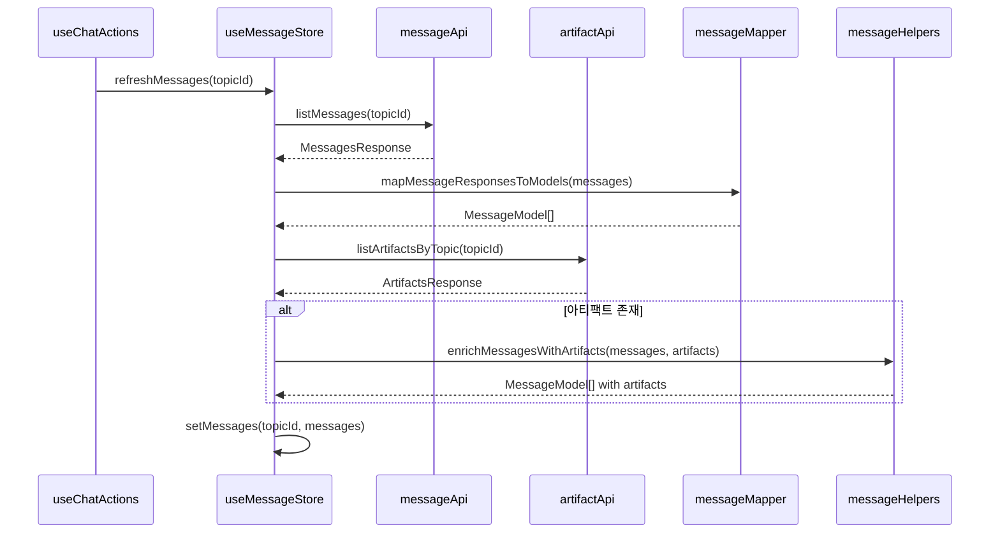
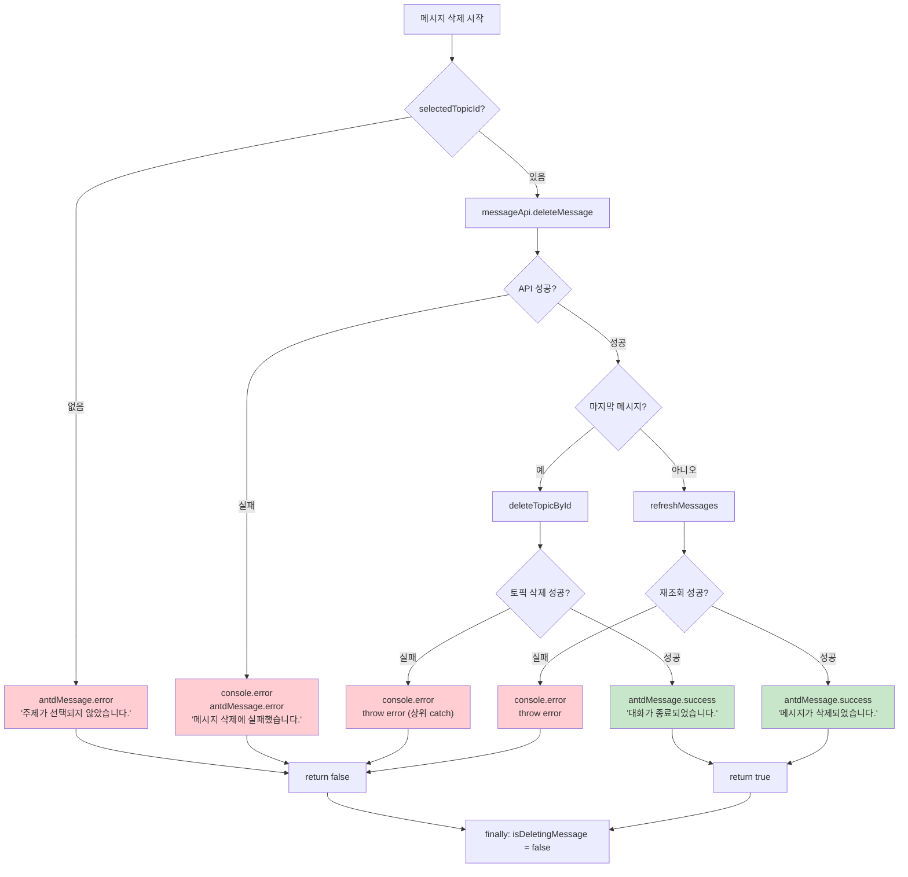

# MESSAGE_FLOW.md - 메시지 흐름 문서

이 문서는 프론트엔드에서 메시지 생성 및 삭제 흐름을 정리합니다.

---

## 목차

1. [메시지 삭제 흐름](#1-메시지-삭제-흐름)
2. [메시지 생성 흐름](#2-메시지-생성-흐름) *(작성 예정)*

---

## 1. 메시지 삭제 흐름

### 1.1 전체 흐름 다이어그램



### 1.2 단계별 상세 설명

#### Step 1: UI 진입점 - 삭제 버튼 표시

| 파일 | 함수 | 설명 |
|------|------|------|
| [MainPage.tsx](../src/pages/MainPage.tsx#L256-L258) | `handleDeleteMessage` | 삭제 핸들러 정의 |
| [ChatMessage.tsx](../src/components/chat/ChatMessage.tsx#L77-L81) | `ChatMessage` | 호버 시 삭제 버튼 표시 |

```typescript
// MainPage.tsx:256-258
const handleDeleteMessage = async (messageId: number, messageClientId: number) => {
    await deleteMessage(messageId, messageClientId, setSelectedReport, selectedReport)
}

// MainPage.tsx:361 - 삭제 버튼 조건부 전달
onDelete={message.clientId > 1 ? handleDeleteMessage : undefined}
```

**분기 조건:**
- `clientId > 1` → 삭제 가능 (첫 2개 메시지는 삭제 불가)
- `isGenerating = false` → 생성 중이 아닐 때만 표시
- `isHovered = true` → 마우스 호버 상태일 때만 표시

#### Step 2: 삭제 확인 모달

| 파일 | 함수 | 설명 |
|------|------|------|
| [ChatMessage.tsx](../src/components/chat/ChatMessage.tsx#L29-L32) | `handleDeleteClick` | 모달 열기 |
| [DeleteChatMessageModal.tsx](../src/components/chat/DeleteChatMessageModal.tsx#L34-L38) | `handleConfirmDelete` | 삭제 확인 |



**모달 상태 제어:**
- `loading = true` → OK 버튼 로딩, 취소/닫기 비활성화
- `message.id` 없으면 삭제 중단

#### Step 3: 비즈니스 로직 - useChatActions

| 파일 | 함수 | 설명 |
|------|------|------|
| [useChatActions.ts](../src/hooks/useChatActions.ts#L100-L160) | `handleDeleteMessage` | 삭제 메인 로직 |



**핵심 분기:**

| 분기 조건 | 참일 때 | 거짓일 때 |
|----------|--------|----------|
| `!selectedTopicId` | 에러 반환 | 계속 진행 |
| `clientId === 2` | 토픽 삭제 | 메시지만 삭제 |
| `selectedReport.messageId === messageId` | 미리보기 닫기 | 유지 |

#### Step 4: API 호출

| 파일 | 함수 | 설명 |
|------|------|------|
| [messageApi.ts](../src/services/messageApi.ts#L66-L76) | `deleteMessage` | DELETE API 호출 |

```typescript
// messageApi.ts:66-76
deleteMessage: async (topicId: number, messageId: number): Promise<void> => {
    const response = await api.delete<ApiResponse<{message: string}>>(
        API_ENDPOINTS.DELETE_MESSAGE(topicId, messageId)
    )

    if (!response.data.success) {
        throw new Error(response.data.error?.message || '메시지 삭제에 실패했습니다.')
    }
}
```

**API 엔드포인트:** `DELETE /api/topics/{topicId}/messages/{messageId}`

#### Step 5: 상태 업데이트 (분기별 처리)

##### 5-A: 마지막 메시지 삭제 시 (clientId === 2)

| 파일 | 함수 | 설명 |
|------|------|------|
| [useTopicStore.ts](../src/stores/useTopicStore.ts#L276-L284) | `deleteTopicById` | 토픽 삭제 |
| [useMessageStore.ts](../src/stores/useMessageStore.ts) | `clearMessages` | 메시지 정리 |



##### 5-B: 일반 메시지 삭제 시

| 파일 | 함수 | 설명 |
|------|------|------|
| [useMessageStore.ts](../src/stores/useMessageStore.ts#L215-L237) | `refreshMessages` | 메시지 재조회 |
| [messageMapper.ts](../src/mapper/messageMapper.ts) | `mapMessageResponsesToModels` | 데이터 변환 |
| [messageHelpers.ts](../src/utils/messageHelpers.ts) | `enrichMessagesWithArtifacts` | 아티팩트 연결 |



### 1.3 상태 관리 요약

| 스토어 | 상태 변수 | 변경 시점 | 목적 |
|--------|----------|----------|------|
| `useMessageStore` | `isDeletingMessage` | 삭제 시작/완료 | 버튼 비활성화 |
| `useMessageStore` | `messagesByTopic` | refreshMessages 완료 | UI 목록 업데이트 |
| `useTopicStore` | `selectedTopicId` | 마지막 메시지 삭제 | 화면 초기화 |
| `useTopicStore` | `sidebarTopics` | deleteTopicById | 사이드바 업데이트 |
| `useTopicStore` | `pageTopics` | deleteTopicById | 리스트 업데이트 |
| `MainPage` | `selectedReport` | 삭제된 메시지 보고서 | 미리보기 닫기 |

### 1.4 에러 처리 흐름



### 1.5 관련 파일 목록

| 용도 | 파일 경로 |
|------|---------|
| 메시지 카드 | [ChatMessage.tsx](../src/components/chat/ChatMessage.tsx) |
| 삭제 확인 모달 | [DeleteChatMessageModal.tsx](../src/components/chat/DeleteChatMessageModal.tsx) |
| 페이지 핸들러 | [MainPage.tsx](../src/pages/MainPage.tsx) |
| 비즈니스 로직 | [useChatActions.ts](../src/hooks/useChatActions.ts) |
| 메시지 API | [messageApi.ts](../src/services/messageApi.ts) |
| 토픽 API | [topicApi.ts](../src/services/topicApi.ts) |
| 메시지 스토어 | [useMessageStore.ts](../src/stores/useMessageStore.ts) |
| 토픽 스토어 | [useTopicStore.ts](../src/stores/useTopicStore.ts) |
| 메시지 매퍼 | [messageMapper.ts](../src/mapper/messageMapper.ts) |
| 메시지 헬퍼 | [messageHelpers.ts](../src/utils/messageHelpers.ts) |
| API 엔드포인트 | [constants/index.ts](../src/constants/index.ts) |

---

## 2. 메시지 생성 흐름

> **작성 예정**

### 2.1 전체 흐름 다이어그램

*(추후 작성)*

### 2.2 단계별 상세 설명

*(추후 작성)*

### 2.3 상태 관리 요약

*(추후 작성)*

### 2.4 에러 처리 흐름

*(추후 작성)*

### 2.5 관련 파일 목록

*(추후 작성)*

---

### 마지막 메시지 조건 ###
#### 메시지 id
id와 clientId 2가지 필드가 있다. 
id는 서버에서 생성, clientId는 클라이언트에서 생성한다.
서버는 세번째 메시지부터 저장한다.
그러므로 화면에 보이는 세번째 메시지가 마지막 메시지로 삭제될 시 토픽도 삭제된다.

#### 메시지 종류
첫번째 메시지는 사용자의 계획 생성 요청 메시지.
두번째 메시지는 어시스턴트의 계획 생성 응답 메시지.
세번째 메시지는 어시스턴트의 보고서 응답 메시지.
네번째 메시지는 사용자의 보고서 수정 요청 메시지.
다섯번째 메시지는 어시스턴트의 보고서 응답 메시지.
... 이후 네번쨰 ~ 다섯번째 메시지 반복

**마지막 업데이트:** 2025-11-28
